# Neo4j GraphRAG cross-corpus replacement — design

Date: 2026-08-31 · Status: implemented and accepted 2026-09-02 (plan `docs/superpowers/plans/2026-08-31-neo4j-graphrag-cross-corpus.md`, ledger `docs/exec-plans/active/graphrag-cross-corpus-2026-08-31.md`; section 15 stays a deferred roadmap phase)
Review basis: live LXC100 evidence, real browser inspection, current Ragweld source, Neo4j GraphRAG/GDS documentation and source, and a read-only high-reasoning Fable adversarial review (`AGREE WITH CORRECTIONS`)

## 1. Outcome

Every qualifying external corpus receives an honest, corpus-scoped entity graph that is useful
for retrieval and visible in Graph Explorer. A completed graph-enabled indexing run may not
promote a generation that silently contains only lexical `Document`/`Chunk` nodes. Retrieval
uses Qdrant as the canonical vector store to seed Neo4j traversal; it does not repeat the same
dense search in Neo4j and call the duplicate result an entity hit.

The acceptance corpus matrix is deliberately heterogeneous:

- `nasa-apollo-11`: one large technical document;
- `epstein-files-public`: many legal/public-record documents;
- `ragweld_code`: an AST-derived code graph.

`recall_default` is out of scope for this implementation. There is no checkbox or per-run opt-in
that can send internal recall content through semantic graph extraction in this phase; the
server policy excludes it regardless of a generic graph setting. A future Recall Intelligence
Graph phase is recorded in section 15 for the enterprise RBAC/Kubernetes/GCP roadmap.

## 2. Observed failure

Live inspection on 2026-08-31 found:

| Corpus | Chunks | Entities | Relationships | Communities | Visible result |
|---|---:|---:|---:|---:|---|
| `ragweld_code` | 5,806 | 5,179 | 11,779 | 0 | Node graph is visible |
| `nasa-apollo-11` | 1,315 | 0 | 0 | 0 | Empty entity-graph warning |
| `epstein-files-public` | 3,126 | 0 | 0 | 0 | Empty entity-graph warning |

The Indexing UI says **Build graph during indexing** and claims entity/relationship extraction,
but the separate **Neo4j GraphRAG semantic graph** option defaults off. Graph-only search still
returns results for the two empty corpora because the current graph leg performs another ANN
search over copied chunk embeddings in Neo4j. Its debug payload labels those chunk seeds as
`graph_entity_hits`. This is a false-success contract, not merely an empty visualization.

Code review also confirmed:

- one fixed, generic semantic schema is used across unrelated domains;
- the extractor sends a 300-pattern cartesian product to every extraction prompt;
- there is no entity resolution;
- chunk embeddings are written to Neo4j even when the config says not to create their index;
- community detection is gated off for code corpora;
- `include_communities`, heuristic semantic-KG knobs, and `Neo4jClient.graph_search()` are dead
  or misleading surface;
- semantic extraction can fail batch-by-batch without making promotion fail.

## 3. Versioned source of truth

The implementation follows the shipped API and source of a pinned library version, checked
against the corresponding documentation. It does not copy examples or relationship names
without verifying them in that release.

Required baseline:

| Component | Current | Target / decision |
|---|---|---|
| `neo4j-graphrag` | 1.14.1 | Pin 1.19.x after compatibility verification; use non-`experimental` component imports |
| Neo4j server | 5.26.20 Community | Retain for this slice |
| Neo4j GDS | absent | Add 2.13.x, the terminal GDS line compatible with Neo4j 5.26 |
| Neo4j Python driver | 5.28.3 | Keep unless the GraphRAG pin requires a compatible lockfile change |

Primary references:

- [Neo4j GraphRAG KG Builder](https://neo4j.com/docs/neo4j-graphrag-python/current/user_guide_kg_builder.html)
- [Neo4j GraphRAG retrievers](https://neo4j.com/docs/neo4j-graphrag-python/current/user_guide_rag.html)
- [Neo4j GraphRAG package source](https://github.com/neo4j/neo4j-graphrag-python)
- [Neo4j GraphRAG 1.19.0 resolver source](https://github.com/neo4j/neo4j-graphrag-python/blob/1.19.0/src/neo4j_graphrag/components/resolver.py)
- [Neo4j GraphRAG 1.19.0 Qdrant retriever source](https://github.com/neo4j/neo4j-graphrag-python/blob/1.19.0/src/neo4j_graphrag/retrievers/external/qdrant/qdrant.py)
- [Neo4j GraphRAG 1.19.0 writer source](https://github.com/neo4j/neo4j-graphrag-python/blob/1.19.0/src/neo4j_graphrag/components/kg_writer.py)
- [Neo4j GraphRAG 1.19.0 schema source](https://github.com/neo4j/neo4j-graphrag-python/blob/1.19.0/src/neo4j_graphrag/components/schema.py)
- [SimpleKGPipeline custom entity metadata limitation, issue 588](https://github.com/neo4j/neo4j-graphrag-python/issues/588)
- [Neo4j data modeling](https://neo4j.com/docs/getting-started/data-modeling/)
- [GDS compatibility](https://neo4j.com/docs/graph-data-science/current/installation/supported-neo4j-versions/)
- [GDS Leiden](https://neo4j.com/docs/graph-data-science/current/algorithms/leiden/)

### 3.1 Lexical relationship correction

The current documentation contains an overridden example described as defaults. The shipped
1.19 source defaults are:

- `FROM_DOCUMENT` (`Chunk` → `Document`);
- `NEXT_CHUNK` (`Chunk` → next `Chunk`);
- `FROM_CHUNK` (`__Entity__` → `Chunk`).

Ragweld already uses the first two. The replacement is therefore `IN_CHUNK` → `FROM_CHUNK`,
not a migration to `PART_OF_DOCUMENT`/`PART_OF_CHUNK`. The implementation stops overriding
`LexicalGraphConfig` and uses the pinned library defaults. No compatibility dual-read is kept;
affected external corpora are rebuilt.

## 4. Architecture

```mermaid
flowchart LR
    Source[Corpus documents] --> Existing[Existing extraction and canonical chunks]
    Existing --> Qdrant[(Qdrant generation collection)]
    Existing --> Schema[Stratified schema sample]
    Schema --> Review[Persisted GraphSchema plus hash]
    Review --> Extract[Neo4j GraphRAG Pipeline components]
    Existing --> Extract
    Extract --> Stage[Corpus and generation scoped staged graph]
    Stage --> Resolve[Scoped entity resolution]
    Resolve --> Validate[Fail-closed graph invariants]
    Validate --> Leiden[GDS Leiden]
    Leiden --> Promote[Atomic generation promotion]

    Query[Query embedding] --> QSeed[QdrantNeo4jRetriever seed lookup]
    Qdrant --> QSeed
    Promote --> QSeed
    QSeed --> Traverse[Generation-scoped entity and graph traversal]
    Traverse --> Hydrate[Postgres chunk hydration]
    Hydrate --> Fuse[Truthful fusion and debug telemetry]
```

Postgres remains the generation manifest and chunk hydration authority. Qdrant remains vector
truth. Neo4j stores lexical links, resolved entities, semantic relationships, and community
properties. There is no Qdrant alias assumption and no per-corpus Neo4j database assumption.

## 5. Corpus policy

| Corpus class | Graph policy |
|---|---|
| External documents | Semantic entity graph on by default, subject to estimate/confirm and cost visibility |
| Source code | Existing AST entity/relationship graph; participate in entity resolution where appropriate and in community detection |
| Internal recall | Excluded in this phase and explicitly filtered from automatic semantic extraction |
| Operator-declared entity-sparse corpus | May promote only through a recorded, visible override after telemetry proves extraction was attempted honestly |

The UI exposes the policy, cost, model, schema status, extraction coverage, resolution counts,
and promotion verdict. A checked generic graph box must never imply semantic extraction when it
is not happening.

## 6. Schema derivation and persistence

Each external-corpus generation derives its schema once from a pinned, stratified sample and
reuses it for all chunks.

1. Sample across documents and positions; never take only the first N chunks. The sampling
   recipe, seed, selected chunk ids, extraction model alias, model-reported version when
   available, and prompt/schema component versions are recorded in the run manifest.
2. Use structured output and the 1.19 `GraphSchema` constraint and validation model.
3. Persist the proposed schema before bulk extraction and store its content hash in the
   generation manifest.
4. Give the operator a review surface showing node types, relationship types, directions,
   patterns, properties, and constraints before the paid bulk pass.
5. Set the actual 1.19 `GraphSchema` openness fields — `additional_node_types`,
   `additional_relationship_types`, and `additional_patterns` — explicitly to false for the
   approved run. Node and relationship properties are closed by their declared `NodeType` and
   `RelationshipType` definitions; 1.19 does not expose separate additional-property flags.
   Prune undefined graph output.
6. Treat a schema that prunes all nodes or produces no usable graph as an invariant failure,
   not a green empty result.

Schema names follow Neo4j modeling guidance: domain nouns and discrete entities become
CamelCase labels; precise directed verbs become `UPPER_SNAKE_CASE` relationship types;
properties use camelCase; stable business keys receive uniqueness constraints. Generic
`Object`, `RELATED_TO`, and `ASSOCIATED_WITH` catch-alls are prohibited unless a corpus-specific
schema review provides a concrete, documented meaning.

Amendment 2026-09-01 (Task 8 live drive, defects D3/D4): two domain rules are applied to every
proposal before it is hashed, so the operator reviews exactly the shape that will run
(`normalize_domain_schema`, enforced again by `validate_domain_schema` at every boundary):

1. Every node type carries a STRING `name` identity property with a mandatory constraint on it
   (EXISTENCE, or an existing KEY on `name`). Without it the official exact-match resolver skips
   the anonymous nodes and the explorer has nothing to show; the gpt-4o-mini NASA proposal left
   2,021 of 2,112 entities anonymous.
2. No node or relationship type carries a document-text property (`body`, `content`, `text`,
   `full_text`, `raw_text`, `html`, `message`, `message_body`, `email_body`, `transcript`), and no
   constraint references one. The chunk store owns text; a body property makes the extractor
   copy whole documents into the structured-output stream, which provider moderation cuts
   mid-JSON (`finish_reason=content_filter`) and the run then fails closed.

A proposal that still has no node types, relationship types, or patterns after these rules is
answered with a typed 422 `graph_schema_unusable`, never a server fault.

## 7. Pipeline boundary and scoped writing

Use the composable `Pipeline` components rather than `SimpleKGPipeline` because Ragweld already
owns document loading, splitting, canonical chunk ids, Qdrant payload ids, and Postgres rows.
Re-splitting inside SimpleKGPipeline would break cross-store identity.

The only custom boundary is a thin corpus/generation-scoped writer around the official
Neo4j writer. It stamps every staged node and relationship with the manifest-resolved
`graph_repo_id` and generation identity before writing. This addresses the custom entity
metadata limitation tracked upstream in issue 588. It must not reimplement extraction,
pruning, lexical graph creation, or Cypher serialization.

The concrete 1.19 seam is a `Neo4jWriter` subclass that overrides only
`run(graph: Neo4jGraph, lexical_graph_config: LexicalGraphConfig)`. It first rejects any extracted
node or relationship that already contains a reserved scope key, then stamps the canonical
caller-owned scope properties onto `graph.nodes` and `graph.relationships`, and delegates the
graph to `super().run(...)`. This is the exact no-fork mechanism documented in upstream issue
588; the official writer retains batching, labels, Cypher generation, cleanup, and error
behavior. A reserved-key collision always aborts before writes; it is never silently overridden.

For each lexical `Chunk`, the writer also stamps `graphJoinId =
"<graph_repo_id>:<chunk_id>"`. The Qdrant write for the same promoted generation stores this
non-secret value in payload as `graph_join_id`. It is a join/isolation key, not a second vector
or another source of chunk identity.

The writer is a replaceable seam: remove it when the pinned upstream release supports caller
metadata on extracted entities without losing chunk identity.

## 8. Entity resolution

Entity resolution is a load-bearing phase, not a cleanup detail. It runs after extraction and
before validation/community detection.

- Start with the official exact-match resolver using stable, schema-declared identity
  properties.
- Scope the resolver with the 1.19 constructor's documented `filter_query` argument, using
  a `WHERE entity.graph_repo_id = <validated internal literal>` clause. Version 1.19 appends
  the clause but does not expose a parameter map on `run()`, so no user-supplied value may enter
  it: the value comes only from the server-generated manifest id, passes a strict identifier
  allowlist, and is Cypher-literal encoded. The implementation characterization test must prove
  the installed component appends this clause to both its count and merge queries. Entities
  from another corpus or retired generation may not merge.
- Preserve provenance from every merged entity to its source chunks.
- Record candidates, merges, conflicts, and unresolved counts.
- Add fuzzy resolution only through a later corpus-specific review with measurable false-merge
  tests; it is not the default.
- Prove isolation with a collision fixture: identical entity and chunk ids in active and retired
  generations must not cross-link.

Communities are invalid until this phase succeeds because duplicate entity nodes fragment the
graph and cap community quality regardless of algorithm.

Amendment 2026-09-01 (Task 8 live drive, defect D7): the identity property is owned by the graph
policy. Semantic entities resolve on `name` (the approved schema's extracted name); code entities
resolve on `entity_id` (the qualified `path::Qualified.symbol`, which the store keeps unique per
generation), because resolving code on the bare name merged every `__init__` and `main` of a
corpus into one node and produced artifact communities. `resolution_property_for_policy` in
`server/indexing/graphrag_pipeline.py` is the single place that decides.

## 9. Retrieval replacement

Replace the Neo4j chunk-vector search with the official `QdrantNeo4jRetriever` contract:

- resolve the physical Qdrant collection and `graph_repo_id` from the promoted Postgres
  manifest on each request, then construct a request-scoped retriever with that fixed physical
  `collection_name`; the official object is not claimed to mutate its collection dynamically;
- join Qdrant `payload.graph_join_id` to Neo4j `Chunk.graphJoinId` by setting the official
  `id_property_external="graph_join_id"` and `id_property_neo4j="graphJoinId"`; the Qdrant point
  UUID is not the join key, and the generation-qualified value prevents an ambiguous base match
  before appended traversal Cypher runs;
- select the canonical named Qdrant vector (`text-dense` at present);
- set `node_label_neo4j="Chunk"` and enforce the same corpus/generation scope again in the
  appended `retrieval_query` before traversal; defense-in-depth filtering is not the primary
  join isolation mechanism;
- traverse from seed chunks through `FROM_CHUNK` entity provenance and semantic relationships;
- return traversal-derived related chunks for Postgres hydration.

Fusion credits the graph leg only for traversal-derived evidence. The original Qdrant seeds
already belong to the dense leg and may not be counted again as independent graph evidence.
Debug telemetry distinguishes `qdrant_seed_chunks`, `resolved_entities`,
`relationship_expansion_hits`, `community_expansion_hits`, and `graph_hydrated_chunks`.
The misleading `graph_entity_hits` field is replaced, not retained as an alias.

The implementation removes Neo4j chunk embedding writes, the Neo4j chunk vector index, the
overfetch workaround caused by post-ANN corpus filtering, and their now-dead configuration.

## 10. Community detection

Add GDS 2.13.x to the Neo4j 5.26 deployment and run weighted Leiden only after extraction,
resolution, and base graph validation pass.

- Project only the staged corpus/generation graph.
- Project semantic relationships undirected for Leiden while retaining their directed stored
  form for product behavior.
- Use schema- or AST-derived relationship weights.
- Set both a fixed `randomSeed` and `concurrency: 1` for reproducible acceptance runs.
- Enable intermediate communities and persist `communityId` plus hierarchical community
  properties on member nodes.
- Run for semantic document graphs and AST code graphs.
- Fail the run if requested community computation errors or writes out-of-scope membership.

The UI derives community views from node properties. The current invented `Community` node /
`IN_COMMUNITY` ontology and its endpoints are replaced in the same slice; no compatibility
layer remains. The deployment note records that GDS 2.13 is the terminal GDS line for Neo4j
5.x and a future Neo4j major upgrade must move both components together.

The present deterministic NetworkX Louvain code is not described as corrupt. It is replaced to
use the documented in-database weighted hierarchical community subsystem and to remove a local
parallel implementation. Entity resolution, not the Louvain-to-Leiden swap, is the primary
quality improvement.

## 11. Promotion invariants and overrides

Promotion is fail-closed. Each invariant requires both a green proof and a RED mutation test
where the run is observed refusing promotion.

| Invariant | Required evidence |
|---|---|
| Extraction coverage | chunks selected, attempted, succeeded, failed, and truncated are explicit; requested extraction may not silently truncate at `semantic_kg_max_chunks` |
| Non-empty qualifying graph | a qualifying external corpus has resolved entities, semantic relationships, and entity-to-chunk provenance |
| Scope integrity | every node, relationship, resolver merge, retrieval result, and community belongs to the staged `graph_repo_id` |
| Retrieval usefulness | graph traversal yields related chunks beyond the original Qdrant seed set for a known graph-answerable query |
| Community integrity | every eligible connected graph has persisted Leiden membership; no cross-generation community membership exists |
| UI truth | the run and Graph Explorer report the same counts, extraction coverage, partial/override status, and generation |

“Qualifying” is telemetry-defined, not a brittle file-type label. A genuinely entity-sparse
corpus may use an operator override only after extraction attempted the approved sample/bulk
scope and the UI records the reason, actor, timestamp, graph counts, and partial/empty status.
The override cannot relabel chunk-only dense retrieval as GraphRAG.

Default-on semantic extraction goes through the existing estimate/confirm workflow. Cost,
model route, chunk scope, and any configured ceiling are visible before mutation. An exceeded
ceiling fails or produces a deliberately partial non-promotable run until the operator changes
scope; it never silently produces a “complete” graph.

## 12. Product and configuration cleanup

Replacement slices remove or correct:

- the over-claiming **Build graph during indexing** copy and contradictory defaults;
- the separate default-off semantic graph trap for qualifying external corpora;
- `semantic_kg_mode="heuristic"` and unused heuristic weight/concept knobs;
- inert `include_communities` flags;
- production-dead `Neo4jClient.graph_search()`;
- Neo4j chunk embedding storage/index settings;
- `fusion_graph_entity_hits` / `graph_entity_hits` misnaming;
- legacy `IN_CHUNK`, `Community`, and `IN_COMMUNITY` assumptions;
- semantic-only gating that prevents code-graph community detection.

Pydantic model, generated TypeScript, both glossary mirrors, settings UI, run events, API
responses, observability dashboards, and tests change together. No fallback, shim, dual-write,
dual-read, or deprecated hidden setting remains.

## 13. Delivery chunks and review gates

Each chunk follows this gate before the next begins:

1. GitNexus upstream impact analysis for every edited symbol, with HIGH/CRITICAL risk reported
   before mutation.
2. A failing category-level test or invariant proof on LXC100.
3. The smallest replacement implementation.
4. Narrow changed-surface verification plus the repository standard gate on LXC100.
5. `detect_changes` against `main` before commit.
6. Read-only DeepSeek V4 Flash review of the complete chunk diff, tests, relevant current docs,
   and verification evidence.
7. Fix every substantiated finding, rerun verification, and obtain a clean follow-up review.

Proposed chunks:

1. Dependency/import upgrade and contract characterization.
2. Truthful corpus policy, cost gate, UI copy/defaults, and dead-config removal.
3. Persisted stratified schema derivation and operator review surface.
4. Corpus-scoped official pipeline writer plus `FROM_CHUNK` lexical replacement.
5. Scoped entity resolution and promotion invariants with RED mutation proofs.
6. QdrantNeo4jRetriever traversal and truthful fusion/debug replacement.
7. GDS deployment, deterministic Leiden, code-corpus communities, and community UI/API
   replacement.
8. Cross-corpus reindex, deployment, observability, docs, and browser acceptance.

Fable is used again for architectural review if a chunk requires a material design departure.
DeepSeek review is not a substitute for tests or visible runtime proof.

## 14. Acceptance

### 14.1 Automated and store-level

- Lockfile and imports prove the selected GraphRAG version and non-experimental namespace.
- Representative external corpora produce nonzero resolved entities, semantic relationships,
  `FROM_CHUNK` provenance, and GDS community membership.
- `ragweld_code` retains AST entities/relationships and gains communities.
- Retired-generation collision tests prove writer, resolver, retriever, and community isolation.
- A 1.19 contract characterization test asserts the exact resolver `filter_query` behavior,
  Qdrant retriever constructor fields, payload-first ID getter, and appended traversal query.
- A writer integration test proves all node/relationship kinds receive immutable scope
  properties, `Chunk.graphJoinId` matches Qdrant `payload.graph_join_id`, extracted reserved-key
  collisions fail before writes, and delegation preserves the official writer's graph output.
- A request-factory test issues separate requests against two manifest fixtures without a
  service restart and proves each request constructs a new retriever with its manifest's correct
  physical collection and join key; no shared retriever is hot-switched.
- A resolver-specific collision test places identical named entities in active and retired
  generations and proves only the staged `graph_repo_id` is merged.
- A retriever-specific collision test places identical raw chunk ids in two generations and
  proves the generation-qualified `graphJoinId` returns and traverses only the promoted graph.
- RED tests prove every promotion invariant actually blocks promotion.
- Graph retrieval returns at least one traversal-derived hydrated chunk outside its initial
  Qdrant seed set for a fixed query in each external acceptance corpus.
- Dense-only search remains dense-only; graph-disabled corpora cannot manufacture graph debug
  hits.

### 14.2 Real browser pass

Acceptance is performed in the authenticated in-app browser against the deployed URL with
actual visible controls. DOM inspection and direct API calls may diagnose but cannot satisfy
this gate.

For NASA, Epstein, and code corpora, the operator must:

1. select the corpus from the visible dropdown;
2. inspect indexing policy, schema, extraction coverage, graph counts, and community status;
3. open Graph Explorer and see nodes/edges without an empty semantic-graph warning;
4. click multiple nodes and inspect their real properties and source provenance;
5. expand neighborhoods and verify related entities/chunks visibly change;
6. use zoom/pan/fit controls and community filters;
7. run a graph-including search from the visible workbench and inspect truthful debug details;
8. reload the browser and confirm corpus/generation state persists;
9. capture screenshots and a click-by-click evidence ledger.

Negative browser proof includes an intentionally failed run or safe test corpus whose invariant
error is visible and whose generation is not promoted.

## 15. Deferred Recall Intelligence Graph

Do not graph `recall_default` in this slice. Add a future enterprise roadmap phase after RBAC,
tenant isolation, audit identity, Kubernetes workload identity, and GCP data-governance
boundaries exist.

That phase should model governed, tenant-scoped patterns rather than raw private content:

- recurring needs versus one-off lookups;
- repeated retrieval misses and unanswered intent clusters;
- exploration sequences and topic transitions;
- prompt/cache candidates where repeated stable context could be safely cached;
- missing knowledge, documentation, tools, or permissions inferred from repeated friction;
- role/team-level aggregate trends with minimum cohort sizes and retention controls.

Its design must include purpose limitation, consent/notice, tenant and role visibility,
de-identification, deletion/retention, prompt-cache invalidation, audit logs, and protection
against turning individual exploration into employee surveillance. It belongs with the
RBAC/Kubernetes/GCP enterprise phase because those controls define who may see which aggregates
and where the underlying events may be processed and retained.

## 16. Non-goals

- Building the Recall Intelligence event pipeline now.
- Treating an empty entity graph plus lexical chunk graph as successful GraphRAG.
- Making Neo4j a second canonical vector store.
- Inventing a universal ontology or catch-all entity/relation vocabulary.
- Adding GDS without entity resolution and scope isolation.
- Preserving obsolete graph config or Cypher as compatibility surface.
- Calling tests, HTTP responses, or screenshots from one corpus whole-product acceptance.

## 17. Approval gate

Implementation starts only after this written design is approved. Any material departure in
schema ownership, cross-store identity, generation scoping, promotion invariants, retrieval
credit, community representation, or recall scope returns to design review before code changes.
