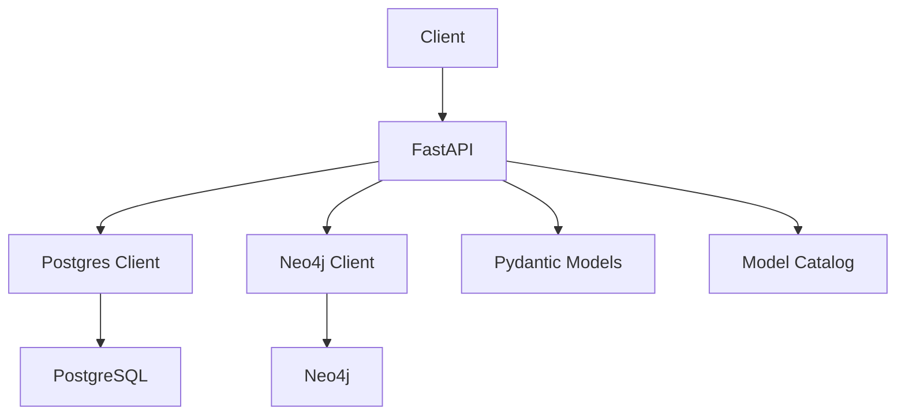

# API Reference

<div class="grid chunk_summaries" markdown>

-   :material-api:{ .lg .middle } **FastAPI Endpoints**

    ---

    Endpoints for config, indexing, retrieval, graph, models, keywords, reranker, and health.

-   :material-file-code:{ .lg .middle } **Schema by Pydantic**

    ---

    Request/response models are defined in Pydantic. The frontend imports generated TypeScript types.

-   :material-shield-key:{ .lg .middle } **Secrets Check**

    ---

    Validate configured provider keys via `/api/secrets/check`.

</div>

[Get started](index.md){ .md-button .md-button--primary }
[Configuration](configuration.md){ .md-button }
[API](api.md){ .md-button }

!!! tip "Inspect Schemas"
    Prefer calling `/api/config` first to align UI interactions with actual server capabilities. All shapes are Pydantic-driven.

!!! note "HTTP Conventions"
    - JSON requests/responses
    - Errors via standard status codes with `detail`
    - Streaming responses for long operations are `text/event-stream` or chunked JSON

!!! warning "Model Usage Costs"
    Reranking and keyword generation may incur API costs depending on selected models. Control via `data/models.json` and `TriBridConfig`.

## Endpoint Inventory

| Area | Route | Method | Purpose |
|------|-------|--------|---------|
| Config | `/api/config` | GET | Get full config |
| Config | `/api/config` | PUT | Replace config |
| Config | `/api/config/{section}` | PATCH | Sectional patch, e.g., `fusion` |
| Config | `/api/config/reset` | POST | Reset to defaults |
| Secrets | `/api/secrets/check` | GET | Check provider keys (never returns values) |
| Index | `/api/index` | POST | Start indexing |
| Index | `/api/index/{corpus_id}/status` | GET | Per-corpus status |
| Index | `/api/index/{corpus_id}/stats` | GET | Per-corpus storage breakdown |
| Index | `/api/index/estimate` | POST | Best-effort indexing estimate |
| Index | `/api/index/vocab-preview` | GET | BM25 vocabulary sample |
| Documents | `/api/corpora/{corpus_id}/documents/view` | GET | Typed document view (text/pdf/rich) with provenance state |
| Documents | `/api/corpora/{corpus_id}/documents/page` | GET | Server-rendered PDF page PNG (`page`/`thumb`, ETag/304) |
| Documents | `/api/corpora/{corpus_id}/documents/raw` | GET | Original file bytes (inline PDF, otherwise attachment + sandbox) |
| Search | `/api/search` | POST | Tri-brid retrieval + fusion (+reranker) |
| Answer | `/api/answer` | POST | Retrieval + LLM answer generation |
| Answer | `/api/answer/stream` | POST | Stream answer generation |
| Graph | `/api/graph/{corpus_id}/entities` | GET | List entities |
| Graph | `/api/graph/{corpus_id}/entity/{id}` | GET | Entity details |
| Graph | `/api/graph/{corpus_id}/entity/{id}/neighbors` | GET | Neighborhood |
| Models | `/api/models/by-type/{component}` | GET | Models by component `GEN/EMB/RERANK` |
| Keywords | `/api/keywords/generate` | POST | Generate discriminative keywords |
| Reranker | `/api/reranker/*` | mixed | Status / mine / train / evaluate |
| Health | `/api/health` | GET | Liveness |
| Health | `/api/ready` | GET | Readiness |
| Metrics | `/api/metrics` | GET | Prometheus exposition |
| Docker | `/api/docker/*` | GET/POST | Infra status, logs, restart |
| MCP | `/api/mcp/status` | GET | MCP inbound transport status |

!!! tip "Citations you can open"
    `ChunkMatch` now carries typed `provenance` (extraction method; cited pages and normalized regions for Docling PDFs), and `ChatResponse` carries `web_grounding` with validated web citations. See [Source document viewer](manual/source_viewer.md) and [Web search in Chat](manual/web_search.md).

!!! note "Graph entity ids may contain slashes"
    Code-graph entity ids are corpus-relative paths (`server/services/traces.py::TraceStore.add_event`). The `/api/graph/{corpus_id}/entity/{entity_id}` routes match ids containing `/`, so pass them as-is without encoding the slashes. See [Graph API](api_graph.md).



## Example: Search Roundtrip (Annotated)

=== "Python"
```python
import httpx
base = "http://127.0.0.1:8012/api"

payload = {
    "corpus_id": "tribrid",  # (1)!
    "query": "authentication flow",
    "top_k": 10
}
resp = httpx.post(f"{base}/search", json=payload)
resp.raise_for_status()
res = resp.json()  # type: SearchResponse (2)!
print(res["fusion_method"], len(res["matches"]))
```

1. Always scope by `corpus_id` (legacy `repo_id` is accepted)
2. Response includes `fusion_method`, `reranker_mode`, `latency_ms`, and `matches`

=== "curl"
```bash
BASE=http://127.0.0.1:8012/api
curl -sS -X POST "$BASE/search" \
  -H 'Content-Type: application/json' \
  -d '{"corpus_id":"tribrid","query":"authentication flow","top_k":10}' | jq '.fusion_method, .matches | length'
```

=== "TypeScript"
```typescript
import type { SearchRequest, SearchResponse } from "./web/src/types/generated";

async function run(req: SearchRequest): Promise<SearchResponse> {
  const r = await fetch("/api/search", { method: "POST", headers: {"Content-Type":"application/json"}, body: JSON.stringify(req) });
  return await r.json(); // (2)!
}
```

## Health and Metrics

=== "Python"
```python
import httpx
print(httpx.get("http://127.0.0.1:8012/api/ready").json())   # readiness
print(httpx.get("http://127.0.0.1:8012/api/metrics").text[:300])  # metrics sample
```

=== "curl"
```bash
curl -sS http://127.0.0.1:8012/api/health | jq .
curl -sS http://127.0.0.1:8012/api/ready | jq .
curl -sS http://127.0.0.1:8012/api/metrics | head -n 20
```

=== "TypeScript"
```typescript
await fetch('/api/ready').then(r => r.ok || Promise.reject('Not ready'))
const metrics = await (await fetch('/api/metrics')).text()
console.log(metrics.split('\n').slice(0,5))
```

??? note "Streaming"
    Endpoints that can stream long-running operations (e.g., evaluation logs, training metrics) use Server-Sent Events or chunked JSON. Use backpressure-aware clients.
