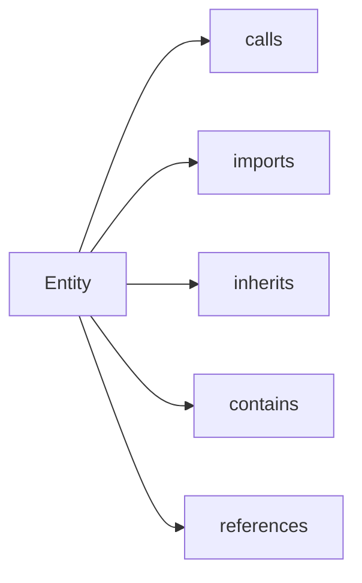

# Graph API (Entities and Relationships)

<div class="grid chunk_summaries" markdown>

-   :material-source-branch:{ .lg .middle } **Entities**

    ---

    Functions, classes, modules, variables, concepts.

-   :material-link-variant:{ .lg .middle } **Relationships**

    ---

    calls, imports, inherits, contains, references.

-   :material-account-group:{ .lg .middle } **Communities**

    ---

    Optional clustering for related entities.

</div>

[Get started](index.md){ .md-button .md-button--primary }
[Configuration](configuration.md){ .md-button }
[API](api.md){ .md-button }

!!! tip "One graph pipeline"
    Graph retrieval is a single Qdrant-seeded Neo4j traversal — there is no chunk/entity mode switch. See [Graph retrieval](retrieval/graph.md).

!!! note "Database isolation"
    Use `graph_storage.neo4j_database_mode` with `per_corpus` (Enterprise) to avoid cross-corpus filters.

!!! warning "Hops"
    High `max_hops` increases latency and noise. Start at 2.

| Route | Method | Description |
|-------|--------|-------------|
| `/graph/{corpus_id}/entities` | GET | List entities |
| `/graph/{corpus_id}/entity/{entity_id}` | GET | Entity details |
| `/graph/{corpus_id}/entity/{entity_id}/relationships` | GET | Direct edges |
| `/graph/{corpus_id}/entity/{entity_id}/neighbors` | GET | 1-hop neighborhood |
| `/graph/{corpus_id}/communities` | GET | List communities |

!!! note "Entity ids may contain slashes"
    Code-graph entity ids are corpus-relative paths such as `server/services/traces.py::TraceStore.add_event` (a module id is its `file_path`, a symbol id is `file_path::qualname`). The entity detail routes match `{entity_id}` as a full path segment (`{entity_id:path}` in `server/api/graph.py`), so ids containing `/` are accepted as-is — no extra encoding of the id is needed. Plain ids like `apollo_11` keep working unchanged.



## Entity ids with slashes (code graph)

=== "Python"
```python
import httpx
base = "http://127.0.0.1:58012/api"
entity_id = "server/services/traces.py::TraceStore.add_event"
ent = httpx.get(f"{base}/graph/ragweld_code/entity/{entity_id}").json()
rels = httpx.get(f"{base}/graph/ragweld_code/entity/{entity_id}/relationships").json()
print(ent["name"], len(rels))
```

=== "curl"
```bash
BASE=http://127.0.0.1:58012/api
ENTITY_ID="server/services/traces.py::TraceStore.add_event"
curl -sS "$BASE/graph/ragweld_code/entity/$ENTITY_ID" | jq '.name'
curl -sS "$BASE/graph/ragweld_code/entity/$ENTITY_ID/neighbors" | jq '.relationships | length'
```

=== "Python"
```python
import httpx
base = "http://localhost:8000"
ents = httpx.get(f"{base}/graph/tribrid/entities").json()
print("entities", len(ents))
```

=== "curl"
```bash
BASE=http://localhost:8000
curl -sS "$BASE/graph/tribrid/entities" | jq '.[0]'
```

=== "TypeScript"
```typescript
const ents = await (await fetch('/graph/tribrid/entities')).json();
console.log(ents.length)
```

??? info "Communities"
    Communities are GDS Leiden partitions written at index time (`communityId`/`communityPath` on entities) and served as `Community` objects with members and level. Re-index to derive them from the current graph.
