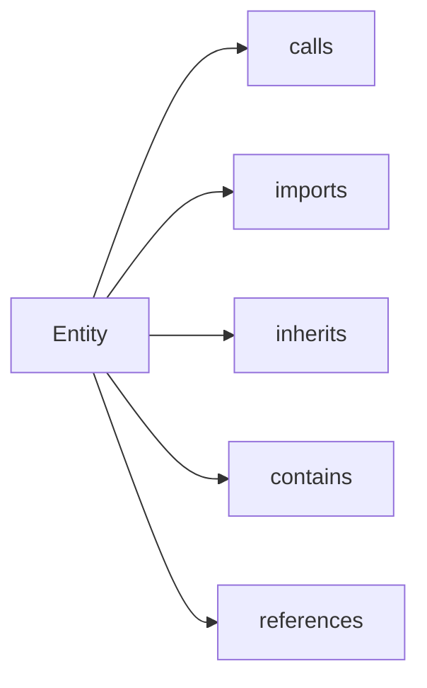

# Graph API (Entities and Relationships)

<div class="grid chunk_summaries" markdown>

-   :material-source-branch:{ .lg .middle } **Entities**

    ---

    Functions, classes, modules, variables, concepts.

-   :material-link-variant:{ .lg .middle } **Relationships**

    ---

    Code-graph edge kinds (`calls`, `imports`, `inherits`, `contains`) plus the approved schema's relationship types for semantic graphs.

-   :material-account-group:{ .lg .middle } **Communities**

    ---

    Optional clustering for related entities.

</div>

[Get started](index.md){ .md-button .md-button--primary }
[Configuration](configuration.md){ .md-button }
[API](api.md){ .md-button }

!!! tip "One graph pipeline"
    Graph retrieval is a single Qdrant-seeded Neo4j traversal — there is no chunk/entity mode switch. See [Graph retrieval](retrieval/graph.md).

!!! note "Database isolation"
    Use `graph_storage.neo4j_database_mode` with `per_corpus` (Enterprise) to avoid cross-corpus filters.

!!! warning "Hops"
    High `max_hops` increases latency and noise. Start at 2.

!!! note "The approved schema owns the type vocabulary"
    `Entity.entity_type` and `Relationship.relation_type` are **open strings** in the Pydantic boundary models (`server/models/tribrid_config_model.py`) — not a fixed enum. Code graphs store AST kinds (`function`, `class`, `module`); semantic graphs store the operator-approved schema's node labels and relationship types (`Tank`, `LaunchSite`, `CONTAINS`, `LOCATED_AT`, …) **verbatim**, exactly as they were written at index time. Responses are never filtered against a fixed type allowlist, so a semantic generation's schema edges appear in every explorer view (entity list, stats breakdowns, subgraph, neighbours, community members). Empty values are refused (`min_length=1`), because an unlabelled node would hide the graph's shape.

    `Entity.name` is read the same honest way: a stored record without a name reads back an **empty string** (`server/db/neo4j.py`), never the text `"None"` that `str(None)` used to produce. Only generations proposed before the `name` identity rule (see the [Indexing pipeline](indexing.md)) can hold such anonymous entities; the Graph explorer labels them with the stable `entity_id`, and new generations always carry a name.

    Neighbourhood and community walks are confined to `__Entity__` nodes of the current generation (`server/db/neo4j.py`): a 2-hop path can never cross a `Chunk` node, so entities that merely share a source chunk are not reported as neighbours.

| Route | Method | Description |
|-------|--------|-------------|
| `/graph/{corpus_id}/entities` | GET | List entities |
| `/graph/{corpus_id}/entity/{entity_id}` | GET | Entity details |
| `/graph/{corpus_id}/entity/{entity_id}/relationships` | GET | Direct edges |
| `/graph/{corpus_id}/entity/{entity_id}/neighbors` | GET | 1-hop neighborhood |
| `/graph/{corpus_id}/communities` | GET | List communities |

!!! note "Entity ids may contain slashes"
    Code-graph entity ids are corpus-relative paths such as `server/services/traces.py::TraceStore.add_event` (a module id is its `file_path`, a symbol id is `file_path::qualname`). The entity detail routes match `{entity_id}` as a full path segment (`{entity_id:path}` in `server/api/graph.py`), so ids containing `/` are accepted as-is — no extra encoding of the id is needed. Plain ids like `apollo_11` keep working unchanged.



## Entity ids with slashes (code graph)

=== "Python"
```python
import httpx
base = "http://127.0.0.1:58012/api"
entity_id = "server/services/traces.py::TraceStore.add_event"
ent = httpx.get(f"{base}/graph/ragweld_code/entity/{entity_id}").json()
rels = httpx.get(f"{base}/graph/ragweld_code/entity/{entity_id}/relationships").json()
print(ent["name"], len(rels))
```

=== "curl"
```bash
BASE=http://127.0.0.1:58012/api
ENTITY_ID="server/services/traces.py::TraceStore.add_event"
curl -sS "$BASE/graph/ragweld_code/entity/$ENTITY_ID" | jq '.name'
curl -sS "$BASE/graph/ragweld_code/entity/$ENTITY_ID/neighbors" | jq '.relationships | length'
```

=== "Python"
```python
import httpx
base = "http://localhost:8000"
ents = httpx.get(f"{base}/graph/tribrid/entities").json()
print("entities", len(ents))
```

=== "curl"
```bash
BASE=http://localhost:8000
curl -sS "$BASE/graph/tribrid/entities" | jq '.[0]'
```

=== "TypeScript"
```typescript
const ents = await (await fetch('/graph/tribrid/entities')).json();
console.log(ents.length)
```

??? info "Communities"
    Communities are GDS Leiden partitions written at index time (`communityId`/`communityPath` on entities) and served as `Community` objects with members and level. Re-index to derive them from the current graph.
