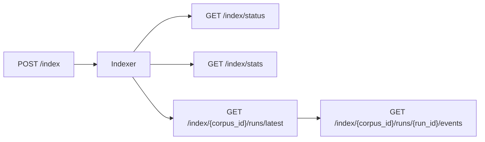

# Indexing API

<div class="grid chunk_summaries" markdown>

-   :material-file-document-multiple:{ .lg .middle } **Start**

    ---

    `POST /index` with `IndexRequest`.

-   :material-progress-clock:{ .lg .middle } **Status**

    ---

    `GET /index/status` returns progress, current file.

-   :material-harddisk:{ .lg .middle } **Stats**

    ---

    `GET /index/stats` returns storage breakdown.

</div>

[Get started](index.md){ .md-button .md-button--primary }
[Configuration](configuration.md){ .md-button }
[API](api.md){ .md-button }

!!! tip "Force reindex"
    Set `force_reindex=true` only when you need a clean rebuild. Incremental updates are cheaper.

!!! note "BM25 vocabulary"
    `/index/vocab-preview` helps debug tokenizer/stemmer stopword settings.

!!! warning "Repo path"
    Ensure `repo_path` points to a locally accessible directory (bind-mount in Docker).

| Route | Method | Description |
|-------|--------|-------------|
| `/index` | POST | Start indexing |
| `/index/status` | GET | Current state |
| `/index/stats` | GET | Storage stats |
| `/index/{corpus_id}/runs/latest` | GET | Latest run summary for the corpus (run id, status, progress) |
| `/index/{corpus_id}/runs/{run_id}/events` | GET | Event log for a run (`?limit=500`), usable for replay or live tailing |

!!! note "Runs are observable regardless of who started them"
    Every indexing run is recorded against the corpus and can be polled by any client — the UI, a CI job that started the run via `POST /api/index`, or a scheduled automation. The **RAG → Indexing** tab polls `/api/index/{corpus_id}/status` and, when it finds a run it did not start itself, mirrors its progress bar, current file, event log, and Stop button, marking the run "started outside this tab". This means an indexing job kicked off by an API call or a schedule is never invisible in the workbench.



=== "Python"
```python
import httpx
httpx.post("http://localhost:8000/index", json={"corpus_id":"tribrid","repo_path":"/repo","force_reindex":False})
```

=== "curl"
```bash
curl -sS -X POST http://localhost:8000/index -H 'Content-Type: application/json' -d '{"corpus_id":"tribrid","repo_path":"/repo","force_reindex":false}'
```

=== "TypeScript"
```typescript
await fetch('/index', { method:'POST', headers:{'Content-Type':'application/json'}, body: JSON.stringify({ corpus_id:'tribrid', repo_path:'/repo', force_reindex:false }) })
```

??? info "Dashboard"
    Use `DashboardIndexStatusResponse` and `DashboardIndexStatsResponse` to populate UI storage and status panels per corpus.
