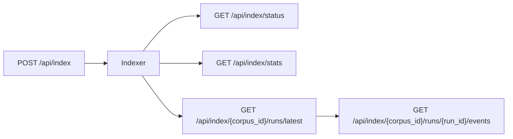

# Indexing API

<div class="grid chunk_summaries" markdown>

-   :material-file-document-multiple:{ .lg .middle } **Start**

    ---

    `POST /index` with `IndexRequest`.

-   :material-progress-clock:{ .lg .middle } **Status**

    ---

    `GET /index/status` returns progress, current file.

-   :material-harddisk:{ .lg .middle } **Stats**

    ---

    `GET /index/stats` returns storage breakdown.

</div>

[Get started](index.md){ .md-button .md-button--primary }
[Configuration](configuration.md){ .md-button }
[API](api.md){ .md-button }

!!! tip "Force reindex"
    Set `force_reindex=true` only when you need a clean rebuild. Incremental updates are cheaper.

!!! note "BM25 vocabulary"
    `/index/vocab-preview` helps debug tokenizer/stemmer stopword settings.

!!! warning "Repo path"
    Ensure `repo_path` points to a locally accessible directory (bind-mount in Docker).
    A registered relative path — for example the Recall corpus's `data/recall` — resolves against the project root, not the API process's working directory (`_resolve_corpus_root` in `server/api/index.py`), and a `422` for a missing root names the resolved path it looked for.

| Route | Method | Description |
|-------|--------|-------------|
| `/index` | POST | Start indexing |
| `/index/status` | GET | Current state |
| `/index/stats` | GET | Storage stats |
| `/index/{corpus_id}/runs/latest` | GET | Latest run summary (run id, status, progress, figure counts); `?finalize=false` for a pure read |
| `/index/{corpus_id}/runs/{run_id}/events` | GET | One page of a run's event log as `IndexRunEventPage` (`?limit=500`): the most recent events plus the run's real `total` and `first_index`, so a cap is never shown as a fact |

!!! note "Runs are observable regardless of who started them"
    Every indexing run is recorded against the corpus and can be polled by any client — the UI, a CI job that started the run via `POST /api/index`, or a scheduled automation. The **RAG → Indexing** tab polls `/api/index/{corpus_id}/status` and, when it finds a run it did not start itself, mirrors its progress bar, current file, event log, and Stop button, marking the run "started outside this tab". This means an indexing job kicked off by an API call or a schedule is never invisible in the workbench.

!!! note "A 409 fence conflict names the run and what it is doing"
    Starting, stopping, or deleting an index on a corpus whose fence is held answers the typed `IndexRunConflictResponse`. Alongside `run_id`, `owner`, `started_at` and `heartbeat_at`, the detail carries:

    - `phase` — the holding run's fence phase: `building` while it indexes, `retiring` while it retires the previous generation.
    - `stage` — what the holding run last reported doing (its most recent `log`/`progress` run event, e.g. `Converting apollo-11-mission-report.pdf: still running (600s elapsed)`), or `null` when the run has logged nothing yet. The stage is read from the tail of the holding run's event log — never the full file — and the reader deliberately does not drain the live write queue, so it can lag by at most a moment and never hangs the response.

    The same builder serves the corpus-delete refusal (`DELETE /api/repos/{corpus_id}` and `DELETE /api/corpora/{corpus_id}`, both of which document the `409` in their OpenAPI responses), so the delete refusal and the index-start refusal cannot drift apart.

!!! note "A poll for a deleted corpus is a typed 404, not a 500"
    `GET /api/index/status` and `GET /api/index/stats` resolve the corpus's scoped config as part of answering; when the named corpus is not registered — for example, a Dashboard tab left open across a corpus deletion — both answer `404` with the corpus-not-found message instead of an unhandled `500`, and both document the `404` in their OpenAPI responses (`server/api/index.py`).

!!! note "Run event logs are pages, not bare lists"
    `GET /api/index/{corpus_id}/runs/{run_id}/events` now answers `IndexRunEventPage`: `events` (the most recent `limit`, oldest first), `total` (everything the run recorded) and `first_index` (where this slice starts). A client that asked for `?limit=500` of a 1,284-event run can now say so, instead of printing its own cap as a fact about the run.

!!! note "Semantic runs need an approved graph schema"
    When the derived graph policy is `semantic` (external corpus, `graph_indexing.enabled`, AST policy off), `POST /api/index` requires `approved_graph_schema_hash` — the exact hash from a reviewed proposal (`POST /api/index/{corpus_id}/graph-schema/proposal`). A missing hash, or a corpus change since the review, answers `409 graph_schema_approval_required` before any run fence is taken. An authenticated operator may also retry a refused entity-sparse run with `graph_empty_override_reason`; the override promotes chunks and vectors only. See [Indexing a corpus](manual/indexing.md) and [Indexing pipeline](indexing.md).

!!! note "Schema proposal sampling is bounded, and a textless PDF refuses fast"
    `POST /api/index/{corpus_id}/graph-schema/proposal` no longer converts whole documents behind the synchronous HTTP boundary. Text-bearing PDFs are sampled through a fast pypdfium2 page reader (`_extract_schema_sample_text_for_path` in `server/api/index.py`) — every page of a document with twelve or fewer pages, or nine positionally representative pages (front, middle, back) of a larger one — with each sampled page stamped `# <file> page <n>` so the sampled positions stay reviewable. The chunker tokenizer's warm-up is deferred until the first non-empty sample. A corpus whose sampled documents yield no text answers `422` naming the problem instead of starting whole-document OCR behind the public proxy window. See [Indexing pipeline](indexing.md).



!!! note "Run summaries record the figure phase"
    Every completed run’s `IndexRunSummary` persists `figures_described`, `figures_failed`, and `figures_undescribed`, plus `figure_description_cost_usd` — a ceiling on the vision-call cost, priced from catalog pricing for the run’s `indexing.figures.vision_model` over the full `max_completion_tokens` budget, and `null` when nothing was described or the alias is unpriced. A run that described no figures reports zero counts and no price, never a `$0.0000` line.

!!! tip "Polling many corpora? Read runs with `?finalize=false`"
    By default `GET /api/index/{corpus_id}/runs/latest` reconciles a persisted `indexing` run against the manifest and fence before answering — a fence read, a scoped-config load and an event-queue flush per call, and it rewrites the summary when the run turns out to have finished. Pass `finalize=false` for a pure read of the stored summary: no reconcile, no write, no event flush. A never-indexed corpus still answers `404`, so callers can tell “never indexed” from “could not be read”.

!!! note "Tokens and chunks are measured, not a byte ratio"
    `POST /api/index/estimate` no longer divides bytes by a constant. It samples the corpus through the configured chunker (`server/indexing/estimate.py`): for every file format present it measures a systematic sample across the size distribution, extracts each sampled file the way the indexer does, and extrapolates with a ratio estimator on the group's known bytes. The answer carries the point estimate (`estimated_total_tokens`, `estimated_total_chunks`), an error band (`estimated_tokens_low/high`, `estimated_chunks_low/high`, half-width `estimate_relative_error`), what was measured (`sampled_files`, `sampled_bytes`), and `elapsed_seconds`.

    The new `status` field is the contract for when numbers exist at all:

    - `ready` — the only state that carries measurements. Everything measured is populated.
    - `warming` — the estimator's tokenizer is still loading in a fresh API process (~27 s). The endpoint answers immediately with every measured field `null` and `warmup_seconds_remaining` for the wait message; clients poll until `ready`. The Dashboard and Indexing tab warm the tokenizer from their status reads, so this is usually gone before you click.
    - `insufficient_sample` — the sample says nothing about this corpus: a file format group measured nothing, or the band saturated past `indexing.estimate.max_relative_error` (default `0.9`). The file inventory is real; every measured field is `null`, and asking again returns the same refusal.

    In both non-ready states every measured field is `null`, not zero — a consumer that would have rendered "0 chunks" cannot. The floors live under `indexing.estimate.*` in the config model.

!!! note "The estimate itemises optional vision costs"
    `POST /api/index/estimate` returns an `IndexEstimate` whose cost fields are additive:

    - `embedding_cost_usd` — always populated when catalog pricing exists for the embedding model
    - `semantic_kg_cost_usd` — present only when `graph_indexing.semantic_kg_enabled` is on
    - `estimated_figures` + `figure_description_cost_usd` — present only when `indexing.figures.enabled` **and** `indexing.figures.describe` are on *and* the corpus contains PDFs; the figure count is a heuristic (PDF pages × 0.4, rounded; omitted entirely when it rounds to zero) and the cost is priced from `data/models.json` for `indexing.figures.vision_model`

    `total_cost_usd` sums whichever components apply and is `null` when any applicable component has no catalog price. When figures are off (or the corpus has no PDFs), the figure fields stay `null` — the estimate never shows a `$0` figure cost that isn't really zero. The **RAG → Indexing** tab renders the breakdown as `Embed $X + Semantic KG $Y + Figures $Z (~N figures)`.

    Time comes from one model (`server/api/index.py` `_index_time_model`): `estimated_seconds` is the point estimate, the phases printed beside it — `estimated_seconds_embedding`, `estimated_seconds_semantic_kg`, `estimated_seconds_figures` — plus the fixed `estimated_seconds_overhead` sum to it exactly, and `estimated_seconds_low/high` are that same number scaled (×0.6–×1.9). The embedding phase is stated rather than derived by subtraction, so the tab's `Embed ~X + Semantic KG ~Y + Figures ~Z + startup ~Zs` breakdown can never disagree with the range quoted next to it — previously the embed leg alone could exceed the range's own lower bound.

!!! tip "Semantic KG cost is priced through the gateway alias"
    `semantic_kg_cost_usd` resolves its model through the same `gateway_alias` lookup the figure price uses — the alias the run would actually call (`graph_indexing.semantic_kg_llm_model`, else the gateway default). A catalog `model` id such as `z-ai/glm-5.3-flash` is not an alias (aliases may not contain a `/`), so resolving by model id would price nothing at all; the default `ragweld-local` alias is a real, priced catalog row at $0/$0, so a default-config corpus reports a true zero rather than an unknown total.

=== "Python"
```python
import httpx
httpx.post("http://127.0.0.1:58012/api/index", json={"corpus_id":"docs","repo_path":"/repo","force_reindex":False})
```

=== "curl"
```bash
curl -sS -X POST http://127.0.0.1:58012/api/index -H 'Content-Type: application/json' -d '{"corpus_id":"docs","repo_path":"/repo","force_reindex":false}'
```

=== "TypeScript"
```typescript
await fetch('http://127.0.0.1:58012/api/index', { method:'POST', headers:{'Content-Type':'application/json'}, body: JSON.stringify({ corpus_id:'docs', repo_path:'/repo', force_reindex:false }) })
```

??? info "Dashboard"
    Use `DashboardIndexStatusResponse` and `DashboardIndexStatsResponse` to populate UI storage and status panels per corpus.
