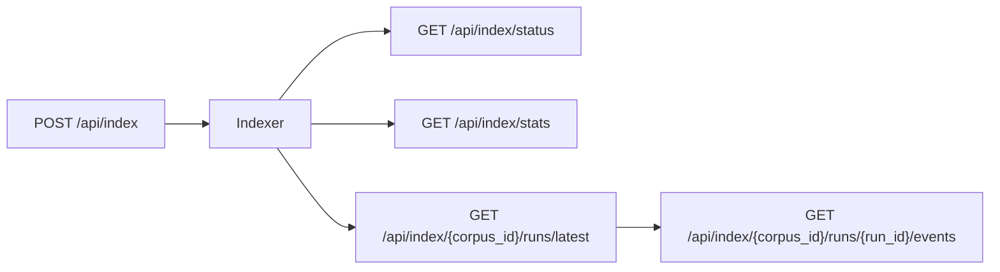

# Indexing API

<div class="grid chunk_summaries" markdown>

-   :material-file-document-multiple:{ .lg .middle } **Start**

    ---

    `POST /index` with `IndexRequest`.

-   :material-progress-clock:{ .lg .middle } **Status**

    ---

    `GET /index/status` returns progress, current file.

-   :material-harddisk:{ .lg .middle } **Stats**

    ---

    `GET /index/stats` returns storage breakdown.

</div>

[Get started](index.md){ .md-button .md-button--primary }
[Configuration](configuration.md){ .md-button }
[API](api.md){ .md-button }

!!! tip "Force reindex"
    Set `force_reindex=true` only when you need a clean rebuild. Incremental updates are cheaper.

!!! note "BM25 vocabulary"
    `/index/vocab-preview` helps debug tokenizer/stemmer stopword settings.

!!! warning "Repo path"
    Ensure `repo_path` points to a locally accessible directory (bind-mount in Docker).

| Route | Method | Description |
|-------|--------|-------------|
| `/index` | POST | Start indexing |
| `/index/status` | GET | Current state |
| `/index/stats` | GET | Storage stats |
| `/index/{corpus_id}/runs/latest` | GET | Latest run summary (run id, status, progress, figure counts); `?finalize=false` for a pure read |
| `/index/{corpus_id}/runs/{run_id}/events` | GET | Event log for a run (`?limit=500`), usable for replay or live tailing |

!!! note "Runs are observable regardless of who started them"
    Every indexing run is recorded against the corpus and can be polled by any client — the UI, a CI job that started the run via `POST /api/index`, or a scheduled automation. The **RAG → Indexing** tab polls `/api/index/{corpus_id}/status` and, when it finds a run it did not start itself, mirrors its progress bar, current file, event log, and Stop button, marking the run "started outside this tab". This means an indexing job kicked off by an API call or a schedule is never invisible in the workbench.

!!! note "A 409 fence conflict names the run and what it is doing"
    Starting, stopping, or deleting an index on a corpus whose fence is held answers the typed `IndexRunConflictResponse`. Alongside `run_id`, `owner`, `started_at` and `heartbeat_at`, the detail carries:

    - `phase` — the holding run's fence phase: `building` while it indexes, `retiring` while it retires the previous generation.
    - `stage` — what the holding run last reported doing (its most recent `log`/`progress` run event, e.g. `Converting apollo-11-mission-report.pdf: still running (600s elapsed)`), or `null` when the run has logged nothing yet. The stage is read from the tail of the holding run's event log — never the full file — and the reader deliberately does not drain the live write queue, so it can lag by at most a moment and never hangs the response.

    The same builder serves the corpus-delete refusal (`DELETE /api/repos/{corpus_id}` and `DELETE /api/corpora/{corpus_id}`, both of which document the `409` in their OpenAPI responses), so the delete refusal and the index-start refusal cannot drift apart.



!!! note "Run summaries record the figure phase"
    Every completed run’s `IndexRunSummary` persists `figures_described`, `figures_failed`, and `figures_undescribed`, plus `figure_description_cost_usd` — a ceiling on the vision-call cost, priced from catalog pricing for the run’s `indexing.figures.vision_model` over the full `max_completion_tokens` budget, and `null` when nothing was described or the alias is unpriced. A run that described no figures reports zero counts and no price, never a `$0.0000` line.

!!! tip "Polling many corpora? Read runs with `?finalize=false`"
    By default `GET /api/index/{corpus_id}/runs/latest` reconciles a persisted `indexing` run against the manifest and fence before answering — a fence read, a scoped-config load and an event-queue flush per call, and it rewrites the summary when the run turns out to have finished. Pass `finalize=false` for a pure read of the stored summary: no reconcile, no write, no event flush. A never-indexed corpus still answers `404`, so callers can tell “never indexed” from “could not be read”.

!!! note "The estimate itemises optional vision costs"
    `POST /api/index/estimate` returns an `IndexEstimate` whose cost fields are additive:

    - `embedding_cost_usd` — always populated when catalog pricing exists for the embedding model
    - `semantic_kg_cost_usd` — present only when `graph_indexing.semantic_kg_enabled` is on
    - `estimated_figures` + `figure_description_cost_usd` — present only when `indexing.figures.enabled` **and** `indexing.figures.describe` are on *and* the corpus contains PDFs; the figure count is a heuristic (PDF pages × 0.4, rounded; omitted entirely when it rounds to zero) and the cost is priced from `data/models.json` for `indexing.figures.vision_model`

    `total_cost_usd` sums whichever components apply and is `null` when any applicable component has no catalog price. When figures are off (or the corpus has no PDFs), the figure fields stay `null` — the estimate never shows a `$0` figure cost that isn't really zero. The **RAG → Indexing** tab renders the breakdown as `Embed $X + Semantic KG $Y + Figures $Z (~N figures)`.

    Time is itemized the same way: `estimated_seconds_figures` appears whenever the figure count does — the measured ~20 s per vision call divided by `indexing.figures.concurrency`, folded into the total time range — so the tab's `Embed ~X + Semantic KG ~Y + Figures ~Z` breakdown never double-counts the figure phase into the embedding line.

!!! tip "Semantic KG cost is priced through the gateway alias"
    `semantic_kg_cost_usd` resolves its model through the same `gateway_alias` lookup the figure price uses — the alias the run would actually call (`graph_indexing.semantic_kg_llm_model`, else the gateway default). A catalog `model` id such as `z-ai/glm-5.3-flash` is not an alias (aliases may not contain a `/`), so resolving by model id would price nothing at all; the default `ragweld-local` alias is a real, priced catalog row at $0/$0, so a default-config corpus reports a true zero rather than an unknown total.

=== "Python"
```python
import httpx
httpx.post("http://127.0.0.1:58012/api/index", json={"corpus_id":"docs","repo_path":"/repo","force_reindex":False})
```

=== "curl"
```bash
curl -sS -X POST http://127.0.0.1:58012/api/index -H 'Content-Type: application/json' -d '{"corpus_id":"docs","repo_path":"/repo","force_reindex":false}'
```

=== "TypeScript"
```typescript
await fetch('http://127.0.0.1:58012/api/index', { method:'POST', headers:{'Content-Type':'application/json'}, body: JSON.stringify({ corpus_id:'docs', repo_path:'/repo', force_reindex:false }) })
```

??? info "Dashboard"
    Use `DashboardIndexStatusResponse` and `DashboardIndexStatsResponse` to populate UI storage and status panels per corpus.
