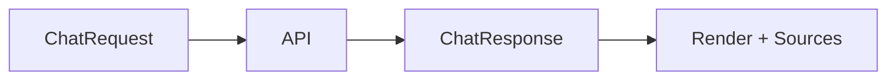

# Chat Models

<div class="grid chunk_summaries" markdown>

-   :material-chat-processing:{ .lg .middle } **Request/Response**

    ---

    `ChatRequest` and `ChatResponse` with streaming option.

-   :material-bug-outline:{ .lg .middle } **Debug Info**

    ---

    `ChatDebugInfo` includes per-leg enablement and fusion params.

-   :material-timeline-text:{ .lg .middle } **Tracing**

    ---

    `Trace`, `TraceEvent`, and `/traces/latest` for last run.

</div>

[Get started](index.md){ .md-button .md-button--primary }
[Configuration](configuration.md){ .md-button }
[API](api.md){ .md-button }

!!! tip "Data Sources"
    Chat composes sources: one or more corpora and (optionally) Recall. There are no modes — everything composes.

!!! note "Vision"
    `images` supports up to 5 attachments when the model/provider supports multimodal.

!!! note "Image token budgets are per documented model"
    The chat prompt budget prices attached images from a per-model table of published OpenAI image-token formulas (`server/chat/prompt_budget.py`). An OpenAI vision alias the table does not document — including a newly published model id that inherits no predecessor's formula — fails closed with a "no published finite image token bound" error instead of reserving tokens from a guessed formula, so a new vision model is entered deliberately rather than absorbed by a family-prefix heuristic. Until it is, image attachments to that alias are refused rather than under-budgeted.

!!! warning "Recall Scope"
    Recall gating only affects Recall; RAG corpora are always queried when checked.

| Model | Key Fields |
|-------|------------|
| `ChatRequest` | `message`, `corpus_id`, `sources`, `top_k`, `include_vector/sparse/graph`, `stream`, `web_enabled` |
| `ChatResponse` | `message`, `sources`, `tokens_used`, `debug`, `conversation_id`, `web_grounding` |
| `ChatDebugInfo` | `fusion_method`, `rrf_k`, per-leg weights, confidence thresholds, `graph_enabled`, graph leg counts (`graph_qdrant_seed_chunks`, `graph_resolved_entities`, `graph_relationship_expansion_hits`, `graph_community_expansion_hits`, `graph_hydrated_chunks`) |

!!! note "Graph counters in the chat debug footer"
    The dev/debug footer under an assistant message renders the message's own `ChatDebugInfo`. When that message's retrieval included the graph leg, it now discloses the leg's own accounting verbatim — `graph_enabled`, `graph_qdrant_seed_chunks` (the dense Qdrant seeds that fed the traversal), `graph_relationship_expansion_hits` (relationship-expansion hits), and `graph_hydrated_chunks` (chunks hydrated back from Postgres). The line renders only when `graph_enabled` is a boolean on the message, and the retired `graph_entity_hits` figure is never shown. Note that traversal credits only **non-seed** chunks: a search whose seed set already spans the whole corpus can legitimately report zero hydrated chunks beyond its seeds.

!!! note "A failed generation says why — and is traceable like a success"
    When the gateway cannot complete generation, the typed `generation_unavailable` detail carries `failure_kind` (`spend_limit`, `auth`, `upstream_unreachable`, `gateway_unreachable`, or `gateway`), a `gateway_reason` (the provider's own words, sanitised server-side: secrets, bearer tokens and key-bearing URLs removed), and an `operator_hint` chosen from that classification — an exhausted provider spending limit no longer sends you to check keys and aliases that are fine. The chat stream's in-band `error` event and the non-stream HTTP paths (chat, eval) share one classifier (`server/chat/generation_failure.py`), so the same refusal reads the same everywhere.

    The non-chat answer pipeline follows the same rules: `/api/answer` and `/api/answer/stream` take their `retrieval_error` / `llm_error` debug strings from the one shared sanitiser (`safe_error_message` in `server/chat/generation_failure.py`), so no server module keeps a private redaction copy. And a gateway reply that arrives without assistant content is a typed `GatewayContentMissingError` (`server/chat/generation.py`) carrying the response's `finish_reason` and token `usage`, so "a reasoning alias spent its whole output budget thinking" is distinguishable from a bare parse failure.

    A failed send also carries the run the server had already recorded: the stream's terminal `done` event follows the `error` event, and the UI publishes the run id, timing, and trace headers exactly like a successful answer — the Routing Trace panel follows the failed run instead of the previous successful one, and the error card's Details list the failure class, the sanitised reason, and the run id. See [UI tour](manual/ui.md).

    The trace panel is also honest when the run it is showing did not come from this conversation: with no answer in the conversation yet, its fallback query is the corpus's most recent run — which a Retrieval-tab search, an MCP probe, or another tab can have produced — and the panel says so in place instead of presenting that run silently as this conversation's trace. See [UI tour](manual/ui.md).

!!! note "Nothing is persisted before the exchange is committed"
    A chat exchange reaches durable history, the generation cache and the query record in one commit that happens **before** the stream's terminal `done` event goes out (the commit is shielded, so a closing client cannot interrupt it halfway). An exchange that fails, is cancelled, or loses its client leaves nothing behind: no assistant message built from failure text, and no unanswered question for Recall to index as a conversation. A client that reads `done` and disconnects immediately still gets the whole exchange committed. The Routing Trace panel derives "which runs this conversation produced" from the stored thread, so its foreign-run label survives reloads and follows session switches. See [UI tour](manual/ui.md).



=== "Python"
```python
import httpx
print(httpx.post("http://127.0.0.1:8012/api/chat", json={"corpus_id":"tribrid","message":"where is auth?"}).json())
```

=== "curl"
```bash
curl -sS -X POST http://127.0.0.1:8012/api/chat -H 'Content-Type: application/json' -d '{"corpus_id":"tribrid","message":"where is auth?"}' | jq .
```

=== "TypeScript"
```typescript
const r = await (await fetch('/api/chat', { method:'POST', headers:{'Content-Type':'application/json'}, body: JSON.stringify({ corpus_id:'tribrid', message:'where is auth?' }) })).json();
```

??? info "Recall Gate"
    `ChatResponse.debug.recall_plan` exposes the decision: intensity, overrides, and the signals behind them.
