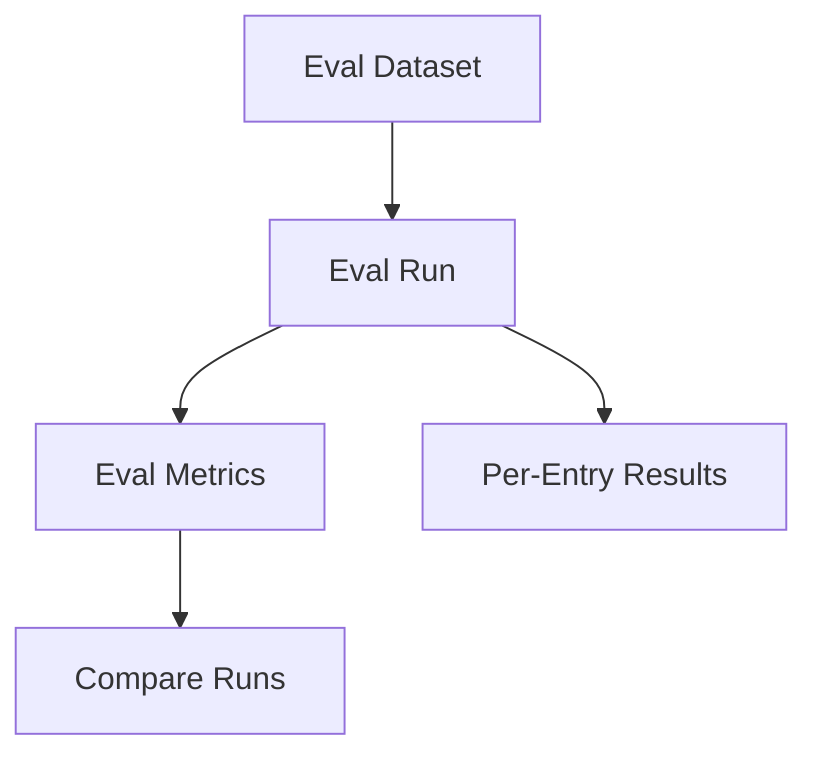

# Evaluation Models

<div class="grid chunk_summaries" markdown>

-   :material-clipboard-text-search:{ .lg .middle } **Eval Dataset**

    ---

    `EvalDatasetItem` defines questions and expected paths.

-   :material-chart-line:{ .lg .middle } **Metrics**

    ---

    `EvalMetrics`, `EvalRun`, `EvalResult` capture performance.

-   :material-compare:{ .lg .middle } **Comparisons**

    ---

    `EvalComparisonResult` compares two runs.

</div>

[Get started](index.md){ .md-button .md-button--primary }
[Configuration](configuration.md){ .md-button }
[API](api.md){ .md-button }

!!! tip "Match Production"
    Tune `eval_final_k` and `eval_multi` to reflect real usage; misaligned evals mislead.

!!! note "Config Snapshots"
    `EvalRun` stores both nested and flat config snapshots for reproducibility.

!!! note "AI analyses are persisted, not re-charged"
    `POST /api/eval/analyze_comparison` saves the generated analysis as an `EvalAnalysisArtifact` (under `data/eval_runs/analysis/`). `GET /api/eval/analysis/{run_id}?compare_run_id=...` serves it back without touching the gateway; it answers `404` when nothing is cached **or** when the cached analysis was generated against a different baseline — a stale pair is never served. Deleting a run deletes its cached analysis. See [Evaluation Guide](eval_guide.md).

!!! warning "Latency Budget"
    Track `latency_p95_ms` across runs to guard against regressions.

| Model | Purpose |
|-------|---------|
| `EvalDatasetItem` | Single question + expected file paths |
| `EvalMetrics` | Aggregated metrics (MRR, Recall@K, NDCG@10, latency percentiles) |
| `EvalRun` | Complete run with config snapshot and results |
| `EvalComparisonResult` | Delta between baseline and current runs |
| `EvalAnalysisArtifact` | Persisted AI comparison analysis, keyed by (run_id, compare_run_id) |



=== "Python"
```python
import httpx
base = "http://localhost:8000"
print(httpx.post(f"{base}/reranker/evaluate", json={"corpus_id": "tribrid"}).json())
```

=== "curl"
```bash
BASE=http://localhost:8000
curl -sS -X POST "$BASE/reranker/evaluate" -H 'Content-Type: application/json' -d '{"corpus_id":"tribrid"}' | jq .
```

=== "TypeScript"
```typescript
const report = await (await fetch('/reranker/evaluate', { method:'POST', headers:{'Content-Type':'application/json'}, body: JSON.stringify({ corpus_id: 'tribrid' }) })).json();
```

??? info "Top-K alignment"
    Ensure `eval_final_k >= retrieval.final_k` when you want strict hit@K parity with production.

??? note "Figure eval dataset models"
    Page-grounded figure evaluation uses its own dataset shapes in `server/models/eval_figures.py` (`FigureEvalDataset` / `FigureEvalItem` with `question`, `expected_pages` (1-based), `figure_ref`, `kind` (`locate`/`content`) and `tags`). They are serialized to `data/eval_datasets/*.json` and consumed by `scripts/eval_figure_grounding.py`; no frontend consumes them, so they are deliberately not registered for TypeScript generation. See [Figure grounding eval](guides/eval_figure_grounding.md).

    These complement — they do not replace — the `EvalDatasetItem` path-based shapes above.
