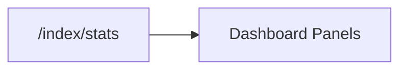

# Index Dashboard Models

<div class="grid chunk_summaries" markdown>

-   :material-chart-box-outline:{ .lg .middle } **Storage Breakdown**

    ---

    `DashboardIndexStorageBreakdown` shows bytes across Postgres + Neo4j.

-   :material-currency-usd:{ .lg .middle } **Costs**

    ---

    `DashboardIndexCosts` estimates embedding, semantic KG, and figure-description costs.

-   :material-database-cog:{ .lg .middle } **Embedding Config**

    ---

    `DashboardEmbeddingConfigSummary` summarizes vector storage settings.

</div>

[Get started](index.md){ .md-button .md-button--primary }
[Configuration](configuration.md){ .md-button }
[API](api.md){ .md-button }

!!! tip "At-a-glance"
    Use dashboard stats to detect storage drift (e.g., pgvector index growth) and plan compaction windows.

!!! note "Estimates"
    Some values (e.g., GIN/GIST index allocations) may be estimated when exact attribution is not possible.

!!! warning "Quotas"
    Track total storage vs. quotas per environment to avoid surprise outages.

| Model | Fields |
|-------|--------|
| `DashboardIndexStorageBreakdown` | `chunks_bytes`, `chunk_summaries_bytes`, `qdrant_points`, `qdrant_dense_vector_bytes`, `neo4j_store_bytes` (nullable when unmeasured), `neo4j_store_note`, `postgres_total_bytes`, `total_storage_bytes` |
| `DashboardIndexCosts` | `total_tokens`, `embedding_cost`, `semantic_kg_cost`, `figure_description_cost`, `figures_described`, `total_cost`, `accounting` (saved `IndexRunAccounting` for the live generation's run) |
| `DashboardIndexStatusResponse` | `lines`, `metadata`, `running`, `progress`, `current_file` |

!!! note "Costs are saved observations, never repriced"
    Every cost field now comes from the accounting saved with the live generation's index run (resolved through the corpus manifest, not the newest summary on disk): the frozen pre-run estimate the run captured under its own config, plus the reconciled native spend when reconciliation has settled. Current configuration never reprices a past run — change the embedding model and the card still shows what the live generation actually cost. A corpus with no manifest-named run reports `null` for every component, and a missing or unpriced component keeps the total unknown rather than counting as zero. The `accounting` block carries the full census (admitted/in-flight requests, retained workers, coverage and pricing states, reconciliation reasons). See [Native run accounting](operations/native_costs.md).

!!! note "An unmeasured store is null with a reason, never a measured-looking zero"
    Neo4j 5 Community exposes no store-size source — `dbms.queryJmx` is gone in Neo4j 5, APOC core has no `apoc.monitor.store`, `SHOW DATABASES` carries no size column, and the data volume is a root-owned Docker volume the API process cannot read. When no measurement source exists, `neo4j_store_bytes` is `null` with `neo4j_store_note` saying why, the store contributes nothing to `total_storage_bytes`, and both Dashboard panels render the tile as `n/a` instead of a measured-looking `0 B (0.0% of total)` beside a graph of thousands of nodes.



=== "Python"
```python
import httpx
print(httpx.get("http://localhost:8000/index/stats?corpus_id=tribrid").json())
```

=== "curl"
```bash
curl -sS "http://localhost:8000/index/stats?corpus_id=tribrid" | jq .
```

=== "TypeScript"
```typescript
const stats = await (await fetch('/index/stats?corpus_id=tribrid')).json();
```

??? info "Metadata"
    `DashboardIndexStatusMetadata.embedding_config` aligns with the active embedding provider/model/dimensions.
