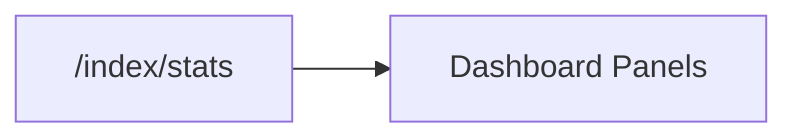

# Index Dashboard Models

<div class="grid chunk_summaries" markdown>

-   :material-chart-box-outline:{ .lg .middle } **Storage Breakdown**

    ---

    `DashboardIndexStorageBreakdown` shows bytes across Postgres + Neo4j.

-   :material-currency-usd:{ .lg .middle } **Costs**

    ---

    `DashboardIndexCosts` estimates embedding, semantic KG, and figure-description costs.

-   :material-database-cog:{ .lg .middle } **Embedding Config**

    ---

    `DashboardEmbeddingConfigSummary` summarizes vector storage settings.

</div>

[Get started](index.md){ .md-button .md-button--primary }
[Configuration](configuration.md){ .md-button }
[API](api.md){ .md-button }

!!! tip "At-a-glance"
    Use dashboard stats to detect storage drift (e.g., pgvector index growth) and plan compaction windows.

!!! note "Estimates"
    Some values (e.g., GIN/GIST index allocations) may be estimated when exact attribution is not possible.

!!! warning "Quotas"
    Track total storage vs. quotas per environment to avoid surprise outages.

| Model | Fields |
|-------|--------|
| `DashboardIndexStorageBreakdown` | `chunks_bytes`, `embeddings_bytes`, `pgvector_index_bytes`, `bm25_index_bytes`, `neo4j_store_bytes`, `total_storage_bytes` |
| `DashboardIndexCosts` | `total_tokens`, `embedding_cost`, `semantic_kg_cost`, `figure_description_cost`, `figures_described`, `total_cost` |
| `DashboardIndexStatusResponse` | `lines`, `metadata`, `running`, `progress`, `current_file` |

!!! note "Figure spend is read off the latest committed run"
    `figure_description_cost` and `figures_described` come from the latest **committed** indexing run summary, not the newest summary on disk: starting a re-index writes an `indexing` summary (zero figures, by design) immediately, and the cost card must keep reporting the live generation’s spend while that run is in flight — and keep it if that run errors. The figure cost is a ceiling: the run record prices the full completion budget per figure, so a real description spent less. `total_cost` sums exactly the phases that apply and is `null` when any applicable component has no known price — an unpriced component makes the total unknown rather than silently counting as zero.



=== "Python"
```python
import httpx
print(httpx.get("http://localhost:8000/index/stats?corpus_id=tribrid").json())
```

=== "curl"
```bash
curl -sS "http://localhost:8000/index/stats?corpus_id=tribrid" | jq .
```

=== "TypeScript"
```typescript
const stats = await (await fetch('/index/stats?corpus_id=tribrid')).json();
```

??? info "Metadata"
    `DashboardIndexStatusMetadata.embedding_config` aligns with the active embedding provider/model/dimensions.
