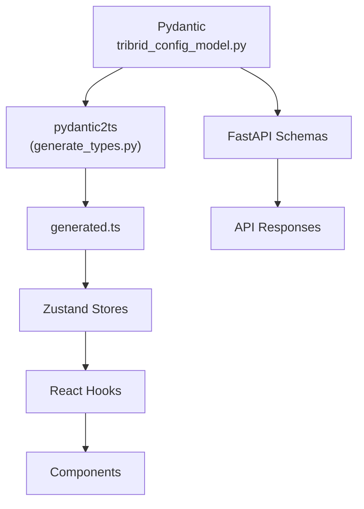
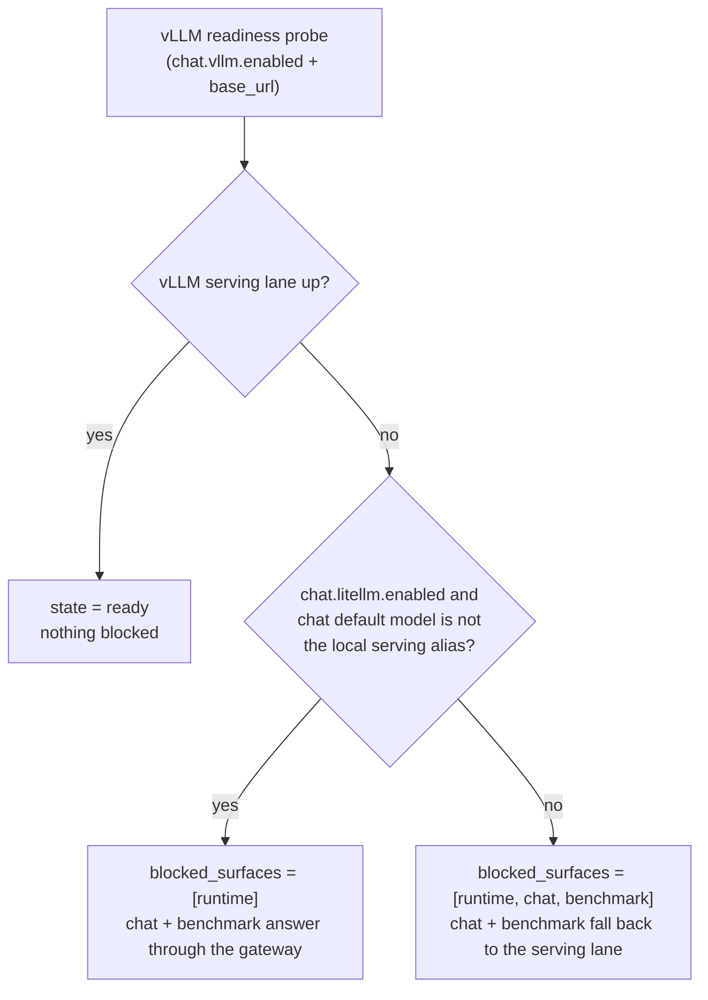
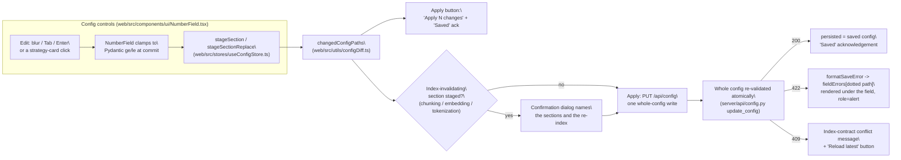

```markdown
# Configuration

<div class="grid chunk_summaries" markdown>

-   :material-cog:{ .lg .middle } **Single Source of Truth**

    ---

    `server/models/tribrid_config_model.py` defines every tunable parameter with Pydantic `Field()` constraints.

-   :material-file-code:{ .lg .middle } **Generated Types**

    ---

    `uv run scripts/generate_types.py` produces `web/src/types/generated.ts`. No hand-written interfaces.

-   :material-scale-balance:{ .lg .middle } **Constraints Enforced**

    ---

    Min/max ranges, enums, and defaults are validated at load time with precise error messages.

</div>

[Get started](index.md){ .md-button .md-button--primary }
[Configuration](configuration.md){ .md-button }
[Config reference](reference/config/index.md){ .md-button }
[API](api.md){ .md-button }

!!! tip "Workflow: Pydantic First"
    1) Add/modify fields in Pydantic. 2) Regenerate TS types. 3) Wire stores/hooks/components using generated types. 4) Update backend logic to honor new fields.

!!! note "Corpus ID Migration"
    Prefer `corpus_id`. Models accept `repo_id` via `AliasChoices` for backward compatibility, but serialize `corpus_id`.

!!! danger "No Adapters"
    If the frontend needs a different shape, change the Pydantic model and regenerate. Adapters introduce drift and are not allowed.

!!! note "Credentials are redacted on the wire"
    `GET /api/config` serves the password inside `indexing.postgres_url` and the authorization value in `tracing.otlp_headers` as `[redacted]`; a PUT/PATCH that returns the marker restores the stored value, so "leave it unchanged" round-trips safely. Typing a real value rotates the secret, and a marker with nothing stored behind it is a `422`. Run-record config snapshots (eval, reranker, agent, synthetic) are redacted the same way. See [Security](security.md).

!!! note "Cloud embeddings are validated against the gateway route at write time"
    Saving a config where `embedding.embedding_backend=provider` and `embedding.embedding_type=openai` is checked against the catalog's native embedding routes (`server/api/config.py` `_validate_model_capabilities`): the selected `embedding.embedding_model` must be a gateway-served OpenAI embedding row (`text-embedding-3-small` or `text-embedding-3-large`), and `embedding.embedding_dim` must not exceed that model's full capacity (1536 / 3072 — catalog dimensions are model capacity, not your shortened output size). A write that fails either check answers `422` and persists nothing, global or corpus-scoped. The check applies even with `indexing.skip_dense` set, because retrieval and the semantic cache can still need embeddings; deterministic and non-OpenAI embedding backends are unaffected.

## Derivation Chain



## Major Sections (Selected Fields)

!!! tip "Need the full 1000+ parameter surface?"
    Use the auto-generated [Configuration Reference](reference/config/index.md) pages. They enumerate **every** tunable key with:
    - JSON path (`retrieval.rrf_k_div`)
    - env-style key (when available, via `TriBridConfig.to_flat_dict()`)
    - type, default, and validation constraints
    - long-form “tooltip” guidance pulled from `data/glossary.json` (when present)

| Section | Key Fields (examples) | Why it matters |
|--------|------------------------|----------------|
| retrieval | `final_k`, `eval_final_k`, `fallback_confidence`, `conf_top1`, `conf_avg5`, `conf_any`, `multi_query_m` | Retry/accept gates, result shaping, and the eval-only final-k |
| fusion | `method`, `vector_weight`, `sparse_weight`, `graph_weight`, `rrf_k`, `normalize_scores` | How legs combine into a single ranking |
| vector_search | `enabled`, `top_k`, `similarity_threshold` | Dense (Qdrant) candidate size |
| sparse_search | `enabled`, `top_k`, `bm25_k1`, `bm25_b` | Sparse (Qdrant BM25) candidate size and scoring |
| graph_search | `enabled`, `max_hops`, `top_k`, `chunk_neighbor_window`, `include_communities` | Qdrant-seeded Neo4j traversal behavior |
| embedding | `embedding_type`, `embedding_model`, `embedding_dim`, `embedding_batch_size` | Embedding provider + dimensions |
| chunking | `chunking_strategy`, `chunk_size`, `chunk_overlap`, `max_chunk_tokens`, `preserve_imports` | Index quality and performance |
| reranking | `reranker_mode`, `reranker_*`, `tribrid_reranker_*` | Cloud/learning reranker stage tuning |
| graph_storage | `neo4j_*`, `neo4j_database_mode` | Graph connectivity and isolation |
| chat.recall_gate | `enabled`, `default_intensity`, `skip_*`, `*top_k`, `*recency_weight` | Smart memory gating |
| chat.web | `enabled`, `engine`, `max_results`, `max_total_results`, `max_characters` | Server-owned web-search policy for Chat |
| indexing | `figures.*`, `estimate.*` | Vision-described figures inside Docling-converted PDFs (off by default; the run refuses to start if the vision alias is not vision-capable), plus the measured-estimate floors `estimate.max_relative_error` and `estimate.min_files_per_format` |
| document_viewer | `page_render_scale`, `thumbnail_render_scale`, `max_text_bytes` | Source document evidence viewer limits |

!!! note "Removed: the dead `retrieval.topk_*` and weight duplicates"
    `retrieval.rrf_k_div`, `retrieval.langgraph_final_k`, `retrieval.bm25_weight`, `retrieval.vector_weight`, `retrieval.topk_dense`, and `retrieval.topk_sparse` are gone from the config model. They duplicated the knobs the pipeline actually reads (`server/retrieval/fusion.py`): fusion weights live under `fusion.*`, the dense candidate size is `vector_search.top_k`, and the sparse candidate size is `sparse_search.top_k`. A saved config that still carries the old keys simply ignores them — retune at the canonical homes. `retrieval.eval_final_k` stays: it is the evaluation-only final-k (`server/api/eval.py`) and is deliberately distinct from `retrieval.final_k`, not a duplicate.

!!! note "Removed: the legacy base+suffix chat prompt composition"
    `chat.system_prompt_base`, `chat.system_prompt_rag_suffix`, and `chat.system_prompt_recall_suffix` are gone from `ChatConfig`. Exactly one of the four state prompts (`system_prompt_direct`, `system_prompt_rag`, `system_prompt_recall`, `system_prompt_rag_and_recall`) is selected per message by whether RAG and/or Recall context is present, so the legacy base+suffix path was a second, conflicting instruction surface behind the live one. `GET /api/prompts` lists only the four state prompts, and a persisted config that still carries the removed keys loads cleanly — the config-store upgrade path strips them (`server/services/config_store.py`), as does the flat loader (`server/config.py`). If you customized a suffix, move that text into the state prompt whose behavior you want it to affect.

!!! note "Removed: graph mode and Neo4j chunk-vector knobs"
    `graph_search.mode`, `graph_search.chunk_seed_overfetch_multiplier`, `graph_search.chunk_entity_expansion_enabled`, `graph_search.chunk_entity_expansion_weight`, `graph_indexing.store_chunk_embeddings`, `graph_indexing.chunk_vector_index_name`, `graph_indexing.chunk_embedding_property`, `graph_indexing.vector_similarity_function`, `graph_indexing.wait_vector_index_online`, `graph_indexing.vector_index_online_timeout_s`, and `graph_storage.community_algorithm` are gone from the config model. The graph leg is now one pipeline — dense Qdrant seeds joined to generation-scoped Neo4j entities through `FROM_CHUNK`, expanded through relationships, `NEXT_CHUNK` neighbors, and GDS Leiden communities — so the chunk/entity toggle and its blend knobs have nothing left to control. A saved config that still carries the old keys loads cleanly; the config-store upgrade path strips them (`server/services/config_store.py`).

### Fusion Configuration

| Field | Type | Constraints | Description |
|------|------|-------------|-------------|
| `fusion.method` | Literal["rrf","weighted"] | required | Fusion algorithm |
| `fusion.vector_weight` | float | 0.0–1.0 | Weight for vector scores (weighted mode) |
| `fusion.sparse_weight` | float | 0.0–1.0 | Weight for sparse scores (weighted mode) |
| `fusion.graph_weight` | float | 0.0–1.0 | Weight for graph scores (weighted mode) |
| `fusion.rrf_k` | int | 1–200 | RRF smoothing constant |
| `fusion.normalize_scores` | bool | — | Normalize inputs before weighted fusion |

!!! warning "Weights Must Sum"
    Weighted mode normalizes tri-brid weights to approximately 1.0. If total ≤ 0, safe defaults are applied.

### Graph Retrieval Configuration

| Field | Type | Constraints | Description |
|------|------|-------------|-------------|
| `graph_search.enabled` | bool | — | Enable the graph leg (Qdrant-seeded Neo4j traversal) in retrieval |
| `graph_search.max_hops` | int | 1–5 | Traversal depth from seed entities |
| `graph_search.top_k` | int | 5–100 | Qdrant seed Top-K for the graph leg |
| `graph_search.chunk_neighbor_window` | int | 0–10 | Include up to N adjacent `NEXT_CHUNK` chunks around relationship hits |
| `graph_search.include_communities` | bool | — | Include community expansion (GDS Leiden communities written at index time) |
| `graph_search.max_related_entities_per_seed` | int | 1–1000 | Cap on related entities each seed entity may expand to (nearest first, then most connected) — bounds how far a hub entity can reach |

### Retrieval and Confidence Gates

| Field | Default | Description |
|-------|---------|-------------|
| `retrieval.final_k` | 10 | Final top-k after fusion/rerank |
| `retrieval.eval_final_k` | 5 | Final-k used only by the evaluation flow (`server/api/eval.py`); a distinct knob from `retrieval.final_k` |
| `vector_search.top_k` | 50 | Dense (Qdrant) candidates per query |
| `sparse_search.top_k` | 50 | Sparse (Qdrant BM25) candidates per query |
| `retrieval.conf_top1` | 0.62 | Early accept top-1 threshold |
| `retrieval.conf_avg5` | 0.55 | Group quality threshold (top-5) |
| `retrieval.conf_any` | 0.55 | Safety net minimum |

### Chat Recall Gate (Memory)

| Field | Default | Meaning |
|-------|---------|---------|
| `chat.recall_gate.enabled` | true | Turn smart Recall gating on/off |
| `chat.recall_gate.default_intensity` | standard | Fallback when no strong signal |
| `chat.recall_gate.skip_greetings` | true | Skip trivial conversational glue |
| `chat.recall_gate.light_top_k` | 3 | Light mode snippets |
| `chat.recall_gate.standard_top_k` | 5 | Standard mode snippets |
| `chat.recall_gate.deep_top_k` | 10 | Deep mode snippets |
| `chat.recall_gate.standard_recency_weight` | 0.3 | Recent > old balance |
| `chat.recall_gate.deep_recency_weight` | 0.5 | Stronger recency in deep mode |

## Read and Update Config via API (Annotated)

=== "Python"
```python
import httpx
base = "http://127.0.0.1:8012/api"

# Read full config (1)!
cfg = httpx.get(f"{base}/config").json()

# Patch a section (fusion) (2)!
patch = {"method": "weighted", "vector_weight": 0.5, "sparse_weight": 0.3, "graph_weight": 0.2}
httpx.patch(f"{base}/config/fusion", json=patch).raise_for_status()

# Reset to defaults (3)!
httpx.post(f"{base}/config/reset").raise_for_status()
```

1. Fetch authoritative nested config
2. Sectional PATCH is validated by Pydantic
3. Reset restores model defaults

=== "curl"
```bash
BASE=http://127.0.0.1:8012/api

# Read (1)!
curl -sS "$BASE/config" | jq .

# Patch fusion (2)!
curl -sS -X PATCH "$BASE/config/fusion" \
  -H 'Content-Type: application/json' \
  -d '{"method":"weighted","vector_weight":0.5,"sparse_weight":0.3,"graph_weight":0.2}' | jq .

# Reset (3)!
curl -sS -X POST "$BASE/config/reset" | jq .
```

1. Retrieve full config
2. Update only the `fusion` section
3. Restore defaults (useful during experiments)

=== "TypeScript"
```typescript
import type { TriBridConfig } from "./web/src/types/generated";

async function loadConfig(): Promise<TriBridConfig> {
  const r = await fetch("/api/config");
  return await r.json(); // (1)!
}

async function patchFusion() {
  await fetch("/api/config/fusion", {
    method: "PATCH",
    headers: { "Content-Type": "application/json" },
    body: JSON.stringify({ method: "weighted", vector_weight: 0.5, sparse_weight: 0.3, graph_weight: 0.2 }),
  }); // (2)!
}
```

1. Typed fetch of config
2. Typed partial update for fusion settings

## Safe Defaults and Tradeoffs

- Vector vs Sparse vs Graph weights
  - If unsure, do this: `fusion.method = "rrf"`, `fusion.rrf_k = 60`. RRF is robust across modalities.
- Candidate sizes
  - Start with `vector_search.top_k=50`, `sparse_search.top_k=50`, `graph_search.top_k=30`. Increase for recall-heavy workloads. (`retrieval.topk_dense` and `retrieval.topk_sparse` no longer exist.)
- Confidence gates
  - Start with `conf_top1=0.62`, `conf_avg5=0.55`. Raise to increase precision (fewer answers), lower for more answers.

??? info "Where values come from"
    All defaults live in Pydantic `Field(default=...)` initializers. UI sliders and inputs read min/max from the same model. The server enforces the same constraints.

!!! note "UI numeric controls are clamped to the same model"
    Every numeric config control in the UI is a clamped `NumberField` whose advertised min/max match the Pydantic field it writes — the UI cannot accept a value the `PATCH /api/config/{section}` would reject, and a bound the model does not have is caught by a test against the model itself (`tests/unit/test_clean_start_defaults.py`) rather than surfacing later as an unattributed `422`. If you tighten a `ge`/`le` in Pydantic, regenerate the TypeScript types and the UI clamp follows automatically.

## Integration readiness (`GET /api/config/readiness`)

**Admin → Dependencies** renders `GET /api/config/readiness`: one `IntegrationReadiness` row per registered integration contract (`server/config_control_plane.py`), each with a `state`, the config paths and secrets it requires, failing checks, and — when it is not ready — the **surfaces it currently blocks**. `blocked_surfaces` is what an operator reads as "what stops working right now", so two contracts were tightened to say exactly that and no more:

- **MLflow blocks `training` only.** MLflow is the training lane's run/artifact truth (Learning Reranker and Learning Agent runs). The eval lane scores with Ragas and Promptfoo and imports nothing from MLflow, so an unready MLflow server no longer claims to block eval. A source-scan test (`tests/unit/test_config_control_plane.py`) keeps that claim true: if the eval lane ever starts using MLflow, the contract must change with it.
- **vLLM blocks chat and benchmark only when they actually route through it.** Chat and the benchmark answer through whichever generation lane is selected. With the LiteLLM gateway enabled and a cloud chat model, an off or unreachable vLLM blocks only its own serving lane (`runtime`). With the gateway disabled — or with the chat default model pinned to the local serving alias (`ragweld-local`, which is itself a gateway route onto the vLLM lane) — chat and the benchmark fall back to the serving lane, and the readiness row lists them as blocked.

*Concept diagram (the vLLM `blocked_surfaces` decision only — the full service map is on the [generated runtime-topology page](reference/architecture/runtime-topology.md)):*



!!! tip "If you're not sure what a blocked surface means"
    Read the row's `operator_hint` first — it names the fix (enable the lane, set the missing config path, or bring the dependency up). A surface that is *not* listed is not affected by that integration's state; that is the whole point of the narrowed contracts.

## How numeric fields behave in the UI

Every numeric config control in the workbench is one component: `web/src/components/ui/NumberField.tsx`. It exists so the question "what happens when I type a value past the bound?" has exactly one answer on every surface — Chat settings, the RAG subtabs, both training studios, Eval run settings, Data Quality, Grafana config. And like every config edit in the workbench, its commit is **staged**: the edit lands in the working config and nothing reaches the server until the footer's **Apply** button writes the whole document.

*Concept diagram (the staged commit mechanism only — the read/patch config API itself is documented above):*



In practice:

- **Typing is never saved.** The box holds raw text while you edit; blurring, Tabbing, or pressing Enter stages the edit — it writes nothing.
- **The clamp happens at staging.** A value past the advertised min/max is corrected before it is staged, so the raw value never reaches the server — the Apply PUT carries the clamped value, and a fresh `GET /api/config` confirms the persisted value is the clamped one.
- **Apply is the only write.** The footer counts the staged leaf changes (`Apply 3 changes`) and shows a brief `Saved` acknowledgement after a successful write. Loading a corpus or switching corpora replaces both snapshots, so unapplied staged edits are dropped by design — apply before you leave a surface.
- **A rejected PUT attributes to fields.** The whole config is validated atomically, so a `422` means nothing was saved. `web/src/utils/saveErrorMessage.ts` shapes the server's detail into per-field messages (never axios's raw status string), and a `NumberField` with a `configPath` prop renders its own message under the box as a `role=alert`.
- **A 409 conflict offers a way out.** When the server refuses the write because it would invalidate the stored index contract, the footer shows the reason plus a **Reload latest** button that discards the staged edits and re-reads the server's current config.
- **Index-invalidating changes warn before they write.** Staged edits under `chunking`, `embedding`, or `tokenization` mean the stored index no longer matches the config; Apply shows a confirmation naming those sections first. No side door commits them silently either: `flushPendingPatches` (used before Index Now and the Infrastructure → Paths save) throws until you Apply or discard.
- **Fields that are not config values still clamp.** The Storage Calculator's inputs and ad-hoc request parameters (Synthetic Lab, the graph max-hops control) pass bounds but no `configPath` — they clamp, there is just nothing persisted to attribute a server error to.

??? note "One deliberate exception: Chat's Top-K override"
    The Chat **Top-K (results)** control is a *nullable* per-conversation override: clearing it and blurring reverts to the corpus's configured `retrieval.final_k`, and it is never persisted to config. `NumberField`'s commit treats an empty box as "restore the last committed value", so it cannot express "the operator cleared this" — adopting it there would silently remove the only way back to the corpus default. The control still clamps (1–100) inline and is pinned by the guard test below.

Enforcement is a test against the model itself, not a review guideline (`tests/unit/test_clean_start_defaults.py`):

- `test_every_number_field_advertises_its_pydantic_bounds` walks every `NumberField` in `web/src`, resolves its config path (an explicit `configPath="a.b.c"` prop, or a `useConfigField<number>` binding), and asserts the advertised min/max equal the Pydantic `ge`/`le` — it checks **100+** controls, and a `NumberField` with neither marker must be a genuine non-config input.
- `test_no_config_editor_still_writes_a_raw_number_input` scans every frontend source and forbids a raw `<input type="number">` outside `NumberField.tsx`, with one pinned, documented exception (the Chat Top-K override above).

The end-to-end behavior is proven against a live stack in `web/tests/e2e/exhaustive/numberfield_migration.spec.ts` — see [Testing](testing.md).

!!! tip "If you're not sure"
    Add numeric controls as `<NumberField configPath="section.field" ... />` with min/max matching the Pydantic field. A bound the model does not have fails the bounds test above at build time, instead of surfacing later as an unattributed `422` in production. If a value must be clearable/nullable, do not use `NumberField` — clamp inline and document why, like the Chat Top-K control does.

