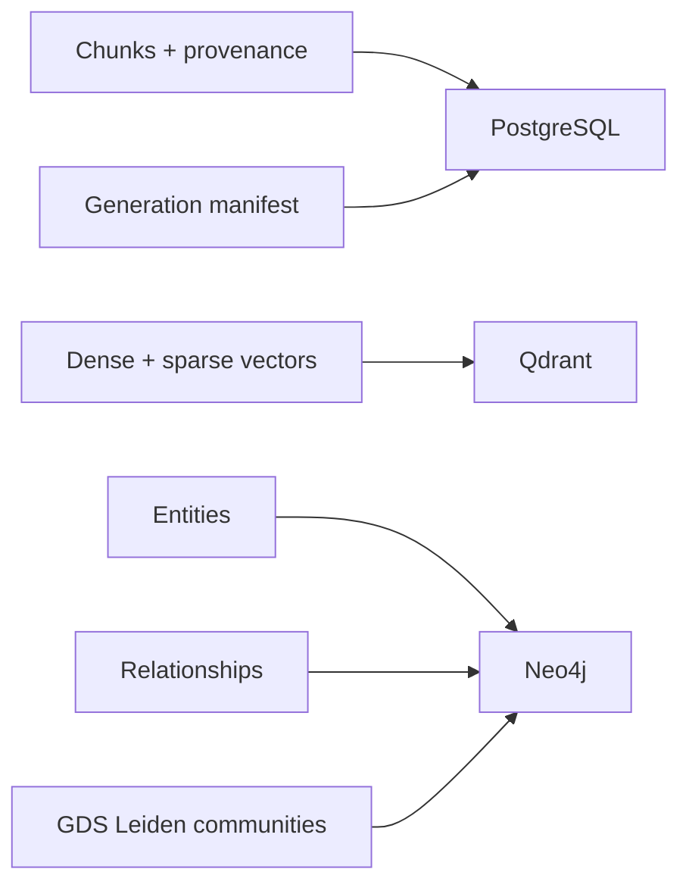

# Storage: PostgreSQL (chunk rows + manifests) and Neo4j

<div class="grid chunk_summaries" markdown>

-   :material-database:{ .lg .middle } **PostgreSQL**

    ---

    Chunk rows with provenance, chunk summaries, caches, and the generation manifest.

-   :material-vector-polyline:{ .lg .middle } **Qdrant**

    ---

    Per-corpus Qdrant generations hold the dense and sparse chunk vectors both retrieval legs query.

-   :material-graph:{ .lg .middle } **Neo4j**

    ---

    Generation-scoped entities and relationships linked to chunks (`FROM_CHUNK`), plus GDS Leiden communities.

</div>

[Get started](index.md){ .md-button .md-button--primary }
[Configuration](configuration.md){ .md-button }
[API](api.md){ .md-button }

!!! tip "One Postgres, Many Corpora"
    Partition by `repo_id`/`corpus_id` in schema to keep corpus isolation at the data layer.

!!! note "TSConfig"
    `indexing.postgres_ts_config` resolves the text search config (`simple` or a stemmer language) based on tokenizer settings.

!!! warning "Neo4j Isolation"
    `neo4j_database_mode=per_corpus` avoids expensive cross-corpus filters but requires Enterprise Edition.

## PostgreSQL Client Responsibilities

- Upsert chunk rows with metadata, content, and provenance
- Store the generation manifest (Qdrant collection + Neo4j graph id) and the dense/sparse contracts
- Serve chunk hydration for every retrieval leg

## Neo4j Client Responsibilities

- Resolve the corpus database (per mode)
- Store generation-scoped entities, relationships, and `FROM_CHUNK` chunk links
- Derive GDS Leiden communities at index time when `graph_storage.include_communities` is on
- Serve entity traversal seeded from the manifest's Qdrant generation

*Concept diagram (where each artifact lives only — the retrieval flow is on the [generated retrieval-pipeline page](reference/architecture/retrieval-pipeline.md)):*



### Configuration Hooks

| Section | Field(s) | Meaning |
|---------|----------|---------|
| indexing | `postgres_url` | DSN for Postgres |
| graph_storage | `neo4j_uri`, `neo4j_user`, `neo4j_password` | Neo4j connectivity |
| graph_storage | `neo4j_database_mode`, `neo4j_database_prefix` | DB isolation strategy |
| graph_indexing | `enabled`, `build_code_graph` | Derived graph policy selection |

=== "Python"
```python
# Resolve Neo4j database name for a corpus (1)!
from server.models.tribrid_config_model import GraphStorageConfig
print(GraphStorageConfig().resolve_database("dev_corpus"))
```

=== "curl"
```bash
# Connectivity checks are via readiness
curl -sS http://localhost:8000/ready | jq .
```

=== "TypeScript"
```typescript
// Client: no direct DB use — rely on API readiness
```

1. Uses prefix + sanitized corpus id in per_corpus mode

??? info "Qdrant vectors"
    Dense and sparse vectors live in per-corpus Qdrant generations; the corpus manifest names the physical collection and the contracts they were built under.

