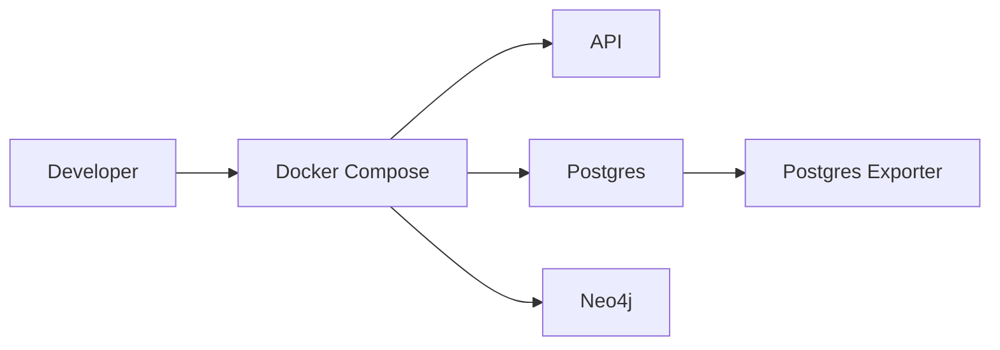
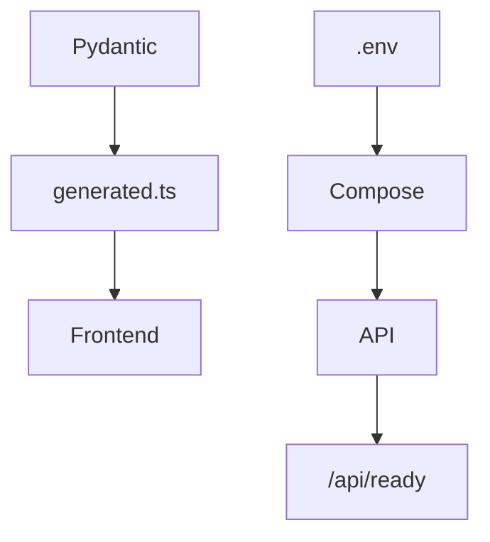

```markdown
# Deployment

<div class="grid chunk_summaries" markdown>

-   :material-docker:{ .lg .middle } **Docker-First**

    ---

    Compose stack for Postgres, Neo4j, exporter, and API.

-   :material-cog-transfer:{ .lg .middle } **Configurable**

    ---

    All behavior via Pydantic config and environment variables.

-   :material-cloud:{ .lg .middle } **Portable**

    ---

    Works on local dev, CI, or container platforms.

</div>

[Get started](index.md){ .md-button .md-button--primary }
[Configuration](configuration.md){ .md-button }
[API](api.md){ .md-button }

!!! tip "Persistent Volumes"
    Data lives in named Docker volumes (`postgres_data`, `qdrant_data`, `neo4j_data`, ...) owned by the `ragweld` Compose project. Back up the volumes rather than bind mounts.

!!! note "Environment Template"
    Copy the provided environment configuration to `.env` and fill in DB credentials. Upstream provider keys (`OPENAI_API_KEY`, `OPENROUTER_API_KEY`, `ANTHROPIC_API_KEY`, `GOOGLE_API_KEY`) are **gateway-owned**: they belong only in the gateway's private `infra/litellm.env`, initialized from `infra/litellm.env.example` on a new install (`disabled` is not a working key). The app talks to the gateway with `LITELLM_BASE_URL` and `LITELLM_API_KEY` from its own environment — never with an upstream provider key. `./start.sh` unsets inherited provider keys, the Compose API service blanks them, and importing the app drops any that survive, so a leaked shell export can never impersonate the gateway's upstream credential.

!!! tip "Precedence: shell environment beats `.env`"
    `./start.sh` sources `.env` with `set -a`, but it first snapshots every exported variable in your shell and restores that exact snapshot after sourcing. The practical effect: **caller-provided environment always wins over `.env`** — `.env` fills in only the keys you did not already set. This matters for ports (`BACKEND_PORT`, `FRONTEND_PORT`), provider keys you inject from a secret manager, and any CI runner that exports configuration before invoking `./start.sh`.

    The snapshot/restore uses `export -p` + `eval` rather than bash-4 associative arrays, so the behavior is identical under macOS's stock bash 3.2. A regression here (a `.env` value silently clobbering an exported override) is caught by `tests/unit/test_runtime_lifecycle.py`.

!!! warning "Production Secrets"
    Use a secret manager for API keys and DB credentials in production. Do not rely on `.env` files in containerized environments.

## Services and Ports

| Service | Port | Purpose |
|---------|------|---------|
| API (uvicorn, host) | 58012 | REST endpoints under `/api` |
| PostgreSQL | 5432 | Chunk rows, summaries, caches |
| Qdrant | 56333 | Dense + sparse chunk vectors |
| Neo4j Bolt | 7687 | Graph driver |
| Neo4j Browser | 7474 | Admin UI |
| LiteLLM | 54000 | Generation + native OpenAI embedding gateway |
| MLflow | 55500 | Training run tracking |
| Prometheus | 59090 | Metrics (remote-writes to Mimir) |
| Grafana | 3301 | Dashboards |
| Loki | 53100 | Log aggregation |



## Bring-Up Tasks

- [x] Create `.env` with DB creds (upstream provider keys belong in `infra/litellm.env`, not here)
- [x] Initialize `infra/litellm.env` from `infra/litellm.env.example` and fill in the upstream keys you need
- [x] `docker compose up -d`
- [x] `uv run scripts/generate_types.py`
- [x] Start API service

=== "Python"
```python
import subprocess, os

# Generate types from Pydantic (1)!
subprocess.check_call(["uv", "run", "scripts/generate_types.py"])  # (1) Pydantic → TS types

# Start FastAPI via uvicorn (2)!
os.system("uvicorn server.main:app --reload --port 8000")  # (2) Dev server
```

=== "curl"
```bash
# After containers are up:
curl -sS http://127.0.0.1:58012/api/ready | jq .  # readiness check (3)!
```

=== "TypeScript"
```typescript
// Frontend dev typically proxies to :8000
console.log("Ensure generated.ts exists and API ready at /ready");
```



??? note "Container Logs"
    Use `/docker/{container}/logs` to fetch current log lines via API for basic troubleshooting when UI access is limited.

