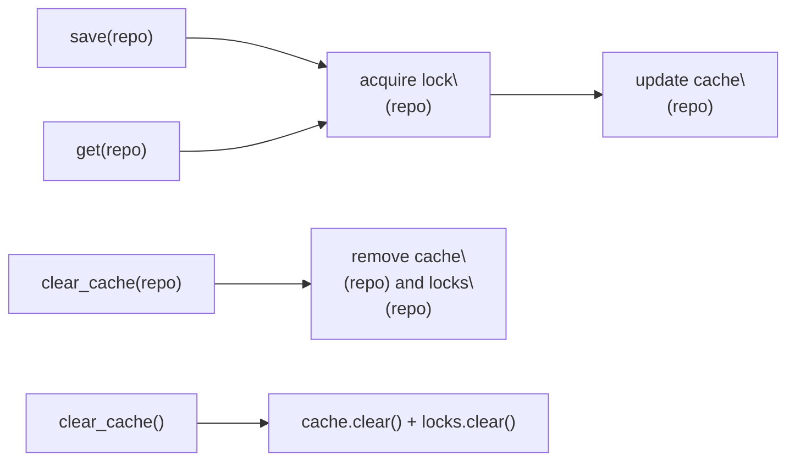

# Config cache & locks (developer guide)

<div class="grid chunk_summaries" markdown>

-   :material-database-lock:{ .lg .middle } **Per-corpus locks**

    ---

    `ConfigStore` uses an in-memory async lock per `repo_id` (corpus id) to serialize reads/writes for that corpus.

-   :material-broom:{ .lg .middle } **Clear = cache + locks**

    ---

    As of current builds, `clear_cache()` also releases the corresponding lock(s) so ephemeral corpora don't leave stale locks behind.

-   :material-rocket-launch:{ .lg .middle } **Hot reloads stay safe**

    ---

    Clearing cache does not cancel in-flight work. It removes the lock reference so new work uses a fresh lock after current operations finish.

-   :material-file-tree:{ .lg .middle } **Pydantic-first**

    ---

    All shapes flow from `server/models/tribrid_config_model.py`. The store caches those validated models keyed by corpus.

</div>

[Get started](../index.md){ .md-button .md-button--primary }
[Configuration](../configuration.md){ .md-button }
[API](../api.md){ .md-button }
[Config store & caching](config_store.md){ .md-button }

!!! note "Naming — repo_id vs corpus"
    The code paths and internal APIs use `repo_id` as the canonical key. In user-facing APIs and docs, treat it as the corpus identifier.

## What changed and why it matters

`server/services/config_store.py`:

- `ConfigStore.clear_cache(None)` now clears both:
  - the in-memory config cache map
  - the per-corpus locks map
- `ConfigStore.clear_cache(repo_id="...")` now:
  - evicts that corpus from the config cache
  - removes the matching lock from the locks map

Why this matters:

- Prevents lock object leaks for short-lived or dynamically named corpora (ephemeral `repo_id`s).
- Ensures a hot-reload that wipes a corpus entry also resets its concurrency primitive, so follow-on operations don't accumulate stale lock references.
- Does not affect currently executing operations: removing a lock from the dict does not cancel or break an in-flight `asyncio.Lock`; running tasks still hold their reference and will release it normally.

!!! tip "If you’re not sure, clear just the corpus you changed"
    Prefer targeted clears (`clear_cache(repo_id=...)`) during development. Use global clears only for large migrations or test isolation.

## Concurrency model at a glance



Key properties:

- Per-corpus serialization via a lock keyed by `repo_id`.
- Cache holds validated Pydantic objects; cache misses hydrate from durable backing or defaults (implementation detail).
- Clearing does not retroactively modify any active `save/get`; it only impacts subsequent calls.

## Usage examples (Python)

=== "Targeted corpus clear"

    ```python
    import asyncio
    from server.services.config_store import ConfigStore

    async def main() -> None:
        store = ConfigStore("postgresql://unused")  # (1)!

        # You modified settings for the "docs" corpus
        store.clear_cache(repo_id="docs")  # (2)!

        # Next access will re-hydrate config and use a fresh lock
        cfg = await store.get(repo_id="docs")  # (3)!
        print(cfg.retrieval.vector_search.top_k)

    asyncio.run(main())
    ```

    1. The store coordinates an in-memory cache and per-corpus async locks. The DSN here is not used for the example.
    2. Evicts both the cached config and the lock for `"docs"`.
    3. A subsequent `get()` re-populates cache for `"docs"` under a new lock.

=== "Global clear"

    ```python
    from server.services.config_store import ConfigStore

    store = ConfigStore("postgresql://unused")

    # Reset everything: configs and locks
    store.clear_cache()
    ```

    - Use this for large test suites, migrations, or when you want an entirely clean slate between scenarios.

!!! warning "Clearing while operations are running"
    - `clear_cache()` does not cancel work in progress.
    - If a task currently holds an `asyncio.Lock`, it continues unaffected and will eventually release it.
    - New calls after a clear will acquire a fresh lock object from the store.

## How we test it

Unit coverage asserts the new behavior:

- `tests/unit/test_config_store.py::test_clear_cache_releases_repo_lock` ensures that `clear_cache(repo_id=...)` removes the corresponding entry from the internal locks map.
- Concurrency tests ensure a newer save is not overwritten by older concurrent saves.

!!! note "Where to look in code"
    - Store implementation: `server/services/config_store.py`
    - Pydantic model (authoritative config): `server/models/tribrid_config_model.py`
    - Unit tests: `tests/unit/test_config_store.py`

## Operational checklist (lock + cache hygiene)

- [ ] Prefer per-corpus clears during interactive development.
- [ ] Use global clear between large, isolated integration tests.
- [ ] If you see surprising stale values after a change, confirm the caller is addressing the correct `repo_id`.
- [ ] Avoid generating unbounded `repo_id`s (e.g., UUID per request) unless you also clear them; each unique id will allocate a lock and a cache entry.

## FAQ

Definition list:

Lock lifetime
:   Tied to the in-memory map entry. When you `clear_cache(repo_id=...)`, future operations for that `repo_id` will use a new lock instance once they need one.

Does clear cancel my tasks?
:   No. It only removes entries from internal dictionaries. In-flight tasks continue to completion.

Why not reuse the same lock after clear?
