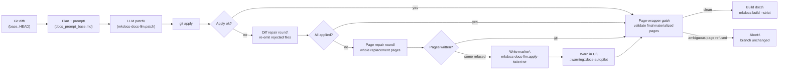

# Docs Autopilot (CI soft-fail updates)

<div class="grid chunk_summaries" markdown>

-   :material-cog:{ .lg .middle } **Soft-fail patch apply**

    ---

    The CI no longer hard-fails when the LLM-generated patch can’t apply. We continue the job, record the error, and surface clear warnings.

-   :material-file:{ .lg .middle } **Marker file = source of truth**

    ---

    When `git apply` fails, the workflow writes `mkdocs-docs-llm.apply-failed.txt` with the error. Downstream steps read this file.

-   :material-alert:{ .lg .middle } **Action warnings, not silent drops**

    ---

    The generator emits `::warning::docs-autopilot: ...` so you can see what went wrong directly in GitHub Actions logs.

-   :material-console:{ .lg .middle } **Repro locally with one flag**

    ---

    Use `--soft-fail-apply-errors` in `generate_docs_from_diff.py` to mirror CI behavior on your machine.

-   :material-file-restore:{ .lg .middle } **Page repair before drop**

    ---

    Files git still rejects after the diff repair round get one whole-page replacement attempt before they are dropped from the patch.

</div>

[Docs Autopilot](docs-autopilot.md){ .md-button .md-button--primary }
[Workflow](docs-autopilot-workflow.md){ .md-button }
[Dev workflow](../dev_workflow.md){ .md-button }

!!! note "Scope"
    This page documents the CI-facing changes to ragweld’s Docs Autopilot introduced alongside updates to:
    
    - `.github/workflows/docs-automation.yml`
    - `scripts/docs_ai/generate_docs_from_diff.py`

## What changed (and why)

- The workflow now calls the generator with a new flag: `--soft-fail-apply-errors`.
- If the LLM produces a patch that cannot be cleanly applied, the run does not fail the job immediately.
- Instead, the script writes `mkdocs-docs-llm.apply-failed.txt` containing the apply error, and emits GitHub Actions warnings.
- A lightweight “Docs autopilot failed” step adds summary context if the marker file exists.
- We still upload both the patch and the apply-failed marker as artifacts for inspection.

Rationale:

- Docs edits often race with concurrent human commits. Hard-failing CI on a non-applicable patch wastes time.
- We want visibility without blocking: the docs still build later in the job so you get a trustworthy mkdocs signal.

## Page repair round (whole pages before drop)

Since the soft-fail change, the generator gained one more recovery pass for stubborn files. When
`git apply` rejects hunks for a file even after the diff repair round, the generator (by default)
asks the model for the **complete new content of each still-rejected page** instead of another diff.

How the round works:

- The request lists why each file was rejected, quotes the intended (rejected) hunks, and quotes each
  page's current text verbatim.
- The reply must use `### FILE: <path>` / `### END FILE` markers; markdown fences inside a page are
  just content.
- Whole-page replacements are validated with the same rules as a patch before being written:
  - only files already rejected may be written (anything else is refused),
  - only paths under `mkdocs/docs/`,
  - the replacement is diffed against the page on disk and re-checked against the delete limits, so
    an incremental run cannot use "whole page" mode to destroy hundreds of lines (bootstrap runs,
    `--base EMPTY`, may rewrite wholesale).
- Pages that pass the checks are written and staged; pages that fail are reported as refused with a
  reason (`not one of the rejected pages`, `outside mkdocs/docs`, a delete-limit error, or
  `identical to the current page`).

The raw model reply is written to `mkdocs-docs-llm-page-repair-raw.txt` whenever the round runs, and
`scripts/docs_ai/run_ci_autopilot.py` copies it into the run artifacts alongside the other raw
replies.

!!! tip "Turning the round off"
    Set `DOCS_AUTOPILOT_PAGE_REPAIR=0` to skip the whole-page recovery pass. Default is `1` (enabled).

## The page-wrapper gate (before any publish)

Since the two repair rounds, one more provider-free check guards what actually publishes. After the
config-reference regeneration, the CI orchestrator runs the validator against the **final materialized
tree** in its worktree (`generate_docs_from_diff.py --repair-page-wrappers --docs-root <worktree>`) —
including pages the AI patch never touched:

- It removes only a recognizable generated-page wrapper: a leading `` ```markdown `` (or `~~~markdown`)
  fence wrapped around a title plus a `grid chunk_summaries` feature div. Every other byte is
  preserved, and inner code examples' closing fences are parsed independently so they are never
  mistaken for the wrapper's.
- It validates the entire batch before writing anything: a page whose leading fence is ambiguous (a
  genuine Markdown-syntax example, an unclosed inner fence) refuses the whole run with no partial
  writes.
- A gate failure aborts with the branch unchanged and an error annotation, ahead of the strict build —
  the job summary records what the check reported.
- `python scripts/docs_ai/run_ci_autopilot.py --repair-page-wrappers-only` runs the same check
  standalone: a bot-owned commit containing exactly the mechanical wrapper deletions, with no content
  generator or provider call involved.

## Updated GitHub Actions workflow snippets

=== "Generate docs patch (apply)"

    ```yaml
    - name: Generate docs patch (apply)
      run: |
        BASE="${{ github.event.inputs.base_ref }}"
        if [ -z "$BASE" ]; then
          # Fallback to current branch if no manual input provided
          BASE="origin/${{ github.ref_name }}"
        fi
        echo "Using base ref: $BASE"
        python scripts/docs_ai/generate_docs_from_diff.py --base "$BASE" --llm openai --apply --soft-fail-apply-errors  # (1)!
    ```

    1. New behavior: on apply failure, write `mkdocs-docs-llm.apply-failed.txt`, emit `::warning::`, and continue the job.

=== "Failure summary + artifact upload"

    ```yaml
    - name: Docs autopilot failed
      if: hashFiles('mkdocs-docs-llm.apply-failed.txt') != ''  # (2)!
      run: |
        echo "## Docs Autopilot Failed" >> $GITHUB_STEP_SUMMARY
        echo "" >> $GITHUB_STEP_SUMMARY
        echo "The LLM patch was generated but could not be applied cleanly." >> $GITHUB_STEP_SUMMARY
        echo "See mkdocs-docs-llm.apply-failed.txt for details. Artifacts were uploaded." >> $GITHUB_STEP_SUMMARY

    - name: Upload docs autopilot artifacts
      uses: actions/upload-artifact@v4
      with:
        name: mkdocs-docs-llm-patch
        path: |
          mkdocs-docs-llm.patch
          mkdocs-docs-llm.apply-failed.txt  # (3)!
        if-no-files-found: ignore
    ```

    2. Deterministic, file-based signal: only runs when the marker exists.
    3. Upload the failure marker alongside the patch so you can triage locally.

## Local reproduction (match CI behavior)

Use the same soft-fail switch locally:

```bash
python scripts/docs_ai/generate_docs_from_diff.py \
  --base origin/main \
  --llm openai \
  --apply \
  --soft-fail-apply-errors  # (1)!
```

1. Mirrors CI: if the patch can’t be applied, the script writes `mkdocs-docs-llm.apply-failed.txt`, prints `::warning::` logs, and exits successfully.

The page repair round also runs here by default (`DOCS_AUTOPILOT_PAGE_REPAIR=1`), so a locally reproducible failure looks exactly like CI.

??? tip "Working with an existing patch file"
    If you already have a patch (from artifacts or a previous run), apply it directly:

    ```bash
    python scripts/docs_ai/generate_docs_from_diff.py --apply-patch mkdocs-docs-llm.patch
    ```

## Semantics and signals

mkdocs-docs-llm.patch
: The unified diff produced by the LLM. Suitable for `git apply --index`.

mkdocs-docs-llm.apply-failed.txt
: Written only when a patch apply error occurs. Contains the raw `git apply` error message and a trailing newline. Presence of this file drives the CI “failed” summary and artifact upload. Safe to delete.

::warning::docs-autopilot
: Log prefix used by the generator for GitHub Actions warnings. Helpful for quickly grepping pipeline issues.

mkdocs-docs-llm-page-repair-raw.txt
: Raw model reply from the whole-page repair round. Present only when that round ran (some files were still rejected after the diff repair round). Safe to delete; also copied into run artifacts.

!!! tip "Where warnings come from"
    The generator now uses a `_gh_warning()` helper to emit GitHub Actions warnings. You’ll see these in the job logs even when the job continues.

## CI flow (at a glance)

*Mechanism diagram (the apply-and-repair ladder inside the apply step plus the post-patch page-wrapper gate; the surrounding CI steps are shown in the workflow snippets above):*



## Operator checklist (triage quickly)

- [ ] Open GitHub Actions logs and search for `::warning::docs-autopilot`.
- [ ] Download artifacts: `mkdocs-docs-llm.patch` and `mkdocs-docs-llm.apply-failed.txt`.
- [ ] Read `mkdocs-docs-llm-page-repair-raw.txt` (when present) to see the whole-page replacements proposed for files the diff rounds kept rejecting.
- [ ] Inspect the marker file to understand the apply error.
- [ ] Try applying the patch locally on a clean branch.
- [ ] If conflicts are due to recent doc edits, manually port the safe hunks and re-run CI.
- [ ] Always run `mkdocs build --strict` locally after resolving conflicts.

??? info "Why does a patch fail to apply?"
    Common causes:

    - Concurrent edits to the same docs section changed context lines.
    - Files were moved/renamed after the LLM produced its patch.
    - The patch targets a page that was deleted or replaced in the meantime.
    - Whitespace/context drift in long code blocks changed anchors the patch relies on.

    Practical fixes:

    - Re-run the generator against the latest base (reduces drift).
    - Apply the patch manually and resolve conflicts with your editor.
    - If the LLM added a new page, create it manually and port the content.

## Safety and failure modes

!!! warning "Soft-fail does not mean success"
    Soft-fail prevents premature CI failures when applying patches, but your docs still need to build. The dedicated “Build documentation” step continues to enforce `mkdocs build --strict`.

!!! note "Idempotency"
    The generator clears any stale `mkdocs-docs-llm.apply-failed.txt` before running. If you see the file at the end of a run, it reflects the most recent apply attempt.

## Reference snippets (copy/paste)

=== "Minimal CI call"

```yaml
- name: Generate docs patch (apply)
  run: |
    python scripts/docs_ai/generate_docs_from_diff.py --base "origin/${{ github.ref_name }}" --llm openai --apply --soft-fail-apply-errors
```

=== "Detect failure via marker"

```yaml
if: hashFiles('mkdocs-docs-llm.apply-failed.txt') != ''
```

=== "Upload artifacts"

```yaml
with:
  name: mkdocs-docs-llm-patch
  path: |
