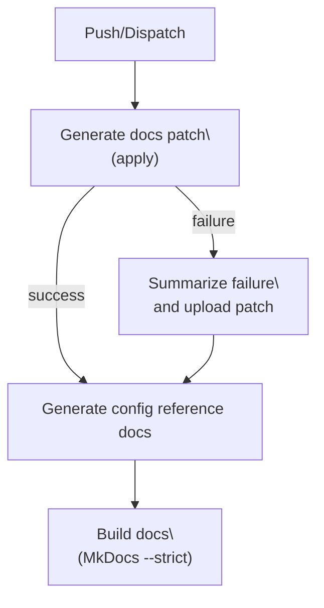

# Docs Autopilot workflow

<div class="grid chunk_summaries" markdown>

-   :material-robot-outline:{ .lg .middle } **Diff‑driven patches**

    ---

    A GitHub Action computes a git diff against a base ref and asks the LLM to generate a docs patch. Only MkDocs sources under `mkdocs/docs/**` and `mkdocs.yml` are touched.

-   :material-shield-half-full:{ .lg .middle } **Continue‑on‑error safety**

    ---

    If the patch cannot be applied cleanly, the workflow records a failure summary but continues to regenerate config reference and build docs.

-   :material-file-cog:{ .lg .middle } **Config reference regen**

    ---

    Reference pages under `reference/config/**` are auto‑generated from `server/models/tribrid_config_model.py` and `data/glossary.json`.

-   :material-file-check:{ .lg .middle } **Strict build**

    ---

    `mkdocs build --strict` runs so broken links or Mermaid errors fail fast during CI, not in production.

-   :material-archive:{ .lg .middle } **Patch artifact**

    ---

    On failure, the raw patch is uploaded as `mkdocs-docs-llm-patch` for easy manual apply and triage.

-   :material-account-wrench:{ .lg .middle } **Human‑in‑the‑loop**

    ---

    You can download the artifact, apply locally, adjust links, and push a fix. Keep edits surgical and API‑first.

</div>

[Get started](../index.md){ .md-button .md-button--primary }
[Configuration](../configuration.md){ .md-button }
[API](../api.md){ .md-button }
[Docs Autopilot (overview)](docs-autopilot.md){ .md-button }

!!! note "What changed in the workflow"
    The GitHub Actions job now gives the patch step an explicit id and does not stop the pipeline on apply errors:

    - The "Generate docs patch (apply)" step has `id: docs_patch` and `continue-on-error: true`.
    - The failure summary step is gated by `if: steps.docs_patch.outcome == 'failure'` instead of a job-wide `failure()`.
    - After a patch failure, the workflow still:
        - Regenerates the config reference docs (Pydantic + glossary)
        - Builds the site with MkDocs in strict mode
        - Publishes a concise failure summary and uploads the patch artifact

## CI flow at a glance



!!! tip "API first, MCP second (docs, too)"
    ragweld’s docs track the production API first. MCP coverage layers on top. When in doubt, document the HTTP endpoints and config models that live under `/api/*` (dev default `http://127.0.0.1:8012/api`) and reference MCP as an optional overlay.

## Triage when the patch fails (human fix loop)

- [ ] Download the `mkdocs-docs-llm-patch` artifact from the failed run
- [ ] Apply locally from repo root:

    ```bash
    git apply --index mkdocs-docs-llm-patch
    ```

- [ ] Resolve rejects (typically new anchors/links or Mermaid issues)
- [ ] Rebuild locally in strict mode:

    ```bash
    mkdocs build --strict
    ```

- [ ] Commit, push a PR, and link it to the failing workflow run

??? note "Common failure causes and quick fixes"
    - Broken relative links after file moves
        - Fix paths and verify with `mkdocs build --strict`
    - Mermaid v11 syntax errors
        - No HTML in Mermaid; quote labels with spaces/newlines: `A["Vector Search\\n(pgvector)"]`
    - Material feature mismatches
        - Keep admonition/tabs syntax exact; avoid nested HTML inside tabs
    - Reference/config edits in patches
        - Don’t hand-edit `reference/config/**` — those pages are overwritten by the generator step

## Local reproduction (config reference + strict build)

=== "uv"

```bash
uv run python scripts/generate_config_reference_docs.py --clean  # (1)!
uv run mkdocs build --strict                                      # (2)!
```

=== "pip"

```bash
python scripts/generate_config_reference_docs.py --clean  # (1)!
mkdocs build --strict                                      # (2)!
```

1. Regenerates all pages under `reference/config/**` from `server/models/tribrid_config_model.py` and `data/glossary.json`
2. Validates links, admonitions, tabs, Mermaid, and assets with strict rules

!!! danger "Do not hand‑edit generated config docs"
    Pages under `reference/config/**` are generated. If a parameter or tooltip is wrong, change it in Pydantic (`server/models/tribrid_config_model.py`) or `data/glossary.json`, then re‑run the generator.

## Where to look in the repo

- GitHub Actions workflow: `.github/workflows/docs-automation.yml`
    - Step: “Generate docs patch (apply)” uses `id: docs_patch` and `continue-on-error: true`
    - Failure summary is gated with `if: steps.docs_patch.outcome == 'failure'`
- Pydantic config source of truth: `server/models/tribrid_config_model.py`
    - All config shapes and defaults derive from here
- Glossary for long‑form tooltips: `data/glossary.json`

## Authoring guardrails (what the LLM and humans must follow)

Definition list:

ragweld naming
:   Use “ragweld” in all user‑facing docs. Use internal names like `tribrid_config_model.py` only for code paths and config keys.

API prefix
:   In dev, all backend routes mount under `/api`. Correct: `http://127.0.0.1:8012/api/search`, `fetch("/api/config")`.

Corpus ids
:   The code and APIs may still say `repo_id`; treat it as the corpus id. Keep corpora strictly separated in examples and screenshots.

Fusion truth
:   Retrieval is fused vector + sparse + graph, optionally reranked. Do not present vector‑only flows as “default”.

Generated docs
:   Never hand‑edit `reference/config/**`. Fix Pydantic + glossary and regenerate.

!!! tip "If you’re not sure"
    Prefer adding a new page over rewriting a high‑traffic page. Keep established anchors and headings stable to avoid breaking inbound links. Use gentle, additive edits.

## Example: documenting a new API with the correct prefix

When you add examples for a new endpoint, show the `/api` prefix and the default dev host/port:

=== "curl"

```bash
curl -sS "http://127.0.0.1:8012/api/health" | jq .
```

=== "TypeScript"

```ts
const res = await fetch("/api/config"); // dev UI proxies /api/* to backend
if (!res.ok) throw new Error(`Config fetch failed: ${res.status}`);
const cfg = await res.json();
```

## FAQ

- Does continue‑on‑error hide failures?
  - No. The step’s outcome is checked explicitly (`steps.docs_patch.outcome == 'failure'`) and a visible summary is posted. The pipeline continues so generated config docs and strict build still run.
- Can the LLM patch safely modify generated config pages?
  - It can propose changes, but they are overwritten by the generator step. To make config docs “stick”, update Pydantic and the glossary, then regenerate.
- Why strict builds?
  - To catch broken links, malformed tabs/admonitions, and Mermaid errors before publishing.

## Related reading

- High‑level Autopilot overview: [Docs Autopilot](docs-autopilot.md)
