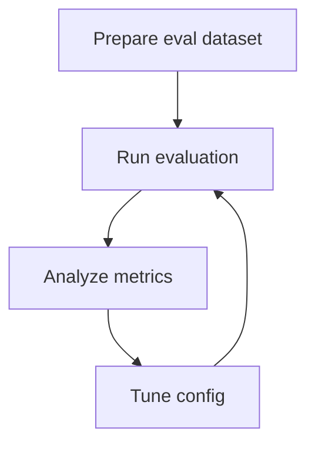
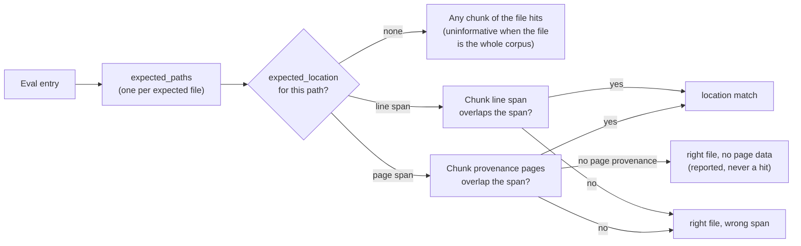

# Evaluation Guide

<div class="grid chunk_summaries" markdown>

-   :material-clipboard-check:{ .lg .middle } **Goals**

    ---

    Detect regressions, compare configs, and track latency.

-   :material-database-cog:{ .lg .middle } **Datasets**

    ---

    Use `EvalDatasetItem` with expected file paths.

-   :material-chart-line:{ .lg .middle } **Metrics**

    ---

    MRR, Recall@K, NDCG@10, p50/p95 latency.

</div>

[Get started](index.md){ .md-button .md-button--primary }
[Configuration](configuration.md){ .md-button }
[API](api.md){ .md-button }

!!! tip "Match prod"
    Align `eval_final_k` and `eval_multi` with production to avoid misleading results.

!!! note "Compare Runs"
    Use `/reranker/train/diff` or evaluation comparison endpoints to see deltas and compatibility.

!!! warning "Small samples"
    Use small samples for iteration, but run full suites before shipping changes.

## Typical Flow



=== "Python"
```python
import httpx
base = "http://localhost:8000"
# Trigger evaluation (1)!
print(httpx.post(f"{base}/reranker/evaluate", json={"corpus_id":"tribrid"}).json())
```

=== "curl"
```bash
BASE=http://localhost:8000
curl -sS -X POST "$BASE/reranker/evaluate" -H 'Content-Type: application/json' -d '{"corpus_id":"tribrid"}' | jq .
```

=== "TypeScript"
```typescript
// Load eval results and render charts
const result = await (await fetch('/reranker/evaluate', { method:'POST', headers:{'Content-Type':'application/json'}, body: JSON.stringify({ corpus_id: 'tribrid' }) })).json();
```

| Knob | Where | Default |
|------|-------|---------|
| `evaluation.eval_multi_m` | `TriBridConfig.evaluation` | 10 |
| `retrieval.eval_final_k` | `TriBridConfig.retrieval` | 5 |
| `retrieval.eval_multi` | `TriBridConfig.retrieval` | 1 (on) |

??? info "Prompt analysis"
    Use `system_prompts.eval_analysis` to generate skeptical post-hoc analysis comparing two runs.

## AI analysis: persisted, exportable, and honest about what changed

The comparison analysis is a costed LLM generation, so the drilldown treats it as an artifact rather than a transient panel:

- **Cached per run + baseline.** Generating an analysis persists it (`EvalAnalysisArtifact`) keyed by the current run id and the baseline it compared against. Re-opening the run serves the saved text with a **cached** badge and never calls the gateway again; **Regenerate** is the only control that re-charges. A cached analysis is never served for a different baseline — the read answers `404` and offers a fresh generate instead (see [Evaluation models](api_models_eval.md)).
- **Copy / Export .md.** The analysis (with the run ids and the model used in a header) can be copied to the clipboard or downloaded as Markdown, so reading it later costs nothing.
- **Per-question detail is already in the run.** Clicking a question row shows the retrieved chunks with rank, retrieval leg (`vector` / `sparse` / `graph`), fused score, and a highlight on chunks whose path matches `expected_paths`; when the gateway answered the question, the generated answer and the per-entry Ragas judge scores render below it (through the same markdown renderer chat uses). Opening a row fires no extra request.

Two honesty rules in the drilldown:

- **Changed params are counted once.** The eval knobs are carried in the flat snapshot (`EVAL_MULTI`, `EVAL_FINAL_K`) and as runtime fields (`use_multi`, `final_k`); aliases collapse to one canonical key before diffing, so "N params changed" counts distinct settings, not spellings of the same setting.
- **A config change is neutral.** A changed value no longer renders green or red based on whether the run improved — a single knob move does not map to the run's overall delta. Only real regressions (questions that got worse) are red.

## Give the grader something to grade: expected answers

The eval dataset form has an optional **expected answer** field. Promptfoo regression entries are graded against it — an entry without an expected answer is skipped by the grader, so filling it in is what makes a question gradeable rather than merely retrievable. It round-trips through the dataset API and shows on the saved entry.

!!! note "Deleting an eval entry confirms itself"
    The delete button on a dataset row opens a danger dialog that names the question being removed, states that runs already computed against it keep their results while no future run will include it, and focuses **Keep entry** first — a stray Enter declines. Deleting is not undoable.

## Pin expectations to pages or lines — and let uninformative entries opt out

Scoring is chunk-level: retrieval returns ranked chunks, and an entry's expectations decide which chunks count. Two additions make a dataset discriminate instead of flattering you:

- **Expected locations.** Each expected path can carry one page range (PDF and other paged documents, from the chunk's provenance) or line range (text and code). A chunk satisfies the expectation only when it comes from that file **and** its span overlaps the range. In the dataset form, pick **Pages** or **Lines** per path; a reversed span is refused in the form, and the persisted run records the typed locations.
- **Uninformative entries.** An entry with no expected paths — or file-only expectations that cover every indexed document, which is every question on a single-document corpus — cannot fail, so scoring it would always read 100%. Those entries are flagged in the drilldown (a badge on the question row and an **Uninformative** card), counted in the run's `uninformative_count`, and **excluded** from top-1/top-k/MRR/NDCG/MAP instead of scoring a vacuous perfect run. Add a location to make them count.

Because ranks are chunk ranks in fusion order — never de-duplicated file ranks — a corpus of one long PDF can now score a miss, which file-level scoring read as a flawless 100%. Alongside the change:

- `EvalMetrics.map_at_5` adds mean average precision over the top 5 chunks (`null` on runs scored before chunk-level scoring).
- Each retrieved chunk in the drilldown is labelled: **location match** (hit), **file match** (hit, no location), **right file, wrong span**, or **right file, no page data** (chunks indexed before provenance capture are reported, never scored as hits).

*Concept diagram (expectation matching only — the full fused pipeline is on the [generated retrieval-pipeline page](reference/architecture/retrieval-pipeline.md)):*



!!! tip "If you're not sure"
    Give every expected path at least a coarse span — even a wide page range beats whole-file, because a whole-file expectation on a one-document corpus is excluded from your own scores. Runs that predate locations keep their stored shapes; only new runs pick up the chunk-level scorer.

## Page-grounded figure retrieval (single-PDF corpora)

The standard eval lane scores retrieval by `expected_paths`, which works when a corpus spans many files but is meaningless on a corpus that is one PDF: every match has the same path, so path-level MRR is 1.0 whatever the retriever does. For document corpora indexed with [figure descriptions](manual/indexing.md), use the page-grounded dataset and scorer instead — each question is grounded on the **pages** where the answer is printed. See [Figure grounding eval](guides/eval_figure_grounding.md).

The two lanes complement each other: keep path-based runs for multi-file code corpora, and use the figure-grounding harness when the question "does retrieval bring back the page with the chart?" is the one that matters.
