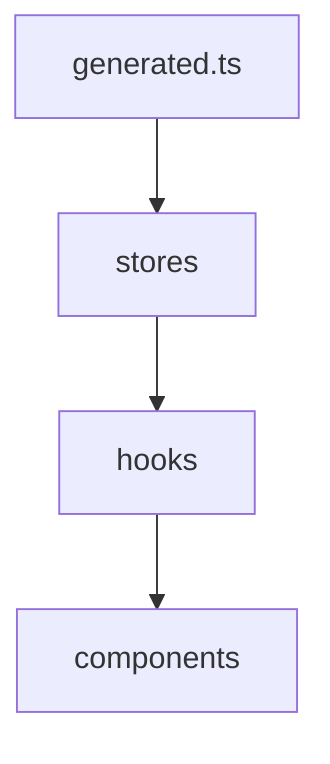
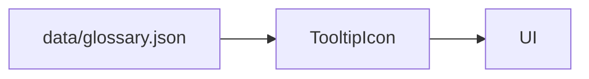

```markdown
# Frontend Integration and Types

<div class="grid chunk_summaries" markdown>

-   :material-code-json:{ .lg .middle } **Generated Types Only**

    ---

    `web/src/types/generated.ts` is the only source for API interfaces.

-   :material-store:{ .lg .middle } **Zustand Stores**

    ---

    Stores consume generated types; hooks expose typed accessors.

-   :material-react:{ .lg .middle } **Components**

    ---

    Props derive from hooks; no custom interfaces without Pydantic ancestry.

</div>

[Get started](index.md){ .md-button .md-button--primary }
[Configuration](configuration.md){ .md-button }
[API](api.md){ .md-button }

!!! tip "Generate Early"
    Run `uv run scripts/generate_types.py` before starting the frontend. Hot reload relies on correct types.

!!! note "Traceability"
    Every UI element (slider, toggle, input) must map to a Pydantic field. Tooltips come from `data/glossary.json`.

!!! warning "No Hand-Written Interfaces"
    Interfaces like `interface SearchResponse { ... }` are forbidden. Import from `generated.ts`.

## Store and Hook Structure

| File | Purpose |
|------|---------|
| `web/src/stores/useConfigStore.ts` | Holds the working `config` and server-acknowledged `persisted` snapshots plus staging helpers; records `fieldErrors` keyed by dotted config path from a rejected save, and `saveConflict` when a 409 index-contract lock refused the write. Loads are corpus-scoped: the registry's resolved active corpus (global when the registry resolves to no corpus) decides which `/api/config` scope is fetched, an epoch guard discards a late response for a superseded scope, and a scope change clears both snapshots and reloads |
| `web/src/stores/useRepoStore.ts` | The corpus registry: loads corpora with generation-based supersession (only the newest request publishes state and canonicalizes browser scope), and reports `resolved` only after a registry response applied — including a successful empty list — so consumers never mistake a failed first load for global scope. A mutation whose follow-up registry refresh fails raises with the completed operation named, so a caller never repeats a mutation the server already performed |
| `web/src/hooks/useConfig.ts` | Read/update config |
| `web/src/hooks/useFusion.ts` | Fusion-related derived state |
| `web/src/hooks/useReranker.ts` | Reranker configuration and status |



## Example Usage

=== "Python"
    ```python
    # Backend reference: see dev/pydantic.md for generation step (1)
    ```

=== "curl"
    ```bash
    # Frontend consumes API; see api.md for routes (2)
    ```

=== "TypeScript"
    ```typescript
    import { TriBridConfig, SearchResponse } from '../web/src/types/generated';

    function useConfig() {
      // typed fetch
      const [cfg, setCfg] = React.useState<TriBridConfig | null>(null);
      React.useEffect(() => { fetch('/api/config').then(r => r.json()).then(setCfg); }, []); // (3)
      return cfg;
    }
    ```

1. Types generation step is mandatory
2. API is the contract; no local mocks of shapes
3. Fetch returns the Pydantic-driven shape of config

!!! success "Tooltip Integration"
    `data/glossary.json` drives hover help via `TooltipIcon` in the UI. Keep term keys stable.

- [x] Use generated types across stores, hooks, and components
- [x] Remove any legacy custom interfaces
- [x] Validate prop chains map back to Pydantic fields



## Numeric inputs: `NumberField`

Every numeric input in the frontend is `web/src/components/ui/NumberField.tsx` — the one place a raw `<input type="number">` is allowed to render. It exists so a config-bound number has one behavior everywhere: raw text while editing, a clamp to the field's Pydantic bounds at commit (blur, Tab, or Enter), then a **staged** local update — the clamped value sits in the working config until the footer's **Apply** button PUTs the whole document.

Two props carry the contract:

configPath
:   The full dotted `TriBridConfig` path the field persists to (for example `enrichment.chunk_summaries_max`). When set, the per-field detail of a rejected PATCH — parsed by `web/src/utils/configPatchErrors.ts` into `useConfigStore`'s `fieldErrors` — renders under this exact field as a `role="alert"` message. Omit it for inputs that are not persisted config values (the Storage Calculator, ad-hoc request parameters): they still clamp, there is just nothing to attribute a server error to.

onCommit
:   Receives the clamped number. Clearing the box and blurring restores the last committed value — `NumberField` cannot express "the operator cleared this", so genuinely nullable overrides (Chat's per-conversation Top-K) must not use it. Under the staged commit model, `onCommit` calls `useConfigStore.stageSection` — a local merge into the working config with no network write.

Two tests enforce the contract instead of trusting review:

- `tests/unit/test_clean_start_defaults.py::test_every_number_field_advertises_its_pydantic_bounds` — every `NumberField`'s advertised min/max must equal the Pydantic `ge`/`le` of the config path it writes (resolved from `configPath` or a `useConfigField<number>` binding). It checks 100+ controls; a `NumberField` with neither marker must be a genuine non-config input.
- `tests/unit/test_clean_start_defaults.py::test_no_config_editor_still_writes_a_raw_number_input` — no frontend source may contain `type="number"` outside `NumberField.tsx`, with one pinned, documented exception (Chat's Top-K override).

The end-to-end behavior (blur writes nothing and stages, the Apply PUT carries the clamped value, the raw value never reaches any request) is proven against a live stack in `web/tests/e2e/exhaustive/numberfield_migration.spec.ts` — see [Testing](testing.md).

## Theme tokens and text contrast

<div class="grid chunk_summaries" markdown>

-   :material-palette:{ .lg .middle } **Text vs. background split**

    ---

    `--accent` is a button background and border color; `--accent-text` is the text-only variant.

-   :material-check-decagram:{ .lg .middle } **Floors, pinned by a test**

    ---

    Body text >= 7:1 and support text >= 4.5:1 against every composited surface, in both themes.

</div>

[Get started](index.md){ .md-button .md-button--primary }
[Configuration](configuration.md){ .md-button }
[API](api.md){ .md-button }

All GUI color choices live in `web/src/styles/tokens.css`, and the legibility rules that govern them are enforced by a real test (`tests/unit/test_web_tokens_contrast.py`), not by eyeballing. The motivation is concrete: ragweld's operator monitors are low-DPI, and muted grays that look fine on a retina screen collapse into mush there. If you add or change a styled surface, these are the constraints you inherit.

### The token contract

| Token | Role | Rule |
|-------|------|------|
| `--accent` | Button **background** (paired with `--accent-contrast`), borders, active accents | Never use as a `color:` (text) value — its dark-theme value fails the text-contrast floor on its own |
| `--accent-text` | Standalone **text** that wants the accent hue | Lightness-adjusted to clear 4.5:1 against `--bg`, `--bg-elev1`, `--bg-elev2`, and `--panel` in both themes; on the light theme it equals `--accent`, which already passes |
| `--fg` | Body text | >= 7:1 against every composited surface |
| `--fg-muted`, `--link`, `--ok`, `--warn`, `--err` | Support text and status colors | >= 4.5:1 against every composited surface |
| `--line` | Borders, hairlines, and divider strokes | >= 3:1 (the decorative-ink floor) against every surface it is drawn on, in both themes — a fainter border reads as a panel that failed to load on a low-DPI monitor |

### Two rules enforced beyond the tokens

1. **Never dim text with `opacity`.** A muted color tier is the only allowed way to de-emphasize text — an `opacity: 0.6` rule composites a token that passes its own floor down to well below it on screen.
2. **Resting opacity on visible controls >= 0.8.** Disabled and loading states communicate through `cursor`, border, and color, not through a sub-0.8 fade.
3. **Type and dimming floors are ownership-scoped.** Nothing under `web/src/styles/**` or `web/src/components/Dock/**` may render text below **11.5px** (a hard gate). Everywhere else a ratchet applies: the counts of sub-11.5px inline `fontSize` values and of inline text `opacity` below 0.8 may not grow, and every offender prints `file:line` so it can be routed to its owning lane. De-emphasize with a muted color tier at 11.5px or larger, never by shrinking or fading.

The test parses the hex values straight out of `tokens.css` (zero mocks, no hand-copied constants) and computes WCAG 2.x relative luminance and contrast ratios directly, across both theme blocks and all four surfaces text actually paints on. When an edit breaks a floor, the failure names the theme, the token, the surface, and the measured ratio.

!!! tip "Reaching for the accent color in text"
    Reach for `var(--accent-text)` instead of `var(--accent)`. The test also scans every `web/src/**/*.{css,tsx,ts}` file for raw `var(--accent)` used as a `color` value, so the migration stays durable. Note that scan is a heuristic over source text: it cannot see through an intermediate variable or lookup table (a `const accent = ...` re-exported as a text color), so review those by hand when you introduce them.

!!! note "What changed visually (operators)"
    Muted text is slightly brighter in both themes, the light-theme status colors were darkened to clear the 4.5:1 floor, and disabled/loading buttons no longer fade below 0.8 resting opacity. Nothing functional changed — this is a legibility pass, not a feature change.

!!! note "Shell geometry follows the same discipline"
    The app shell sizes itself from `--topbar-h` and `100dvh` (no more `calc(100vh - 56px)` magic numbers), so the fixed footer sits at the viewport bottom at every width, and a <=1200px compact breakpoint narrows the sidebar and settings rail — with the resize handle disabled there — so the content column keeps a readable width on half-screen windows. Borders in both themes were raised to the 3:1 decorative floor, so panels read as panels again.

??? note "Component Inventory"
    - `DockerStatusCard.tsx`, `HealthStatusCard.tsx` show system state
    - `RepoSelector.tsx` binds UI to `corpus_id`
    - `RAGTab.tsx`, `GrafanaTab.tsx`, `AdminTab.tsx` orchestrate panels using typed hooks

```
