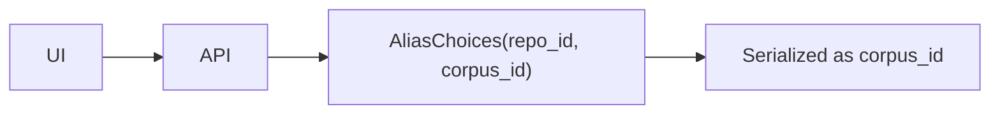

# Corpus vs repo_id

<div class="grid chunk_summaries" markdown>

-   :material-folder:{ .lg .middle } **Corpus-First**

    ---

    A corpus is any folder you index: repo, docs, or subtree.

-   :material-shield-sync:{ .lg .middle } **Isolation**

    ---

    Each corpus has separate Postgres tables, Neo4j DB, and config.

-   :material-rename:{ .lg .middle } **Naming Migration**

    ---

    API accepts `repo_id` but serializes as `corpus_id`.

</div>

[Get started](../index.md){ .md-button .md-button--primary }
[Configuration](../configuration.md){ .md-button }
[API](../api.md){ .md-button }

!!! tip "Best Practice"
    Use stable, lowercase slugs for corpus ids, e.g., `tribrid`, `myapp-docs`. Avoid spaces and special characters.

!!! note "AliasChoices"
    Pydantic models specify `validation_alias=AliasChoices("repo_id", "corpus_id")` and `serialization_alias="corpus_id"` to ensure forward compatibility.

!!! warning "Cross-Corpus Leakage"
    Never mix `corpus_id` across requests. Isolation is enforced in storage and graph layers.

!!! note "Runtime-managed corpora carry a typed `internal` flag"
    Some corpora are registered by the runtime, not by an operator: the chat Recall corpus (`recall_default`) and the Codex session corpora. Each carries a `meta.system_kind` marker, and the `Corpus` wire model now derives a typed `internal` flag from it (`server/api/repos.py` `_corpus_from_row`; see `tests/unit/test_domain_models.py`). These corpora index through their own path and never have an operator-run index run, so operator surfaces exclude them: the Dashboard's **Recent Index Runs** panel filters them out (they would otherwise read "never indexed" forever), and "delete all unindexed corpora" cleanup skips them via `internal` instead of a hardcoded `recall_default` check. See [UI tour](../manual/ui.md).

## Models Using corpus_id

| Model | Fields |
|-------|--------|
| `IndexRequest` | `corpus_id`, `repo_path`, `force_reindex` |
| `IndexStatus` | `corpus_id`, `status`, `progress`, `current_file` |
| `SearchRequest` | `corpus_id`, `query`, `top_k` |



## Example Requests

=== "Python"
```python
import httpx
req = {"corpus_id": "tribrid", "repo_path": "/code/tribrid", "force_reindex": False}
httpx.post("http://127.0.0.1:8012/api/index", json=req)
httpx.get("http://127.0.0.1:8012/api/index/tribrid/status")
```

=== "curl"
```bash
curl -sS -X POST http://127.0.0.1:8012/api/index -H 'Content-Type: application/json' -d '{
  "corpus_id": "tribrid", "repo_path": "/code/tribrid", "force_reindex": false
}'
```

=== "TypeScript"
```typescript
import type { IndexRequest } from "../../web/src/types/generated";
const req: IndexRequest = { corpus_id: 'tribrid', repo_path: '/code/tribrid', force_reindex: false };
```

!!! success "Multi-Corpus UIs"
    Add a repo switcher bound to `corpus_id`. All panels (RAG, Graph, Index) should update in lockstep.
