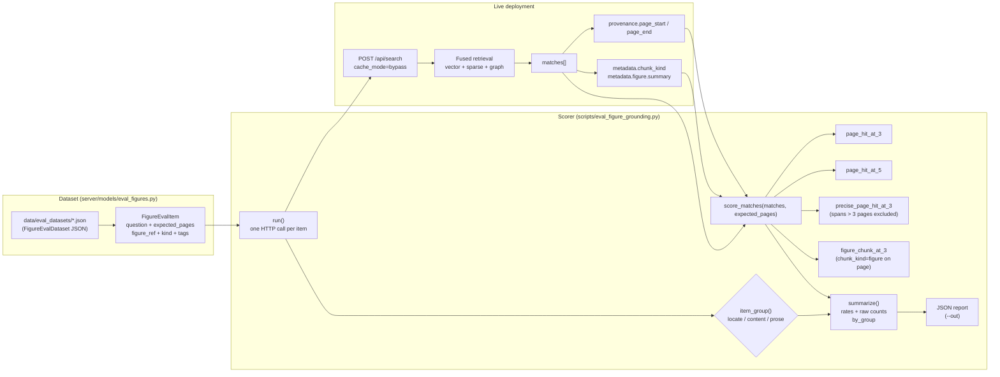

# Figure grounding eval (page-level retrieval)

<div class="grid chunk_summaries" markdown>

-   :material-file-chart:{ .lg .middle } **Scores pages, not paths**

    ---

    Every match in a single-PDF corpus has the same path, so path-level MRR is 1.0 whatever the retriever does. This eval asks whether the *page* the answer is printed on comes back in the top ranks.

-   :material-shape-rectangle-group:{ .lg .middle } **Figure-aware metrics**

    ---

    `figure_chunk_at_3` checks that described figure chunks — not just neighbouring prose — are what carry the hit.

-   :material-flask:{ .lg .middle } **Prose control group**

    ---

    Non-figure `prose` items are reported in their own group, so tuning figure behavior can never hide a regression on ordinary text retrieval.

-   :material-run-fast:{ .lg .middle } **Zero-mock harness**

    ---

    Every call is a real `POST /api/search`; cache reads are bypassed by default so a before/after comparison cannot replay cached results.

</div>

[Get started](../index.md){ .md-button .md-button--primary }
[Evaluation Guide](../eval_guide.md){ .md-button .md-button--primary }
[Indexing a corpus](../manual/indexing.md){ .md-button }
[Configuration](../configuration.md){ .md-button }

!!! tip "Who this is for"
    Operators running a document corpus — a scanned report, an engineering manual, a drawing set — where "which figure shows X?" is a real question. If your corpus is many files of code or prose, the standard [Evaluation Guide](../eval_guide.md) path-based lane is the right tool and you can skip this page.

## Why the path-based eval lane is blind on single-PDF corpora

The standard eval lane scores retrieval by `expected_paths`. That works when a corpus spans many files, but a corpus that is one PDF makes it meaningless: every match cites the same path, so path-level MRR and Recall are 1.0 regardless of ranking. Figure chunks (described during indexing via `indexing.figures`, see [Indexing a corpus](../manual/indexing.md)) are located by **page**, so this eval grounds each question on the pages where the answering figure (or prose passage) is actually printed and asks whether those pages came back in the top ranks.

## The dataset

Datasets are serialized to `data/eval_datasets/*.json` and validated by the Pydantic boundary models in `server/models/eval_figures.py` (`FigureEvalDataset` / `FigureEvalItem`):

| Field | Type | Meaning |
|-------|------|---------|
| `question` | `str` | A real question about the source document |
| `expected_pages` | `list[int]` | 1-based PDF pages on which the answering figure or passage is printed (every page must be ≥ 1) |
| `figure_ref` | `str` | The figure as the document names it (e.g. `Figure 5-6`), or the prose section |
| `kind` | `locate` \| `content` | `locate`: the caption alone answers it; `content`: only the plotted content does |
| `tags` | `list[str]` | Free-form grouping labels; `prose` marks a non-figure control item |

The file shape is `{"corpus_id": ..., "items": [...]}` — one item looks like:

```json
{
  "corpus_id": "nasa-apollo-11",
  "items": [
    {
      "question": "Which figure shows the lunar module pitch attitude time history during powered descent?",
      "expected_pages": [72],
      "figure_ref": "Figure 5-5",
      "kind": "locate",
      "tags": ["figure", "chart", "descent"]
    }
  ]
}
```

## The committed example dataset

`data/eval_datasets/nasa-apollo-11-figures.json` ships 25 questions against the Apollo 11 Mission Report (a 359-page scanned PDF, indexed as corpus `nasa-apollo-11`):

| Group | Count | What it measures |
|-------|-------|------------------|
| `locate` (figure) | 10 | Caption-level questions — "Which figure shows the lunar module pitch attitude time history during powered descent?" |
| `content` (figure) | 10 | Questions only the plotted content answers — "How many seconds of data are annotated as missing on the recording of spacecraft dynamics during powered descent?" |
| `prose` (control) | 5 | Ordinary text retrieval, e.g. "Who were the three Apollo 11 crewmen and what crew position did each of them hold?" |

Group membership is by tag: an item whose tags include `prose` is reported in the `prose` group no matter its `kind`, so the control never dilutes the headline figure numbers — and the `locate`/`content` groups cover disjoint pages, so one well-indexed figure cannot move both numbers together.

!!! note "Why this file is committed"
    The runtime publishes eval datasets to `data/eval_datasets/<corpus_id>.json`, and those stay ignored. The `.gitignore` re-includes exactly this one dataset so the example travels with the repo as a working reference.

## The scorer

`scripts/eval_figure_grounding.py` reads the dataset and fires one real `POST /api/search` per question against a live deployment. It scores the ranked matches against `expected_pages` using the typed provenance and metadata the search response already carries:

| Metric | Question it answers |
|--------|---------------------|
| `page_hit_at_3` / `page_hit_at_5` | Did any expected page appear among the cited pages of the top 3 / top 5 matches? |
| `precise_page_hit_at_3` | The same, counting only chunks that cite at most 3 pages (`MAX_PRECISE_SPAN_PAGES`) |
| `figure_chunk_at_3` | Is a top-3 match a figure chunk (`metadata.chunk_kind = "figure"`) that sits on an expected page? |
| `top` | The ranked window with each match's cited pages and kind, so a hit can be read back as real retrieval or as a neighbour-expanded blob rather than being taken on trust |

!!! warning "Why 'precise' exists"
    On a scanned report, pages that are wholly figure carry almost no extractable text, so the chunker merges across them and a single chunk can span a dozen pages. Such a chunk "covers" any figure page in its run by accident, which would let `page_hit_at_3` score a blob as a hit and make the pre-figure index look already good at exactly the questions figure chunks are supposed to fix. `precise_page_hit_at_3` re-asks the same question with those blobs excluded.

*Mechanism diagram (this harness only — the full fused retrieval pipeline is on the [generated retrieval-pipeline page](../reference/architecture/retrieval-pipeline.md)):*



## Run it

=== "Baseline"

    ```bash
    uv run python scripts/eval_figure_grounding.py \
      --out /tmp/eval_before.json
    ```

=== "After a change"

    ```bash
    uv run python scripts/eval_figure_grounding.py \
      --out /tmp/eval_after.json
    ```

=== "Explicit dataset and deployment"

    ```bash
    uv run python scripts/eval_figure_grounding.py \
      --dataset data/eval_datasets/nasa-apollo-11-figures.json \
      --base-url http://127.0.0.1:58012/api \
      --top-k 5 \
      --cache-mode bypass \
      --out /tmp/eval_before.json
    ```

Before/after workflow:

- [ ] Index the PDF corpus with `indexing.figures.enabled=true` and wait for the run to complete (see [Indexing a corpus](../manual/indexing.md))
- [ ] Run the scorer and save the baseline report
- [ ] Change one thing (reranking mode, chunking, figure filters) and re-index
- [ ] Re-run the scorer with the same `--dataset` and compare `page_hit_at_3`, `precise_page_hit_at_3`, and `figure_chunk_at_3` per group
- [ ] Check the `prose` group did not regress while the figure groups improved

!!! tip "If you're not sure how to read it"
    Treat `page_hit_at_3` as the headline, `precise_page_hit_at_3` as the honest version of it, and `figure_chunk_at_3` as proof the figure-description path is what moved the number. If `figure_chunk_at_3` is flat while `page_hit_at_3` improved, the prose around the figure is doing the work — which is a valid outcome, just a different one.

## Flags

--dataset
:   Path to the `FigureEvalDataset` JSON. Defaults to `data/eval_datasets/nasa-apollo-11-figures.json`.

--base-url
:   API base for the live deployment. Defaults to `http://127.0.0.1:58012/api` — always include the `/api` prefix in dev.

--top-k
:   Matches to request per question. Must be `>= 5`, otherwise `page_hit_at_5` silently collapses onto `page_hit_at_3`. Default `5`.

--cache-mode
:   `bypass` (the default) keeps a before/after comparison from replaying cached results. `default` and `refresh` are available when you explicitly want cache behavior in the measurement.

--timeout
:   Per-request HTTP timeout in seconds (default `120`).

--out
:   Write the JSON report to a file in addition to stdout.

!!! note "Failures are loud"
    Any transport or HTTP error is fatal, and a response without a `matches` list is fatal too — a silent empty result would score as a miss and quietly understate the index.

## For engineers

- Dataset boundary models live in `server/models/eval_figures.py`. They are serialized to disk and consumed by the script; deliberately **not** registered for TypeScript generation because no frontend reads them.
- Scoring is pure: `score_matches`, `summarize`, and the `match_*` helpers take match dicts, so they are unit-tested on hand-built shapes (`tests/unit/test_figure_eval_dataset.py`) — including absent provenance, `null` pages, multi-page spans, and the rank-4 boundary between @3 and @5.
- The test fixtures' provenance blocks are validated through the real `ChunkProvenance` model, so the tests cannot drift into shapes search never returns.
- This harness complements the standard eval lane; it is not a claim of complete end-to-end lineage across prompts, datasets, evals, and runs.
