# Synthetic Data Lab

<div class="grid chunk_summaries" markdown>

-   :material-flask:{ .lg .middle } **Recipe-driven generation**

    ---

    Turn an indexed corpus into grounded eval datasets, reranker triplets, semantic cards, and keywords — recipe by recipe, not one giant pipeline.

-   :material-scale-balance:{ .lg .middle } **Judge + quality gate**

    ---

    An LLM judge curates rows, a verbatim evidence check rejects ungrounded ones, and a retrieval quality gate blocks publication before weak data reaches your evals.

-   :material-shield-lock:{ .lg .middle } **Gated promotion**

    ---

    Only a completed, gate-passed run can be promoted to a lineage alias — enforced server-side, including on the raw lineage endpoint, so a failed run can never become "current".

</div>

[Get started](../index.md){ .md-button .md-button--primary }
[Evaluation guide](../eval_guide.md){ .md-button }
[Config reference: synthetic](../reference/config/synthetic.md){ .md-button }

!!! tip "Where it lives"
    Open **RAG → Synthetic Lab** with a corpus selected. Every run is scoped to that corpus, and each run ends with artifacts, a run report, and (for full-stack recipes) a lineage bundle you can publish or promote.

!!! note "Generation costs money"
    Generator and judge calls route through the LiteLLM gateway using the aliases you pick per run. A gated recipe that fails its quality gate has already spent the generation cost — the gate decides whether the output may be *used*, not whether it is free. Run small `max_pairs` first.

## What one run does

A run walks the corpus's indexed chunks in bounded batches:

1. **Generate** — the generator prompt (`system_prompts.synthetic_generator`) asks for question / expected answer / verbatim evidence-quote rows grounded in one chunk's excerpt, with self-contained questions (no "this document").
2. **Ground** — a row survives only when its `evidence_quote` appears **verbatim** in the source chunk; anything else is counted as ungrounded and dropped.
3. **Judge** — the judge prompt (`system_prompts.synthetic_judge`) scores each row 0–10 for grounding and self-containedness and keeps only what clears the bar (score >= 7.0 by default).
4. **Gate** — for retrieval-affecting recipes (`eval_dataset`, `triplets`), the gate retrieves the run's own generated questions against the corpus via `POST /api/search` and requires top-1 accuracy >= `synthetic.quality_gate.top1_min` over `synthetic.quality_gate.sample_size` samples.

!!! warning "The quality gate is a self-consistency check, not external validation"
    The gate retrieves the run's *own* generated questions against the corpus they came from. A perfect score proves the questions are self-consistent with the index — it is **not** evidence of retrieval quality on real operator questions. Validate published datasets with the [Evaluation guide](../eval_guide.md) workflows.

## Recipes and artifacts

| Recipe | Artifact | Publish action | Quality-gated |
|---|---|---|---|
| Grounded QA | `eval_dataset_json` | Publish eval dataset | yes |
| Triplets | `triplets_jsonl` | Publish triplets (reranker training) | yes |
| Semantic cards | `semantic_cards_jsonl` | Publish semantic cards | no |
| Keywords | keywords file | Publish keywords | no |

Every run also writes a human-readable `report_md` summary. That report is not published to a corpus store, so it has no Publish action; each artifact row carries **Copy path**, **Preview** (a bounded, read-only preview of the artifact rows), and **Publish** where applicable.

## Publish vs promote

Publishing writes an artifact into the corpus's stores (eval datasets, triplets, cards, keywords). **Promotion** moves a lineage alias — `baseline`, `canary`, `current`, or `promoted` — to point at the run's bundle, which is how the rest of the platform records "this output is now the reference".

The gate is enforced server-side on both paths:

| Run state | Promote? | What you see |
|---|---|---|
| `completed`, gate passed (or recipe has no gate), bundle attached | yes | alias buttons enabled |
| failed or still running | no — typed `409 PROMOTION_BLOCKED` | disabled buttons + the reason |
| completed but the gate failed | no — `409` | the gate's failure reason |
| completed but never attached to a bundle | no — `409` | "not attached to a lineage bundle" |

The **raw lineage endpoint** refuses too: `POST /api/lineage/aliases/{alias}` checks whether the posted bundle id belongs to a synthetic run and applies the same gate, so a direct API call cannot bypass the UI's disabled buttons. It fails closed — if a run's record no longer validates, promotion is refused rather than trusted.

```mermaid
flowchart LR
  subgraph s_req["Request (RAG - Synthetic Lab)"]
    REQ["POST /api/synthetic/run/start\\nprovider + recipe + models"]
  end
  subgraph s_orch["Orchestrator (server/synthetic/orchestrator.py)"]
    ORCH["Per-source chunk batches"]
    GEN["Generator LLM\\nsynthetic.generator.*\\nvia the LiteLLM gateway :54000"]
    GROUND["Grounding check\\nevidence_quote verbatim\\nin the source chunk"]
    REJ["Ungrounded + malformed rows rejected"]
    JUDGE["Judge LLM\\nsynthetic.judge.*\\nLLM-as-a-judge curation"]
    GATE["Quality gate\\nsynthetic.quality_gate.*\\nPOST /api/search on the corpus"]
    ART["Artifacts + report\\neval dataset / triplets /\\nsemantic cards / keywords"]
  end
  subgraph s_store["Run store and lineage"]
    RUNS["Run record\\nrun.json + live events"]
    BUNDLE["Lineage bundle"]
    PUBLISH["Publish endpoints\\n/synthetic/run/:id/publish/:kind"]
    PROMOTE["Promotion gate\\ncompleted + gate passed +\\nbundle attached, else 409"]
    ALIAS["POST /api/synthetic/run/:id/promote/:alias\\nand POST /api/lineage/aliases/:alias"]
    SET["Alias updated\\nbaseline / canary / current / promoted"]
  end
  REQ --> ORCH
  ORCH --> GEN
  GEN --> GROUND
  GROUND --> REJ
  GROUND --> JUDGE
  JUDGE --> GATE
  GATE --> ART
  GATE -->|"gate failed"| RUNS
  ART --> RUNS
  ART --> PUBLISH
  RUNS --> BUNDLE
  BUNDLE --> PROMOTE
  PROMOTE --> ALIAS
  ALIAS --> SET
```



## When a run fails

A failed run is a data point, not a dead end:

- The run detail shows the failure reason in a **Run failed** card; **Live events** below it holds the run log.
- **Retry** re-launches with the exact recipe, models, and parameters the run stored — no rebuilding the request by hand.
- Aliases stay locked until a run actually completes and passes its gate.

=== "Retry from the UI"

    Open the failed run in **RAG → Synthetic Lab**, read the reason, fix the cause (an unindexed corpus, an unreachable gateway alias), then press **Retry**.

=== "Retry from the API"

    Start a new run with the same request body you used before (`POST /api/synthetic/run/start`); the run record's `request` block is exactly that body. Cancel a still-running run first if you need to:

    ```bash
    curl -sS -X POST "http://127.0.0.1:58012/api/synthetic/run/<run_id>/cancel" | jq .
    ```

!!! tip "Read the numbers the way the run wrote them"
    The Grounding & Curation panel reports `sources` used, `generated`, `ungrounded`, `malformed`, `judged`, `kept`, the average judge score (0–10, two decimals), and mined `triplets`. A run with many `ungrounded` rows is telling you the generator is reaching beyond its excerpt — narrow the per-run excerpt scope or lower `pairs_per_source` rather than loosening the judge.

## Knobs

All knobs are generated in the [synthetic config reference](../reference/config/synthetic.md). The ones that matter first:

| Knob | Default | Why it matters |
|---|---|---|
| `synthetic.generator.max_tokens` | 1200 | Output budget per generator call; too low truncates JSON rows |
| `synthetic.generator.temperature` | 0.0 | Keep at 0 for grounded, reproducible rows |
| `synthetic.generator.concurrency` | 4 | Parallel gateway calls; forced to 1 for the single-stream local serving row |
| `synthetic.judge.temperature` | 0.0 | A judge that samples is a judge that wobbles |
| `synthetic.quality_gate.sample_size` | 50 | Questions sampled for the gate — raise for a stronger signal |
| `synthetic.quality_gate.top1_min` | 0.4 | Minimum top-1 accuracy to pass; raise cautiously |

!!! tip "If you're not sure"
    Start with the `eval_dataset` recipe and small limits, read the run report, and only promote (point an alias at) runs whose gate passed on a healthy sample. Wire the published dataset into an eval run before trusting it in any regression workflow.
