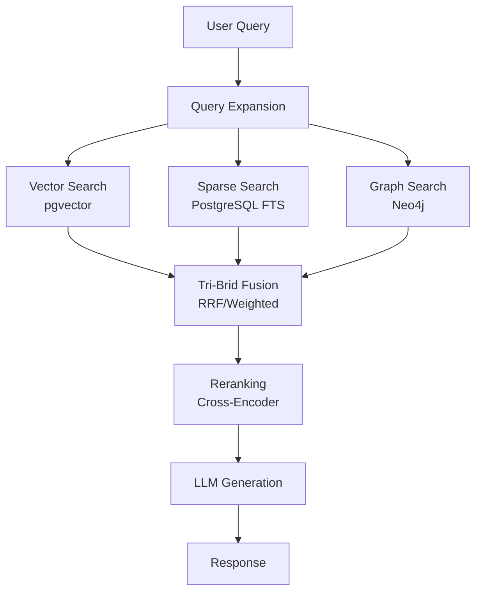

# TriBridRAG

**A Tri-Brid RAG Engine combining Vector, Sparse, and Graph Search**

TriBridRAG is a Retrieval-Augmented Generation engine that combines three search modalities for superior code retrieval:

1. **Vector Search** (pgvector) - Semantic similarity using dense embeddings
2. **Sparse Search** (PostgreSQL FTS) - BM25/keyword matching
3. **Graph Search** (Neo4j) - Entity relationships and code structure

## Architecture



## Quick Start

```bash
# Clone the repository
git clone https://github.com/DMontgomery40/tribrid-rag.git
cd tribrid-rag

# Install dependencies
pip install -e .

# Start the server
python -m server.main
```

## Key Features

- **Tri-Brid Fusion**: Combines vector, sparse, and graph results using RRF or weighted scoring
- **Configurable Weights**: Tune `vector_weight`, `sparse_weight`, and `graph_weight` for your use case
- **Pydantic-First Architecture**: All configuration is validated through Pydantic models
- **Auto-Generated Types**: TypeScript types are generated from Pydantic for type safety

## Configuration

All configuration is managed through `tribrid_config.json` and validated by the Pydantic model in `server/models/tribrid_config_model.py`.

!!! tip "Pydantic is the Law"
    Every tunable parameter must exist in the Pydantic model first. TypeScript types are generated, not hand-written.

## Next Steps

- [Quick Start Guide](getting-started/quickstart.md) - Get up and running
- [Installation](getting-started/installation.md) - Detailed setup instructions
- [Tri-Brid Search](features/tribrid-search.md) - Understanding the search architecture
