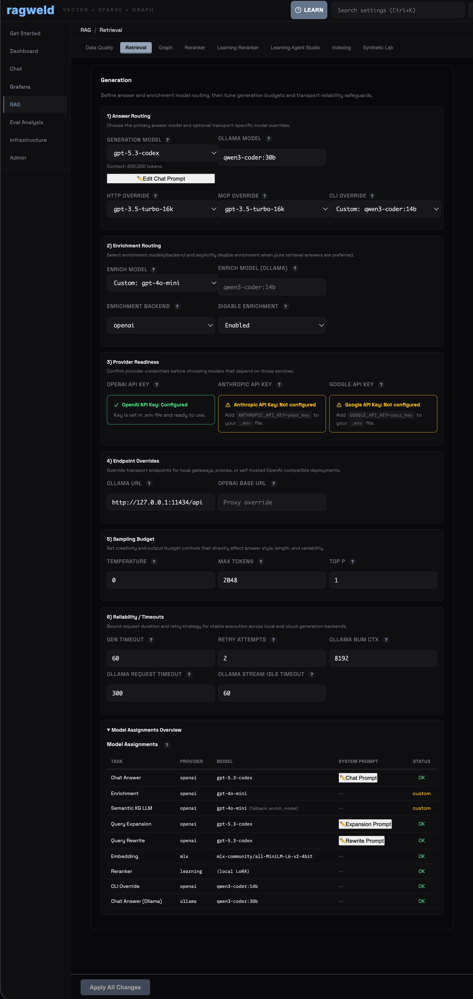
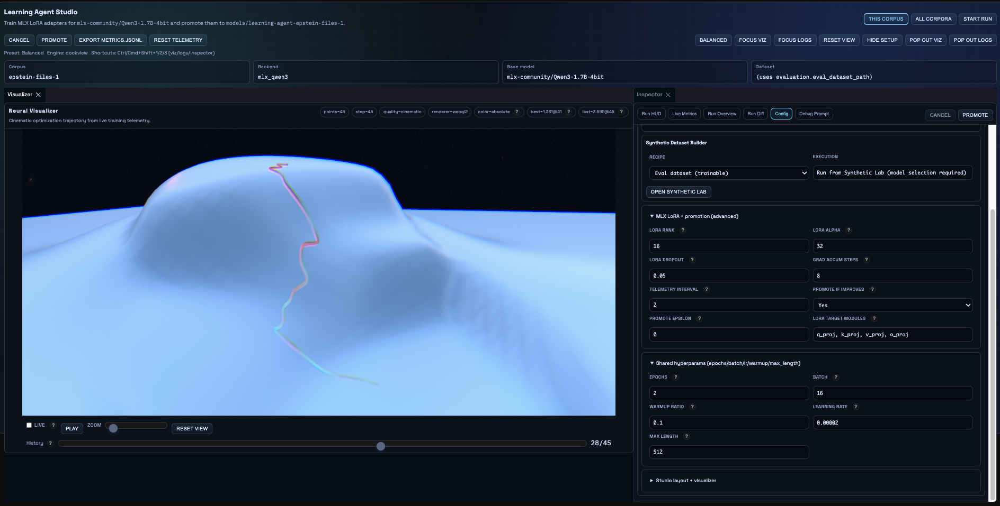
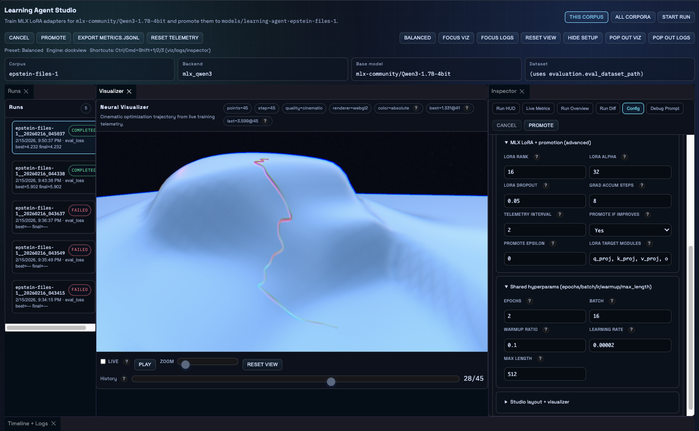
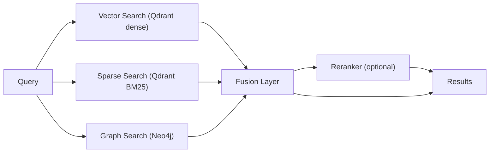
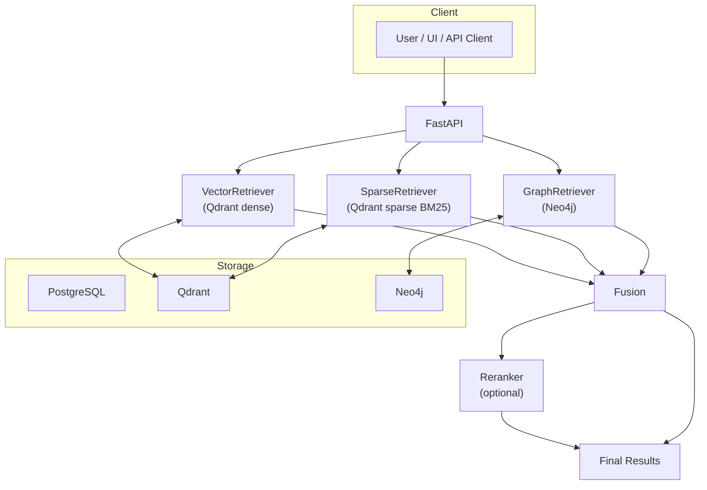

# ragweld Documentation

<div class="grid chunk_summaries" markdown>

-   :material-vector-combine:{ .lg .middle } **Tri-brid Retrieval**

    ---

    Parallel Vector (pgvector), Sparse (PostgreSQL FTS/BM25), and Graph (Neo4j) search fused with configurable strategies.

-   :material-factory:{ .lg .middle } **MLOps Engineering Platform**

    ---

    Synthetic data, training studios, eval drilldowns, tracing, routing, and ops controls built into one workflow.

-   :material-cog:{ .lg .middle } **Pydantic Is The Law**

    ---

    All configuration and API shapes live in `server/models/tribrid_config_model.py`. Everything else derives from it.

-   :material-database:{ .lg .middle } **PostgreSQL Backbone**

    ---

    Chunk rows, summaries, and caches in Postgres; dense and sparse vectors in per-corpus Qdrant generations.

-   :material-graph:{ .lg .middle } **Knowledge Graph**

    ---

    Neo4j stores entities/relationships and supports traversal for cross-file context.

-   :material-rocket-launch:{ .lg .middle } **API-First**

    ---

    FastAPI endpoints for indexing, retrieval, graph, models, health, metrics, and training.

-   :material-shield-lock:{ .lg .middle } **Operational Safety**

    ---

    Field constraints, readiness gates, metrics, and cost-aware model selection.

</div>

[Get started](index.md){ .md-button .md-button--primary }
[Configuration](configuration.md){ .md-button }
[Config reference](reference/config/index.md){ .md-button }
[API](api.md){ .md-button }

!!! note "Naming: ragweld vs tribrid"
    The repo/product is **ragweld**. Many internal names still say **tribrid** (config keys, module names, older docs). Treat `tribrid` as stable internal naming; don’t mass-rename it.

!!! tip "Read This First"
    ragweld is strictly Pydantic-first. If a field or feature is not in `server/models/tribrid_config_model.py`, it does not exist. Add it there, regenerate TypeScript types, then build the rest.

!!! note "Terminology — corpus vs repo_id"
    The API still accepts `repo_id` for legacy reasons. Treat it as the corpus identifier. Pydantic models use `AliasChoices("repo_id", "corpus_id")` and serialize as `corpus_id`.

!!! warning "Security"
    Keep `.env` out of version control. Restrict database access. Use strong passwords for PostgreSQL and Neo4j. Rotate API keys regularly.

## What ragweld does as an MLOps Engineering Platform

| Feature | Description | Status |
|---------|-------------|--------|
| Vector Search | Dense similarity via Qdrant dense generations | ✅ Active |
| Sparse Search | IDF-modified BM25 (fastembed `Qdrant/bm25`) for exact terms, identifiers | ✅ Active |
| Graph Search | Neo4j traversal to follow entities/relations | ✅ Active |
| Fusion | Weighted/reciprocal-rank fusion of sources | ✅ Active |
| Reranker | Optional cloud/learning reranking | ✅ Active |
| Synthetic Data Lab | Recipe-driven generation for eval datasets, semantic cards, and triplets | ✅ Active |
| Training Studios | LoRA training workbenches for reranker and agent model | ✅ Active |
| Eval + Drilldown | Run comparisons and per-query diagnostics for regressions | ✅ Active |
| Tracing + Grafana | Local traces plus embedded observability dashboards | ✅ Active |
| Routing + Model Catalog | Local/cloud model routing with catalog refresh and custom models | ✅ Active |
| Source Document Viewer | Clicked citations open the cited file — PDF pages with boxed regions, cited lines, or captured Docling markdown | ✅ Active |
| Web Search (Chat) | Opt-in OpenRouter web-search tool with validated citations and grounding metadata | ✅ Active |

## Product Screenshots

These screenshots are taken from recent production UI surfaces and map to the same workflows documented throughout this site.

### API routing first, MCP layered per channel



- API docs: [API](api.md)
- MCP docs: [MCP integration](integrations/mcp.md)

### Indexing guardrails and model-mismatch detection


- Indexing guide: [Indexing a corpus](manual/indexing.md)
- Config reference: [Indexing config](reference/config/indexing.md)

### Learning studios and live training telemetry




- Training reference: [Training config](reference/config/training.md)
- Workflow guide: [Reranker how-to](howto/reranker.md)

### Graph explorer and retrieval inspection


- Retrieval overview: [Retrieval concepts](retrieval/overview.md)
- Graph controls: [Graph search config](reference/config/graph_search.md)

### Recall gating and chat memory controls


- Chat reference: [Chat config](reference/config/chat.md)
- Caching reference: [Semantic cache config](reference/config/semantic_cache.md)

## End-to-End Retrieval Flow


```mermaid
flowchart LR
    Q["Query"] --> V["Vector Search (Qdrant dense)"]
    Q --> S["Sparse Search (Qdrant BM25)"]
    Q --> G["Graph Search (Neo4j)"]
    V --> F["Fusion Layer"]
    S --> F
    G --> F
    F --> R["Reranker (optional)"]
    R --> O["Results"]
    F --> O
```

## Quickstart — Run, Index, Search

- [x] Configure environment (.env)
- [x] Launch services with Docker Compose
- [x] Regenerate TypeScript types from Pydantic
- [x] Index a corpus
- [x] Search via API
- [ ] Tune fusion weights and confidence thresholds
- [ ] Enable reranking if needed

Use ++ctrl+c++ to stop local `uvicorn` or Docker tail sessions.

=== "Python"
```python
import httpx, subprocess

BASE = "http://127.0.0.1:58012/api"

# 1) Generate TS types from Pydantic (required for UI) (1)!
subprocess.check_call(["uv", "run", "scripts/generate_types.py"])  # (1) Types derive from Pydantic

# 2) Trigger indexing of a corpus (2)!
req = {
    "corpus_id": "tribrid",  # (3)! repo_id alias is also accepted
    "repo_path": "/path/to/your/codebase",
    "force_reindex": False,
}
httpx.post(f"{BASE}/index", json=req).raise_for_status()

# 3) Poll status (4)!
status = httpx.get(f"{BASE}/index/tribrid/status").json()
print(status)

# 4) Search (parallel vector/sparse/graph -> fusion -> optional rerank) (5)!
payload = {
    "corpus_id": "tribrid",
    "query": "How does the chunker split Python files?",
    "top_k": 8,
}
res = httpx.post(f"{BASE}/search", json=payload).json()
for m in res.get("matches", []):
    print(m["file_path"], m["score"])  # fused score
```

1. Pydantic → generated types is a hard contract
2. Start an indexing job for your corpus
3. Inputs accept `repo_id` but serialize as `corpus_id`
4. Poll index status to show progress in UI
5. Search runs vector/sparse/graph in parallel, fuses, then optionally reranks

=== "curl"
```bash
BASE=http://127.0.0.1:58012/api

# Start indexing (1)!
curl -sS -X POST "$BASE/index" \
  -H 'Content-Type: application/json' \
  -d '{
    "corpus_id": "tribrid",
    "repo_path": "/path/to/your/codebase",
    "force_reindex": false
  }'

# Status (2)!
curl -sS "$BASE/index/tribrid/status" | jq .

# Search (3)!
curl -sS -X POST "$BASE/search" \
  -H 'Content-Type: application/json' \
  -d '{
    "corpus_id": "tribrid",
    "query": "How does the chunker split Python files?",
    "top_k": 8
  }' | jq '.matches[] | {file_path, score}'
```

1. Kick off corpus indexing
2. Verify progress and current file
3. Run tri-brid retrieval

=== "TypeScript"
```typescript
// Ensure ./web/src/types/generated.ts exists (generated by Python) (1)!
import type { IndexRequest, SearchRequest, SearchResponse } from "./web/src/types/generated";

async function indexAndSearch() {
  const base = "http://127.0.0.1:58012/api";

  const indexReq: IndexRequest = {
    corpus_id: "tribrid", // (2)! repo_id alias also accepted server-side
    repo_path: "/path/to/your/codebase",
    force_reindex: false,
  };
  await fetch(`${base}/index`, {
    method: "POST",
    headers: { "Content-Type": "application/json" },
    body: JSON.stringify(indexReq),
  });

  const searchReq: SearchRequest = {
    corpus_id: "tribrid",
    query: "chunker split Python",
    top_k: 8,
  } as any;

  const r = await fetch(`${base}/search`, {
    method: "POST",
    headers: { "Content-Type": "application/json" },
    body: JSON.stringify(searchReq),
  });
  const data: SearchResponse = await r.json(); // (3)!
  console.log(data.matches.map(m => [m.file_path, m.score]));
}
```

1. Import only generated API types
2. Scoped by `corpus_id` (alias of legacy `repo_id`)
3. Response includes fused matches and timings

## Architecture Overview


```mermaid
flowchart TB
    subgraph Client
      U["User / UI / API Client"]
    end

    U --> A["FastAPI"]
    A --> V["VectorRetriever\n(Qdrant dense)"]
    A --> S["SparseRetriever\n(Qdrant sparse BM25)"]
    A --> G["GraphRetriever\n(Neo4j)"]
    V --> F["Fusion"]
    S --> F
    G --> F
    F --> R["Reranker\n(optional)"]
    R --> O["Final Results"]
    F --> O

    subgraph Storage
      P["PostgreSQL"]
      QD["Qdrant"]
      N["Neo4j"]
    end

    V <--> QD
    S <--> QD
    G <--> N
```

??? note "Advanced Topics"
    - Fusion math: weighted linear combination and Reciprocal Rank Fusion with configurable `fusion.rrf_k`.
    - Retrieval cache: cache keys include `corpus_id`, `query`, and a hash of the retrieval config subset.
    - Failure isolation: vector, sparse, and graph legs are resilient; a failure in one leg degrades gracefully.
