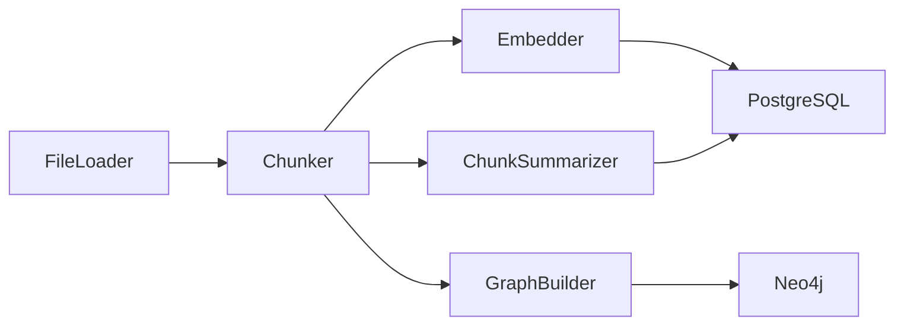
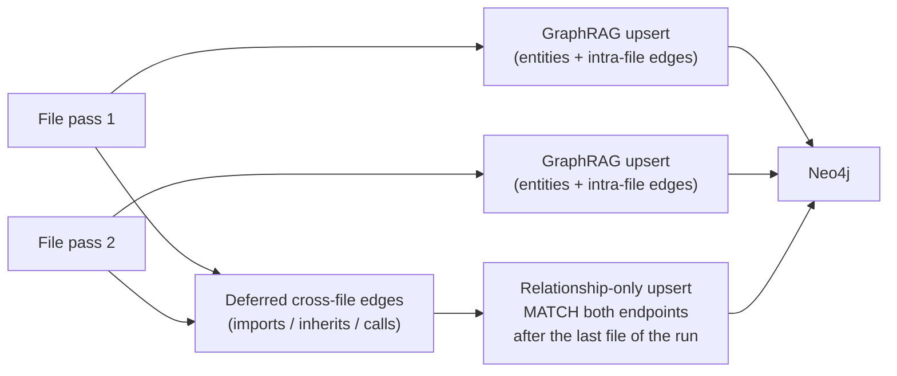
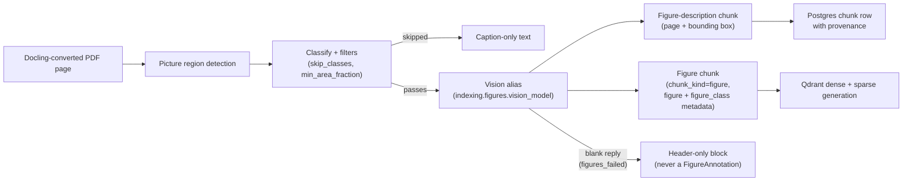

# Indexing Pipeline

<div class="grid chunk_summaries" markdown>

-   :material-file-find:{ .lg .middle } **Loader**

    ---

    Git-aware discovery honoring `.gitignore` with root-relative patterns.

-   :material-content-cut:{ .lg .middle } **Chunker**

    ---

    Fixed, AST-aware, or hybrid chunk strategies with line attribution.

-   :material-vector-polyline:{ .lg .middle } **Embedder**

    ---

    Deterministic local or provider-backed embeddings configured in Pydantic.

-   :material-text-short:{ .lg .middle } **Chunk Summaries**

    ---

    Optional LLM-generated `chunk_summaries` to improve sparse search.

-   :material-graph:{ .lg .middle } **Graph Builder**

    ---

    Entity/relationship extraction and Neo4j persistence.

</div>

[Get started](index.md){ .md-button .md-button--primary }
[Configuration](configuration.md){ .md-button }
[API](api.md){ .md-button }

!!! tip "Idempotent Indexing"
    Use `force_reindex=false` for incremental updates. The indexer skips unchanged files using mtime/hash checks where available.

!!! note "Storage Layout"
    Chunks, embeddings, and FTS are in PostgreSQL. Graph artifacts are in Neo4j. Sizes are summarized via dashboard endpoints.

!!! note "The pre-run estimate is measured"
    `POST /api/index/estimate` no longer divides bytes by a constant. It samples the corpus through the configured chunker (`server/indexing/estimate.py`), reports token/chunk bands (`estimated_*_low/high`, `±estimate_relative_error`), what it measured (`sampled_files`, `sampled_bytes`), and a `status` of `ready`, `warming` (tokenizer still loading; every measured field is `null`) or `insufficient_sample`. The estimate is also the consent gate: a failed or refused estimate blocks the run instead of letting it start unpriced. See [Indexing API](api_indexing.md) and [Indexing a corpus](manual/indexing.md).

!!! warning "Large Corpora"
    Configure Neo4j heap and page cache via environment for multi-million edge graphs. Monitor Postgres disk growth for pgvector indexes.

## Pipeline Flow



## Chunking & Embedding Controls (Selected)

| Section | Field | Default | Notes |
|---------|-------|---------|-------|
| chunking | `chunk_size` | 1000 | Target chars per chunk |
| chunking | `chunk_overlap` | 200 | Overlap for continuity |
| chunking | `chunking_strategy` | ast | `ast \| greedy \| hybrid` |
| chunking | `max_chunk_tokens` | 8000 | Split recursively if larger |
| embedding | `embedding_type` | openai | Provider selector |
| embedding | `embedding_model` | text-embedding-3-large | Model id |
| embedding | `embedding_dim` | 3072 | Must match model outputs |
| indexing | `bm25_tokenizer` | stemmer | Tokenizer for FTS |
| indexing | `figures.*` | off | Describe charts/drawings in Docling-converted PDFs via a vision alias (`indexing.figures`) |

## Start Indexing via API (Annotated)

=== "Python"
```python
import httpx
base = "http://127.0.0.1:8012/api"

req = {
    "corpus_id": "tribrid",   # (1)!
    "repo_path": "/work/src/tribrid",
    "force_reindex": False
}
httpx.post(f"{base}/index", json=req).raise_for_status()  # (2)!

status = httpx.get(f"{base}/index/tribrid/status").json()
print(status["status"], status.get("progress"))          # (3)!
```

1. Create/refresh a specific corpus
2. Start indexing
3. Poll progress

=== "curl"
```bash
BASE=http://127.0.0.1:8012/api
curl -sS -X POST "$BASE/index" -H 'Content-Type: application/json' -d '{
  "corpus_id":"tribrid","repo_path":"/work/src/tribrid","force_reindex":false
}'
curl -sS "$BASE/index/tribrid/status" | jq .
```

=== "TypeScript"
```typescript
import type { IndexRequest, IndexStatus } from "./web/src/types/generated";

async function reindex(path: string) {
  const req: IndexRequest = { corpus_id: "tribrid", repo_path: path, force_reindex: false } as any;
  await fetch("/api/index", { method: "POST", headers: {"Content-Type":"application/json"}, body: JSON.stringify(req) }); // (2)!
  const status: IndexStatus = await (await fetch("/api/index/tribrid/status")).json(); // (3)!
  console.log(status.status, status.progress);
}
```

## Graph Indexing (Neo4j)

| Field | Default | Meaning |
|-------|---------|---------|
| `graph_indexing.enabled` | true | Enable graph building during indexing |
| `graph_indexing.build_lexical_graph` | true | Add Chunk/NEXT_CHUNK structure |
| `graph_indexing.build_code_graph` | false | AST code graph: module/class/function entities with contains/inherits/imports/calls edges (Python, TypeScript, JavaScript) |
| `graph_indexing.store_chunk_embeddings` | true | Store chunk vectors for Neo4j vector search |
| `graph_indexing.semantic_kg_enabled` | false | Extract concept relations (heuristic or LLM) |

### AST code graph (`build_code_graph`)

When `graph_indexing.build_code_graph=true`, indexing additionally runs a tree-sitter AST pass per source file (`server/indexing/code_graph.py`) for **Python, TypeScript, and JavaScript**:

- one **module** entity per file, plus **class** and **function**/**method** entities carrying qualname, line range, and first-line signature
- `contains`, `inherits`, `imports`, and `calls` relationships, weighted by the `graph_indexing.ast_*_weight` fields
- each entity anchored to the chunk that defines it through the same lexical chunk relationship, so `graph_search.mode=chunk` retrieval can expand a hit to its callers, callees, base classes, and importing modules

Entity ids are corpus-relative: a module is its `file_path` and a symbol is `file_path::qualname`; uniqueness in Neo4j is scoped by the corpus id, so a staging id never leaks into an entity id. Relationships whose target is defined in another file are **deferred**: the per-file pass writes only that file's entities and intra-file edges, and the cross-file edges (`imports`, plus cross-file `inherits` and `calls`) are written once after every file of the run is in Neo4j, through a relationship-only upsert that `MATCH`es both endpoints. No placeholder node is ever created for a target — a call to an imported class is a call to the existing `class` node, not to a guessed `function` node (the earlier shape collided with the Neo4j uniqueness constraint on entity ids and failed the run). Resolution is conservative: a name that cannot be tied to a definition inside the corpus, or an import that does not resolve to a corpus file, produces no edge and is counted as unresolved rather than guessed.

*Concept diagram (the deferred cross-file write only — the full fused pipeline is on the [generated retrieval-pipeline page](reference/architecture/retrieval-pipeline.md)):*



??? note "Why deferred edges instead of placeholder nodes"
    Placeholder nodes forced a guessed label for cross-file targets — for example, calling an imported class created a `function` node. When the defining file later wrote the real `class` entity with the same id, the two labels violated the Neo4j uniqueness constraint on entity ids and failed the index run. Deferring the edge until every file has been upserted means both endpoints always exist under their real labels, and index order across files no longer matters.

For engineers: the deferred write runs under the `neo4j_upsert_code_graph_edges` Prometheus stage label in `server/api/index.py`, immediately after the file loop and before semantic-KG community detection.

!!! warning "Re-index after enabling"
    The code graph is built during indexing. Toggling `build_code_graph` only affects new runs, so enable it per code corpus and re-index. It is off by default because it only pays for code corpora.

The full fused path (where the graph leg feeds weighted RRF fusion alongside Qdrant dense and sparse) is documented on the generated [retrieval pipeline](reference/architecture/retrieval-pipeline.md) page; every `graph_indexing` knob is in the [`graph_indexing` config reference](reference/config/graph_indexing.md).

=== "curl"

    ```bash
    curl -sS -X PATCH "http://127.0.0.1:58012/api/config/graph_indexing" \
      -H 'Content-Type: application/json' \
      -d '{"build_code_graph": true}' | jq .
    ```

=== "Python"

    ```python
    import httpx

    httpx.patch(
        "http://127.0.0.1:58012/api/config/graph_indexing",
        json={"build_code_graph": True},
    ).raise_for_status()  # (1)!
    ```

1. Sectional PATCH is validated by Pydantic; re-index the corpus to rebuild the graph

### Figure descriptions (`indexing.figures`)

For document corpora, indexing can additionally **describe figures** — charts, diagrams and engineering drawings inside Docling-converted PDFs — so they become retrievable chunks. It is off by default (`indexing.figures.enabled=false`) because each described figure is a vision-model call through the LiteLLM gateway.

- Docling detects picture regions per page, optionally classifies them (`chart`, `diagram`, `logo`, `photo`), and sends each qualifying figure to the configured vision alias (`indexing.figures.vision_model`, default `z-ai.glm-5.3-flash`)
- The alias must be a vision-capable, routable gateway alias: the indexing request is refused with a typed `409` (`code: figure_vision_alias`) before the run claims the corpus
- The structured description becomes a chunk anchored to the figure's page and normalized bounding box, so citations box the figure in the [source document viewer](manual/source_viewer.md)
- Coverage and cost controls: `min_area_fraction`, `skip_classes` (denied only when the classifier's confident (>= 50%) prediction names the class — a listed class that only appears in the prediction long tail does not skip), `max_completion_tokens` (default `2500`, sized to cover a reasoning alias's internal trace before its JSON reply), `concurrency`, `timeout_s`

Under the hood (`server/indexing/text_extractors.py`): the Docling pipeline options are built straight from the `indexing.figures` fields; `describe=true` with no resolved gateway route raises instead of silently producing no descriptions; and enrichment converters are cached per options signature — with figures off the plain shared converter is reused, and only the PDF and IMAGE formats carry the enrichment pipeline, so DOCX/PPTX/XLSX/HTML extraction is unchanged.

The description is a structured `FigureAnnotation` (`server/models/index.py`): a vision-judged `kind` (diagram, chart, schematic, photo, table, drawing, other), a dense prose `summary` — the text that gets embedded — and transcribed `labels` (callouts, axis labels, legend entries, part numbers), `components`, `connections` (`A -> B`), `values` (numbers with units exactly as printed) and `references` (sheet/figure/table/section cross-references), persisted in `Chunk.metadata["figure"]` and rendered into the chunk as prose-only markdown, so callouts and part numbers are searchable verbatim without JSON entering the embedded text. The prompt templates and the reply parser live in `server/indexing/figure_prompts.py` (profile chosen via `indexing.figures.prompt_profile`); parsing is deliberately forgiving — fenced replies are unwrapped, malformed JSON (trailing commas, unescaped newlines, replies truncated mid-object) is repair-parsed via `json-repair`, unknown kinds fall back to `other`, a JSON-looking but unrecoverable reply degrades to an empty annotation so raw syntax never leaks into the embedded text, and a non-JSON reply becomes the plain summary, so a malformed vision response degrades one chunk instead of failing the run.

Rendering is its own step: `RagweldPictureSerializer` (`server/indexing/figure_serializer.py`) serializes each picture as prose at the picture's position and blocks Docling's meta-serialization block, so the raw vision JSON can never leak into the markdown even though Docling carries the reply on `item.meta`. A picture the classifier caught but the vision alias skipped — `min_area_fraction`, `skip_classes`, or a per-figure timeout — still renders a `Figure (chart)`-style header plus its image placeholder, so the class name stays searchable text; and a figure whose caption and summary are both blank keeps its structured lists (`Labels`, `Components`, `Connections`, `Values`, `References`) instead of collapsing away. A blank vision reply (`""`) is not a description: the serializer treats it exactly like no description was ever attached — the picture falls back to the classified-but-undescribed header-only block and is never parsed into a `FigureAnnotation`. The prose block appears exactly once per picture even when Docling keeps both the newer `item.meta` shape and its legacy annotations.

Stamping closes the loop: `stamp_provenance` (`server/indexing/provenance.py`) maps chunk char ranges back to source spans and, when a described figure's span covers at least half a chunk's range, marks that chunk as a **figure chunk** — `chunk.metadata["chunk_kind"] = "figure"` plus the parsed `FigureAnnotation` under `chunk.metadata["figure"]` and `chunk.metadata["figure_class"]` when the classifier resolved one. A chunk that merely brushes a figure keeps the page region in its provenance but stays a text chunk, and `figure_class` is only written when a class was actually resolved, so no metadata key is backed by nothing. The extracted document triages every picture into exactly one of three counts — `figures_described` (non-blank description text), `figures_failed` (a description object exists but its text is blank: the vision call was attempted and the gateway returned nothing, e.g. an unreachable alias or a reasoning model that spent its `max_completion_tokens` budget on its internal trace before writing any JSON; Docling absorbs this rather than raising), and `figures_skipped` (no description object at all: the picture never reached the vision call) — across both the `item.meta` and legacy `item.annotations` shapes. The run emits a final `Figure summary` event with all three, and only when at least one picture was processed: it is a warning, not a log line, when description was enabled but nothing was described — `figures_failed > 0` gets a distinct hint pointing at the gateway, the alias, and `max_completion_tokens` (the call was attempted and billed), while an all-skipped run points back at the area threshold and the classification deny-list. Conversion guarding is figure-aware: without figures, a Docling conversion failure degrades to "unparseable" as before; with figures on, the failure raises so one bad conversion cannot quietly drop documents from an index the operator is paying a vision model to enrich — while a bug in ragweld's serializer, source map, or figure counting always raises so regressions stay visible.

*Concept diagram (figure enrichment only — the full fused pipeline is on the [generated retrieval-pipeline page](reference/architecture/retrieval-pipeline.md)):*



Chunking is figure-aware too: `server/api/index.py` cuts each document through `chunk_document_with_figures` (`server/indexing/figure_chunking.py`), so a described figure block is emitted as **one atomic chunk** — caption, prose summary, structured lists, and trailing image placeholder together — instead of being windowed by size and risking a citation that lands on a mid-word fragment of the description. Only the text between figures is windowed by the configured chunking strategy, a document with no described figures chunks exactly as before, and an oversized figure splits only at its `Labels:`/`Components:`/`Connections:`/`Values:`/`References:` headings.

!!! note "Figures are part of the run record"
    A completed run persists `figures_described`, `figures_failed`, `figures_undescribed`, and a `figure_description_cost_usd` ceiling on its `IndexRunSummary` (`GET /api/index/{corpus_id}/runs/latest`), so the counts stay auditable after the terminal stream is gone. The pre-run estimate answers in kind: `IndexEstimate.estimated_seconds_figures` prices the figure phase’s wall clock (~20 s per vision call, divided by `indexing.figures.concurrency`) alongside its cost, and the `GET /api/index/status` cost card adds a Figure Descriptions line when the latest committed run described any.

For the operator walkthrough (cost estimation, per-corpus tuning, troubleshooting), see [Indexing a corpus](manual/indexing.md); every knob is in the [`indexing` config reference](reference/config/indexing.md).

??? info "Failure Modes"
    - File decoding errors: logged and skipped.
    - Embedding timeouts: retried with backoff; chunk remains un-embedded if persistent.
    - Graph build failures: retrieval continues with vector/sparse; flagged in logs.
    - Code graph: extraction is skipped entirely for unsupported languages (empty graph, not an error); only Python, TypeScript, and JavaScript are parsed.
    - Docling extraction is serialized process-wide: a run queued behind another run's conversion logs `Waiting for the document extractor …` notices with the measured elapsed wait, and a long conversion emits `Converting <file>: still running (Ns elapsed)` heartbeats — the first lands after ~60 seconds to rule out a wedged worker, then the interval widens (to ~5 minutes) so a 40-minute conversion narrates itself a handful of times instead of forty identical lines. See [Indexing a corpus](manual/indexing.md).

