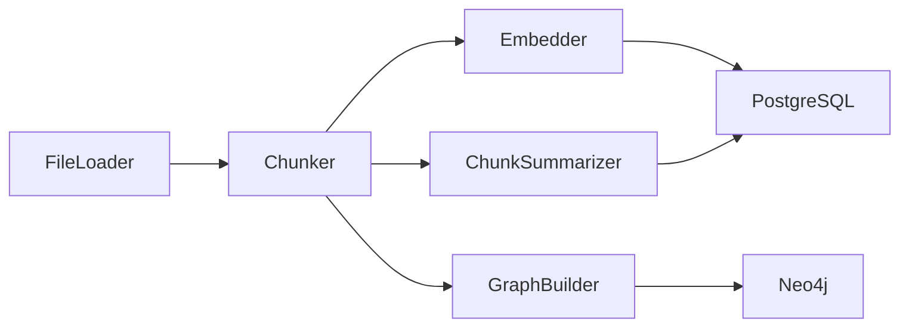

# Indexing Pipeline

<div class="grid chunk_summaries" markdown>

-   :material-file-find:{ .lg .middle } **Loader**

    ---

    Git-aware discovery honoring `.gitignore` with root-relative patterns.

-   :material-content-cut:{ .lg .middle } **Chunker**

    ---

    Fixed, AST-aware, or hybrid chunk strategies with line attribution.

-   :material-vector-polyline:{ .lg .middle } **Embedder**

    ---

    Deterministic local or provider-backed embeddings configured in Pydantic.

-   :material-text-short:{ .lg .middle } **Chunk Summaries**

    ---

    Optional LLM-generated `chunk_summaries` to improve sparse search.

-   :material-graph:{ .lg .middle } **Graph Builder**

    ---

    Entity/relationship extraction and Neo4j persistence.

</div>

[Get started](index.md){ .md-button .md-button--primary }
[Configuration](configuration.md){ .md-button }
[API](api.md){ .md-button }

!!! tip "Idempotent Indexing"
    Use `force_reindex=false` for incremental updates. The indexer skips unchanged files using mtime/hash checks where available.

!!! note "Storage Layout"
    Chunks, embeddings, and FTS are in PostgreSQL. Graph artifacts are in Neo4j. Sizes are summarized via dashboard endpoints.

!!! warning "Large Corpora"
    Configure Neo4j heap and page cache via environment for multi-million edge graphs. Monitor Postgres disk growth for pgvector indexes.

## Pipeline Flow



## Chunking & Embedding Controls (Selected)

| Section | Field | Default | Notes |
|---------|-------|---------|-------|
| chunking | `chunk_size` | 1000 | Target chars per chunk |
| chunking | `chunk_overlap` | 200 | Overlap for continuity |
| chunking | `chunking_strategy` | ast | `ast \| greedy \| hybrid` |
| chunking | `max_chunk_tokens` | 8000 | Split recursively if larger |
| embedding | `embedding_type` | openai | Provider selector |
| embedding | `embedding_model` | text-embedding-3-large | Model id |
| embedding | `embedding_dim` | 3072 | Must match model outputs |
| indexing | `bm25_tokenizer` | stemmer | Tokenizer for FTS |

## Start Indexing via API (Annotated)

=== "Python"
```python
import httpx
base = "http://127.0.0.1:8012/api"

req = {
    "corpus_id": "tribrid",   # (1)!
    "repo_path": "/work/src/tribrid",
    "force_reindex": False
}
httpx.post(f"{base}/index", json=req).raise_for_status()  # (2)!

status = httpx.get(f"{base}/index/tribrid/status").json()
print(status["status"], status.get("progress"))          # (3)!
```

1. Create/refresh a specific corpus
2. Start indexing
3. Poll progress

=== "curl"
```bash
BASE=http://127.0.0.1:8012/api
curl -sS -X POST "$BASE/index" -H 'Content-Type: application/json' -d '{
  "corpus_id":"tribrid","repo_path":"/work/src/tribrid","force_reindex":false
}'
curl -sS "$BASE/index/tribrid/status" | jq .
```

=== "TypeScript"
```typescript
import type { IndexRequest, IndexStatus } from "./web/src/types/generated";

async function reindex(path: string) {
  const req: IndexRequest = { corpus_id: "tribrid", repo_path: path, force_reindex: false } as any;
  await fetch("/api/index", { method: "POST", headers: {"Content-Type":"application/json"}, body: JSON.stringify(req) }); // (2)!
  const status: IndexStatus = await (await fetch("/api/index/tribrid/status")).json(); // (3)!
  console.log(status.status, status.progress);
}
```

## Graph Indexing (Neo4j)

| Field | Default | Meaning |
|-------|---------|---------|
| `graph_indexing.enabled` | true | Enable graph building during indexing |
| `graph_indexing.build_lexical_graph` | true | Add Chunk/NEXT_CHUNK structure |
| `graph_indexing.build_code_graph` | false | AST code graph: module/class/function entities with contains/inherits/imports/calls edges (Python, TypeScript, JavaScript) |
| `graph_indexing.store_chunk_embeddings` | true | Store chunk vectors for Neo4j vector search |
| `graph_indexing.semantic_kg_enabled` | false | Extract concept relations (heuristic or LLM) |

### AST code graph (`build_code_graph`)

When `graph_indexing.build_code_graph=true`, indexing additionally runs a tree-sitter AST pass per source file (`server/indexing/code_graph.py`) for **Python, TypeScript, and JavaScript**:

- one **module** entity per file, plus **class** and **function**/**method** entities carrying qualname, line range, and first-line signature
- `contains`, `inherits`, `imports`, and `calls` relationships, weighted by the `graph_indexing.ast_*_weight` fields
- each entity anchored to the chunk that defines it through the same lexical chunk relationship, so `graph_search.mode=chunk` retrieval can expand a hit to its callers, callees, base classes, and importing modules

Cross-file targets (an imported module, a base class, or a callee defined elsewhere) are emitted as minimal nodes with deterministic ids and unified by the GraphRAG `MERGE` upsert, so index order across files does not matter. Resolution is conservative: a name that cannot be tied to a definition inside the corpus, or an import that does not resolve to a corpus file, produces no edge and is counted as unresolved rather than guessed.

!!! warning "Re-index after enabling"
    The code graph is built during indexing. Toggling `build_code_graph` only affects new runs, so enable it per code corpus and re-index. It is off by default because it only pays for code corpora.

The full fused path (where the graph leg feeds weighted RRF fusion alongside Qdrant dense and sparse) is documented on the generated [retrieval pipeline](reference/architecture/retrieval-pipeline.md) page; every `graph_indexing` knob is in the [`graph_indexing` config reference](reference/config/graph_indexing.md).

=== "curl"

    ```bash
    curl -sS -X PATCH "http://127.0.0.1:58012/api/config/graph_indexing" \
      -H 'Content-Type: application/json' \
      -d '{"build_code_graph": true}' | jq .
    ```

=== "Python"

    ```python
    import httpx

    httpx.patch(
        "http://127.0.0.1:58012/api/config/graph_indexing",
        json={"build_code_graph": True},
    ).raise_for_status()  # (1)!
    ```

1. Sectional PATCH is validated by Pydantic; re-index the corpus to rebuild the graph

??? info "Failure Modes"
    - File decoding errors: logged and skipped.
    - Embedding timeouts: retried with backoff; chunk remains un-embedded if persistent.
    - Graph build failures: retrieval continues with vector/sparse; flagged in logs.
    - Code graph: extraction is skipped entirely for unsupported languages (empty graph, not an error); only Python, TypeScript, and JavaScript are parsed.
