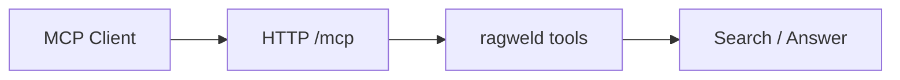

# MCP Integration (Model Context Protocol)

<div class="grid chunk_summaries" markdown>

-   :material-puzzle:{ .lg .middle } **Embedded MCP HTTP**

    ---

    Optional stateless HTTP transport for tools and clients.

-   :material-shield-check:{ .lg .middle } **Access Control**

    ---

    Allowed hosts/origins, optional API key, DNS rebinding protection.

-   :material-tune:{ .lg .middle } **Defaults**

    ---

    Per-endpoint defaults for retrieval mode and Top-K.

</div>

[Get started](../index.md){ .md-button .md-button--primary }
[Configuration](../configuration.md){ .md-button }
[API](../api.md){ .md-button }

!!! tip "Stateless Mode"
    Keep the embedded MCP HTTP endpoint stateless for easier scaling and isolation.

!!! note "Path and CORS"
    Align `mount_path`, `allowed_hosts`, and `allowed_origins` with your reverse proxy and UI origin to avoid CORS issues.

!!! warning "Auth"
    Use `require_api_key=true` in multi-tenant or exposed deployments.

!!! tip "The advertised URL comes from config"
    `GET /api/mcp/status` reports the connect URL as `mcp.public_base_url` plus the mount path; behind a proxy, set `public_base_url` to the public origin and add its host to `mcp.allowed_hosts`. See [MCP](../mcp.md) for the full field list.

!!! tip "The probe shows the client-facing defaults"
    The **Infrastructure → MCP** probe card runs the `search` tool with no mode or Top-K override, so it exercises this deployment's `mcp.default_mode` and `mcp.default_top_k` rather than a hardcoded `top_k=5`. Its result line marks the transport URL it echoes as the **in-process** address; the URL an external client actually dials is the advertised `mcp.public_base_url` + mount path above.

## Configuration (Selected)

| Field | Default | Description |
|-------|---------|-------------|
| `mcp.enabled` | true | Enable embedded MCP HTTP endpoint |
| `mcp.mount_path` | `/mcp` | URL path for MCP endpoint |
| `mcp.public_base_url` | `http://127.0.0.1:58012` | Public origin the status endpoint advertises; the server appends the mount path |
| `mcp.stateless_http` | true | Stateless mode |
| `mcp.json_response` | true | Prefer JSON responses |
| `mcp.enable_dns_rebinding_protection` | true | Defense in depth |
| `mcp.allowed_hosts` | `localhost:*` | Allowed Host headers |
| `mcp.allowed_origins` | `http://localhost:*` | Allowed Origin values |
| `mcp.require_api_key` | false | Require `Authorization: Bearer $MCP_API_KEY` at the mount (fails closed without the key) |
| `mcp.default_top_k` | 20 | Default Top-K when omitted |
| `mcp.default_mode` | `tribrid` | Default retrieval mode |



## Status Endpoint

=== "Python"
```python
import httpx
status = httpx.get("http://127.0.0.1:58012/api/mcp/status").json()
print(status)
```

=== "curl"
```bash
curl -sS http://127.0.0.1:58012/api/mcp/status | jq .
```

=== "TypeScript"
```typescript
async function mcpStatus() {
  const s = await (await fetch('/api/mcp/status')).json();
  console.log(s);
}
```

- [x] Set allowed hosts/origins
- [x] Enable API key when exposing outside localhost
- [x] Choose default retrieval mode/Top-K for tools

!!! note "Search failures are structured, never partial"
    The MCP `search` tool fails closed: when retrieval cannot complete it returns `isError=true` with a typed error detail — `dependency_unavailable`, `required_retrieval_leg_failed`, or an index-contract mismatch (`embedding_contract_mismatch` / `sparse_contract_mismatch`) — instead of partial rows, and `POST /api/mcp/probe` surfaces the same details as typed `503`/`409` HTTP errors. See [MCP](../mcp.md) for the payload shape.
