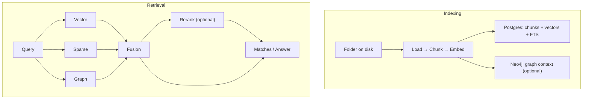

# User Manual

-   :material-rocket-launch:{ .lg .middle } **Get running**

    ---

    Start the stack, verify health, and create your first corpus.

-   :material-database-arrow-up:{ .lg .middle } **Index a corpus**

    ---

    Turn a folder (repo, docs, or subtree) into searchable chunks + embeddings + graph context.

-   :material-magnify:{ .lg .middle } **Search & answer**

    ---

    Run tri-brid retrieval (`vector + sparse + graph`) and optionally generate answers.

-   :material-monitor-dashboard:{ .lg .middle } **Use the UI**

    ---

    Learn the Dashboard / RAG / Eval / Admin tabs and how they map to the API.

-   :material-tune:{ .lg .middle } **Tune safely**

    ---

    Understand the “Pydantic is the law” contract and adjust config without drifting.

[Quickstart](quickstart.md){ .md-button .md-button--primary }
[UI tour](ui.md){ .md-button }
[Configuration](../configuration.md){ .md-button }
[API](../api.md){ .md-button }

!!! note "Naming: ragweld vs TriBridRAG"
    This repo/product is called **ragweld**. Many internal names still say **tribrid** (config keys, module names, older docs). Treat **tribrid** as stable internal naming; don’t mass-rename it.

## What ragweld does (in one paragraph)

You point ragweld at a **corpus** (a folder on disk). It **indexes** that corpus into chunks, embeddings, and (optionally) a graph. Then when you ask a question, ragweld runs **three retrieval “legs” in parallel** (vector, sparse, graph), **fuses** the results, can **rerank**, and returns matches (and optionally an answer).

## The mental model

## Reading paths (pick one)

=== "I want a 10-minute success"
    1. Follow the [Quickstart](quickstart.md).
    2. Then skim [Searching & answering](search.md) so you know which knobs matter.

=== "I’m evaluating product fit"
    1. Read the high-level [Architecture](../architecture.md).
    2. Skim [Retrieval overview](../retrieval/overview.md) to understand the tri-brid approach.
    3. Use the [UI tour](ui.md) to see what’s actually operable.

=== "I need to run this reliably"
    1. [Deployment](../deployment.md)
    2. [Operations & metrics](../operations.md)
    3. [Troubleshooting](troubleshooting.md)

## What you’ll use most

- **UI**: `http://127.0.0.1:5173/web/dashboard` (default dev URL)
- **API base**: `http://127.0.0.1:8012/api` (default dev URL)
- **Source of truth**: `server/models/tribrid_config_model.py` (Pydantic config + API shapes)

