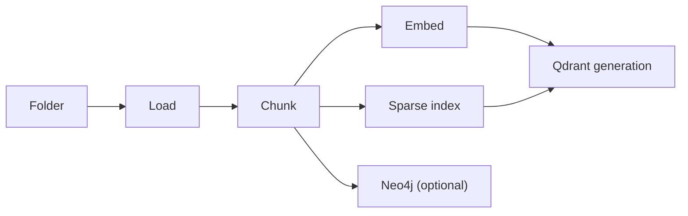
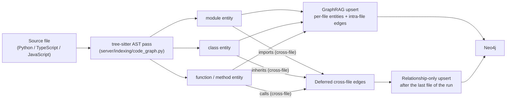
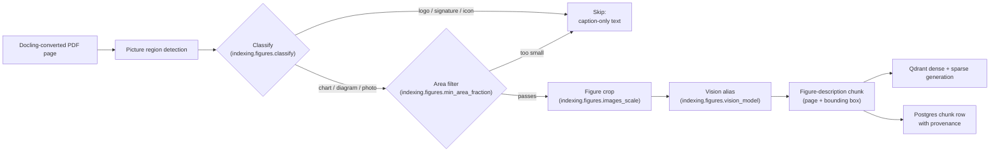
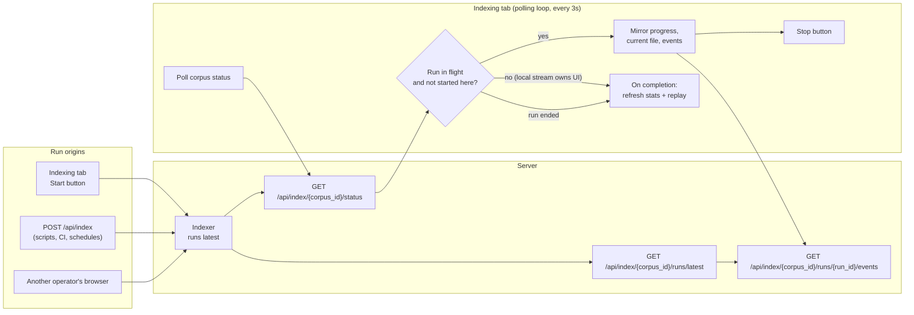
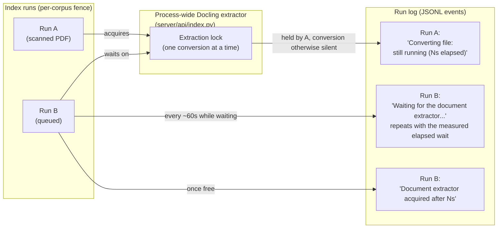

```markdown


# Indexing a corpus

<div class="grid chunk_summaries" markdown>

-   :material-folder-search:{ .lg .middle } **Corpus = a folder**

    ---

    A corpus can be a repo, docs tree, mono-repo subtree, or any folder you point at.

-   :material-database:{ .lg .middle } **Persisted in Postgres**

    ---

    Chunk rows live in Postgres; dense and sparse vectors live in a per-corpus Qdrant generation.

-   :material-graph:{ .lg .middle } **Optional graph context**

    ---

    Neo4j can store additional context to improve cross-file retrieval.

</div>

[Quickstart](quickstart.md){ .md-button .md-button--primary }
[Searching](search.md){ .md-button }
[Indexing pipeline (deep dive)](../indexing.md){ .md-button }

!!! tip "Use stable corpus ids"
    Use lowercase slugs like `myapp`, `docs`, `customer-a`. Avoid spaces and special characters.

## What indexing does

Indexing turns a folder into a set of **retrieval primitives**:

- **Chunks** (text/code spans) with file paths and line ranges — rows in Postgres
- **Dense embeddings** (vector search) in a per-corpus Qdrant generation
- **Sparse index** (IDF-modified BM25 via fastembed `Qdrant/bm25`) in the same generation
- **Graph context** (optional) stored in Neo4j
- **Code graph** (optional, `graph_indexing.build_code_graph`) — module/class/function entities with `contains`/`inherits`/`imports`/`calls` edges in Neo4j
- **Chunk provenance** — every chunk carries typed provenance (extraction method; for Docling PDFs, cited pages plus normalized layout regions) that powers the [source document viewer](source_viewer.md)
- **Figure descriptions** (optional, `indexing.figures.enabled`) — charts and drawings inside Docling-converted PDFs are described by a vision model and become retrievable chunks anchored to their page and bounding box; the chunk holding a described figure is stamped `chunk_kind: "figure"` so retrieval can prefer or filter figure evidence by metadata
- Cross-file code-graph edges (`imports`, and `inherits`/`calls` that resolve to another file) are held back and written once after every file of the run is in Neo4j, so both endpoints exist under their real labels in either index order — no placeholder node is ever created for a target, and a call to an imported class resolves to the class node

!!! note "Corpora indexed before provenance capture"
    Chunks from older runs report `provenance` as not captured, and rich documents (docx/pptx/xlsx/html) show a "not captured" state in the [source document viewer](source_viewer.md) until you re-index.

!!! note "Graph indexing is policy-derived"
    There is no separate semantic-KG toggle. With graph indexing enabled, external document corpora run semantic entity extraction and code corpora can select the AST policy (`graph_indexing.build_code_graph`); runtime-managed corpora (Recall, Codex sessions) are excluded. A semantic run also requires a reviewed graph schema — **RAG → Indexing** walks you through generate → review → approve, and the API refuses a run without the approved hash. See the [Indexing pipeline](../indexing.md).

!!! tip "Edit the extraction prompt from the Graph card"
    The Graph card on **RAG → Indexing** carries an **Edit Semantic KG Extraction Prompt** link that deep-links straight into **Eval Analysis → System Prompts** with `semantic_kg_extraction` preselected — the template the semantic policy formats for every chunk during extraction. You no longer have to know that the prompt lives under System Prompts to find it; the card that runs the policy links to it. See the [Indexing pipeline](../indexing.md) for what the template must keep (the `{schema}` and `{text}` placeholders) and what happens when it is invalid.

??? question "Why does the proposal show a `name` property on every node type — and where did my `body` property go?"
    Two domain rules are applied to every proposal before it is hashed for review (`normalize_domain_schema` in `server/indexing/graphrag_schema.py`):

    - **Every node type gets a STRING `name` identity property plus a mandatory constraint on it.** An extraction that omits the name is dropped instead of writing an anonymous entity the resolver and the Graph explorer cannot address.
    - **Document-text properties (`body`, `content`, `text`, and similar) are removed.** The chunk store owns the document text; a graph property holding it makes the extraction stream carry whole documents and the provider's output moderation cuts the run.

    Both rules are enforced again when the approved proposal is validated, so a hand-edited or stale proposal cannot sneak either shape through. See the [Indexing pipeline](../indexing.md).

??? question "Generate proposal returns 422: 'no embedded PDF text'"
    The schema-proposal sampler reads a bounded, positionally representative set of PDF pages — every page of a document with 36 pages or fewer, 36 evenly spaced pages of a larger one — instead of converting the whole document behind the synchronous request. A corpus of image-only or unreadable PDFs yields no sample text, so the API refuses with a typed `422` rather than starting unbounded whole-document OCR behind the public proxy window. Run a real index first (text extraction and figure description happen during indexing, not during the proposal call), or point the corpus at a text-bearing source, then generate the proposal again. See the [Indexing pipeline](../indexing.md).



### Optional: AST code graph (structural code context)

For code corpora, ragweld can additionally build an **AST code graph** while indexing. It is off by default (`graph_indexing.build_code_graph=false`); enable it per corpus and re-index.

What lands in Neo4j:

- one **module** entity per Python, TypeScript, or JavaScript source file
- **class** and **function/method** entities with qualname, line range, and first-line signature
- `contains`, `inherits`, `imports`, and `calls` relationships between them
- every entity linked to the chunk that defines it, so graph retrieval can expand a hit to its callers, callees, base classes, and importing modules instead of only neighbouring chunks

*Concept diagram (this mechanism only — the full fused pipeline is on the [generated retrieval-pipeline page](../reference/architecture/retrieval-pipeline.md)):*



!!! note "Conservative resolution"
    Imports and calls only produce edges when the target is defined inside the corpus or the import explicitly resolves to a corpus file. Everything else is counted as unresolved rather than guessed, keeping the graph high-signal.

!!! note "The file's Document node and its module entity are two distinct nodes"
    A code corpus writes each file's lexical graph (one `Document` node per file plus its `Chunk` nodes) and the AST graph in the same pass, and both halves once used the bare file path as the writer id — the official GraphRAG writer keys nodes and relationship endpoints by id regardless of label, so the collision silently mis-wired the promoted graph: every `Document` carried the module's `contains` and `FROM_CHUNK` edges, and chunk `FROM_DOCUMENT` edges pointed at `module` entities instead of at the file. The Document id is now namespaced (`document::<file_path>`) and the assembled per-file graph refuses any writer-id collision instead of writing one (`assemble_code_file_graph` in `server/indexing/graphrag_pipeline.py`). Re-index code corpora indexed before this fix so their graphs are rebuilt with the correct wiring.

!!! note "Same-name entities no longer block code-graph promotion"
    The code policy resolves entities on the qualified `entity_id` (`path::Qualified.symbol`), and the promotion invariant counts duplicate groups on that same resolution property (`server/indexing/graph_invariants.py`) — so two `__init__` methods of different classes promote normally. The semantic policy still resolves on `name`, and two extracted entities sharing a name there is still a promotion refusal (`unresolved_duplicate_entity`). See the [Indexing pipeline](../indexing.md) for the invariant details.

!!! warning "Enable per corpus, then re-index"
    The code graph is built during indexing, so toggling `build_code_graph` has no effect until the corpus is re-indexed. It only pays for code corpora — leave it off for prose-only corpora.

### Optional: Figure descriptions for PDFs (Docling picture enrichment)

For document corpora, ragweld can additionally **describe figures** — charts, diagrams, photos and engineering drawings inside Docling-converted PDFs — so they become retrievable chunks. It is off by default (`indexing.figures.enabled=false`) because every described figure is a vision-model call through the LiteLLM gateway.

What happens when it is on:

- Docling detects picture regions on each page and (with `indexing.figures.classify`) records the figure kind — chart, diagram, logo, photo
- Logos, signatures, icons (`indexing.figures.skip_classes`) and figures below `indexing.figures.min_area_fraction` are skipped for description — the skip applies when the classifier's confident (>= 50%) prediction names one of these classes, not when a listed class merely appears somewhere in the classifier's full prediction list; when the classifier ran, skipped pictures still render a `Figure (logo)`-style header (or their caption when one exists) plus the image placeholder, so the class name stays searchable text
- Everything else is cropped at `indexing.figures.images_scale` and sent to the vision alias (`indexing.figures.vision_model`) for a structured description
- The description becomes a **retrievable chunk anchored to the figure's page and normalized bounding box**, so a citation boxes the figure in the [source document viewer](source_viewer.md)

*Concept diagram (figure enrichment only — the full fused pipeline is on the [generated retrieval-pipeline page](../reference/architecture/retrieval-pipeline.md)):*



### What the vision model returns

The vision reply is parsed into a structured `FigureAnnotation` (`server/models/index.py`): a vision-judged `kind` (diagram, chart, schematic, photo, table, drawing, other), a dense prose `summary` — which is the text that gets embedded — and transcribed lists of `labels` (callouts, axis labels, legend entries, part numbers), `components`, `connections` (`A -> B` relations), `values` (numbers with units exactly as printed), and `references` (sheet/figure/table/section cross-references). The annotation is persisted in `Chunk.metadata["figure"]`, so part numbers and callouts stay searchable verbatim even when they never appeared in the chunk's prose.

Three details worth knowing:

- **Only prose gets embedded.** The indexer renders the annotation as prose-only markdown (summary plus labelled lists); the JSON schema itself never enters the embedded text.
- **Malformed replies degrade, never fail the run.** The parser in `server/indexing/figure_prompts.py` unwraps code-fenced replies, repair-parses malformed JSON (trailing commas, unescaped newlines, replies truncated mid-object) through `json-repair`, falls back to `kind: other` for unrecognized kinds, and turns a fully non-JSON reply into the plain-text summary — a weird description can make one chunk worse; it cannot fail indexing.
- **Nothing quietly disappears.** A figure whose caption and summary are both blank keeps its structured lists (`Labels`, `Components`, `Connections`, `Values`, `References`) in the chunk text; a picture the classifier caught but the vision alias skipped still renders a `Figure (chart)`-style header plus the image placeholder; and the prose block appears exactly once even when Docling carries the reply on both the newer `item.meta` shape and its legacy annotations. Rendering itself lives in `server/indexing/figure_serializer.py`, which blocks Docling's meta-serialization block so the raw vision JSON can never reach the markdown.
- **A blank reply is a failure, not a description.** A vision reply of `""` — the gateway returned nothing, or a reasoning alias spent its whole `max_completion_tokens` budget on its internal reasoning trace before writing any JSON — is treated exactly like no description was ever attached: the picture falls back to the header-only block and is counted as `figures_failed` in the run summary, never parsed into a `FigureAnnotation`.

### Described figures become figure chunks

A chunk whose text is majority covered by a described figure's source span is stamped as a **figure chunk** during provenance stamping (`server/indexing/provenance.py`): its chunk metadata carries `chunk_kind: "figure"`, the parsed `FigureAnnotation` JSON under `figure`, and `figure_class` when Docling's picture classifier resolved a class name. Three boundaries keep this honest:

- **The annotation must dominate the chunk.** If the figure span covers at least half the chunk's character range, the chunk is a figure chunk. A chunk that merely brushes a figure at its edge keeps the figure's page region in its [provenance](source_viewer.md) but stays a text chunk, so ordinary prose next to a figure is never mislabeled.
- **`figure_class` is only written when classification resolved.** A described-but-unclassified figure gets `chunk_kind` and `figure` but no `figure_class` key — no metadata backed by nothing.
- **Only the marked chunk carries the annotation.** Text chunks next to a figure get no `figure` key, so retrieval-side filtering on `chunk_kind` can't accidentally pick up prose.

**A described figure is one atomic chunk.** The indexer cuts documents through `chunk_document_with_figures` (`server/indexing/figure_chunking.py`), which hands the chunker the described figures' `[char_start, char_end)` ranges (`Chunker.chunk_document`) so each figure block — caption, prose summary, structured lists, and the trailing image placeholder — is emitted **whole**, not windowed by size. This is what keeps a citation from landing on a mid-word fragment of a figure description (" … the following week.\nLabels: …"): only the text *between* figures is windowed by the configured strategy, and a document with no described figures chunks exactly as `chunk_file` would. When a figure block exceeds `chunking.max_chunk_tokens`, it is split only at its `Labels:` / `Components:` / `Connections:` / `Values:` / `References:` section headings (packed to the token budget), never mid-word — every piece still reconstructs the block and stamps as a figure chunk.

!!! note "The figure marking rides the vector payload"
    The Qdrant writer carries `chunk_kind` and `figure` in the point payload (`server/retrieval/qdrant_store.py`), so **dense and sparse** hits read back as figures without a Postgres hydration step — previously only graph-hydrated chunks carried the marking, and a figure hit on the dense or sparse leg looked like ordinary page text to the citation UI. `figure_class` is deliberately not carried in the payload: nothing downstream reads the local classifier's class at retrieval time. Corpora indexed before this change still hold the metadata in Postgres; re-index to mark dense/sparse figure hits.

For retrieval, this means figure evidence can be preferred or excluded by chunk metadata without text sniffing, and extraction triages every picture into exactly one of three run-summary counts (across both the live `item.meta` shape and Docling's deprecated `item.annotations` shape): `figures_described` (the vision call returned non-blank text), `figures_failed` (the vision call was attempted but the gateway returned nothing — an unreachable alias, or a reasoning alias that exhausted its `max_completion_tokens` budget on its internal trace before writing any JSON), and `figures_skipped` (never attempted: below `min_area_fraction`, a confident `skip_classes` prediction, or `describe` off).

To measure whether these figure chunks actually move retrieval on a document corpus, score a page-grounded question set with the [figure grounding eval](../guides/eval_figure_grounding.md).

!!! note "The counts and the cost survive the run"
    These counts — plus a `figure_description_cost_usd` ceiling priced from catalog pricing for the run’s vision alias over its full completion budget, counted over every **attempted** description (described plus failed — a failed call was still made and billed) — are persisted on the run summary under `GET /api/index/{corpus_id}/runs/latest`, so they stay auditable after the terminal stream is gone. The Dashboard → System **Recent Index Runs** panel shows the counts plus the run's saved accounting per corpus — see [Native run accounting](../operations/native_costs.md).

!!! note "Profiles are protocol, not configuration"
    The two prompt templates (`technical_figure`, `schematic`) live in `server/indexing/figure_prompts.py` as code — they are the reply-schema contract between ragweld and the vision alias, not per-corpus config. You choose the profile with `indexing.figures.prompt_profile`; the `schematic` profile additionally asks the model to put drawing number, sheet and revision into `references`, connector/pin/signal designators into `labels`, and every drawn connection into `connections` as `A -> B` with units exactly as printed.

Knobs that matter:

| Knob | Default | What it does |
|------|---------|--------------|
| `indexing.figures.enabled` | `false` | Turn figure description on per corpus |
| `indexing.figures.describe` | `true` | Send each figure to the vision alias (off = captions and classification only) |
| `indexing.figures.vision_model` | `z-ai.glm-5.3-flash` | Gateway alias for descriptions; must be vision-capable in the model catalog |
| `indexing.figures.prompt_profile` | `technical_figure` | `technical_figure` for reports; `schematic` adds drawing number, sheet, revision and connector conventions |
| `indexing.figures.images_scale` | `2.0` | Raster scale for figure crops (≈144 DPI at 2.0) |
| `indexing.figures.min_area_fraction` | `0.02` | Skip icons and decorative marks |
| `indexing.figures.max_completion_tokens` | `2500` | Output token budget per description; includes any reasoning tokens a reasoning vision alias spends before its JSON reply |
| `indexing.figures.concurrency` | `4` | Parallel vision calls while converting one document |
| `indexing.figures.timeout_s` | `90` | Per-figure vision call timeout (seconds) |

Enable it per corpus:

=== "curl"

    ```bash
    curl -sS -X PATCH "http://127.0.0.1:58012/api/config/indexing" \
      -H 'Content-Type: application/json' \
      -d '{"figures": {"enabled": true, "prompt_profile": "schematic"}}' | jq .
    ```

=== "Python"

    ```python
    import httpx

    httpx.patch(
        "http://127.0.0.1:58012/api/config/indexing",
        json={"figures": {"enabled": True, "prompt_profile": "schematic"}},
    ).raise_for_status()  # (1)!
    ```

1. Sectional PATCH is validated by Pydantic; re-index the corpus to describe figures

!!! tip "Figures & Vision card in the UI"
    The **RAG → Indexing** tab has a **Figures & Vision** component card with the same knobs in one place: enable/classify/describe toggles, a vision-alias picker filtered to vision-capable catalog aliases, the prompt profile, image scale, min area fraction, skip classes, concurrency, per-figure timeout, and the completion-token budget. The card warns in place when the selected alias is missing or not flagged vision-capable — the same condition that makes the run refuse to start with `409 figure_vision_alias` — and the skip-classes field accepts a comma-separated list that is trimmed, de-duplicated and lower-cased to match Docling's classifier output.

!!! tip "Deep links from global search"
    A global-search hit (Ctrl+K) for any `indexing.figures.*` setting opens **RAG → Indexing** with this card selected and highlights the matching control, instead of landing on a raw Admin registry row (`web/src/config/configDeepLinks.ts`). The `?component=<id>` link parameter is a one-shot navigation aid: it is applied and then stripped from the URL, so a shared or reloaded link cannot stick and re-open the card against the operator's will — pick a different card, leave the subtab and come back, and it stays where you left it. Inside the `/rag` dock the card still opens, but the URL is not rewritten.

!!! warning "Vision costs are per figure"
    A dense scanned PDF can hold hundreds of figures. Run `/api/index/estimate` first — the estimate includes the figure cost before you commit. There is no per-file figure cap: bound cost with `min_area_fraction`, `skip_classes`, and `max_completion_tokens`, and point hard scanned schematics at a stronger vision alias per corpus.

!!! note "Automated end-to-end coverage"
    The whole figure workflow is exercised by `web/tests/e2e/exhaustive/figure_workflow.spec.ts` against a live stack with zero mocking: figures enabled from this very tab, estimate pricing (including the "cancelling starts no run" guarantee), a real index whose replayed run log reports `figures_described`, badged citations with boxed thumbnails, the source viewer's **Figure description** panel, and the field-clamping / commit-on-blur / Escape / nested-PATCH deep-merge behavior of these controls. See [Testing](../testing.md) for how the exhaustive suite is wired.

### How the estimate prices figures

`POST /api/index/estimate` counts the PDF pages in scope (real page counts via pypdfium2, skipping files it cannot open), multiplies by the shipped heuristic of **0.4 describable figures per page** (rounded; omitted entirely when it rounds to zero), and prices the result from the model catalog:

| Estimate field | Meaning |
|----------------|---------|
| `estimated_figures` | Figures expected to be described — PDF pages × 0.4 (rounded), only when `indexing.figures.enabled` **and** `describe` are on and the corpus has PDFs; omitted entirely when the heuristic rounds to zero |
| `figure_description_cost_usd` | Vision-call cost for those figures: ~1,200 input tokens per figure (image crop at `images_scale=2.0` plus the prompt) plus `indexing.figures.max_completion_tokens` output tokens, priced from `data/models.json` for `indexing.figures.vision_model` |
| `total_cost_usd` | Embedding + (optional) semantic KG + (optional) figures, or `null` when any priced component lacks catalog pricing |
| `estimated_seconds_figures` | Estimated figure-phase wall clock — the same figure count at ~20 s per vision call, divided by `indexing.figures.concurrency`; folded into the total time range |

!!! tip "Reading the numbers"
    The figure line is an estimate of an estimate: the 0.4 figures-per-page factor is a planning heuristic, not a measured count. Use it to decide *whether* to enable figure description on a large scanned corpus; the run summary's `figures_described` / `figures_failed` / `figures_undescribed` counts are the ground truth after indexing. If the figure line is missing entirely, either figures are disabled, `describe` is off, the corpus has no PDFs in scope, or the page count is too small for the heuristic to round up to a single figure.

    In the **RAG → Indexing** tab the cost breakdown appears as `Embed $X + Semantic KG $Y + Figures $Z (~N figures)` next to the total, and the time estimate splits as `Embed ~X + Semantic KG ~Y + Figures ~Z` — the Embed line is the remainder of the total, so enabling figures no longer silently inflates it.

!!! tip "If you're not sure"
    Leave it off for text-heavy corpora. Turn it on for report/drawing corpora where "which chart shows X?" is a real question, start with the defaults, and check the run summary's described / failed / skipped counts before widening the filters.

## Before you index: estimate size/time (optional)

Use the estimate endpoint to catch “oops, this repo is huge” early:

```bash
curl -sS -X POST "http://127.0.0.1:58012/api/index/estimate" \
  -H "Content-Type: application/json" \
  -d '{
    "corpus_id": "demo",
    "repo_path": "/absolute/path/to/your/project",
    "force_reindex": false
  }' | jq .
```

!!! note "The estimate measures your corpus — and it is the consent gate"
    Tokens and chunks are **measured**, not divided out of bytes: `POST /api/index/estimate` samples files across every format in the corpus, runs them through the configured chunker, and scales by byte share (`server/indexing/estimate.py`). The dialog shows a point estimate with a band — `Tokens (est): 362,000 (317,000–407,000)` — plus how many files were sampled and how long the measurement took. The headline stays short — files, estimated chunks, estimated cost and time, and an explicit uncertainty line when a total is unknown or the forecast baseline comes from a failed run — while every number, the cost/time breakdown, and the saved estimate assumptions live behind an **Estimate details** drawer, so consenting is never done against a payload you cannot inspect.

    Three things can happen instead of a number:

    - **The estimator is warming.** The first call after a service restart pays for loading the chunker's tokenizer (~27 s), so the endpoint answers immediately with nothing measured and `warmup_seconds_remaining` for the wait message; the UI shows "Preparing the estimator" and asks again. The Indexing tab warms the tokenizer from its status reads, so this is usually done before you click.
    - **The sample is insufficient.** If a file format was never measured, or the error band saturated past `indexing.estimate.max_relative_error` (default `0.9`), the endpoint refuses with the reason and the real file inventory rather than extrapolating a guess — a cold run once measured 8 bytes of 8.5 MB and reported 15,437 tokens for a 3,531,477-token corpus, which is exactly what the refusal exists to prevent.
    - **The estimate fails** (for example, a registered relative path that no longer resolves — relative paths resolve against the project root). Index Now **blocks**: the run is not started, and an error banner names the corpus and the path that was looked for. No run starts without consent.

    If the first estimate after a restart still times out, click Index Now again — the tokenizer is warm by then.

## Start indexing

```bash
curl -sS -X POST "http://127.0.0.1:58012/api/index" \
  -H "Content-Type: application/json" \
  -d '{
    "corpus_id": "demo",
    "repo_path": "/absolute/path/to/your/project",
    "force_reindex": false
  }' | jq .
```

## Monitor progress

```bash
curl -sS "http://127.0.0.1:58012/api/index/demo/status" | jq .
curl -sS "http://127.0.0.1:58012/api/index/demo/stats" | jq .
```

In the UI, this typically maps to **RAG → Indexing** and **Dashboard → Storage**.


### Reading the run report

The replayed log comes from `GET /api/index/{corpus_id}/runs/{run_id}/events`, which returns an `IndexRunEventPage` — the most recent events, the run's real `total`, and where the slice starts. The run's collapsible **Run details** disclosure therefore reports what the run recorded, never the cap it asked for: a run whose log holds 1,284 events reads "showing the most recent 500 of 1,284 events" instead of "500 replayed events". The disclosure starts collapsed, so the header stays a status line — status pill, run cost headline, and graph verdict — and the identifiers open on demand.

Two things the tab does so the signal survives the replay:

- **Conversion heartbeats collapse.** A long Docling conversion emits a `Converting <file>: still running (Ns elapsed)` beat every few minutes, which used to bury everything around it — the figure summary included — under dozens of identical lines. Only the last beat per file is kept, labelled `[N progress notices]`, so the figure summary and per-file events stay readable.
- **Figure outcomes are listed per document.** When a figure-enabled run finishes, the tab shows a **Figures this run failed to describe** panel (or "Figures this run filtered out, as configured" when nothing failed), one row per document with failed / filtered-out / described counts, from the run's own per-document `figure_outcome` events. "Failed" means the vision call was made and the gateway returned nothing — check the alias and `indexing.figures.max_completion_tokens`, then re-run with Force reindex. "Filtered out" means the picture never reached the vision call (`indexing.figures.skip_classes`, `min_area_fraction`, or `classify`) — the configured rules working, not a fault. The event also carries per-figure detail for the non-described pictures (`FigureOutcome` in `server/models/index.py` — the Docling `self_ref`, the 1-based page, the classifier class when one resolved, and a reason), so the panel can name *which* figures failed or were filtered out rather than only counting them.

!!! note "The status pill and the graph verdict read like outcomes, not codes"
    The run status pill renders the resolved state in words — **Running**, **Complete**, **Failed**, **Cancelled**, **Idle** — and resolves live indexing against saved history: a run in flight always reads Running, an idle current status never erases the last completed run's outcome, and a run that ended in an error shows its message in a red panel directly under the header, above the run-cost panel. The **Graph generation** card is worded the same way: **Validated**, **Chunks only** (the audited sparse-graph override promoted chunks and vectors only), **Not published** (promotion refused), or **Pending validation**, with the policy, schema hash, telemetry, and any override reason behind a **Graph details** disclosure. Read the verdict first; open details only when the verdict needs explaining. See the [Indexing pipeline](../indexing.md) for what promotion validates.

### Runs started outside the tab are mirrored, not lost

The **RAG → Indexing** tab used to only show progress for runs *it* started. That is no longer the case: the tab polls the corpus status endpoint every few seconds, so a run begun anywhere — a `POST /api/index` call from a script, another operator's browser, or a scheduled automation — appears in this tab exactly like a local one:

- the progress bar and current file update live
- the run's event log streams into the terminal pane (replayed from the start, then appended as new events arrive)
- **Start** is disabled and **Stop** is available, so you can still cancel a run you didn't begin
- the status panel adds a note: *started outside this tab (API, another operator, or a schedule) — progress mirrored from the server*

If a run you started in this tab is in flight, its own event stream owns the UI and the polling stays quiet — there is no double-reporting.

!!! note "The panel always names the run that is actually executing"
    Pressing **Start** drops the previous run's summary and event log immediately — the panel can no longer sit showing the last run's id and graph verdict under the new run's `indexing` badge for the whole run. As soon as the terminal stream reports the new run's id (`run_id=…`), the panel adopts it by re-reading `GET /api/index/{corpus_id}/runs/latest` and shows `run_id: <id>` in the status header, so the id, the graph verdict, and the progress bar all belong to the run the API is executing. See [Indexing API](../api_indexing.md).

*Concept diagram (the run-adoption mechanism only — the full fused retrieval pipeline is on the [generated retrieval-pipeline page](../reference/architecture/retrieval-pipeline.md)):*



??? tip "Watch an API-triggered index from the UI"
    1. Kick off indexing from a terminal: `curl -sS -X POST "http://127.0.0.1:58012/api/index" ...`
    2. Open **RAG → Indexing** with the same corpus selected. Within a few seconds you'll see the progress bar moving, the current file, and the "started outside this tab" note.
    3. The terminal pane replays the run's events from the beginning, so you don't need to have been watching when it started.

    If you'd rather check programmatically, the run summary and events are plain GETs: `/api/index/{corpus_id}/runs/latest` and `/api/index/{corpus_id}/runs/{run_id}/events?limit=500`.

## When a run goes quiet: the document extractor queue

Docling conversion (rich documents and PDFs — the same path that powers the figure descriptions above) is serialized **process-wide**: only one index run converts at a time, and a second run's files queue behind it while its status still reads `indexing`. On a busy box that wait can stretch for many minutes, so the run log now narrates both silences instead of leaving a queued run looking like a hang:

- **Queued waits.** After roughly 15 seconds waiting on the extractor, the run logs `Waiting for the document extractor: another index run is converting (<corpus> run <run id>) — queued Ns`, and repeats the notice every ~60 seconds with the **measured** elapsed wait (not a repeated constant, so a 20-minute queue never reads as "queued 15s" twenty times). The acquisition itself is logged too (`Document extractor acquired after Ns`), so the gap is accounted for.
- **Long conversions.** One scanned PDF can hold the extractor for tens of minutes. Past roughly 60 seconds inside a single conversion, the run logs `Converting <file>: still running (Ns elapsed)` — the first beat answers "is it wedged?", and every beat after it repeats at a wider interval (~5 minutes) so a 40-minute conversion narrates itself a handful of times instead of writing 40 identical lines that bury every other event in the run log. A slow file never reads as a wedged worker, and the log around it stays readable.

*Concept diagram (the process-wide extractor lock only — the full fused pipeline is on the [generated retrieval-pipeline page](../reference/architecture/retrieval-pipeline.md)):*



??? question "Indexing looks hung: status is `indexing`, nothing is progressing"
    - Open the run's event log (**RAG → Indexing** terminal pane, or `GET /api/index/{corpus_id}/runs/{run_id}/events`).
    - `Waiting for the document extractor … — queued Ns`: your run is healthy and waiting its turn behind another corpus's Docling conversion. The notices repeat with the measured elapsed wait, so a long queue stays visible.
    - `Converting <file>: still running (Ns elapsed)`: the conversion itself is alive — large scanned PDFs are simply slow. Compare the elapsed time against the corpus before intervening.
    - Neither message and no recent events: make a second request (start/stop/delete); it answers `409` naming the holding run's id, its fence phase (`building` or `retiring`) and the last step that run reported. A fence whose heartbeat is older than `indexing.index_run_lease_seconds` is treated as crashed and taken over automatically.

??? question "The run log says 'GraphRAG extraction repeated node ids'"
    That is a warning, not a failure — the run continues. The extraction model returned the same node id more than once inside one chunk's response, and the scoped writer folded the duplicates before writing (`fold_duplicate_node_ids` in `server/indexing/graphrag_pipeline.py`): same-label duplicates merged into the first occurrence, a different-label duplicate kept a `#N` suffix so nothing was dropped, and relationships attach to the first occurrence. Without the fold, the graph store's uniqueness constraint on `(repo_id, entity_id)` would abort the whole run near the end of a long semantic index. If the `folded=`/`rekeyed=` counts are large or repeat across runs, the extraction alias is struggling with the chunk text — point `graph_indexing.semantic_kg_llm_model` at a stronger alias and re-index.

## Reindexing safely

Common reasons to reindex:

- you changed chunking rules
- you changed embedding model/dimensions
- you changed inclusion/exclusion patterns
- you upgraded graph building logic

Recommended workflow:

- [ ] Confirm the corpus is not currently indexing (`/api/index/<corpus>/status`)
- [ ] Decide whether you need a *full rebuild* (`force_reindex=true`)
- [ ] Start indexing and monitor
- [ ] Validate with a few known-good queries after completion

!!! warning "Embeddings are not always compatible"
    If you change embedding dimensions or switch providers/models, you usually need a full reindex. Mixing incompatible embeddings can silently degrade retrieval quality.

!!! note "The mismatch guard reads the canonical embedding identity"
    An incremental run compares its embedding settings against the corpus's promoted identity columns (`embedding_backend`, `embedding_model`, `embedding_dimensions` — written when the generation commits), not the legacy `meta` JSON: a stale or absent metadata copy can no longer force an unnecessary rebuild, and it can no longer hide one. A blank or unknown canonical backend still refuses the run (the error names `stored=unknown, config=...`) with a `force_reindex=true` hint, and a refused identity change never promotes a replacement generation — the previous chunks, manifest, and Qdrant generation stay untouched.

!!! note "Force reindex is a replacement, not a wipe"
    A force run builds a replacement generation and switches the active index **only after validation** — the old generation keeps serving searches until the rebuild commits. Changed embedding or sparse settings can still make searches unavailable until the rebuild succeeds, but a failed rebuild no longer leaves the corpus empty.

## The knobs that matter (where to tune)

You tune indexing through config (Pydantic-first). For deep reference, see:

- [Configuration](../configuration.md)
- [Indexing pipeline](../indexing.md)

Here’s the short list of “most likely to matter” knobs:

| Goal | Knobs to look at |
|------|------------------|
| Better recall | chunk size/overlap, candidate top-k, include more file types |
| Better precision | tighter chunking, better reranking, raise confidence gates |
| Faster indexing | larger batches, skip graph build, skip expensive summarization |
| Lower cost | deterministic embeddings, smaller models, disable optional stages |

## Troubleshooting indexing

??? info "Indexing never reaches `complete`"
    - Check `/api/ready` first (DB connectivity).
    - Look at backend logs (in UI: **Infrastructure → Docker** or terminal output).
    - If you see repeated failures on one file, temporarily exclude that file type and re-run.

??? info "Indexing is slow"
    - Large corpora + cloud embeddings will be bound by provider latency.
    - On Apple Silicon, local/MLX paths may be faster for some stages.
    - Disable optional graph stages until you have baseline search working.

??? info "I’m missing chunks / the index looks empty"
    - Verify the `repo_path` exists *inside* the environment that’s indexing (host vs container path mismatch is the classic failure).
    - Confirm you’re querying the correct `corpus_id` (corpora are isolated).

??? info "Figure descriptions never appear"
    - Confirm `indexing.figures.enabled` is `true` for this corpus and the corpus was **re-indexed after enabling** — figures are captured during indexing, not retroactively.
    - Check the run summary: figures below `min_area_fraction` or in `skip_classes` are counted as skipped and keep caption-only text.
    - Watch the run's final `Figure summary` event: `figures_described`, `figures_failed` (the vision call was attempted but the gateway returned nothing), and `figures_undescribed` (never attempted). If description was enabled but no figure came back described while pictures existed, the run logs a **warning** — Docling absorbs a per-picture vision failure, so an unreachable alias otherwise produces a run that looks completely successful. The warning tells you which shape it is: `figures_failed > 0` points at the gateway, the alias, or the `indexing.figures.max_completion_tokens` budget (the call was attempted and billed but came back empty), while an all-skipped run points back at `min_area_fraction` and `skip_classes`.
    - Use `/api/index/estimate` before re-indexing large PDF corpora; figure descriptions are priced per figure.

??? question "Starting the run returns 409 with `code: figure_vision_alias`"
    `indexing.figures.vision_model` is either not a vision-capable gateway alias in the model catalog, or it cannot be routed right now (for example, the LiteLLM gateway is disabled). ragweld refuses the run **before** it takes the per-corpus run fence, so nothing is claimed, leased, or staged. Fix the alias — pick a vision-capable alias from the model catalog — or turn `indexing.figures.describe` off, then start the run again.
```
