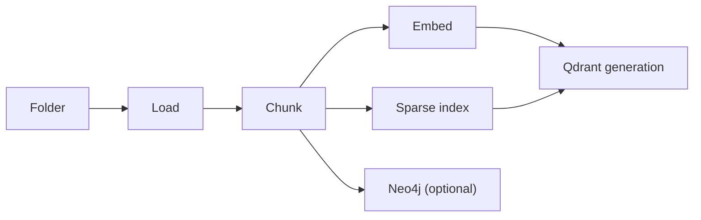
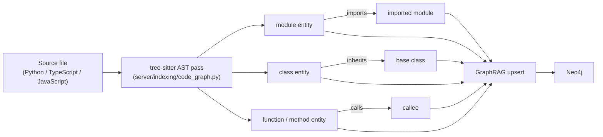

# Indexing a corpus

<div class="grid chunk_summaries" markdown>

-   :material-folder-search:{ .lg .middle } **Corpus = a folder**

    ---

    A corpus can be a repo, docs tree, mono-repo subtree, or any folder you point at.

-   :material-database:{ .lg .middle } **Persisted in Postgres**

    ---

    Chunk rows live in Postgres; dense and sparse vectors live in a per-corpus Qdrant generation.

-   :material-graph:{ .lg .middle } **Optional graph context**

    ---

    Neo4j can store additional context to improve cross-file retrieval.

</div>

[Quickstart](quickstart.md){ .md-button .md-button--primary }
[Searching](search.md){ .md-button }
[Indexing pipeline (deep dive)](../indexing.md){ .md-button }

!!! tip "Use stable corpus ids"
    Use lowercase slugs like `myapp`, `docs`, `customer-a`. Avoid spaces and special characters.

## What indexing does

Indexing turns a folder into a set of **retrieval primitives**:

- **Chunks** (text/code spans) with file paths and line ranges — rows in Postgres
- **Dense embeddings** (vector search) in a per-corpus Qdrant generation
- **Sparse index** (IDF-modified BM25 via fastembed `Qdrant/bm25`) in the same generation
- **Graph context** (optional) stored in Neo4j
- **Code graph** (optional, `graph_indexing.build_code_graph`) — module/class/function entities with `contains`/`inherits`/`imports`/`calls` edges in Neo4j
- **Chunk provenance** — every chunk carries typed provenance (extraction method; for Docling PDFs, cited pages plus normalized layout regions) that powers the [source document viewer](source_viewer.md)

!!! note "Corpora indexed before provenance capture"
    Chunks from older runs report `provenance` as not captured, and rich documents (docx/pptx/xlsx/html) show a "not captured" state in the [source document viewer](source_viewer.md) until you re-index.



### Optional: AST code graph (structural code context)

For code corpora, ragweld can additionally build an **AST code graph** while indexing. It is off by default (`graph_indexing.build_code_graph=false`); enable it per corpus and re-index.

What lands in Neo4j:

- one **module** entity per Python, TypeScript, or JavaScript source file
- **class** and **function/method** entities with qualname, line range, and first-line signature
- `contains`, `inherits`, `imports`, and `calls` relationships between them
- every entity linked to the chunk that defines it, so graph retrieval can expand a hit to its callers, callees, base classes, and importing modules instead of only neighbouring chunks

*Concept diagram (this mechanism only — the full fused pipeline is on the [generated retrieval-pipeline page](../reference/architecture/retrieval-pipeline.md)):*



!!! note "Conservative resolution"
    Imports and calls only produce edges when the target is defined inside the corpus or the import explicitly resolves to a corpus file. Everything else is counted as unresolved rather than guessed, keeping the graph high-signal.

!!! warning "Enable per corpus, then re-index"
    The code graph is built during indexing, so toggling `build_code_graph` has no effect until the corpus is re-indexed. It only pays for code corpora — leave it off for prose-only corpora.

## Before you index: estimate size/time (optional)

Use the estimate endpoint to catch “oops, this repo is huge” early:

```bash
curl -sS -X POST "http://127.0.0.1:58012/api/index/estimate" \
  -H "Content-Type: application/json" \
  -d '{
    "corpus_id": "demo",
    "repo_path": "/absolute/path/to/your/project",
    "force_reindex": false
  }' | jq .
```

!!! note "Estimates are heuristics"
    The estimate is intentionally rough (machine speed, provider latency, DB IO, and corpus makeup all matter). Use it for sizing, not for SLAs.

## Start indexing

```bash
curl -sS -X POST "http://127.0.0.1:58012/api/index" \
  -H "Content-Type: application/json" \
  -d '{
    "corpus_id": "demo",
    "repo_path": "/absolute/path/to/your/project",
    "force_reindex": false
  }' | jq .
```

## Monitor progress

```bash
curl -sS "http://127.0.0.1:58012/api/index/demo/status" | jq .
curl -sS "http://127.0.0.1:58012/api/index/demo/stats" | jq .
```

In the UI, this typically maps to **RAG → Indexing** and **Dashboard → Storage**.

## Reindexing safely

Common reasons to reindex:

- you changed chunking rules
- you changed embedding model/dimensions
- you changed inclusion/exclusion patterns
- you upgraded graph building logic

Recommended workflow:

- [ ] Confirm the corpus is not currently indexing (`/api/index/<corpus>/status`)
- [ ] Decide whether you need a *full rebuild* (`force_reindex=true`)
- [ ] Start indexing and monitor
- [ ] Validate with a few known-good queries after completion

!!! warning "Embeddings are not always compatible"
    If you change embedding dimensions or switch providers/models, you usually need a full reindex. Mixing incompatible embeddings can silently degrade retrieval quality.

## The knobs that matter (where to tune)

You tune indexing through config (Pydantic-first). For deep reference, see:

- [Configuration](../configuration.md)
- [Indexing pipeline](../indexing.md)

Here’s the short list of “most likely to matter” knobs:

| Goal | Knobs to look at |
|------|------------------|
| Better recall | chunk size/overlap, candidate top-k, include more file types |
| Better precision | tighter chunking, better reranking, raise confidence gates |
| Faster indexing | larger batches, skip graph build, skip expensive summarization |
| Lower cost | deterministic embeddings, smaller models, disable optional stages |

## Troubleshooting indexing

??? info "Indexing never reaches `complete`"
    - Check `/api/ready` first (DB connectivity).
    - Look at backend logs (in UI: **Infrastructure → Docker** or terminal output).
    - If you see repeated failures on one file, temporarily exclude that file type and re-run.

??? info "Indexing is slow"
    - Large corpora + cloud embeddings will be bound by provider latency.
    - On Apple Silicon, local/MLX paths may be faster for some stages.
    - Disable optional graph stages until you have baseline search working.

??? info "I’m missing chunks / the index looks empty"
    - Verify the `repo_path` exists *inside* the environment that’s indexing (host vs container path mismatch is the classic failure).
    - Confirm you’re querying the correct `corpus_id` (corpora are isolated).

