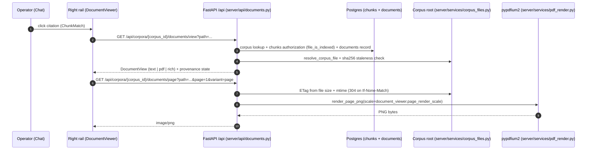

# Source document viewer

<div class="grid chunk_summaries" markdown>

-   :material-file-eye-outline:{ .lg .middle } **Citations open the real file**

    ---

    Click a citation under a chat answer and the cited document opens in the right rail — not a path string.

-   :material-map-marker-radius:{ .lg .middle } **Points at the evidence**

    ---

    PDF citations render the page with the chunk's layout regions boxed; text citations scroll to the cited lines.

-   :material-shield-check:{ .lg .middle } **Indexed files only**

    ---

    A file is viewable exactly when the corpus indexed it. Path escapes and unindexed files are typed 404s.

-   :material-history:{ .lg .middle } **Honest provenance**

    ---

    The viewer reports when a file changed since indexing and when a corpus predates provenance capture.

</div>

[Searching & answering](search.md){ .md-button .md-button--primary }
[Indexing a corpus](indexing.md){ .md-button }
[Configuration](../configuration.md){ .md-button }

!!! tip "Where it lives in the UI"
    Open a chat, ask a question with a corpus selected, then click any citation under the answer. The right rail switches to **Source** mode. Web-search citations behave differently — see [Web search in Chat](web_search.md).

## What opens when you click a citation

The server inspects how the file was indexed and returns a typed view:

| Document kind | What you see | Backed by |
|---------------|--------------|-----------|
| `text` (code, .md, .csv, …) | Full file with 1-based line numbers; the cited lines are highlighted and scrolled into view | The file on disk, decoded exactly as the indexer decoded it |
| `pdf` | One rendered page at a time with the chunk's layout regions boxed, page chips for every cited page, and the cited text below | Server-side rendering via pypdfium2 (`server/services/pdf_render.py`) |
| `rich` (docx, pptx, xlsx, html) | The Docling markdown the chunks were cut from, with the cited character span marked | The markdown captured at index time (stored in the `documents` table) |

The viewer header always shows the corpus, the corpus-relative path, the content kind, and an **Open original ↗** link to the raw file.

*Sequence diagram (this viewer only; retrieval itself is documented on the [generated retrieval-pipeline page](../reference/architecture/retrieval-pipeline.md)):*



## Provenance states

Definition list — what the badge next to the document means:

Captured
:   The corpus has a provenance record for this file: how it was extracted (`docling` or `direct`), its SHA-256 at index time, and when it was indexed. PDF chunks additionally carry the cited pages and normalized layout regions.

Changed since indexing
:   The file on disk no longer matches the SHA-256 recorded at index time. The viewer still opens it, but highlights may be offset — re-index to refresh.

Not captured
:   The corpus was indexed before provenance capture existed. The viewer tells you to re-index; rich documents return a typed `409 document_not_captured` because there is no captured markdown to display.

!!! note "Where provenance lives"
    Every chunk carries a typed `ChunkProvenance` (`extraction`, optional `page_start`/`page_end`, optional normalized `PageRegion`s). Corpora indexed before capture simply have `provenance: null` — nothing is synthesized.

## Who can open what (security model)

- A file is viewable **only** when the corpus has at least one indexed chunk for that path (`file_is_indexed` in `server/db/postgres.py`). A `documents` record alone does not authorize a view.
- Paths must be corpus-root-relative POSIX paths. Absolute paths, `..` segments, backslashes, and NUL bytes are rejected with a 404, and a symlink pointing outside the corpus root fails the resolved-containment check the same way (`server/services/corpus_files.py`).
- The raw endpoint serves PDFs inline and everything else as a download with `X-Content-Type-Options: nosniff` and `Content-Security-Policy: sandbox`, so a corpus file can never execute as a page on the API origin.

## Tuning knobs (`document_viewer` config)

| Field | Default | Range | What it does |
|-------|---------|-------|--------------|
| `document_viewer.page_render_scale` | `2.0` | 1.0–4.0 | PDF page raster scale for the viewer. `1.0` = 72 dpi; `2.0` gives 144 dpi — sharp on 1x monitors while keeping a letter page under a few hundred KB. Higher values cost render time and bandwidth per page. |
| `document_viewer.thumbnail_render_scale` | `0.5` | 0.25–1.0 | Raster scale for citation thumbnails in chat. Kept low because a thumbnail only needs to show where on the page the cited region sits. |
| `document_viewer.max_text_bytes` | `5,000,000` | 65,536–50,000,000 | Largest text/code file the viewer serves in full. Larger files return a typed `413` with an operator hint instead of streaming megabytes into the browser. |

=== "curl"

```bash
curl -sS -X PATCH "http://127.0.0.1:58012/api/config/document_viewer" \
  -H 'Content-Type: application/json' \
  -d '{"page_render_scale": 2.5}' | jq .  # (1)!
```

1. Sectional PATCH is validated by Pydantic; takes effect on the next page render.

=== "Python"

```python
import httpx

httpx.patch(
    "http://127.0.0.1:58012/api/config/document_viewer",
    json={"page_render_scale": 2.5},
).raise_for_status()
```

!!! tip "If you're not sure"
    Leave all three at their defaults. Raise `page_render_scale` only if PDF text looks soft on your display, and raise `max_text_bytes` only for corpora that genuinely hold large generated files.

## Troubleshooting

??? question "Citation does nothing / the rail says the file is not indexed"
    - The path may have changed since indexing (rename, move) — the viewer reports staleness when it can.
    - Confirm the corpus still has chunks for the file: index it again, or check `GET /api/index/{corpus_id}/status`.
    - Corpora indexed before provenance capture still open, but show the "not captured" notice until you re-index.

??? question "The viewer shows 'Signed out' instead of the document"
    - The auth proxy in front of the API has no valid session for you (HTTP 401) — most often because your sign-in session ended, for example after a service restart.
    - Nothing is wrong with the document: reload the page to sign in again, then click the citation again.
    - The error card says this directly ("Your sign-in session has ended, so the document could not be fetched") with a *Reload the page to sign in again* hint, instead of a generic `Could not load document (HTTP 401)` — so you don't go hunting for an indexing problem that doesn't exist.

??? question "The viewer says 'Access denied' even though I'm signed in"
    - HTTP 403 is handled separately from 401: you **are** authenticated, but the access policy on this deployment does not allow your account to read documents.
    - Signing in again cannot fix this — the error card says so explicitly ("Access denied: your account is not allowed to read documents on this deployment") so you don't waste a reload cycle on it.
    - The operator hint on the card points at the real fix: ask the operator to grant your user the required group in the auth policy. There is nothing to change in the corpus, the index, or the viewer itself.

??? question "PDF highlights look offset"
    - The file likely changed since indexing (check the **changed since indexing** badge). Re-index to rebuild the provenance map.
    - A handful of Docling layout items can fail to locate in the serialized markdown; those are counted as unlocated rather than guessed, so a region may be missing while the page highlight still works.

??? question "Rich document says 'not captured'"
    Rich documents (docx/pptx/xlsx/html) are viewable only from the Docling markdown captured at index time. Re-index the corpus to capture it.

## For engineers

- Router: `server/api/documents.py` (`view`, `page`, `raw` endpoints under `/api/corpora/{corpus_id}/documents/*`)
- Page rendering: `server/services/pdf_render.py` — pypdfium2 serialized under Docling's `pypdfium2_lock`
- Path safety, hashing, ETags: `server/services/corpus_files.py`
- Provenance stamping at index time: `server/indexing/provenance.py` (maps chunk `char_start`/`char_end` onto Docling source spans)
- Boundary models: `server/models/index.py` (`ChunkProvenance`, `PageRegion`, `DocumentView` and the typed error details), regenerated into `web/src/types/generated.ts`
- Persistence: a `documents` table (sha256, size, kind, captured markdown for rich kinds) plus a `provenance` JSONB column on `chunks`; both are written under the staging corpus id during a run and promoted with the chunks.
