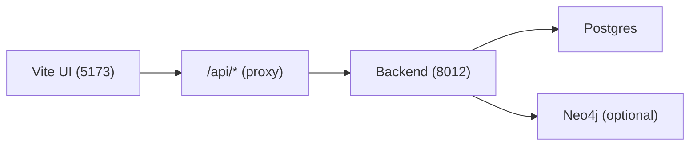

# UI tour

-   :material-rocket-launch:{ .lg .middle } **Get Started**

    ---

    The fastest way to bring the stack up and learn the “happy path”.

-   :material-monitor-dashboard:{ .lg .middle } **Dashboard**

    ---

    System status, monitoring links, storage, help, and glossary.

-   :material-brain:{ .lg .middle } **RAG**

    ---

    Retrieval, graph views, indexing, reranker config, and learning studios.

-   :material-shield-key:{ .lg .middle } **Admin**

    ---

    Secrets + integrations that power provider-backed features.

[Quickstart](quickstart.md){ .md-button .md-button--primary }
[Indexing](indexing.md){ .md-button }
[Searching](search.md){ .md-button }
[Configuration](../configuration.md){ .md-button }

!!! tip "Default dev URL"
    `http://127.0.0.1:5173/web`

!!! note "How the UI talks to the backend"
    In dev, the UI uses relative requests like `/api/search` and your dev server proxies them to the backend (default `http://127.0.0.1:8012`).

## Main tabs (what they’re for)

The UI is organized into top-level tabs. Here’s the practical meaning of each:

| Tab | What you do there | Typical “first click” |
|-----|-------------------|------------------------|
| Get Started | Bring-up flow + sanity checks | `/web/start` |
| Dashboard | System status, monitoring, storage, help | `/web/dashboard?subtab=system` |
| Chat | Chat UI + chat settings | `/web/chat?subtab=ui` |
| Grafana | Embed Grafana dashboards/config (when enabled) | `/web/grafana?subtab=dashboard` |
| Benchmark | Run/inspect benchmarks | `/web/benchmark` |
| RAG | Core tri-brid features (retrieval/indexing/graph/reranker) | `/web/rag?subtab=retrieval` |
| Eval Analysis | Analyze eval runs and datasets | `/web/eval?subtab=analysis` |
| Infrastructure | Docker status, MCP servers, paths/stores | `/web/infrastructure?subtab=services` |
| Admin | Secrets and integrations | `/web/admin?subtab=secrets` |

!!! warning "If something looks empty"
    Most RAG panels depend on a **selected corpus** and a **completed index**. If you haven’t indexed yet, start at [Indexing](indexing.md).

## The single most important UI control: corpus selection

Many screens include a corpus selector (sometimes labeled “repo”). This determines the `corpus_id` used for:

- indexing
- retrieval
- graph views
- per-corpus configuration and stats

If you see “wrong results”, the most common cause is simply that you’re looking at the wrong corpus.

## Quick troubleshooting inside the UI

??? tip "Where to check readiness"
    - **Dashboard → System Status**
    - `/api/ready` (raw endpoint)

??? tip "Where to find logs"
    - **Infrastructure → Docker** (if you’re running via Docker)
    - Your terminal where `./start.sh` is running

??? tip "Where to verify secrets"
    - **Admin → Secrets**
    - `/api/secrets/check?...`

