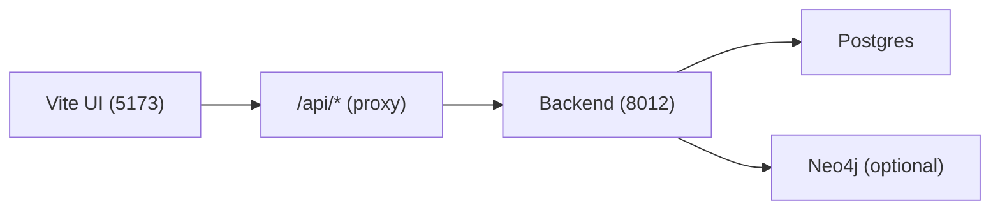
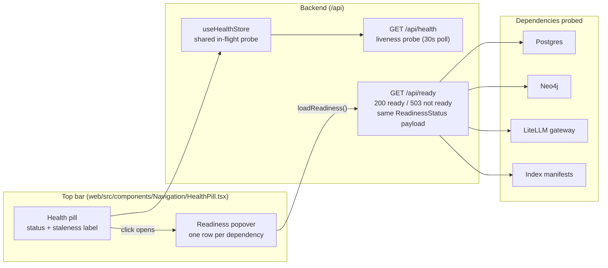

```markdown
# UI tour

<div class="grid chunk_summaries" markdown>

-   :material-rocket-launch:{ .lg .middle } **Get Started**

    ---

    The fastest way to bring the stack up and learn the “happy path”.

-   :material-monitor-dashboard:{ .lg .middle } **Dashboard**

    ---

    System status, monitoring links, storage, help, and glossary.

-   :material-rocket-launch:{ .lg .middle } **Get Started**

    ---

    The fastest way to bring the stack up and learn the “happy path”.

-   :material-monitor-dashboard:{ .lg .middle } **Dashboard**

    ---

    System status, monitoring links, storage, help, and glossary.

-   :material-brain:{ .lg .middle } **RAG**

    ---

    Retrieval, graph views, indexing, reranker config, and learning studios.

-   :material-shield-key:{ .lg .middle } **Admin**

    ---

    Basic, advanced, and raw configuration plus dependency and secret readiness.

</div>

[Quickstart](quickstart.md){ .md-button .md-button--primary }
[Indexing](indexing.md){ .md-button }
[Searching](search.md){ .md-button }
[Configuration](../configuration.md){ .md-button }

!!! tip "Default dev URL"
    `http://127.0.0.1:5173/web`

!!! note "How the UI talks to the backend"
    In dev, the UI uses relative requests like `/api/search` and your dev server proxies them to the backend (default `http://127.0.0.1:8012`).



## UI snapshots (current surfaces)

### Chat + dataset iteration loop


This is the core operator loop: ask, inspect sources, adjust retrieval settings, and re-run.

### RAG graph inspection


The graph view is where you validate entity extraction quality and relationship coverage. Communities are GDS Leiden partitions derived at index time — re-index the corpus to refresh them.

Entity and relationship types are whatever the graph actually stores: AST kinds (`function`, `class`, `module`) for code corpora, and the approved schema's labels (`Tank`, `LaunchSite`, `CONTAINS`, `LOCATED_AT`, …) for semantic corpora — never coerced to a generic "(concept)" fallback. Schema-labelled entities get a stable palette colour keyed by the label text, and every view (entity table, neighbourhood, communities) returns the stored schema edges, so a semantic generation shows real edge counts instead of "0 edges".

Entity names come from the graph too: an entity stored without a `name` — possible only on generations approved before the proposal's `name` identity rule — is labelled with its stable entity id instead of an empty name, and it reads back over the API as an empty string, never the text `None`. Newer generations always carry a name; see the [Indexing pipeline](../indexing.md).

The entity details panel now shows what the graph actually extracted: a **Properties** chip row listing every stored schema or AST property (`qualname`, `kind`, `start_line`, `pressure`, `ullage`, …), with derived community membership shown separately — `Community: <id>` plus its path when Leiden produced a multi-level partition — because `communityId`/`communityPath` are written at index time by the community pass, not extracted, so they are never presented as extracted properties. An entity with nothing stored says "none extracted". The **File** line is provenance-backed for semantic entities too: a semantic entity stores no file of its own, so the view reports the file of the chunk it was extracted from (`FROM_CHUNK`), and an entity without provenance reads `File: —` honestly rather than guessing. These behaviors are pinned end to end in `web/tests/e2e/exhaustive/graph_explorer.spec.ts`; see [Graph API](../api_graph.md).

### Recall gating and memory policy controls


This panel controls when memory is indexed and when recall is injected per message.

### Citations open the actual source

Every citation under a chat answer is clickable. PDF citations render as a page-thumbnail card with the cited region boxed; text citations open the file scrolled to the cited lines. Either way the document opens in the right rail's **Source** mode, so you can verify evidence without leaving the chat.

Figure citations are flagged on top of that: a citation whose chunk is a described figure (see [Indexing a corpus](indexing.md)) carries a **Figure** pill — `Figure · chart` when the vision model named a kind — and the page viewer labels its text panel **Figure description** instead of **Cited text**. Ordinary page-text citations are never marked.

- Source viewer guide: [Source document viewer](source_viewer.md)
- Web-search citations: [Web search in Chat](web_search.md)

### Chat model choice survives reloads

Your selected chat model is saved per conversation. On page load, the model picker keeps that saved override while `/api/chat/models` is still loading — it is no longer reset just because the model catalog has not arrived yet. Once the catalog responds, the picker confirms the saved model is present and keeps it selected.

Why this matters: if you pin a specific LiteLLM gateway alias for your conversations (for example, a production chat model that differs from the vision override), a refresh no longer silently drops you back to the default before the catalog finishes loading. The picker simply stays on your saved choice until the server confirms the option list.

!!! tip "If the picker stays disabled"
    The picker enables once `/api/chat/models` responds. If it never does, check:

    - `GET /api/chat/health` (default dev base `http://127.0.0.1:58012/api`) for provider readiness
    - The LiteLLM gateway service on port `54000` (see the [runtime topology](../reference/architecture/runtime-topology.md) for the full service map)

### Chat reliability: Stop, Retry, Export, and honest sources

A handful of chat behaviors changed so the thread never lies to you:

- **Stop always lands.** Pressing Stop (or hitting the stream timeout) finalizes the in-flight answer as an interrupted, retryable error card — it can no longer sit at "Streaming" forever. A page load reconciles any abandoned running bubble the same way, and the card's **Retry** replays your question without duplicating it.
- **Streaming shows progress.** While an answer streams, the header shows a live elapsed counter (`Streaming · 12s`) instead of a static label.
- **Attachments say what they are.** The composer preview shows each image's name, type, and size; non-image files are refused with a toast naming them (previously dropped silently); and the answer's Sources block lists attached images as real inputs (`N attached images used as an answer input`).
- **Sources are labeled.** The Sources header carries a count; Recall citations read `Recall · <first line of the recalled turn>` instead of a raw `conversations/<id>.md` path; and the source dropdown summary counts corpora and Recall separately (`2 corpora + Recall`, never a bare `3 selected`).
- **History shows context.** Each chat-history row carries badges for the corpora (plus Recall) the conversation used.
- **Export works and confirms.** Export downloads a JSON file reliably and shows a toast with the filename; an empty chat says "Nothing to export yet".
- **One prompt system.** Exactly one of the four state prompts (Direct / RAG / Recall / RAG+Recall) is sent, chosen by whether RAG and/or Recall context is present; the legacy base+suffix fallback composition is gone. Set them in **Chat → Settings**.
- **One markdown renderer.** Assistant answers (and onboarding answers) render through a single GFM renderer — tables, bold, inline code, fenced code with syntax highlighting, and nested lists all render, and wide content wraps inside the pane instead of growing it sideways.
- **The debug footer discloses the graph leg.** When a message's retrieval ran the graph leg, its debug footer shows the leg's own counters — `graph_enabled`, `graph_qdrant_seed_chunks`, `graph_relationship_expansion_hits`, `graph_hydrated_chunks` — read straight from the chat debug contract (`ChatDebugInfo`), and never the retired entity-hit figure. See [Chat models](../api_models_chat.md).
- **A failed answer says why, and the trace follows it.** When generation fails, the error card classifies the gateway's sanitised reason (`spend limit`, `rejected key`, `serving lane not running`, `gateway unreachable`) and shows it in **Details** together with the run id; the Routing Trace panel follows the failed run instead of the previous successful one. See [Chat models](../api_models_chat.md).
- **A used thread never lies about its corpus.** Opening Chat with an active corpus (`?corpus=`) that is not in the conversation's Sources shows a notice — the next answer would search elsewhere — with two honest moves: **Add <corpus>** to this thread's Sources, or **New chat about <corpus>**. A `?thread=new` deep link (what Get Started's *Open Chat* uses) opens a fresh conversation scoped to the URL corpus and leaves the used thread alone.

### Top-bar health pill: the /api/ready breakdown in one click

The top bar's **Health** control is now a pill: `OK · just now` or `Not OK · 2m ago`. The status word is backed by the same health probe the app runs every 30 seconds while the tab is visible, and the label shows **how stale the reading is** instead of a bare time-of-day — the underlying tooltip carries the full date and time of the last check.

Clicking the pill is no longer a no-op: it opens a **component-status popover** backed by `GET /api/ready`'s dependency breakdown, with one row per required dependency (the databases, the LiteLLM gateway, the index manifests). Each row carries a ready/unavailable marker, a short non-sensitive detail line, and — when a dependency is down — an operator hint naming the fix.

- **A 503 is a status, not an error.** `/api/ready` answers `200` when every required dependency is ready and `503` — with the same payload shape — when one is not, so the popover can always show *which* dependency is the problem instead of a generic failure. See [Health, Readiness, and Metrics API](../api_health.md).
- **Escape closes the popover** and returns focus to the pill; a click outside dismisses it too.
- **Open System Status** closes the popover and lands on **Dashboard → System Status** for the detailed view.
- **The first reading is not gated on visibility.** A page opened in a background tab (or an automation tab, which browsers report as hidden) gets one health probe at mount, so its pill never sits at "— · not checked yet" while the Dashboard reads OK. Only the recurring 30-second poll follows tab visibility.

*Concept diagram (the pill's data path only — the full service map is on the [generated runtime-topology page](../reference/architecture/runtime-topology.md)):*



??? tip "If the pill says Not OK"
    Open the popover first — it names the dependency and its operator hint (for example, start the database container, or bring the LiteLLM gateway up). For deeper diagnosis go to **Dashboard → System Status**, or check the raw endpoint directly: `curl -sS http://127.0.0.1:58012/api/ready | jq .`

### RAG → Data Quality reviews what it says it reviews

The Data Quality subtab now fetches what it promises: chunk summaries load with the corpus, and a **Corpus keywords** panel lists the keywords stored on the corpus that weight retrieval. Empty states say why they are empty — "no build has been run for this corpus yet" versus "could not be loaded" versus "select a corpus" — instead of a blanket "No chunk summaries to show" for every corpus, indexed or not. **Generate keywords** fills the panel from what was persisted, so it survives a reload.

The **Synthetic Lab** jump buttons beside each panel are labelled as what they do — "Generate keywords in Synthetic Lab →", not "Corpus Keywords" — carry the recipe they preselect in their tooltip, keep the current corpus in the URL, and Synthetic Lab announces "Recipe preset to … Nothing has run" on arrival. Nothing runs until you start it there.

Index Now on the **Indexing** subtab is a hard consent gate: the estimate is measured (token/chunk bands, sampled-file counts), a failed or refused estimate blocks the run with an actionable error banner instead of starting unpriced, and the confirmation dialog can no longer open on an unmeasured payload. See [Indexing a corpus](indexing.md).

## Main tabs (what they’re for)

The UI is organized into top-level tabs. Here’s the practical meaning of each:

| Tab | What you do there | Typical “first click” |
|-----|-------------------|------------------------|
| Get Started | Bring-up flow + sanity checks | `/web/start` |
| Dashboard | System status, monitoring, storage, help | `/web/dashboard?subtab=system` |
| Chat | Chat UI + chat settings | `/web/chat?subtab=ui` |
| Grafana | Embedded dashboards, observability catalog, and incident signals (when enabled) | `/web/grafana?subtab=overview` |
| Benchmark | Run/inspect benchmarks | `/web/benchmark` |
| RAG | Core tri-brid features (retrieval/indexing/graph/reranker) | `/web/rag?subtab=retrieval` |
| Eval Analysis | Analyze eval runs and datasets | `/web/eval?subtab=analysis` |
| Infrastructure | Docker status, MCP servers, paths/stores | `/web/infrastructure?subtab=services` |
| Admin | Basic/advanced/raw configuration + dependency and secret readiness | `/web/admin?subtab=basic` |

!!! note "Subtab routes changed recently"
    Grafana's subtabs are now **Overview**, **Dashboards**, **Incidents**, and **Config**; Admin's are **Basic**, **Advanced**, **Raw**, and **Dependencies** (secret readiness lives under Dependencies); RAG's Reranker subtab id is now `reranker` (it used to be `reranker-config`, so `?subtab=reranker` — the slug the label suggests — bounced to Data Quality). A bookmark pointing at an old `?subtab=` value is corrected with a toast naming what changed, and `?subtab=reranker-config` still lands on the Reranker tab. RAG's Learning Reranker subtab id is now `learning-reranker` (it used to be `learning-ranker`); the old slug still resolves through the same alias map.

!!! note "Startup load: Dashboard → Storage is lazy-loaded"
    To keep first paint cheap and avoid unnecessary database IO, ragweld does not fetch storage/indexing metrics until you open the Storage subtab.
    
    - On initial load of `/web/dashboard?subtab=system`, the UI makes zero calls to `/api/index/stats`.
    - Open Dashboard → Storage to trigger the fetch and render per-corpus storage and indexing stats.
    - If you expected to see numbers but the panel looks empty, you are probably still on the System subtab. Click Storage (or use the panel’s Refresh control) to populate it.

??? tip "Verify in your browser’s Network panel"
    - Go to `/web/dashboard` (the System subtab).
    - Open DevTools → Network and filter for `/api/index/stats`.
    - You should see no requests until you click the Storage subtab.
    - This behavior is by design to reduce background load on Postgres at startup.

### Dashboard → System: Recent Index Runs

The System subtab’s **Recent Index Runs** panel lists one row per corpus: its latest persisted index run with status (`complete` in green, `error` in red, **never indexed** when the corpus has no runs), completion time, chunk count, figures described (with a failed count in parentheses when any), and the run’s figure-description cost ceiling. “Never indexed” and “unavailable” (the request failed) are different answers, and the panel colors them differently.

Runtime-managed corpora are excluded from this panel: the chat Recall corpus (`recall_default`) and the two Codex session corpora are registered by the runtime, carry the typed `internal` flag on `Corpus`, and index through their own path — so they have no operator-run index run and would otherwise sit here reading “never indexed” forever. The same marker keeps them out of “delete all unindexed corpora” cleanup, since runtime-registered corpora are never the operator’s to clean up.

!!! tip "This panel is deliberately off the 30-second poll"
    Nothing in it changes without an indexing run, so fetching on mount and on the dashboard’s explicit refresh action is enough — one request per corpus every 30 seconds would be real load against the run store. The panel reads `GET /api/index/{corpus_id}/runs/latest?finalize=false`, a pure read that never rewrites a run summary as a side effect of displaying it. See [Indexing API](../api_indexing.md).

!!! warning "If something looks empty"
    Most RAG panels depend on a **selected corpus** and a **completed index**. If you haven’t indexed yet, start at [Indexing](indexing.md).

### Dashboard → System: cost cards that say what they mean

The System subtab's index panel renders the per-corpus cost cards with the distinctions the underlying run record actually makes:

- **A metered `$0.0000` says so.** An embedding cost of exactly zero with real tokens processed — a local or no-charge embedding model — renders as `$0.0000 (no charge)`, distinguishable from `N/A`, which means no meter ran at all.
- **Semantic KG Cost always appears.** A phase that did not run reads `not run`, never a silently missing card that could be mistaken for `$0.00`.
- **Total Cost carries its ceiling.** When figure descriptions contributed, the total is priced from the full per-figure completion budget, so it is labelled `≤ $X` — an upper bound, never presented as an exact charge. See [Indexing a corpus](indexing.md) for how the figure ceiling is computed.
- **Byte figures are binary.** The panel's byte figures use KiB/MiB/GiB (the values are divided by 1024), matching the Storage subtab's labels.

### Dashboard → Monitoring: alerts read live from Alertmanager

The Monitoring subtab's **Alerts** panel calls `GET /api/observability/alerts`, which reads Alertmanager's own alerts route on every refresh — so what you see is what Alertmanager is holding right now, with a firing count that excludes silenced and inhibited alerts.

- **Alert rows carry severity tones** — critical/page in red, warning in amber, everything else neutral — and silenced/inhibited rows are labeled, so you can tell why something is being held back rather than wondering where it went.
- **An empty result is evidence, not a guess** — the empty state names the Alertmanager URL that was read.
- **A failure is a typed error card** — if Alertmanager is unconfigured, unreachable, or answering with something other than alerts, the panel shows the API's own reason and operator hint (typically: set `tracing.alertmanager_base_url`), with a **Retry** button and a link into **Infrastructure → Monitoring**. It never falls back to a bare "Failed to load" or an empty list that would read as good news.

Full alerting controls (Alertmanager endpoints, receivers, delivery policy) live in [Alert webhooks](../operations/webhooks.md).

### Dashboard → Monitoring: Recent Query Traces

Below the alerts panel, **Recent Query Traces** lists the last 10 search and chat queries — a date-and-time timestamp, the query text, and the corpus each ran against. The table deliberately has no Duration column: the query log records no per-request timing, so the table never shows a column it cannot populate (a column of `—` for every row would look like missing data). For latency work use `/api/metrics`, the trace viewer, or the Grafana dashboards rather than this table; the timestamps include the date, so a list spanning days cannot read as if it ran backwards.

The panel's description links straight into the **Eval Analysis** tab — per-run drilldown, per-question detail, and AI comparison analysis live there — and the table's third column header reads **Corpus**, matching the workbench's corpus-first naming.

### Dashboard → Storage: byte tiles, count tiles, and the capacity planner

The Storage subtab shows one tile per storage component, in two deliberately different formats:

- **Byte tiles** (chunks, vectors, indexes, Postgres totals) carry a `% of total` share line and a background fill bar, because they are slices of a real byte total and the shares sum to roughly 100%.
- **Count tiles** (Qdrant points, keywords) show only the tally — `1,315 points`, `247 keywords`. A count has no share of a byte total, so a percentage would always read 0.0% and the fill bar would be meaningless; neither is rendered.
- **An unmeasured store is "n/a" with the reason.** The Neo4j store tile reads `n/a` — Neo4j 5 exposes no store-size procedure and the data volume is not host-readable — with no share line and no fill bar, and it contributes nothing to the byte total. A zero would read as a measured empty graph beside thousands of nodes; see [Index Dashboard models](../api_models_extra.md).

Byte figures are labelled in binary units (KiB / MiB / GiB) here and on **Dashboard → System Status**, because both divide by 1024 — the two subtabs agree on the same number under the same label.

Below the live tiles sits the **Storage Calculator Suite**, a *hypothetical capacity planner* — editing its inputs never changes a stored index. When an indexed corpus is active, the planner seeds itself from that corpus (stored chunk bytes for corpus size, the mean chunk size across stored points, embedding dimensions from config) and says so in a banner naming the source of every prefilled number; with no indexed corpus it holds generic planning defaults and says that instead. The right-hand **Fit Analysis** panel's Corpus Size / Chunk Size / Embedding Dims fields are independent scenario inputs — editing them does not move the left panel — while Hydration %, Replication and HNSW overhead are read from the left panel.

## The single most important UI control: corpus selection

Many screens include a corpus selector (sometimes labeled “repo”). This determines the `corpus_id` used for:

- indexing
- retrieval
- graph views
- per-corpus configuration and stats

If you see “wrong results”, the most common cause is simply that you’re looking at the wrong corpus.

## Quick troubleshooting inside the UI

??? tip "Where to check readiness"
    - **Dashboard → System Status**
    - `/api/ready` (raw endpoint)
    - The top-bar **Health** pill — click it for the per-dependency readiness popover without leaving the page

??? tip "Where to find logs"
    - **Infrastructure → Docker** (if you’re running via Docker)
    - Your terminal where `./start.sh` is running

??? tip "Where to verify secrets"
    - **Admin → Dependencies** (dependency and secret readiness)
    - `/api/secrets/check?...`

## Shell polish worth knowing (recent changes)

A handful of workbench-shell behaviors changed recently; none change any workflow, but they explain things you may notice:

- **Unknown routes say so.** A URL nothing is routed to now renders a "Page not found" card naming the attempted path, with links to every tab — previously it rendered a silently empty page under a "Home" breadcrumb.
- **Bad deep links are corrected out loud.** An unknown `?subtab=` or `?corpus=` value is replaced (and the URL cleaned) with a toast naming what was wrong and what you landed on, instead of a silent rewrite that made a broken bookmark look like a working link.
- **The window title names where you are.** The browser tab reads `Dashboard · Storage — <corpus> — ragweld`, so a multi-tab operator session is tellable apart at a glance.
- **The glossary is organized by its own data.** Category chips come from the `category` field in `data/glossary.json` (one badge per category), chip counts describe the current search, and search matches on word boundaries — searching `figure` finds the figure settings instead of everything containing "configured".
- **Keyboard access.** Ctrl+K no longer opens on focus (it opens on click, Enter, or Ctrl+K), traps focus while open and returns it on close; the dock picker supports arrow keys + Enter like Ctrl+K; the top bar's tab stops show a visible focus ring.
- **Admin → Basic names its scope.** A banner shows which corpus the page writes to, and every field carries its `corpus`/`global` scope chip even in the trimmed Basic view — a save can no longer look like a global default when it is a per-corpus value.
- **Credential fields explain themselves.** The Postgres DSN shows a "Password configured" chip and a note that `[redacted]` means "kept in the backend", and nested config fields read their units properly ("Timeout (seconds)", not "Timeout S"). See [Security](../security.md).
- **Config edits stage; Apply writes.** Every config edit — a number, a toggle, a chunking-strategy card, a raw JSON section — stages locally, and the footer's **Apply** button counts what is staged (`Apply 3 changes`) with a brief `Saved` acknowledgement after a successful write. A rejected save shows the server's per-field message under the field itself, and a 409 conflict offers **Reload latest**. See [Configuration](../configuration.md).
- **Destructive actions confirm themselves.** Irreversible dialogs focus **Cancel** first — a stray Enter declines rather than destroys — and the biggest ones (deleting a corpus's index) require typing the corpus id before the confirm button enables. See [Testing](../testing.md).
- **Admin → Raw is read-only until you opt in.** The raw section editor opens read-only in a Monaco JSON view; **Edit section** enables it, **Cancel** reverts to the last loaded JSON, invalid JSON is caught before saving, and a save stages the whole-section replacement for Apply.
- **Admin → Dependencies loads out loud.** The readiness probe can take ~25 s on a cold cache, so the panel shows a spinner with an elapsed counter, skeleton cards, and a "still working" note past ~8 seconds instead of a bare sentence that reads as a hung page.
- **The dock has one set of controls.** When nothing is docked, **Dock Chat** / **Dock Current** / **Choose…** live in the dock header and the empty body is guidance text — the duplicate control set in the empty body is gone. Docking the page you are on (which moves the main view to Chat) now announces it with a one-click undo toast instead of silently relocating the page.
- **The settings rail links, it doesn't duplicate.** The rail's old "Quick Model Switcher" — a second copy of generation/embedding/reranker assignment with its own Apply button — is gone; it now links to **RAG → Retrieval**, the single surface that assigns models. Long lineage/eval ids render middle-truncated with a one-click **copy full id** control.
- **The wizard follows a corpus that still exists.** Steps 3 and 4 now name the corpus they act on (`This step works on <name> (<corpus_id>)`), and a persisted wizard corpus the registry no longer has — deleted while the wizard kept its id — is replaced by the active corpus (or cleared), instead of greying the steps out over a corpus that no longer exists while the corpus in the URL is indexed and ready. *Open Chat* at the end deep-links into a fresh conversation scoped to that corpus (`?thread=new`).
- **Get Started lays out by its pane, not the window.** The wizard's container keys its layout to the width of its own pane (`#tab-start` is a CSS size container), so it renders readably both as the main page and when swapped into the narrow dock pane — navigating to Get Started while another tab is docked no longer wraps step headings and warnings one character per line. Swapping tabs between the main pane and the dock is intentional behavior; the wizard just stays legible through it.
- **Docked chat keeps its buttons whole.** The chat composer's text column is the only element allowed to shrink in a narrow docked pane, so **Attach** and **Send** keep their labels on one line instead of wrapping letter-per-line — the dock body inherits `overflow-wrap: anywhere` for long identifiers, and the textarea's intrinsic minimum width used to squeeze the button column instead.
```
