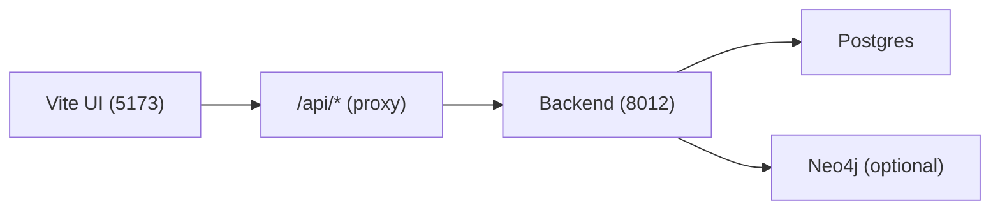
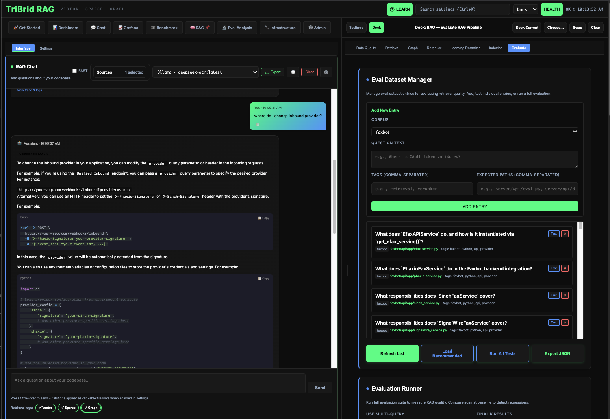
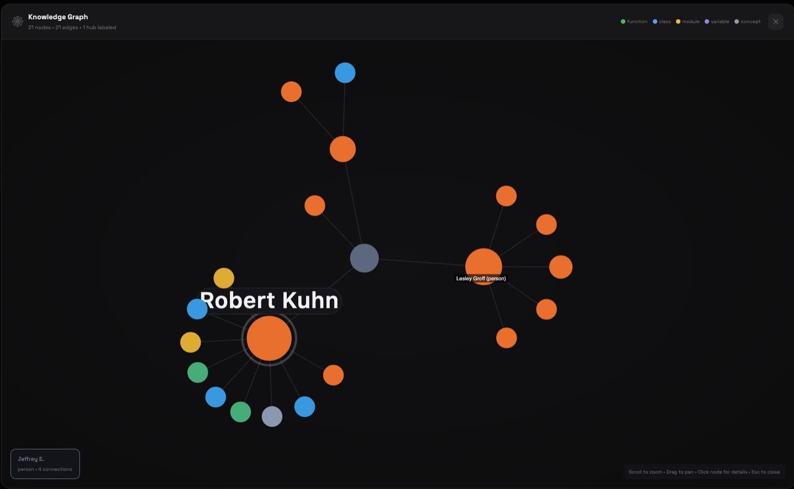

# UI tour

-   :material-rocket-launch:{ .lg .middle } **Get Started**

    ---

    The fastest way to bring the stack up and learn the “happy path”.

-   :material-monitor-dashboard:{ .lg .middle } **Dashboard**

    ---

    System status, monitoring links, storage, help, and glossary.

-   :material-rocket-launch:{ .lg .middle } **Get Started**

    ---

    The fastest way to bring the stack up and learn the “happy path”.

-   :material-monitor-dashboard:{ .lg .middle } **Dashboard**

    ---

    System status, monitoring links, storage, help, and glossary.

-   :material-brain:{ .lg .middle } **RAG**

    ---

    Retrieval, graph views, indexing, reranker config, and learning studios.

-   :material-shield-key:{ .lg .middle } **Admin**

    ---

    Secrets + integrations that power provider-backed features.

[Quickstart](quickstart.md){ .md-button .md-button--primary }
[Indexing](indexing.md){ .md-button }
[Searching](search.md){ .md-button }
[Configuration](../configuration.md){ .md-button }

!!! tip "Default dev URL"
    `http://127.0.0.1:5173/web`

!!! note "How the UI talks to the backend"
    In dev, the UI uses relative requests like `/api/search` and your dev server proxies them to the backend (default `http://127.0.0.1:8012`).

## UI snapshots (current surfaces)

### Chat + dataset iteration loop

This is the core operator loop: ask, inspect sources, adjust retrieval settings, and re-run.

### RAG graph inspection

The graph view is where you validate entity extraction quality and relationship coverage.

### Recall gating and memory policy controls

This panel controls when memory is indexed and when recall is injected per message.

### Citations open the actual source

Every citation under a chat answer is clickable. PDF citations render as a page-thumbnail card with the cited region boxed; text citations open the file scrolled to the cited lines. Either way the document opens in the right rail's **Source** mode, so you can verify evidence without leaving the chat.

Figure citations are flagged on top of that: a citation whose chunk is a described figure (see [Indexing a corpus](indexing.md)) carries a **Figure** pill — `Figure · chart` when the vision model named a kind — and the page viewer labels its text panel **Figure description** instead of **Cited text**. Ordinary page-text citations are never marked.

- Source viewer guide: [Source document viewer](source_viewer.md)
- Web-search citations: [Web search in Chat](web_search.md)

### Chat model choice survives reloads

Your selected chat model is saved per conversation. On page load, the model picker keeps that saved override while `/api/chat/models` is still loading — it is no longer reset just because the model catalog has not arrived yet. Once the catalog responds, the picker confirms the saved model is present and keeps it selected.

Why this matters: if you pin a specific LiteLLM gateway alias for your conversations (for example, a production chat model that differs from the vision override), a refresh no longer silently drops you back to the default before the catalog finishes loading. The picker simply stays on your saved choice until the server confirms the option list.

!!! tip "If the picker stays disabled"
    The picker enables once `/api/chat/models` responds. If it never does, check:

    - `GET /api/chat/health` (default dev base `http://127.0.0.1:58012/api`) for provider readiness
    - The LiteLLM gateway service on port `54000` (see the [runtime topology](../reference/architecture/runtime-topology.md) for the full service map)

## Main tabs (what they’re for)

The UI is organized into top-level tabs. Here’s the practical meaning of each:

| Tab | What you do there | Typical “first click” |
|-----|-------------------|------------------------|
| Get Started | Bring-up flow + sanity checks | `/web/start` |
| Dashboard | System status, monitoring, storage, help | `/web/dashboard?subtab=system` |
| Chat | Chat UI + chat settings | `/web/chat?subtab=ui` |
| Grafana | Embed Grafana dashboards/config (when enabled) | `/web/grafana?subtab=dashboard` |
| Benchmark | Run/inspect benchmarks | `/web/benchmark` |
| RAG | Core tri-brid features (retrieval/indexing/graph/reranker) | `/web/rag?subtab=retrieval` |
| Eval Analysis | Analyze eval runs and datasets | `/web/eval?subtab=analysis` |
| Infrastructure | Docker status, MCP servers, paths/stores | `/web/infrastructure?subtab=services` |
| Admin | Secrets and integrations | `/web/admin?subtab=secrets` |

!!! note "Startup load: Dashboard → Storage is lazy-loaded"
    To keep first paint cheap and avoid unnecessary database IO, ragweld does not fetch storage/indexing metrics until you open the Storage subtab.
    
    - On initial load of `/web/dashboard?subtab=system`, the UI makes zero calls to `/api/index/stats`.
    - Open Dashboard → Storage to trigger the fetch and render per-corpus storage and indexing stats.
    - If you expected to see numbers but the panel looks empty, you are probably still on the System subtab. Click Storage (or use the panel’s Refresh control) to populate it.

??? tip "Verify in your browser’s Network panel"
    - Go to `/web/dashboard` (the System subtab).
    - Open DevTools → Network and filter for `/api/index/stats`.
    - You should see no requests until you click the Storage subtab.
    - This behavior is by design to reduce background load on Postgres at startup.

### Dashboard → System: Recent Index Runs

The System subtab’s **Recent Index Runs** panel lists one row per corpus: its latest persisted index run with status (`complete` in green, `error` in red, **never indexed** when the corpus has no runs), completion time, chunk count, figures described (with a failed count in parentheses when any), and the run’s figure-description cost ceiling. “Never indexed” and “unavailable” (the request failed) are different answers, and the panel colors them differently.

Runtime-managed corpora are excluded from this panel: the chat Recall corpus (`recall_default`) and the two Codex session corpora are registered by the runtime, carry the typed `internal` flag on `Corpus`, and index through their own path — so they have no operator-run index run and would otherwise sit here reading “never indexed” forever. The same marker keeps them out of “delete all unindexed corpora” cleanup, since runtime-registered corpora are never the operator’s to clean up.

!!! tip "This panel is deliberately off the 30-second poll"
    Nothing in it changes without an indexing run, so fetching on mount and on the dashboard’s explicit refresh action is enough — one request per corpus every 30 seconds would be real load against the run store. The panel reads `GET /api/index/{corpus_id}/runs/latest?finalize=false`, a pure read that never rewrites a run summary as a side effect of displaying it. See [Indexing API](../api_indexing.md).

!!! warning "If something looks empty"
    Most RAG panels depend on a **selected corpus** and a **completed index**. If you haven’t indexed yet, start at [Indexing](indexing.md).

## The single most important UI control: corpus selection

Many screens include a corpus selector (sometimes labeled “repo”). This determines the `corpus_id` used for:

- indexing
- retrieval
- graph views
- per-corpus configuration and stats

If you see “wrong results”, the most common cause is simply that you’re looking at the wrong corpus.

## Quick troubleshooting inside the UI

??? tip "Where to check readiness"
    - **Dashboard → System Status**
    - `/api/ready` (raw endpoint)

??? tip "Where to find logs"
    - **Infrastructure → Docker** (if you’re running via Docker)
    - Your terminal where `./start.sh` is running

??? tip "Where to verify secrets"
    - **Admin → Secrets**
    - `/api/secrets/check?...`
