# Web search in Chat

<div class="grid chunk_summaries" markdown>

-   :material-web:{ .lg .middle } **Opt-in per message**

    ---

    Toggle **Web** in the source dropdown (or set `web_enabled: true` in the request) when the model needs current public information.

-   :material-server-security:{ .lg .middle } **Server-owned policy**

    ---

    All limits live in the `chat.web` config section. Clients cannot override them — unknown `web_*` request fields are rejected.

-   :material-check-decagram:{ .lg .middle } **Grounding you can trust**

    ---

    `web_grounding` is terminal metadata: only validated HTTP(S) citations with offsets inside the final answer count as grounded.

-   :material-shape-rectangle-group:{ .lg .middle } **Composes with everything**

    ---

    Web search works alongside RAG corpora and Recall, or as the only selected source.

</div>

[Searching & answering](search.md){ .md-button .md-button--primary }
[Source document viewer](source_viewer.md){ .md-button }
[Configuration](../configuration.md){ .md-button }

!!! tip "When to use it"
    Ask time-sensitive questions ("latest release notes", "current pricing") with **Web** checked. If the answer needs your indexed corpus *and* current information, check both — RAG context and web evidence are sent together.

## Turning it on

=== "UI"

    Open the source dropdown above the chat input and check **Web**. The dropdown summary shows it next to your corpus count (for example `2 selected + Web`).

=== "curl"

```bash
curl -sS -X POST "http://127.0.0.1:58012/api/chat" \
  -H 'Content-Type: application/json' \
  -d '{
    "message": "What changed in the latest release?",
    "sources": {"corpus_ids": []},
    "web_enabled": true
  }' | jq '.web_grounding'  # (1)!
```

1. `web_grounding` reports whether the answer is grounded and lists validated citations.

=== "TypeScript"

```typescript
const res = await fetch("/api/chat", {
  method: "POST",
  headers: { "Content-Type": "application/json" },
  body: JSON.stringify({
    message: "What changed in the latest release?",
    sources: { corpus_ids: [] },
    web_enabled: true,
  }),
});
const data = await res.json();
console.log(data.web_grounding);
```

## What the server enforces

- **Policy is server-owned.** Limits and the engine come from `chat.web` in the Pydantic config (`server/models/tribrid_config_model.py`). Request fields like `web_max_results` are rejected with a `422`.
- **OpenRouter-backed routes only.** The selected gateway alias must be OpenRouter-backed; otherwise the request fails closed — non-streaming calls return `503 generation_unavailable`, streaming calls emit an `error` event and finish with `web_grounded=false`.
- **The semantic cache is bypassed** while web search is enabled, so a grounded answer is never served from cache.
- **Stream annotations never leak as text.** Citation annotations arrive as terminal metadata, not as extra tokens.

## Grounding metadata

`ChatResponse.web_grounding` (`WebGroundingMetadata`):

| Field | Meaning |
|-------|---------|
| `web_requested` | The caller enabled web search for this message |
| `web_grounded` | At least one validated citation supports the answer |
| `web_search_requests` | Provider-reported web-search request count; `null` when unknown (common on streaming) |
| `citations[]` | Unique HTTP(S) citations with `title`, `url`, and `start_index`/`end_index` offsets inside the final answer |

In the UI, the assistant message shows a badge — `Web grounded · N citations` or `Web requested · no validated citations` — and each citation renders as a link that opens in a new tab.

*Flow diagram (the web-search path only; the fused retrieval pipeline is on the [generated retrieval-pipeline page](../reference/architecture/retrieval-pipeline.md)):*

```mermaid
flowchart LR
    subgraph s_ui["Chat client (web/src/components/Chat)"]
        UI["ChatInterface"] --> SD["SourceDropdown\n(Web checkbox)"]
        SD --> TR["chatTransport\nChatRequest.web_enabled=true"]
    end
    TR --> API["POST /api/chat or /api/chat/stream\n(server/api/chat.py)"]
    subgraph s_server["Server (chat pipeline)"]
        VAL["ChatRequest validation\nclient web_* fields rejected with 422"]
        H["chat_once / chat_stream\n(server/chat/handler.py)"]
        GATE{"route supports web?\n(chat.web.enabled + OpenRouter-backed alias)"}
        FAIL["Fail closed\n503 generation_unavailable\nstream: error event"]
        CACHE["Semantic cache\nbypassed while web is enabled"]
        PROMPT["System prompt +\nuntrusted-web-evidence suffix"]
        LIT["LiteLLM gateway\nchat.litellm.base_url :54000"]
        OR["OpenRouter\nopenrouter:web_search tool"]
        GEN["generate_chat_text / stream_chat_text\n(server/chat/generation.py)"]
        VALC["validate_web_citations\nHTTP(S) URLs + offsets inside the answer"]
        GND["WebGroundingMetadata\ncitations + counts"]
    end
    subgraph s_out["Result surfaces"]
        TRACE["Trace route_summary\nweb_requested / web_grounded\nweb_search_requests"]
        SRC["SourceList web citation links\n+ grounding badge"]
    end
    API --> VAL
    VAL --> H
    H --> GATE
    H -.->|"web enabled bypasses cache"| CACHE
    GATE -->|"no"| FAIL
    GATE -->|"yes"| PROMPT
    PROMPT --> LIT
    LIT --> OR
    OR --> LIT
    LIT --> GEN
    GEN --> VALC
    VALC --> GND
    GND --> TRACE
    GND --> SRC
```



## Configuration (`chat.web`)

| Field | Default | Range | Meaning |
|-------|---------|-------|---------|
| `chat.web.enabled` | `true` | — | Allow opt-in web search in Chat. Set `false` to fail closed for every request. |
| `chat.web.engine` | `auto` | `auto` / `native` / `exa` | Web-search engine passed to the OpenRouter tool |
| `chat.web.max_results` | `5` | 1–20 | Max results per search |
| `chat.web.max_total_results` | `5` | 1–20 | Max total results across the turn |
| `chat.web.max_characters` | `12000` | 1,000–50,000 | Max characters of web content fed to the model |

=== "curl"

```bash
curl -sS -X PATCH "http://127.0.0.1:58012/api/config/chat" \
  -H 'Content-Type: application/json' \
  -d '{"web": {"engine": "exa", "max_results": 8}}' | jq '.chat.web'  # (1)!
```

1. Sectional PATCH on the `chat` section; only the `web` group changes here.

=== "Python"

```python
import httpx

httpx.patch(
    "http://127.0.0.1:58012/api/config/chat",
    json={"web": {"engine": "exa", "max_results": 8}},
).raise_for_status()
```

!!! warning "Web policy is not per-corpus tunable in production"
    In production deployments (`ui.runtime_mode=production`), `chat.web` is a deployment-owned setting and is reconciled into every corpus-scoped config. See [Production scope & links](../operations/production_scope.md).

## Traceability

Every chat trace records the outcome:

- `route_summary.web_requested`, `route_summary.web_grounded`, and `route_summary.web_search_requests` on the trace
- the `chat.response` trace event carries the full `web_grounding` payload

## Troubleshooting

??? question "Badge says 'Web requested · no validated citations'"
    The provider answered but returned no citation annotations that passed validation (wrong offsets, non-HTTP URLs, or duplicates). The answer still used web content; it just isn't citably grounded. Re-ask, or pin `chat.web.engine` to a provider that returns annotations.

??? question "503 when I enable web"
    The selected chat model is not an OpenRouter-backed gateway alias, or `chat.web.enabled` is `false`. Pick an OpenRouter-backed alias in the model picker, or enable web via `PATCH /api/config/chat`.

??? question "Web search is enabled but never runs"
    Check the trace's `route_summary.web_requested`. If it is `false`, the request was sent without `web_enabled: true` — the UI toggle applies per message, not per conversation.
