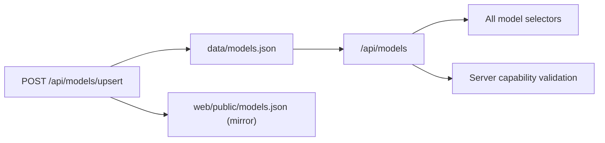

# Model Catalog (`data/models.json`)

`data/models.json` is the canonical catalog for provider/model metadata, capabilities, and pricing.
At runtime, clients must read catalog data from the API, not from static frontend files.

## Runtime Contract

Use these routes:

| Route | Description |
|---|---|
| `GET /api/models` | Full typed catalog payload (`ModelCatalogResponse`) |
| `GET /api/models/by-type/{component_type}` | Typed filtered rows (`GEN`, `EMB`, `RERANK`) |
| `GET /api/models/providers` | Provider keys |
| `GET /api/models/providers/{provider}` | Provider-scoped typed rows |
| `POST /api/models/upsert` | Typed add/update flow (`ModelCatalogUpsertRequest`) |

Notes:

- Frontend runtime selectors must call `/api/models...`.
- Do not fetch `web/public/models.json` in runtime UI code.
- `web/public/models.json` remains a mirror for compatibility and is kept in sync on upsert.

## Capability Semantics

`components` is the capability contract:

- `GEN`: generation/chat-capable
- `EMB`: embedding-capable
- `RERANK`: reranker-capable

Selectors and server config validation enforce capability compatibility. Known mismatches are rejected with `422`.

## Catalog rows are candidates, not runtime guarantees

Every catalog row carries `selection_*` metadata that separates the broad candidate catalog from what the runtime can actually select today:

| Field | Meaning |
|-------|---------|
| `selection_status` | `catalog_only` marks a row as pricing/candidate metadata only — it shows up in cost estimates and picker candidates but is not a runtime-selectable target right now |
| `selection_reason` | Why the row holds that status (for example, generation provider rows are priced candidates; runtime selection comes from authenticated LiteLLM aliases) |
| `selection_roles` | The runtime roles a row is wired for, when any |

!!! tip "Check `/api/runtime-capabilities` before promising a model"
    `data/models.json` is the broad catalog for pricing and candidates; **runtime-selectable truth** comes from the catalog's `selection_*` metadata plus `server/runtime_capabilities.py`, served as `GET /api/runtime-capabilities`. A model appearing in `/api/models` with `selection_status: "catalog_only"` does not mean ragweld can route to it today. The daily refresh adds, re-prices, and drops rows — the 2026-09-01 refresh added IBM Granite 4.2 8B, a wave of OpenAI batch-priced variants, and price updates for DeepSeek V4 Flash/Pro — so treat any specific row as volatile and read the runtime capabilities endpoint when a decision depends on what is selectable now.

!!! note "The local serving row names a lane, not a backend"
    The `ragweld-local` catalog row is titled **Ragweld local (self-hosted)** and claims no serving backend in its name or notes: which backend fronts that alias (vLLM today), whether the lane is switched on for this host (`chat.vllm.enabled`), and which model it serves are host truth, served as `generation.local_serving` on `GET /api/runtime-capabilities` — never a property of the catalog row. Operator surfaces that preselect or describe the local lane read the lane state from there plus the readiness probe, so a host that does not serve a local model never shows one as live or pre-checked (the Benchmark tab's default model selection, for example, skips it).

??? note "Where the gateway aliases live"
    Selectable model rows route through LiteLLM gateway aliases declared in `infra/litellm-config.yaml` (the gateway service on port `54000`). The alias list moves with the catalog: current config adds a wave of `openai.*.batch` aliases pointing at the `:batch` OpenRouter snapshot ids, adds `ibm-granite.granite-4.2-8b`, and drops stale entries such as `anthropic.claude-opus-4.7-fast`, `kwaipilot.kat-coder-air-v2.5`, and the retired Mistral batch aliases. Alias presence alone is not runtime truth — a row's `selection_status` metadata plus `GET /api/runtime-capabilities` decide what a picker can select today, and the alias config is versioned with the repo so changes are reviewable.

## Upsert Flow

Use `POST /api/models/upsert` to add or update entries safely:

- Request body is validated by Pydantic (`ModelCatalogUpsertRequest`).
- Writes are atomic and update both `data/models.json` and `web/public/models.json`.
- Provider `base_url` may be inferred from existing catalog entries/defaults if omitted, and remains editable in UI before submit.

## Automated Daily Refresh

`data/models.json` can be refreshed automatically every 24 hours with:

- Script: `scripts/refresh_models_catalog.py`
- Workflow: `.github/workflows/refresh-models-catalog.yml`
- Feed: `https://openrouter.ai/api/v1/models`

Behavior:

- Runs daily in GitHub Actions (UTC schedule) plus manual `workflow_dispatch`.
- Uses a single machine-readable source (OpenRouter feed) for managed providers:
  - `openai`, `anthropic`, `google`, `cohere`, `mistral`, `deepseek`, `xai`
- Normalizes text-output models from the feed. Batch-priced variants (model ids ending in `:batch`) are added as catalog-only rows carrying the batch tier pricing; other `:` snapshot/alias variants are ignored to reduce churn.
- Updates existing managed `GEN` rows in place (pricing, context, base URL, components, unit).
- Removes managed rows that the feed no longer lists.
- Adds newly discovered models even if pricing is unavailable:
  - Missing price rows are added with null price fields and
    `[auto-refresh] pricing_unknown=true`.
- Leaves unmanaged providers (`voyage`, `jina`, `huggingface`, `local`, `ollama`, `mlx`, etc.) untouched.
- Writes canonical + mirror catalogs atomically and byte-identically.
- No-op runs make no commit when nothing changed.

## Example

```bash
BASE=http://127.0.0.1:8012
curl -sS "$BASE/api/models/by-type/GEN" | jq '.[0]'
curl -sS "$BASE/api/models/providers" | jq .
curl -sS -X POST "$BASE/api/models/upsert" \
  -H 'content-type: application/json' \
  -d '{
    "provider":"openai",
    "family":"gen",
    "model":"gpt-4.1-mini",
    "unit":"1k_tokens",
    "input_per_1k":0.0003,
    "output_per_1k":0.0012
  }' | jq .
```


