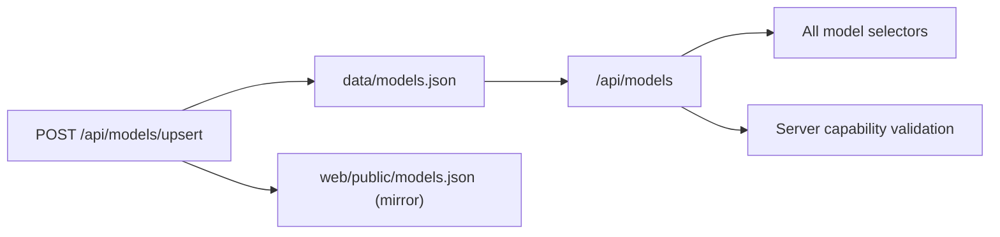

# Model Catalog (`data/models.json`)

`data/models.json` is the canonical catalog for provider/model metadata, capabilities, and pricing.
At runtime, clients must read catalog data from the API, not from static frontend files.

## Runtime Contract

Use these routes:

| Route | Description |
|---|---|
| `GET /api/models` | Full typed catalog payload (`ModelCatalogResponse`) |
| `GET /api/models/by-type/{component_type}` | Typed filtered rows (`GEN`, `EMB`, `RERANK`) |
| `GET /api/models/providers` | Provider keys |
| `GET /api/models/providers/{provider}` | Provider-scoped typed rows |
| `POST /api/models/upsert` | Typed add/update flow (`ModelCatalogUpsertRequest`) |

Notes:

- Frontend runtime selectors must call `/api/models...`.
- Do not fetch `web/public/models.json` in runtime UI code.
- `web/public/models.json` remains a mirror for compatibility and is kept in sync on upsert.

## Capability Semantics

`components` is the capability contract:

- `GEN`: generation/chat-capable
- `EMB`: embedding-capable
- `RERANK`: reranker-capable

Selectors and server config validation enforce capability compatibility. Known mismatches are rejected with `422`.

## Upsert Flow

Use `POST /api/models/upsert` to add or update entries safely:

- Request body is validated by Pydantic (`ModelCatalogUpsertRequest`).
- Writes are atomic and update both `data/models.json` and `web/public/models.json`.
- Provider `base_url` may be inferred from existing catalog entries/defaults if omitted, and remains editable in UI before submit.

## Example

```bash
BASE=http://127.0.0.1:8012
curl -sS "$BASE/api/models/by-type/GEN" | jq '.[0]'
curl -sS "$BASE/api/models/providers" | jq .
curl -sS -X POST "$BASE/api/models/upsert" \
  -H 'content-type: application/json' \
  -d '{
    "provider":"openai",
    "family":"gen",
    "model":"gpt-4.1-mini",
    "unit":"1k_tokens",
    "input_per_1k":0.0003,
    "output_per_1k":0.0012
  }' | jq .
```


