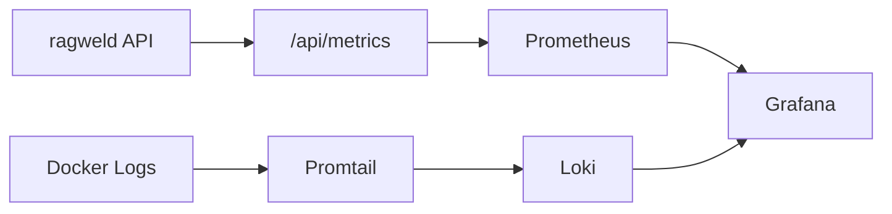

# Observability (Prometheus, Grafana, Loki)

<div class="grid chunk_summaries" markdown>

-   :material-chart-line:{ .lg .middle } **Metrics**

    ---

    `/metrics` endpoint + Postgres exporter.

-   :material-monitor:{ .lg .middle } **Dashboards**

    ---

    Grafana embedded with default UID `tribrid-overview`.

-   :material-clipboard-text-clock:{ .lg .middle } **Logs**

    ---

    Loki + Promtail for container logs and app logs.

</div>

[Get started](index.md){ .md-button .md-button--primary }
[Configuration](configuration.md){ .md-button }
[API](api.md){ .md-button }

!!! tip "Sampling"
    Adjust `tracing.trace_sampling_rate` to manage cost and overhead. Use 1.0 in dev and 0.1–0.2 in production.

!!! note "Anonymous Grafana"
    The compose stack enables anonymous access for embeds. Harden in production.

!!! warning "Timestamps"
    `DOCKER_LOGS_TIMESTAMPS=1` helps correlate events across services.

## Components

| Service | Port | Notes |
|---------|------|-------|
| Prometheus | 59090 | Scrapes `/api/metrics` and the Postgres exporter |
| Grafana | 3301 | Embedded dashboard in UI |
| Loki | 53100 | Log aggregation |
| Promtail | — | Ships container/host logs |



=== "Python"
```python
import httpx
print(httpx.get("http://127.0.0.1:8012/api/metrics").text.splitlines()[:5])
```

=== "curl"
```bash
curl -sS http://127.0.0.1:8012/api/metrics | head -n 20
```

=== "TypeScript"
```typescript
const m = await (await fetch('/api/metrics')).text();
console.log(m.split('\n').slice(0,5));
```

## Cost & Capacity dashboard

The provisioned **Cost & Capacity** dashboard (`ragweld-cost-capacity`, `infra/grafana/provisioning/dashboards/cost-capacity.json`) is the gateway-spend surface, and its current revision makes the time range honest:

- **The default range is today, midnight UTC to now** — calendar-day totals, not a rolling 24 hours — with the dashboard timezone pinned to UTC. **Today (UTC)** and **Last 7 days** header links restore the canonical ranges after you explore history; custom and absolute selections keep their actual boundaries, so a panel title never claims "today" over a historical range.
- **Spend and token totals are native and reset-aware.** `sum(increase(litellm_spend_metric_total[...]))` and `sum(increase(litellm_total_tokens_metric_total[...]))` run over the selected range and a rolling 7 days ending at the selected end. Prometheus `increase` handles counter resets and extrapolates between scrapes, so these are approximate gateway totals, not a billing ledger. A missing series renders **No data**, never a fake zero; a recorded zero stays zero. Token totals count input + output once — cached and reasoning tokens are subsets, never added again.
- **Breakdowns are by model and lane.** Two bar-gauge panels split selected-range spend and tokens by `model` × `metadata_lane`, with pre-lane history and lane-less callers visible as **unattributed** rather than filtered away. No run/corpus Prometheus labels are invented; exact per-run reconciliation stays in the [run accounting](operations/native_costs.md) API and UI.
- **An export-error panel counts real log lines.** A Loki panel counts terminal native OTLP "Failed to export ... batch" log lines from the LiteLLM service over the range. It is a batch diagnostic, not proof of Langfuse delivery: zero only means scoped gateway logs existed in the same range with no terminal errors; no scoped logs renders **Unavailable**, not zero. Recovered retries are excluded, and provider request failures are not callback-delivery failures.

Direct provider calls (including embeddings) are outside every panel here; the dashboard's operator-notes panel says so, and per-request reported cost stays in the run trace with estimates identified separately.

## "Latest" ML-quality gauges are read from persisted runs

The four "Latest" series behind the **Eval / Benchmark / Prompt Regressions** dashboard — `tribrid_eval_last_top1_accuracy`, `tribrid_eval_last_topk_accuracy`, `tribrid_promptfoo_last_pass_ratio`, and `tribrid_benchmark_last_avg_latency_ms` — are scraped from the **most recently persisted** eval / Promptfoo / benchmark run at scrape time, not set from whichever request happened to complete a run inside the current process. What that means operationally:

- **Restarting the API cannot zero them.** A freshly started process reports the persisted truth immediately; there is no window where the dashboard shows a green 0% beside runs that are on disk.
- **No persisted run means no series at all.** An absent series is the only honest encoding of "no data" Prometheus has, so the Grafana panels render "No data" instead of 0. A genuine 0% run is still exported as 0 — and the dashboard's thresholds render it red, never green.
- **The benchmark directory follows config.** The reader resolves `chat.benchmark.results_path`, the same field the benchmark writer uses, so moving where benchmark runs land does not strand the latency gauge on a permanent "No data".

!!! note "Probe hysteresis on the observability status"
    Component readiness behind `/api/observability/status` and the in-app Operator Deck debounces flapping probes: an incident needs `tracing.probe_failure_threshold` (default `3`, env `PROBE_FAILURE_THRESHOLD`) **consecutive** failed probes, each component shows its last-8 probe history, and surfaces the API cannot probe at all (an auth-protected ingress that redirects off-host) never count as failures. See [Tracing](operations/tracing.md).

!!! note "The Langfuse component reports UI health only"
    In `otel_langfuse` mode the Operator Deck's Langfuse card is now the **Langfuse UI** component: it probes the Langfuse web endpoint for reachability and states plainly that native callback activation and generation delivery are unverified by this probe — generation export to Langfuse is owned by the gateway's native OTel callback, which a web-UI health check cannot see. The old card required this process's `LANGFUSE_PUBLIC_KEY`/`LANGFUSE_SECRET_KEY` and read "not configured" without them, which described the wrong surface. See [Tracing](operations/tracing.md).

??? info "Dashboards"
    Mount your own Grafana provisioning under `infra/grafana/provisioning` to add/override dashboards and datasources.
