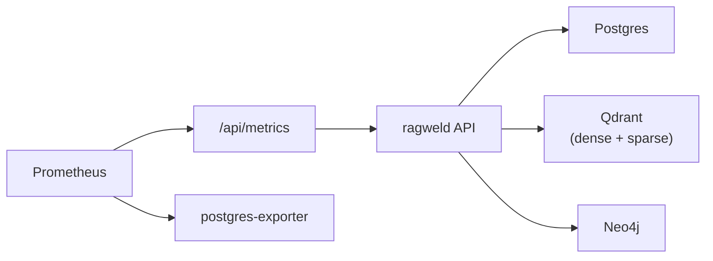

# Operations, Health, and Metrics

<div class="grid chunk_summaries" markdown>

-   :material-heart-pulse:{ .lg .middle } **Health**

    ---

    `/health` and `/ready` for liveness and readiness.

-   :material-chart-areaspline:{ .lg .middle } **Metrics**

    ---

    `/metrics` for Prometheus. Plus Postgres exporter for DB metrics.

-   :material-docker:{ .lg .middle } **Runtime Control**

    ---

    Inspect and restart the ragweld Compose services via project-scoped Docker endpoints.

</div>

[Get started](index.md){ .md-button .md-button--primary }
[Configuration](configuration.md){ .md-button }
[API](api.md){ .md-button }

!!! tip "Readiness Gate"
    Gate traffic on `/api/ready`. It verifies DB connectivity before admitting load.

!!! note "The top-bar Health pill reads these same endpoints"
    In the workbench, the top-bar **Health** control polls `/api/health` every 30 seconds (while the tab is visible) and, on click, opens a popover backed by `GET /api/ready`'s per-dependency breakdown — one row per required dependency with a ready/unavailable marker, a short detail line, and an operator hint for anything that is down. A `503` is treated as a status, not an error: the payload shape is the same, so the popover can always name the dependency that is not ready. See [Health, Readiness, and Metrics API](api_health.md).

!!! note "Container Logs"
    Use `/api/docker/services/{service}/logs` for ad-hoc log pulls (ragweld services only), or rely on Loki for aggregation.

!!! warning "Restarts"
    Prefer coordinated restarts via the API (or compose) to avoid dropping in-flight requests.

## Endpoints

| Endpoint | Description |
|----------|-------------|
| `/api/docker/status` | Docker daemon status + managed service count |
| `/api/docker/services` | Allowlisted ragweld Compose services |
| `/api/docker/services/{service}/{action}` | Start/stop/restart one managed service |
| `/api/docker/services/{service}/logs` | Tail logs for one managed service |
| `/api/dev/status` | Host process status, including how the frontend is served (`frontend_mode`) |
| `/api/observability/status` | Observability mode, component readiness (probe history + hysteresis), incidents |
| `/api/observability/alerts` | What Alertmanager currently holds (typed 502/503 when it cannot be read) |
| `/api/observability/langfuse/trace/{trace_id}` | Whether Langfuse holds a trace, and its deep link when it does |

The Docker surface is project-scoped: it only ever exposes the allowlisted ragweld Compose services, never host-wide arbitrary container control.



=== "Python"
```python
import httpx
print(httpx.get("http://127.0.0.1:8012/api/docker/status").json())
```

=== "curl"
```bash
curl -sS http://127.0.0.1:8012/api/docker/status | jq .
```

=== "TypeScript"
```typescript
await fetch('/api/docker/status').then(r => r.json())
```

- [x] Gate traffic with readiness
- [x] Alert on 5xx and slow search
- [x] Monitor DB connection pool saturation and timeouts
- [ ] Define SLOs for p95 latency per endpoint

??? note "Grafana"
    Default dashboard UID `ragweld-oncall-overview` is embedded in the UI. Customize datasource/dashboards via mounted provisioning files.
