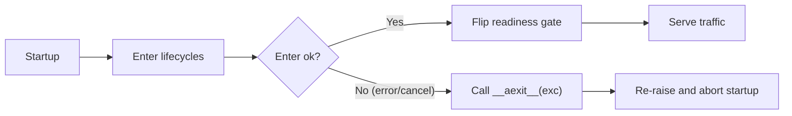

# Startup cancellation and unwind

<div class="grid chunk_summaries" markdown>

-   :material-close-circle:{ .lg .middle } **Cancellation-aware startup**

    ---

    ragweld unwinds partially-entered lifecycle components when startup is cancelled (for example, reloads or Ctrl+C).

-   :material-backup-restore:{ .lg .middle } **Best-effort unwind**

    ---

    On any enter failure, ragweld calls `__aexit__(exc_type, exc, tb)` so your components can clean up.

-   :material-shield-lock:{ .lg .middle } **Operator-safe termination**

    ---

    SIGTERM/SIGINT and uvicorn reloads won’t leak resources created during early startup.

-   :material-rocket-launch:{ .lg .middle } **API-first readiness**

    ---

    Until startup completes, `/api/ready` remains “not ready.” On cancellation, readiness never flips to ready.

</div>

[Startup & lifecycle](lifecycle.md){ .md-button .md-button--primary }
[Health & readiness API](../api_health.md){ .md-button }
[Testing](../testing.md){ .md-button }
[Configuration](../configuration.md){ .md-button }

!!! tip "Who should read this"
    - Operators: understand what happens when you stop/reload the service.
    - Engineers: implement lifecycle components that clean up correctly on cancellation.

## What changed and why it matters

ragweld’s startup manager now treats cancellation as a first-class failure mode. Internally, `_enter_lifecycle_cm` (in `server/main.py`) was updated to catch `BaseException`, not just `Exception`. That matters because:

- `asyncio.CancelledError` and `KeyboardInterrupt` inherit from `BaseException` (not `Exception`).
- Without this, if startup is cancelled during `__aenter__`, your `__aexit__` would never run.
- With the change, ragweld always calls `__aexit__` so partially-initialized resources get cleaned up.

```python
# server/main.py (conceptual excerpt)
async def _enter_lifecycle_cm(cm):
    try:
        await cm.__aenter__()
    except BaseException as e:  # (1)!
        try:
            await cm.__aexit__(type(e), e, e.__traceback__)  # (2)!
        finally:
            raise  # (3)!
```

1. Catch `BaseException` so `CancelledError` and `KeyboardInterrupt` are included.
2. Unwind via `__aexit__` with the original exception details.
3. Re-raise; cancellation/failure still propagates and startup aborts.

!!! note "Readiness stays false on cancellation"
    ragweld does not report ready until all lifecycle components have entered successfully. If a cancellation or error fires during entry, `/api/ready` will remain “not ready” and the process typically exits (or is restarted by your supervisor).

## Operator runbook: safe cancels and reloads

- Stopping the service (SIGTERM/SIGINT) during startup:
  - Resources created before the cancel (files, sockets, DB pools) are cleaned by `__aexit__`.
  - The process exits cleanly; no need to run manual cleanup scripts.
- Dev reloads (uvicorn `--reload`) mid-startup:
  - The in-flight startup is cancelled.
  - Components that began `__aenter__` are unwound.
  - The new worker then starts fresh.
- Health endpoints:
  - Liveness is typically OK unless the process has crashed.
  - Readiness stays false until startup completes.
  - Check directly: `curl -fsS http://127.0.0.1:8012/api/ready || echo "not ready"`

!!! warning "If you see resource contention on a restart"
    Rarely, external systems (DBs, queues) can hold onto ephemeral state briefly after a cancellation. Prefer short retry loops with backoff in your `__aenter__`, and ensure your `__aexit__` is idempotent so a second call is harmless.

## How to write a robust lifecycle component

Definition list

`__aenter__`
:   Do only what you can cleanly undo. If you create files, sockets, or connections, keep references so `__aexit__` can close them. Fail fast on missing secrets or misconfiguration.

`__aexit__(exc_type, exc, tb)`
:   Always attempt cleanup, whether `exc_type` is set or not. Return `False` so exceptions (including cancellations) propagate. Never raise from `__aexit__` unless absolutely necessary.

`Idempotency`
:   Assume `__aexit__` may run after partial `__aenter__`. Guard against `None`/uninitialized members. Multiple invocations should be safe.

`Logging`
:   Log structured, single-line events for create/close with enough context to correlate in traces.

Here’s a minimal pattern you can drop into your component:

```python
import asyncio
from typing import Optional

class MyLifecycle:
    def __init__(self) -> None:
        self._pool: Optional[object] = None
        self._tmp_path: Optional[str] = None

    async def __aenter__(self) -> "MyLifecycle":
        # Allocate resources
        self._pool = await self._open_pool()                 # (1)!
        self._tmp_path = await self._create_tmp_dir()        # (2)!

        # Simulate a cancel point (e.g., long I/O)
        await asyncio.sleep(0)                               # (3)!
        return self

    async def __aexit__(self, exc_type, exc, tb) -> bool:
        # Unwind in reverse order; be idempotent and tolerate partial entry
        try:
            if self._tmp_path:
                await self._remove_tmp_dir(self._tmp_path)   # (4)!
                self._tmp_path = None
        finally:
            if self._pool:
                await self._close_pool(self._pool)           # (5)!
                self._pool = None
        return False                                         # (6)!
```

1. Create a connection pool (or similar external handle).
2. Create a temporary directory (or another local resource).
3. Any `await` point can be cancelled; be prepared to unwind.
4. Clean up local files/dirs first.
5. Then close external handles.
6. Return `False` so exceptions (including `CancelledError`) propagate.

!!! tip "If you’re not sure, do this"
    - Keep references to every resource created in `__aenter__`.
    - Unwind in reverse order in `__aexit__`.
    - Never swallow `CancelledError`: return `False` and let it bubble.

## How it surfaces in tests

ragweld includes unit tests to exercise cancellation during lifecycle entry (see `tests/unit/test_main_lifecycle.py`). You can use a similar pattern in your own tests:

```python
import asyncio
import pytest

from server.main import _enter_lifecycle_cm

class _CancelledLifecycleCM:
    def __init__(self) -> None:
        self.entered = False
        self.exited = False
        self.exit_exc_type = None

    async def __aenter__(self) -> None:
        self.entered = True
        raise asyncio.CancelledError("startup cancelled")     # (1)!

    async def __aexit__(self, exc_type, exc, tb) -> bool:
        self.exited = True
        self.exit_exc_type = exc_type                         # (2)!
        return False                                          # (3)!

@pytest.mark.asyncio
async def test_enter_unwinds_on_cancel() -> None:
    cm = _CancelledLifecycleCM()
    with pytest.raises(asyncio.CancelledError, match="startup cancelled"):  # (4)!
        await _enter_lifecycle_cm(cm)
    assert cm.entered is True
    assert cm.exited is True
    assert cm.exit_exc_type is asyncio.CancelledError
```

1. Simulate cancellation during `__aenter__`.
2. Verify `__aexit__` receives the exception type.
3. Returning `False` ensures the cancellation propagates.
4. The calling code observes the original `CancelledError`.

!!! tip "Dev workflow sanity check"
    - Start the backend, then immediately stop it (Ctrl+C) during “Starting…” logs.
    - Expect no leaked temp dirs, sockets, or DB sessions.
    - If you see leaks, verify your lifecycles’ `__aexit__` paths.

## Health, readiness, and what clients should expect

- Readiness remains “not ready” until all components have fully entered.
- On cancellation during startup, your supervisor (systemd, Docker, k8s) restarts the process or exits; clients should continue to poll readiness.
- Useful endpoints:
  - `GET http://127.0.0.1:8012/api/health` — overall status
  - `GET http://127.0.0.1:8012/api/ready` — readiness gate
  - `GET http://127.0.0.1:8012/api/metrics` — Prometheus scrape (when enabled)

See: [Health & readiness API](../api_health.md).

## FAQ

??? question "Why catch BaseException instead of Exception?"
    `asyncio.CancelledError` and `KeyboardInterrupt` inherit from `BaseException`. If we caught only `Exception`, `__aexit__` wouldn’t be called on cancellation or Ctrl+C, leaving resources partially allocated. Catching `BaseException` ensures unwind logic always runs, then we re-raise.

??? question "Does this swallow my errors?"
    No. After calling `__aexit__`, ragweld re-raises the original exception. Your process manager still observes the failure/cancellation, and startup aborts as expected.

??? question "What about shutdown?"
    This page focuses on cancellation during startup (inside `__aenter__`). Normal shutdown uses the same principle: run cleanup deterministically, make it idempotent, and allow exceptions to propagate after best-effort unwind.

## Architecture mental model



!!! warning "Common failure modes"
