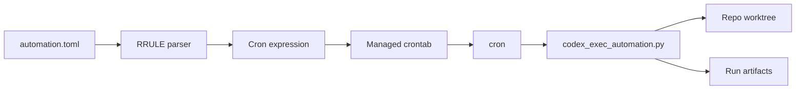

# Codex exec automation (cron lanes)

<div class="grid chunk_summaries" markdown>

-   :material-calendar-clock:{ .lg .middle } **RRULE → cron**

    ---

    Lanes are scheduled from `automation.toml` files using iCalendar-like RRULEs. The installer converts them to crontab expressions.

-   :material-playlist-edit:{ .lg .middle } **Managed crontab**

    ---

    Only ragweld’s managed entries are added/updated. Your other crontab entries are preserved.

-   :material-content-save-alert:{ .lg .middle } **Dry-run safety**

    ---

    `codex_exec_automation.py --dry-run` prints JSON, creates nothing, and performs read-only repo/worktree validation before you schedule a lane.

-   :material-source-branch:{ .lg .middle } **Worktree hygiene**

    ---

    If a previous exec directory exists but is not a real git worktree, it’s renamed to a timestamped `.stale-*` backup automatically.

-   :material-file-cog:{ .lg .middle } **Quoting and paths**

    ---

    Python, script, and log paths are shell-quoted. Cron sets PATH and HOME explicitly for predictable execution.

-   :material-file-document-multiple:{ .lg .middle } **Per-run artifacts**

    ---

    Each run writes to `output/automation/codex-exec/<automation_id>/<timestamp_utc>` inside your repo root.

</div>

[Operations & metrics](../operations.md){ .md-button .md-button--primary }
[Tracing](tracing.md){ .md-button }
[Troubleshooting](../troubleshooting.md){ .md-button }

!!! note "Scope and naming"
    This page documents the operations scripts that ship in the repo:
    
    - `scripts/install_codex_exec_crons.py` — installs or updates managed crontab entries
    - `scripts/codex_exec_automation.py` — runs a single automation lane (with `--dry-run` for safety)
    
    These scripts coordinate external “Codex exec” automations that generate artifacts and telemetry alongside ragweld. They are optional and decoupled from the core API.

## What this solves

Long-running or periodic operator tasks (stability loops, UI proofs, eval data refresh) need predictable, isolated environments and durable logs. The scripts here give you:

- Declarative lane schedules in TOML, under your control
- Merged crontab installs that won’t clobber unrelated entries
- Automatic cleanup when past runs left non-worktree directories behind
- Dry-run validation so you can audit what would happen before it does, without creating worktrees or run artifacts



## Where the files live

- Automation manifests (inputs):
  - `~/.codex/automations/<automation_id>/automation.toml`
- Worktrees (execution roots per lane):
  - `~/.codex/exec-worktrees/<automation_id>`
- Logs:
  - `~/.codex/log/<lane-log-name>.log`
- Run artifacts (inside your repo root):
  - `output/automation/codex-exec/<automation_id>/<timestamp_utc>/...`

!!! tip "Safe defaults"
    If you’re not sure:
    
    - Put automation TOMLs under `~/.codex/automations/<id>/automation.toml`
    - Use HOURLY RRULEs with a 1, 2, 3, 4, 6, 8, or 12 hour interval (those map cleanly to cron)
    - Validate with `--dry-run` before installing cron

## Authoring automation.toml

An automation lives at `~/.codex/automations/<automation_id>/automation.toml`. The installer only requires `rrule`, but the executor expects standard metadata for context.

Example:

```toml
version = 1
id = "ragweld-ui-proof-loop"
name = "UI Proof Loop"
prompt = "Run the UI proof sequence"
status = "PAUSED"
rrule = "FREQ=HOURLY;INTERVAL=4;BYMINUTE=20"
cwds = ["/absolute/path/to/your/ragweld/repo"]
```

Definition list of important fields:

id
: Lane identifier. Used for worktree directory names and run artifact paths.

rrule
: Schedule in iCalendar RRULE form. Supported today:
  - HOURLY with `INTERVAL` in `1, 2, 3, 4, 6, 8, 12`, plus optional `BYMINUTE` and `BYDAY`
  - WEEKLY with `BYDAY`, `BYHOUR`, and optional `BYMINUTE`
  Unsupported RRULE fields fail closed before any crontab changes are applied.

cwds
: One or more repo roots where runs occur. The executor picks a root for worktree setup and artifact placement.

prompt
: Text payload for the executor. The prompt is recorded to `prompt.txt` in the run directory on actual runs.

status
: Operator note (e.g., "PAUSED"). Not enforced by the installer; you still control what is scheduled by editing TOMLs.

### RRULE to crontab mapping

- HOURLY
  - INTERVAL=4 → `hour="*/4"`
  - BYMINUTE=20 → `minute="20"` (default `0` if omitted)
  - Optional BYDAY (e.g., `MO,WE,FR`) limits day-of-week; if omitted, runs every day
  - Intervals that do not map cleanly to cron (for example `5`, `24`, or `72`) are rejected instead of being approximated
- WEEKLY
  - BYDAY is required (e.g., `MO,WE,FR`)
  - BYHOUR and BYMINUTE set daily time

Day-of-week tokens map to crontab as:

| BYDAY | Cron day_of_week |
|-------|------------------|
| SU    | 0                |
| MO    | 1                |
| TU    | 2                |
| WE    | 3                |
| TH    | 4                |
| FR    | 5                |
| SA    | 6                |

!!! warning "Validation"
    The installer validates numeric ranges (minutes 0–59, hours 0–23), rejects unsupported RRULE fields, and refuses hourly intervals that cannot be translated faithfully to cron. Invalid RRULEs raise clear errors before any crontab changes are applied.

## Install or update managed cron entries

Managed lines are rendered from your TOMLs and merged with whatever you already have in crontab. Only entries tagged for ragweld lanes are rewritten.

=== "Preview (no write)"

```bash
python -c 'from scripts.install_codex_exec_crons import render_cron_lines; \
lines = render_cron_lines(); \
print("\n".join(lines))'
```

=== "Install (merge and write)"

```bash
python -c 'from scripts.install_codex_exec_crons import install_managed_crontab; \
install_managed_crontab()'
```

!!! note "Python interpreter used in cron"
    By default, the installer uses the current interpreter (`sys.executable`) when it renders cron commands. If you need a different interpreter:
    
    ```bash
    python -c 'from pathlib import Path; \
    from scripts.install_codex_exec_crons import render_cron_lines, merge_crontab, _load_current_crontab; \
    lines = render_cron_lines(python_bin="/usr/local/bin/python3.12"); \
    print(merge_crontab(_load_current_crontab(), lines))' | crontab -
    ```

## Validate a lane with dry-run

Before scheduling a lane, confirm paths and derived metadata look right. Dry-run creates nothing, runs read-only repo/worktree checks, and prints JSON to stdout.

```bash
python scripts/codex_exec_automation.py --dry-run ragweld-ui-proof-loop
```

Output fields (excerpt):

```json
{
  "timestamp_utc": "20260101T000000Z",
  "dry_run": true,
  "automation_id": "ragweld-ui-proof-loop",
  "repo_root": "/absolute/path/to/your/ragweld/repo",
  "worktree_root": "/Users/you/.codex/exec-worktrees/ragweld-ui-proof-loop",
  "worktree_state": "missing",
  "ready_to_execute": true,
  "events_path": ".../events.jsonl",
  "stderr_path": ".../stderr.log",
  "last_message_path": ".../last_message.txt",
  "command": ["<CODEX_EXEC_BIN>", "--jsonl", "..."]
}
```

!!! tip "What to check"
    - repo_root points at the right checkout
    - worktree_root is under `~/.codex/exec-worktrees/<id>`
    - worktree_state is `missing`, `ready`, or `stale-non-worktree`
    - ready_to_execute is `true` before you rely on the lane to run unattended
    - command shows the expected executor binary when one is available (see below)

!!! note "Missing executor binary"
    If dry-run cannot resolve a Codex binary yet, it still prints metadata so you can validate the lane safely. In that case, `codex_bin` is `null`, `ready_to_execute` is `false`, and `command` is `null`.

## Execution environment and logs

When cron runs a lane:

- Environment variables
  - PATH is set to a safe default for cron jobs on macOS and Homebrew installs
  - HOME is set to your user home so `~/.codex/**` is consistent
  - CRON_TAG carries the lane tag for downstream log/event processors
- Executor binary
  - `CODEX_EXEC_BIN` overrides the default executor resolution if set
  - If unset, the script resolves a sane default for “Codex Desktop”
- Logs
  - Combined stdout/stderr for cron jobs stream to `~/.codex/log/<lane-log-name>.log`
  - Within each run_dir, the executor writes:
    - `events.jsonl` — structured event stream
    - `stderr.log` — process stderr
    - `last_message.txt` — convenience pointer for the latest message
    - `prompt.txt` — the resolved prompt (non-dry-run only)

!!! note "Worktree hygiene: stale directories"
    If `~/.codex/exec-worktrees/<id>` exists but isn’t a real git worktree, the executor will:
    
    - Rename it to `~/.codex/exec-worktrees/<id>.stale-<timestamp>[{-N}]`
    - Re-run `git worktree prune`
    - Proceed to set up a clean worktree
    
    A message is printed to stderr so you have an audit trail.

## Common lanes (shipped metadata)

These lane IDs are recognized and get default log names and tags:

| cron tag                         | automation_id              | log file                                    |
|----------------------------------|----------------------------|---------------------------------------------|
| RAGWELD_CODEX_EXEC_STABILITY     | ragweld-stability-loop     | cron-ragweld-stability-loop.log             |
| RAGWELD_CODEX_EXEC_UI_PROOF      | ragweld-ui-proof-loop      | cron-ragweld-ui-proof-loop.log              |
| RAGWELD_CODEX_EXEC_EVAL_DATA     | ragweld-eval-data-loop     | cron-ragweld-eval-data-loop.log             |

You still control the actual schedules via each lane’s `automation.toml` RRULE.

## Step-by-step checklist

- [ ] Write or update `~/.codex/automations/<id>/automation.toml` with a valid `rrule`
- [ ] Preview the lane: `python scripts/codex_exec_automation.py --dry-run <id>`
- [ ] Preview cron lines: `python -c 'from scripts.install_codex_exec_crons import render_cron_lines; print("\n".join(render_cron_lines()))'`
- [ ] Install managed crontab: `python -c 'from scripts.install_codex_exec_crons import install_managed_crontab; install_managed_crontab()'`
- [ ] Verify with `crontab -l` and tail logs in `~/.codex/log/*.log`

## Troubleshooting

??? info "No crontab for user"
    Cron might report “no crontab for <user>”. This is normal if you’ve never installed one. The installer handles this case and creates a new crontab when writing.
