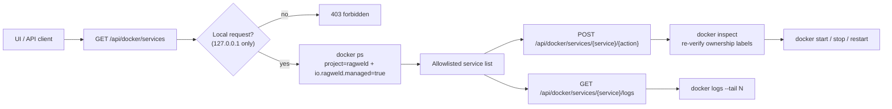

# Docker services UI

-   :material-docker:{ .lg .middle } **Project-scoped**

    ---

    Only containers carrying the exact `ragweld` Compose project label and the `io.ragweld.managed=true` ownership label are listed or controlled.

-   :material-shield-lock:{ .lg .middle } **Localhost only**

    ---

    Docker endpoints answer only to requests from 127.0.0.1 and require a local Docker context (no remote `DOCKER_HOST`).

-   :material-text-box-outline:{ .lg .middle } **Logs on demand**

    ---

    Pull recent logs for any managed service without leaving the workbench.

[Operations & metrics](../operations.md){ .md-button .md-button--primary }
[Config reference: docker](../reference/config/docker.md){ .md-button }
[Troubleshooting](../troubleshooting.md){ .md-button }

!!! tip "Where to find it"
    Open **Infrastructure → Docker** in the workbench. The same controls are available over the API under `/api/docker/services` (default dev base `http://127.0.0.1:58012/api`).

## What the surface shows

The Docker subtab lists the **allowlisted ragweld Compose services** and their live state. A service that has not been created yet shows as **Missing**; the Proxmox ingress overlay services (`caddy`, `authelia`, `cloudflared`) are labeled deployment-only.

## What it deliberately does not do

!!! warning "No host-wide container control"
    The UI never lists, starts, stops, or removes arbitrary containers on your machine. Before acting, each endpoint resolves a service to **one full container id** and re-verifies both ownership labels on that exact id. Anything that is not an allowlisted ragweld service in the `ragweld` Compose project is invisible here — use `docker` directly for everything else.

## API surface

| Route | Method | Purpose |
|-------|--------|---------|
| `/api/docker/status` | GET | Docker daemon status + managed service count |
| `/api/docker/services` | GET | Allowlisted ragweld services and their state |
| `/api/docker/services/{service}/{action}` | POST | `start`, `stop`, or `restart` one service |
| `/api/docker/services/{service}/logs` | GET | Recent logs (`?tail=` up to 1000 lines) |

Timeouts and log defaults come from the `docker.*` config section — see the [config reference](../reference/config/docker.md).

*Concept diagram (this surface only): resolve, authorize, then act — one service at a time.*

## Safe defaults and failure modes

- **403 from a remote host** — controls are localhost-only by design. SSH-tunnel or run the workbench locally.
- **"Ragweld Docker service not found"** — the service is not part of the `ragweld` Compose project, or the stack is not up yet. Run `./start.sh` first.
- **Ambiguous ownership (409)** — more than one container matched the service; resolve duplicates with `docker ps --filter "label=com.docker.compose.project=ragweld"`.
- **Docker daemon unavailable** — start your host-owned Docker runtime first (for a dedicated Colima profile: `colima start --profile ragweld ... && docker context use colima-ragweld`), then refresh.

??? tip "If you're not sure"
    Prefer `restart` over `stop`. Stopping `postgres`, `qdrant`, or `neo4j` takes the corresponding retrieval legs down with it; `/api/ready` reports which dependency is missing.
