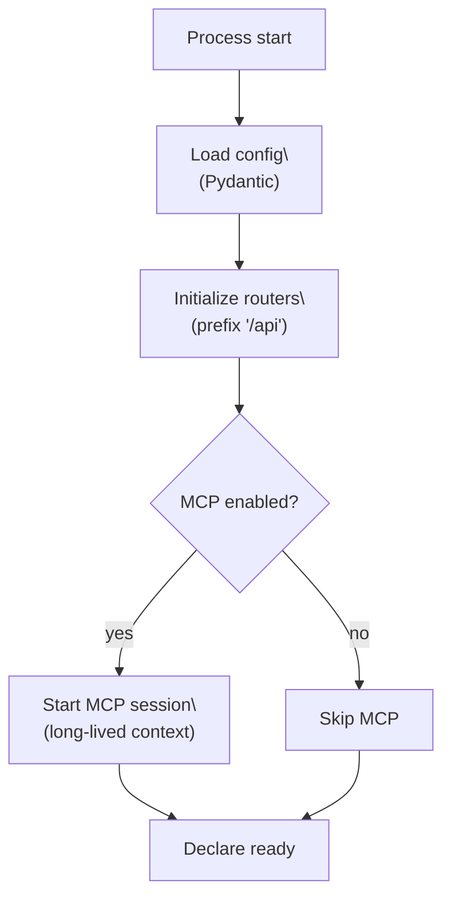

# Startup & lifecycle

<div class="grid chunk_summaries" markdown>

-   :material-rocket-launch:{ .lg .middle } **Startup gates**

    ---

    ragweld validates configuration, checks critical dependencies, and opens long‑lived sessions before reporting readiness.

-   :material-power-plug:{ .lg .middle } **MCP session manager (optional)**

    ---

    When enabled, ragweld starts a Model Context Protocol session during app startup. Failure to connect will fail startup cleanly.

-   :material-api:{ .lg .middle } **API first**

    ---

    The HTTP API is the production contract. MCP layers on top and can be disabled without affecting core API behavior.

</div>

[Configuration](../configuration.md){ .md-button .md-button--primary }
[API health](../api_health.md){ .md-button }
[Tracing & observability](../observability.md){ .md-button }
[MCP integration](../mcp.md){ .md-button }
[Config reference: mcp](../reference/config/mcp.md){ .md-button }

!!! tip "If you're not sure"
    - Keep MCP disabled until your API, database(s), and indexing are stable.
    - Turn MCP on only when you need agent tooling to talk to ragweld.

## What happens during startup

ragweld uses an application lifespan manager to bring subsystems online before advertising readiness.



Definition list (why it matters):

- Configuration load
  : All knobs flow from `server/models/tribrid_config_model.py`. If a field isn't there, it doesn't exist. Invalid config fails fast.

- API routers
  : Every HTTP endpoint is mounted under `/api`. In dev, the UI proxies to `http://127.0.0.1:8012/api`.

- MCP session (optional)
  : When `mcp.enabled` is true, ragweld opens a long‑lived MCP session at startup so agent clients can discover tools. If this fails, startup fails cleanly and resources are unwound.

## New behavior: safe unwind on MCP start failure

As of this change, ragweld defends against partial initialization when an async context fails during `__aenter__`.

- What changed
  - Startup now uses an internal helper to enter long‑lived async contexts and automatically call their `__aexit__` if `__aenter__` raises.
  - You get a clear startup error while still releasing any partially allocated resources.

- Where this lives (for engineers)
  - Helper: `_enter_lifecycle_cm` in `server/main.py`
  - Covered by unit test: `tests/unit/test_main_lifecycle.py`

!!! note "Why you care (operators)"
    A failed MCP handshake or a misconfigured external tool will no longer leave background tasks or sockets hanging. Startup fails fast, logs the cause, and exits — which is what you want under orchestration.

## Signals to watch: health vs readiness

Health and readiness endpoints are mounted under `/api`:

- Liveness: `/api/health`
- Readiness: `/api/ready`

These two signals differ:

- Liveness
  : The process is up and serving HTTP. It can still be unready.

- Readiness
  : All required subsystems (including optional-but-enabled ones like MCP) are initialized. If `mcp.enabled=true` and the MCP session can't start, readiness won't go green and startup may fail, by design.

=== "curl"

    ```bash
    curl -sS http://127.0.0.1:8012/api/health | jq .
    curl -sS http://127.0.0.1:8012/api/ready | jq .
    ```

=== "Python"

    ```python
    import requests
    base = "http://127.0.0.1:8012/api"
    print(requests.get(f"{base}/health").json())
    print(requests.get(f"{base}/ready").json())
    ```

=== "TypeScript"

    ```ts
    const base = "/api";
    const health = await fetch(`${base}/health`).then(r => r.json());
    const ready = await fetch(`${base}/ready`).then(r => r.json());
    console.log({ health, ready });
    ```

## Troubleshooting startup failures

Use this checklist to quickly isolate the cause:

- [ ] Confirm backend is reachable
      - `curl -sS http://127.0.0.1:8012/api/health`
      - If this fails: check process logs and port conflicts.
- [ ] Check readiness
      - `curl -sS http://127.0.0.1:8012/api/ready`
      - If unready: continue below.
- [ ] If MCP is enabled
      - Validate your MCP server address and credentials.
      - Check that the MCP server is running and reachable from the backend container/host.
      - Temporarily disable MCP to confirm the rest of the stack is healthy:

        !!! tip "Disable MCP (quick test)"
            - Set `mcp.enabled = false` in your configuration, or
            - Use the corresponding environment variable for your deployment target.
            - See [Config reference: mcp](../reference/config/mcp.md) for exact names and defaults.

- [ ] Datastores
      - Verify PostgreSQL connectivity and credentials.
      - If you use graph features, verify Neo4j connectivity.
- [ ] Retry startup and re-check `/api/ready`

If readiness still fails, collect:

- the last 200 backend log lines,
- your effective configuration (scrub secrets),
- results from `/api/health` and `/api/ready`,

and file an issue.

## Failure modes and what they usually mean

| Symptom | Likely cause | Where to look |
|---|---|---|
| `/api/health` OK, `/api/ready` hangs or is false | Optional subsystem is enabled but not available (commonly MCP) | Backend logs; [Config reference: mcp](../reference/config/mcp.md) |
| Process exits immediately on start | Hard config error or MCP enter failure with exit | Backend logs (startup); environment overrides |
| Readiness flaps | External dependency unstable (network, DB) | Service health dashboards; [Tracing & observability](../observability.md) |

## Design intent recap

- API first, MCP second
  - ragweld’s HTTP API is the stable, production interface.
  - MCP is an overlay that you can enable per-environment when you need agent ecosystems.
