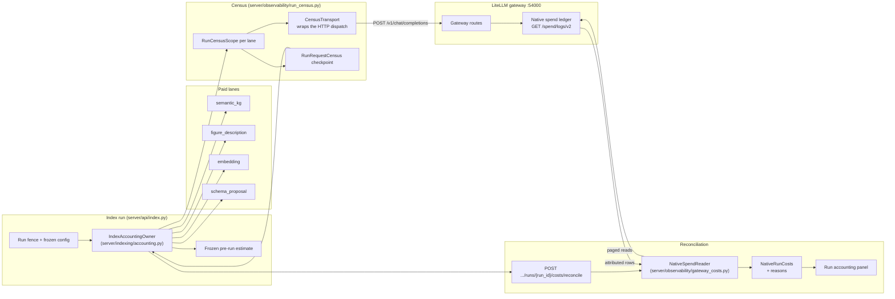

# Native run accounting

-   :material-cash-register:{ .lg .middle } **Observed, not guessed**

    ---

    Indexing and schema-proposal costs are read from the LiteLLM native spend ledger for one saved run, next to the frozen pre-run estimate — never repriced from current config.

-   :material-counter:{ .lg .middle } **Request census**

    ---

    Every paid lane (embedding, semantic KG, figure description, schema proposal) checkpoints an admitted-request census before dispatch; an interrupted or incomplete run says so instead of pretending to be finished.

-   :material-shield-check:{ .lg .middle } **Honest totals**

    ---

    A pending, missing, uncertain or unpriced request prevents a complete total instead of quietly counting as zero; the reasons are on the record.

[Indexing API](../api_indexing.md){ .md-button .md-button--primary }
[Indexing a corpus](../manual/indexing.md){ .md-button }
[Dashboard models](../api_models_extra.md){ .md-button }
[Glossary](../glossary.md){ .md-button }

!!! tip "What problem this solves"
    Earlier cost cards re-derived prices from *current* configuration: change the embedding model and yesterday's run silently changed price. Every run now freezes its own pre-run quote under the config it actually ran with, and reconciles observed gateway charges afterwards — so a cost figure is either the run's own saved evidence or an explicit "unknown".

## What gets accounted

| Lane | What it pays for | Where the charge comes from |
|------|------------------|------------------------------|
| `index_embeddings` | Dense embeddings while indexing a corpus | Native spend rows attributed to the run when the corpus's cloud embeddings route through the LiteLLM gateway; a non-gateway embedding provider is listed in the run's coverage reasons instead |
| `semantic_kg` | GraphRAG extraction calls per chunk | Native spend rows attributed to the run |
| `figure_description` | Docling vision calls for described figures | Native spend rows attributed to the run |
| `schema_proposal` | The one GraphRAG schema-proposal call | Native spend rows attributed to the saved attempt |

Each lane writes a durable **request census** (`RunRequestCensus`) into the run record (`server/indexing/run_records.py`): requests are admitted before transport dispatch, checkpoints are monotonic, and a worker that dies leaves the lane `interrupted` — never reconstructed as complete from ledger rows.

Embedding requests now carry that census identity end to end. Every cloud embedding dispatch — indexing (`index_embeddings`), the fused retrieval query embed (`retrieval_embeddings`), and the semantic-cache fingerprint embed (`cache_embeddings`) — is built through `embedding_gateway_for_config` (`server/indexing/embedding_gateway.py`), which captures the route plus a `RunIdentity` (run id, corpus id, lane) and stamps `x-litellm-session-id` / `x-litellm-spend-logs-metadata` on the native request (`native_request_headers` in `server/observability/run_census.py`). Search, answer, and chat pass their run id down as `billing_session_id`, so the retrieval and cache embeddings of one request reconcile against the same gateway session as its generation; a complete semantic-cache hit needs no provider dispatch and is recorded as zero requests, never as a request without a charge. `embedding.embedding_retry_max` stays the total attempt budget — SDK and gateway-side retries are disabled (`num_retries` / `max_retries` = 0 on every embedding route) so retry layers cannot multiply it.

## Where you see it

- **RAG → Indexing**: a **Run cost** panel under the run replay, and a **Schema proposal cost** panel beside the graph-schema card (failed proposals are saved too, so their spend is attributable).
- **Dashboard → System**: the **Recent Index Runs** table carries a compact accounting cell that refreshes with the 30-second status poll; the System index panel shows the live generation's **Live index accounting**.
- **Benchmark**: the run card shows **Answer-generation cost** — the sum of the per-model generation calls only, with shared retrieval explicitly excluded rather than silently counted as zero.

The panel leads with the number that answers "what did this run cost": a headline like `$0.01 recorded · Complete` — sub-cent spend reads `<$0.01 recorded`, so a metered zero and a rounding loss never look the same — the reconciliation state as one word (**Pending**, **Complete**, **Incomplete**, **Incomplete · Interrupted**, **Check failed**, or **Unavailable** when the run predates saved accounting), and a **Refresh** button beside it. The frozen estimate, native evidence, request census, and denominators live behind a **Details** disclosure that starts collapsed and resets on reload, so expanding it is an operator action, never a side effect of the panel refreshing.

## The states, in plain language

complete
:   Every declared lane's census is closed and quiescent, every matched request has a usable price classification, and nothing is missing. Only then is `costs.state` `complete`.

pending
:   Workers are still running or native ledger writes have not landed. Reconciliation is a pure read — refresh or wait, nothing is lost.

incomplete
:   Something prevents a total: missing native rows, uncertain request outcomes, an interrupted owner, unverified gateway retry policy, or unpriced usage. Known charges stay on the record and the reasons name the gap.

!!! note "History outlives the index"
    Deleting an index — or the corpus itself — no longer deletes its run records. A paid attempt's census, frozen quote and reconciled costs stay readable through `GET /api/index/{corpus_id}/runs/{run_id}` after the index or registration is gone; current-state surfaces read the durable manifest, so a deleted corpus answers `404` there while its cost history remains auditable.

## Endpoints

| Route | Method | Purpose |
|-------|--------|---------|
| `/api/index/{corpus_id}/runs/{run_id}` | GET | One exact index or schema-proposal run, including saved accounting |
| `/api/index/{corpus_id}/runs/{run_id}/costs/reconcile` | POST | Refresh native spend from the ledger the run recorded |
| `/api/index/{corpus_id}/runs/latest` | GET | Latest run; `?run_kind=schema_proposal` for proposals, `?finalize=false` for a pure read |

*Mechanism diagram (the run-accounting census and reconciliation loop only — the full service map is on the [generated runtime-topology page](../reference/architecture/runtime-topology.md)):*

??? info "For engineers"
    - Ownership and reconciliation: `server/indexing/accounting.py` (`IndexAccountingOwner`, `reconcile_run_costs`)
    - Durable checkpoints on the existing run summary: `server/indexing/run_records.py`
    - Native ledger reader and cost classification: `server/observability/gateway_costs.py` (`select_native_run_rows` resolves request identities before any variant is discarded; `NativeSpendReader.read_rows_for_run` is the bounded authenticated transport that reconciliation and the semantic-KG output forecast share)
    - Per-dispatch census transports: `server/observability/run_census.py`
    - Boundary models: `server/models/run_accounting.py`, regenerated into `web/src/types/generated.ts`
    - UI panels: `web/src/components/RAG/IndexRunCosts.tsx` (Indexing tab and Dashboard), `web/src/components/Benchmark/CostAttribution.tsx`
