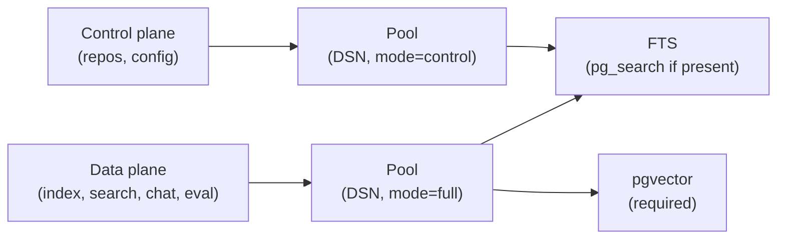

# Postgres schema modes (control vs full)

<div class="grid chunk_summaries" markdown>

-   :material-database-cog:{ .lg .middle } **Control-plane safe start**

    ---

    ragweld now brings up control-plane routes (corpora + config) without requiring `pgvector`.

-   :material-vector-polyline:{ .lg .middle } **Full data-plane features**

    ---

    Indexing, search, chat, and eval still use "full" schema mode and expect `pgvector` to be available.

-   :material-connection:{ .lg .middle } **Per-mode pooling**

    ---

    Connection pools are keyed by `(DSN, schema_mode)` to avoid cross-contamination of init paths.

-   :material-text-search:{ .lg .middle } **Optional pg_search**

    ---

    If `pg_search` (ParadeDB) is present, ragweld will use it; otherwise built-in PostgreSQL FTS is used.

</div>

[Get started](../index.md){ .md-button .md-button--primary }
[Configuration](../configuration.md){ .md-button }
[API](../api.md){ .md-button }

!!! tip "API prefix and dev URLs"
    - API is always under `/api` in dev. Examples: `http://127.0.0.1:8012/api/search`, `fetch("/api/config")`
    - Default UI: `http://127.0.0.1:5173/web`

## Why two schema modes?

Some operators deploy ragweld into environments where database extensions (like `pgvector`) are provisioned by a DBA and may not be ready on day one. To keep the platform operable:

- Control-plane routes (corpus registry and configuration) can start immediately, even if `pgvector` isn't installed yet.
- Data-plane routes (indexing, retrieval, chat, eval) require vector embeddings and therefore still initialize `pgvector`.

The change is internal to the server: code that serves these surfaces opens Postgres pools in either "control" or "full" mode. You don't have to flip a setting; it’s automatic per endpoint.



## Which endpoints use which mode?

| Surface | Examples | Schema mode |
|--------|----------|-------------|
| Corpus registry | `/api/repos/*` | control |
| Configuration (global + per-corpus) | `/api/config*` | control |
| Indexing and estimates | `/api/index*` | full |
| Search and Chat | `/api/search`, `/api/chat*` | full |
| Evaluation and training | `/api/eval*`, `/api/reranker*` | full |

!!! note "Pydantic is the law"
    DSN is read from the config field `indexing.postgres_url`. See [Config reference: indexing](../reference/config/indexing.md). If it's not in `server/models/tribrid_config_model.py`, it doesn't exist.

## Operational impact and benefits

- Control-plane uptime improves: you can register corpora and edit config before `pgvector` is installed.
- Fewer “all or nothing” startup failures: missing `pgvector` no longer blocks repos/config APIs.
- Clearer failure surfaces: data-plane requests will fail fast with a helpful message if `pgvector` is truly required and missing.

!!! tip "If you’re not sure"
    - First, verify control-plane: `curl -sS http://127.0.0.1:8012/api/ready | jq .`
    - Then, verify data-plane: run a small search against a tiny test corpus once embeddings are enabled.

## How connection pooling works now

ragweld maintains one async Postgres connection pool per unique `(DSN, schema_mode)`:

- Keyed by pair: same DSN yields two pools if both modes are used.
- Pools initialize different schemas:
  - control: creates control tables, attempts `pg_search`, skips `pgvector`.
  - full: ensures `pgvector` and all data-plane tables (chunks, embeddings, semantic cache, etc.).
- This keeps control-plane healthy even if `pgvector` is temporarily unavailable.

!!! warning "Pool lifecycle"
    Pools live for the duration of the backend process. To fully drop pools (for example after DB extension changes), restart the ragweld backend service.

## Common scenarios

### 1) pgvector is not installed yet

- Control-plane works:
  - `/api/repos/*` (corpus registry) responds
  - `/api/config*` (config get/set) responds
- Data-plane calls may fail early with messages about missing `pgvector`.

Checklist to get unblocked:

- [ ] Ask your DBA to `CREATE EXTENSION vector;` in the target database
- [ ] Confirm ragweld service user has permissions to use the extension
- [ ] Restart the ragweld backend (so the "full" pool reinitializes with `pgvector`)
- [ ] Re-run a small indexing job and verify embeddings are written

=== "curl"
```bash
# Control-plane readiness
curl -sS http://127.0.0.1:8012/api/ready | jq .

# Health details (see api_health.md for fields)
curl -sS http://127.0.0.1:8012/api/health | jq .
```

??? tip "Troubleshooting symptoms"
    - Control-plane OK, search/index fails: almost always a missing `pgvector` or mismatched embedding dims
    - Long startup delays: check DB privileges for CREATE EXTENSION; avoid cross-database DNS pointing to a node where extensions aren’t provisioned

### 2) pg_search is missing

No problem. ragweld falls back to core PostgreSQL FTS. You can add `pg_search` later for BM25 improvements. No restart is necessary unless you want the log banner to reflect the new capability immediately.

### 3) Migrating DSN or changing privileges

- Changing `indexing.postgres_url` swaps DSNs, creating fresh pools on demand.
- If you modify privileges or add extensions in-place, restart the backend to ensure the "full" pool re-runs bootstrap.

## Quick verification script

Use this as a quick smoke test after DB changes:

=== "bash"
```bash
set -euo pipefail
API="http://127.0.0.1:8012/api"

echo "== Ready =="
curl -fsS "${API}/ready" | jq .

echo "== Control-plane: config =="
curl -fsS "${API}/config" | jq . >/dev/null && echo "config OK"

echo "== Control-plane: repos list =="
curl -fsS "${API}/repos" | jq . >/dev/null && echo "repos OK"

echo "== Data-plane: index estimate (should succeed when pgvector is installed) =="
curl -fsS -X POST "${API}/index/estimate" -H "Content-Type: application/json" -d '{
  "corpus_id": "smoke",
  "repo_path": ".",
  "force_reindex": false
}' | jq .
```

!!! warning "Data-plane requires vector embeddings"
    Search quality depends on embeddings. If you change embedding dimensions or switch providers, plan a full reindex. See [Indexing a corpus](../manual/indexing.md).

## Reference and related pages

- Storage overview and components: [PostgreSQL + FTS + pgvector + Neo4j](../database.md)
- Health and readiness endpoints: [API: Health, Readiness, and Metrics](../api_health.md)
- Configuration reference for DSN: [Config: indexing](../reference/config/indexing.md)

## FAQ

What happens if I call a data-plane endpoint without pgvector installed?
:   The request will fail fast during pool/bootstrap or first query that needs vector types. Control-plane remains available so you can continue setup.

Do I need two DSNs?
:   No. A single DSN is fine. ragweld internally manages two pools against the same DSN, one per schema mode.

Can I force everything to run in control mode?
:   No. Retrieval, indexing, and chat are designed to use embeddings. Control mode is only for the control-plane surfaces.

Will this impact resource usage?
:   Slightly. Two small pools exist instead of one when both modes are active. Defaults are conservative. Scale Postgres accordingly if you have high concurrency.

## Failure modes and guardrails

!!! danger "Missing CREATE EXTENSION privileges"
    If the ragweld DB user cannot `CREATE EXTENSION vector`, the "full" pool cannot initialize. Ask your DBA to either pre-install `vector` or grant the privilege in the target database.

!!! warning "Extension on wrong database"
    Installing `vector` on `postgres` but running ragweld against a different database doesn’t help. Ensure the extension is installed in the same database named in `indexing.postgres_url`.

!!! tip "Observability"
    - Check logs at backend startup for lines indicating `pgvector`/`pg_search` status.
    - Use `/api/health` to confirm readiness and feature flags. See [API Health](../api_health.md).

## Summary

- Control-plane (repos/config) no longer depends on `pgvector`.
