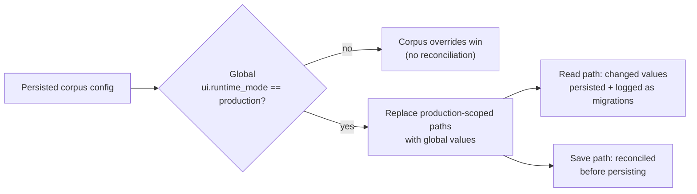
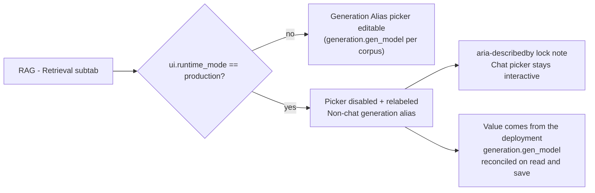
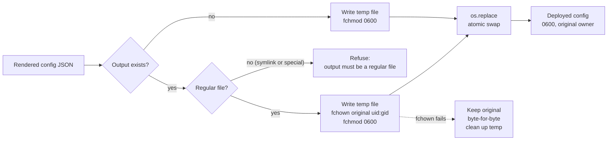

# Production scope & link refresh

-   :material-factory:{ .lg .middle } **Deployment-owned settings**

    ---

    When `ui.runtime_mode=production`, a fixed set of global settings is reconciled into every corpus-scoped config — on read and on save.

-   :material-lock-check:{ .lg .middle } **Drift cannot come back**

    ---

    Saving a stale per-corpus config in production reconciles before persisting, so a client PUT cannot reintroduce old model aliases or base URLs.

-   :material-link-variant:{ .lg .middle } **Deep links follow the deploy**

    ---

    Grafana/Tempo and Langfuse links stored in traces are re-pointed to the current deployment origins when traces are read.

[Configuration](../configuration.md){ .md-button .md-button--primary }
[Tracing](tracing.md){ .md-button }
[Operations & metrics](../operations.md){ .md-button }

!!! tip "Who should read this"
    - Operators running ragweld in `ui.runtime_mode=production` (for example, behind the Proxmox/Caddy ingress): understand which per-corpus settings are no longer corpus-editable.
    - Engineers: the reconciliation lives in `server/services/config_store.py` (`_PRODUCTION_SCOPED_GLOBAL_PATHS`, `_reconcile_production_scope`), and the link refresh in `server/services/traces.py`.

## Production-scoped config reconciliation

In development, per-corpus config wins over global config, full stop. In production, some values are deployment facts — which model alias the gateway exposes, where Grafana and Langfuse live, what the trace store path is — and a corpus must not carry its own divergent copy.

When the global config has `ui.runtime_mode=production`:

- **On read** (`ConfigStore.get(repo_id=...)`): each production-scoped path in the scoped config is replaced with the global value. If anything changed, the reconciled config is persisted and the changed paths are logged as migrations.
- **On save** (`ConfigStore.save(config, repo_id=...)`): the incoming config is reconciled against the global config *before* persistence, so a stale client snapshot cannot reintroduce drift.
- **In development**: nothing is reconciled; corpus overrides always win.

??? info "The production-scoped paths"
    Managed in `_PRODUCTION_SCOPED_GLOBAL_PATHS` in `server/services/config_store.py`:

    | Area | Paths |
    |------|-------|
    | Generation models and limits | `generation.gen_model`, `generation.enrich_model`, `generation.gen_max_tokens` |
    | Chat | `chat.max_tokens`, `chat.litellm.default_model`, `chat.multimodal.vision_model_override`, `chat.vllm.enabled`, `chat.web` |
    | Synthetic generation | `synthetic.generator.max_tokens` |
    | Embedding provider | `embedding.embedding_backend`, `embedding.embedding_type`, `embedding.embedding_model`, `embedding.embedding_dim` |
    | UI defaults | `ui.chat_default_model`, `ui.runtime_mode`, `ui.open_browser`, `ui.grafana_base_url` |
    | Observability endpoints | `tracing.langfuse_base_url`, `tracing.langfuse_public_base_url`, `tracing.faro_base_url`, `tracing.trace_store_path` |
    | Training/eval endpoints and judges | `training.ragweld_agent_flyte_admin_base_url`, `training.ragweld_agent_flyte_console_base_url`, `training.ragweld_agent_flyte_callback_base_url`, `training.ragweld_agent_mlflow_tracking_url`, `training.ragweld_agent_mlflow_console_base_url`, `evaluation.ragas_judge_model`, `evaluation.promptfoo_grader_model` |

!!! warning "Don't hand-edit these paths per corpus in production"
    The values are reconciled away on the next read. Change them in the **global** config (or the deployment environment) instead. Corpus-specific tuning that is *not* on the list — retrieval, fusion, chunking, recall gates — remains fully corpus-scoped.

!!! note "Concrete production aliases"
    The Proxmox production render (`deploy/proxmox/render_config.py`) sets `chat.litellm.default_model` and `ui.chat_default_model` to `z-ai.glm-5.3-flash`, while keeping `chat.multimodal.vision_model_override` on `openai.gpt-5.6-terra`. Two things follow from this split:

    - The **chat default** is a fast, lightweight gateway alias — it is what every conversation starts on unless a per-message override is picked.
    - The **vision override** stays pinned to a multimodal-capable alias, because image-capable requests route through `chat.multimodal.vision_model_override` rather than the chat default.

    Both are deployment-owned values on the production-scoped list above: a stale per-corpus snapshot carrying an older alias is reconciled to the current global value on the next read, and a client PUT cannot reintroduce the drift (see the save-path behavior below).

*Mechanism diagram (reconciliation only; the wider config store behavior is covered in the [config store guide](../dev/config_store.md)):*

## Retrieval surface: the non-chat generation alias is deployment-locked

The generation alias renders **once** on the **RAG → Retrieval** subtab, under **Generation → Answer Routing** (`web/src/components/RAG/RetrievalSubtab.tsx`) — the duplicate picker that used to sit in Universal Controls was removed. In production mode that single picker no longer treats the alias as a per-corpus knob: it is read-only, relabeled, and explained in place:

| What you see | What it means |
|---|---|
| Label reads **Non-chat generation alias** (instead of **Generation Alias**) | This alias feeds the non-chat answer pipeline (`/api/answer`, eval analysis, synthetic generation) — not Chat. |
| The model picker is disabled | The value is deployment-owned (`generation.gen_model` is on the production-scoped list above), so the UI cannot edit it per corpus. |
| Lock note under the picker | "Chat uses its own model picker. This non-chat answer pipeline is locked by the production deployment." — Chat routing follows `chat.litellm.default_model` / `ui.chat_default_model` through the Chat model picker, which stays interactive. |

The lock is exposed accessibly: the `select` carries `aria-describedby` pointing at the lock note, so screen readers announce why the control is disabled. Behavior is covered by the `web/tests/e2e/gateway/production_generation_alias.spec.ts` e2e test.

*Mechanism diagram (this UI lock only — the wider reconciliation flow is the diagram above):*

!!! tip "If you need a different non-chat answer model in production"
    Change `generation.gen_model` in the **global** config (or the deployment render), not in the corpus UI. The retrieval subtab picks up the reconciled value on the next read — see [Configuration](../configuration.md) for the read/patch workflow.

!!! note "Development mode is unchanged"
    When `ui.runtime_mode=development`, the picker is labeled **Generation Alias** and remains fully editable per corpus. Only production mode locks it.

## Renderer output safety (`deploy/proxmox/render_config.py`)

The Proxmox production render writes the validated config to disk atomically, and the write path is deliberately defensive. If you run the renderer from cron, systemd units, or a different user than whoever owns the deployed config, these rules are what protect you:

Regular file required
:   If the output path already exists, it must be a regular file. Symlinks — including a symlink pointing at an unrelated file elsewhere on disk — are refused with `output must be a regular file when it already exists` before anything is written, so a render can never silently overwrite a file it was not pointed at.

Ownership preserved
:   When the renderer replaces an existing output, the new file inherits the old file's `uid` and `gid`, and is always written with mode `0600` before it is swapped in via `os.replace`. A config rendered as root keeps the service account's ownership of the deployed file.

Original kept on failure
:   If restoring ownership fails (for example, a non-root renderer replacing a file it does not own), the render fails, the original file is left byte-for-byte intact, and the temporary file is cleaned up. A failed render never leaves you with a half-owned or mode-flipped production config.

!!! tip "If you're not sure"
    Run the renderer as the same user that owns the deployed config, or expect to re-run it with sufficient privileges. If you see `output must be a regular file`, check for symlinks at the output path (`ls -la`) rather than forcing the write — the renderer refuses them on purpose.

Unit coverage for these behaviors lives in `tests/unit/test_proxmox_deployment_contract.py` (ownership preservation, ownership-failure rollback, and symlink rejection).

### The public origin, spelled once (Faro and MCP)

`render_config.py` derives every browser-facing endpoint that must agree with the deployment's origin from one constant, `PRODUCTION_PUBLIC_ORIGIN` (`https://ragweld.dtmont.com`):

- `PRODUCTION_FARO_URL` is `{origin}/faro/collect` instead of repeating the host in a second constant.
- `mcp.public_base_url` is the origin itself — not origin + `/mcp`, because the server appends `mcp.mount_path` and a base that already ends in the mount path would advertise `/mcp/mcp/`.
- `ragweld.dtmont.com` is appended to `mcp.allowed_hosts` (loopback entries kept) and `https://ragweld.dtmont.com` to `mcp.allowed_origins`; without the host entry the transport answers `421` to clients using the advertised URL.
- The Caddy site for the advertised origin routes `/mcp*` to the API (inside forward auth); the secondary `me.ragweld.com` host deliberately does not, because that host is not in `mcp.allowed_hosts` and the route could not work there.

Both the rendered config and the Caddy path set are pinned by `tests/unit/test_proxmox_deployment_contract.py`, so opening or moving a public MCP route is a visible, reviewed edit.

## External link origin refresh

Traces persist across deployments, but the dashboards they deep-link to move. `TraceStore` keeps a mapping from link kind to the current deployment origin and rewrites matching links whenever traces are read:

| Link kind | Origin taken from |
|-----------|-------------------|
| `grafana` | `ui.grafana_base_url` |
| `tempo` | `ui.grafana_base_url` (Tempo traces open in Grafana Explore) |
| `langfuse` | `tracing.langfuse_public_base_url` |

Behavior:

- Applied when the trace store initializes (including when traces are reloaded from the persisted store) and on every latest-trace lookup.
- Only the origin (scheme + host) is rewritten; path, query, and fragment are preserved.
- Links of kind `custom` are never rewritten.
- An empty base URL means "no rewrite" for that kind — the component reports as unconfigured rather than guessing.

!!! tip "If a deep link lands on the wrong host"
    Update `ui.grafana_base_url` or `tracing.langfuse_public_base_url` in the global config. Old traces pick up the new origin on the next read — no trace-store rebuild required.

## Operator checklist

- [ ] Set `ui.runtime_mode=production` in the **global** config before creating corpora.
- [ ] After changing a production-scoped value (for example, the model alias), confirm per-corpus configs picked it up: `GET /api/config` scoped per corpus, or open the corpus's Admin panel.
- [ ] Verify Grafana/Langfuse deep links from an old trace open the current deployment.
- [ ] Keep corpus-scoped tuning off the production-scoped list so operators retain per-corpus control where it matters.
