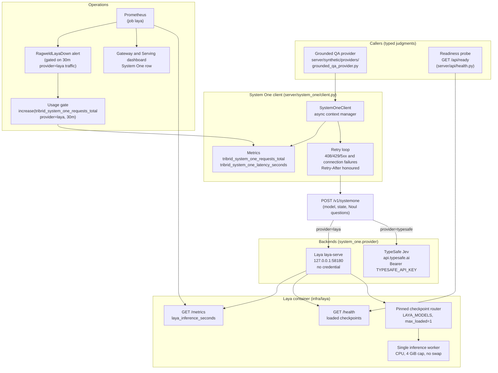

# System One decisions (TypeSafe Jev and Laya)

-   :material-fact-check:{ .lg .middle } **Typed judgments**

    ---

    ragweld asks typed yes/no **Noul** questions and reads back a probability of yes (0.0–1.0) for each — no free-form LLM verdict to parse, no judge prompt to maintain.

-   :material-swap-horizontal:{ .lg .middle } **Two backends, one contract**

    ---

    `system_one.provider` picks TypeSafe's hosted Jev or a self-hosted Laya `laya-serve`. Both speak the same `POST /v1/systemone` request and answer shapes.

-   :material-shield-lock:{ .lg .middle } **Fail closed**

    ---

    A backend that cannot answer fails the call after retries. There is no silent switch to the other provider and no default answer.

-   :material-memory:{ .lg .middle } **Pinned offline Laya**

    ---

    The Compose `laya` service runs one pinned checkpoint on CPU under a 4 GiB no-swap cap, loopback-only — and never gates platform boot.

[Synthetic Data Lab](../guides/synthetic_lab.md){ .md-button }
[Config reference: system_one](../reference/config/system_one.md){ .md-button }
[Configuration](../configuration.md){ .md-button }

System One is ragweld's judgment seam. Instead of asking a generation model to grade free-form output, ragweld sends a **state** (the thing being judged) plus a set of typed **Noul** questions to `POST /v1/systemone`, and each answer comes back as the probability of yes. The request and answer shapes are validated by the provider boundary models in `server/models/system_one.py` — no frontend consumes them, so only `SystemOneConfig` (composed into `TriBridConfig`) reaches the generated TypeScript types.

Today one product surface uses it: the [Synthetic Data Lab](../guides/synthetic_lab.md) judges every grounded eval row with three Nouls — *would a real reader ask this question*, *does the located evidence support the expected answer*, and *does the question copy distinctive cue words from the quote* (reported, not gated). The reranker A/B harness (`scripts/rerank_ab_harness.py`) reuses the same contract for pointwise candidate scoring.

*System One call path (this subsystem only — the full service map is on the [generated runtime-topology page](../reference/architecture/runtime-topology.md)):*

## Choosing a provider

| `system_one.provider` | Endpoint | Credential | Notes |
|---|---|---|---|
| `typesafe` (default) | `https://api.typesafe.ai/v1/systemone` | `TYPESAFE_API_KEY` (app environment) | Hosted Jev. Measured ~0.1–0.3 s per short call; 1,200 requests/minute per key. |
| `laya` | `http://127.0.0.1:58180/v1/systemone` | none | Self-hosted laya-serve beside the platform. Free, offline, CPU-bound — effectively one request at a time. |

- **No automatic switching.** A backend that cannot answer (missing credential, unreachable, out of budget, invalid response) raises a typed `SystemOneError` and the caller fails. Judgments degrade loudly or not at all.
- **Model names differ.** TypeSafe needs a Jev model id (`jev-latest`). laya-serve honours a checkpoint name (`english`, `multilingual`, `typed-decisions`) and routes any other value by the language of the state — unless the deployment pins one checkpoint, where other names are refused with a `422`.
- **Retries** are bounded by `system_one.timeout_s` as a whole budget: 408/429/5xx (529 Overloaded included) and connection failures retry with exponential backoff that honours `Retry-After`/`retry-after-ms` and never sleeps past the budget.

## The self-hosted Laya lane

The `laya` Compose service (built from `infra/laya`, image `ragweld-laya:0.3.11`, `pull_policy: never` — build it once with `docker compose build laya`) keeps judgments available without a hosted key:

- **Loopback only** on `127.0.0.1:58180` (override the published port with `LAYA_HTTP_PORT`).
- **One pinned checkpoint.** `LAYA_MODELS` (default `english`; the Compose env override is `LAYA_CHECKPOINT`) names the only checkpoint that can ever load. Automatic language routing is pinned to it, and an explicit request for another checkpoint is refused — the container's memory cap cannot hold a second checkpoint, which upstream's build-before-evict routing would need.
- **Hard resources.** A 4 GiB memory cap with **no swap** (`memswap_limit` equals `mem_limit`) and 4 CPUs with torch threads matched, so inference pressure never lands on the host's stores.
- **At most 8 questions per request** (a larger batch answers `413`). A 64-question batch was measured OOM-killed under the cap; ragweld's judge sends 1–3 per call.
- Weights download once (~0.8 GB) into the `laya_hf_cache` volume. The health check only answers once the checkpoint is resident, with a 5-minute first-start window.
- **Never gates boot.** The deployment starts Laya best-effort *after* the platform (`deploy/proxmox/start-runtime.sh`); a failed Laya warns and the platform boots without it.

## Readiness, metrics, and alerts

- `/api/ready` lists a **`laya` dependency only while `system_one.provider=laya`**. It probes `GET /health`, which answers only once a checkpoint is resident — a listener with an empty checkpoint is not ready. The operator hint names the fix: start the managed laya service, or set `system_one.provider` to `typesafe`. See [Health API](../api_health.md).
- Prometheus scrapes `laya:8000` always (`infra/prometheus.yml`), so a down Laya is visible whichever provider is selected. The client emits `tribrid_system_one_requests_total{provider,outcome}` and `tribrid_system_one_latency_seconds`; the container entrypoint adds `laya_inference_seconds` and resident memory.
- The **Gateway & Serving** dashboard's System One row shows Laya up and memory against its cap, client request rate by provider and outcome, and p95 request latency beside Laya's own forward-pass time — the gap between the two is time spent waiting for the single inference worker.
- `RagweldLayaDown` fires only while ragweld actually sent `provider=laya` traffic in the last 30 minutes **and** Laya has been unscrapable for 5 minutes. A down Laya under `provider=typesafe` is a dashboard fact, not a page.

## Knobs

Every field is generated in the [system_one config reference](../reference/config/system_one.md). The ones that matter first:

| Knob | Default | Why it matters |
|---|---|---|
| `system_one.provider` | `typesafe` | Which backend answers. Switchable live; no restart needed. |
| `system_one.model` | `jev-latest` | Jev model id for TypeSafe, or a Laya checkpoint name. |
| `system_one.timeout_s` | 30 | Total budget per call, retries and backoff included; an exhausted budget fails, never defaults. |
| `system_one.max_concurrency` | 16 | In-flight requests per caller. TypeSafe allows 1,200/min; a CPU Laya answers one at a time, so extra concurrency only queues. |
| `system_one.max_retries` | 3 | Retries after 408/429/5xx or connection failure; 0 disables. |

!!! tip "If you're not sure"
    Stay on `typesafe`. Switch to `laya` when judgments must keep working offline (or you want zero judgment spend), run `docker compose build laya` first, and remember the base English checkpoint reads at most 512 tokens per state, so long states are truncated.

!!! warning "`TYPESAFE_API_KEY` is an app credential"
    It is read from the **server environment** only when `provider=typesafe` — never from config, which is served to the browser, and never from the gateway's `infra/litellm.env`. See [Security](../security.md).

## Troubleshooting

??? question "A synthetic run fails with 'System One judge (…) failed'"
    The judge call is part of the run: an unreachable backend, a missing `TYPESAFE_API_KEY`, rate-limit exhaustion, or a Laya checkpoint that is not resident all fail the run with the typed reason on the run record. Fix the backend (or switch `system_one.provider`), then press **Retry** — it replays the stored request.

??? question "Does ragweld fall back to the other provider?"
    No. The two backends share a contract, not a failover chain. A judgment that cannot be answered is a typed failure, so a silent quality drop in judgments is impossible — you see the failure instead.

---

Related: [Synthetic Data Lab](../guides/synthetic_lab.md) · [Alert webhooks](webhooks.md) · [Observability](../observability.md)
