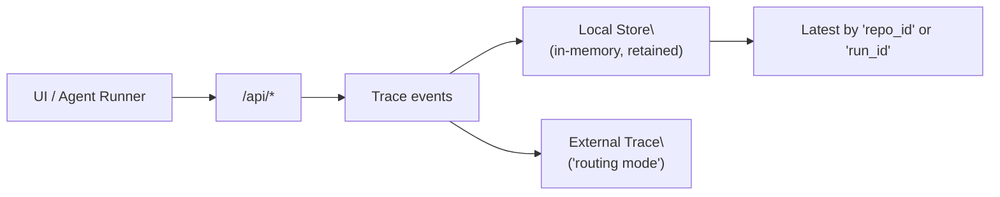

# Tracing (local store and external routing)

-   :material-crosshairs-gps:{ .lg .middle } **Local trace store**

    ---

    In-memory tracing with retention control. Safe to reuse `run_id` across retries; latest always wins.

-   :material-cloud-sync:{ .lg .middle } **External tracing compatible**

    ---

    Route events to external systems (for example, LangSmith-style routing) when you outgrow local traces.

-   :material-clipboard-text-clock:{ .lg .middle } **Deterministic “latest” lookups**

    ---

    Query by `repo_id` (corpus) or `run_id` to fetch the most recent trace; responses are detached copies.

-   :material-tune:{ .lg .middle } **Operator-grade knobs**

    ---

    Control `tracing_mode`, retention, and routing via Pydantic config. If you’re not sure, start with local + default retention.

[Configuration](../configuration.md){ .md-button .md-button--primary }
[Tracing config reference](../reference/config/tracing.md){ .md-button }
[Observability](../observability.md){ .md-button }
[API health & metrics](../api_health.md){ .md-button }

!!! note "API first, MCP second"
    ragweld integrates tracing into the API-first lifecycle. You can layer MCP-based tooling on top, but your production contract remains the HTTP API mounted under `/api`.

## What lives where (mental model)

- Local store: super-fast in-memory traces with retention.
- External route: forward/duplicate events to an external tracer when enabled (for example, LangSmith routing mode).
- Latest lookups: fetch most recent trace by `repo_id` (corpus) or by `run_id`.

## Modes and core settings

Definition list of the knobs that matter:

tracing.tracing_mode
:   Which tracer backend to use.
    - local: keep traces in-process/memory with retention
    - external: route to a compatible external tracer (for example, LangSmith-style routing)
    - If you’re not sure, choose local.

tracing.trace_retention
:   Upper bound on how many traces are retained locally. When the limit is exceeded, oldest traces are evicted. See the [Tracing config reference](../reference/config/tracing.md) for the default and constraints.

!!! tip "Safe defaults"
    Start with `tracing_mode = "local"` and the default retention. Bump retention after you baseline memory headroom in production.

## Local store semantics (what to expect)

ragweld’s local trace store prioritizes correctness during retries and simplicity at read time:

- Run ID reuse is safe
  - If a caller reuses the same `run_id` (a common retry pattern), the store first removes any stale index references for that `run_id` and then records the new trace.
  - Why it matters: retention eviction can’t accidentally evict your just-started retry; the “latest” trace for that `run_id` is the one you just started.

- Latest by repo_id or by run_id
  - latest(repo_id=…): returns the most recent trace in that corpus (remember: the codebase uses `repo_id` for corpus separation).
  - latest(run_id=…): returns the most recent trace matching that run.

- Detached copies
  - Calls that return a trace object return a detached copy, not a live pointer into the store. Mutating it won’t mutate the store.

- Retention-driven eviction
  - When the retention cap is reached, the oldest traces are removed. This happens across all repos, and is applied after any run-id de-duplication described above.

!!! note "Terminology — corpus vs repo_id"
    The API and internals use `repo_id` to mean “corpus id.” Plan and size traces per corpus. See [Corpus vs repo_id](../guides/corpus.md) for background.

## Practical operations

- If your orchestrator uses stable run IDs across retries, keep doing that. ragweld will preserve the newest retry for that `run_id` under retention pressure.
- To investigate a user report:
  - Check Grafana first (system health).
  - Use the UI’s trace viewer or a “latest by repo” lookup to see what happened most recently in that corpus.
  - If you need longer history, either raise `trace_retention` or switch to an external tracer.

### Quick checklist for local mode

- [ ] tracing.tracing_mode is set to local
- [ ] Retention sized to your workload (start small, increase after profiling)
- [ ] You understand that “latest” is per `repo_id` and per `run_id`
- [ ] You are okay with in-memory only storage (export externally if you need durability)

!!! note "Deep links follow the current deployment"
    Grafana/Tempo and Langfuse deep links stored in traces are re-pointed to the current `ui.grafana_base_url` and `tracing.langfuse_public_base_url` when traces are read, so old traces still land on the live dashboards. See [Production scope & links](production_scope.md).

## Switching to external tracing

When you need persistent history, team collaboration, or advanced analytics, switch to external routing mode.

Task list:

- [ ] Set `tracing.tracing_mode = "external"`
- [ ] Configure the external tracer credentials and endpoint (provider-specific)
- [ ] Verify events show up in the external system during a smoke test
- [ ] Keep local retention modest; you’ll primarily use the external system for deep history

!!! warning "Provider specifics live in config"
    External tracer configuration is provider-dependent and defined in Pydantic models under `server/models/tribrid_config_model.py`. Don’t hand-edit docs — see the [Tracing config reference](../reference/config/tracing.md) and adjust via config.

## Failure modes and how to avoid them

- Retention set too low
  - Symptom: expected traces are missing when you open the viewer.
  - Fix: raise `tracing.trace_retention` or move to external mode.

- Confusing corpus separation
  - Symptom: you’re looking at “latest by repo” but using the wrong `repo_id`.
  - Fix: confirm the corpus id (`repo_id`) you indexed and queried against are the same. See [Corpus vs repo_id](../guides/corpus.md).

- Assuming mutability on returned traces
  - Symptom: you “modify” a returned trace object and expect the store to reflect it.
  - Fact: returned traces are detached copies by design.

## Example: behavior when reusing run_id (retries)

If an orchestrator restarts a run and reuses the same `run_id`, ragweld guarantees the newest run takes precedence in the indexes used for “latest” lookups. Concretely:

- Any old index references to that `run_id` are removed before the new trace is recorded.
- Retention eviction is computed after that de-duplication, so the new run won’t be evicted by stale references.

This lets you implement clean retry semantics without inventing new `run_id` values.

!!! info "Why it’s implemented this way"
    Internally, the store maintains ordered deques for:
    - Global start order across all runs
    - Per-`repo_id` start order
    
    Reusing a `run_id` first scrubs stale entries from these deques, then appends the new trace. The result is predictable “latest” lookups that point at the newest retry.

## Probe hysteresis on the observability status

`GET /api/observability/status` probes each configured component's readiness URL every time it is called, and a single HTTP probe is a noisy signal — a collector restart, a brief stall or a busy container answers 503 and recovers seconds later. Escalating one miss to a critical incident trains an operator to ignore the deck, so probes are debounced:

- Every component keeps a short **probe history** — the last 8 outcomes, oldest first — exposed as `probe_history` and drawn as a dot strip on the Operator Deck cards.
- `consecutive_failures` counts failures in a row. Below `tracing.probe_failure_threshold` (default `3`, env `PROBE_FAILURE_THRESHOLD`) a failing probe renders as a **warning** with its streak in the detail text ("failed probe 2 of 3"); at or above it the component escalates (critical for the core observability groups) and an incident is raised.
- One success clears the streak.
- Surfaces the API **cannot probe at all** — an auth-protected ingress that redirects off-host, or a component with no URL — report `probeable=false`, never advance the streak, and read "not probeable" instead of sitting permanently on the "Operator attention needed" line. A component that is enabled but unconfigured still counts as an attention item: it has nothing to probe, but it is a configuration fact.

!!! tip "One request, one probe sweep"
    A request that needs both status and incidents does exactly one readiness sweep — incidents are built from the same probe results rather than re-probing every component. If you poll the Operator Deck, each poll costs one probe per configured component.

## Langfuse deep links: check, then offer

A "Langfuse trace" deep link is only worth offering when Langfuse actually holds that trace. Two questions that used to be conflated are answered separately:

- **Does Langfuse hold the trace?** `GET /api/observability/langfuse/trace/{trace_id}` asks Langfuse's ingestion API with this process's server keys and answers with a typed `LangfuseTraceAccess` (`exists`, `checked`, `url`, `project`, `detail`).
- **May your browser open it?** Langfuse enforces project membership on the signed-in identity, which no server-side check can stand in for — so every Langfuse link carries a `sign_in_hint` naming the project and what an account without membership sees ("You do not have access to this trace").

The check is honest about failure shapes: `checked=false` means the API could not ask (Langfuse disabled, unconfigured, or unreachable) — never that Langfuse said no. Every surface that renders a trace's external links (the Chat routing trace, the Eval trace viewer, the Operator Deck) uses one shared renderer, which withholds the Langfuse link when Langfuse does not hold the trace and states why on screen instead of sending you to a dead end.

!!! note "The Grafana dashboard link is cluster-wide"
    The "Grafana dashboard" external link opens the provisioned overview with the time range bounded to the last 15 minutes. Its panels cover **every corpus on this deployment** — the dashboard has no corpus/run template variables, so the link cannot be scoped to the run it was opened from. The link's detail text says so; read it before assuming a card is about your run.

## Where to look in the UI

- Chat and RAG tabs generate trace events whenever a request flows through routing, retrieval, and generation.
- The trace viewer surfaces the most recent trace per corpus, which is ideal for debugging a single user interaction.
- For structured, long-term analysis, pair traces with [Grafana dashboards](../observability.md) and/or switch to external tracing.

## API, URLs, and ports to remember

- In dev, the backend is mounted under `/api`. Examples:
  - http://127.0.0.1:8012/api/search
  - fetch("/api/config")
- Default dev entrypoints (unless overridden by env vars):
  - UI: http://127.0.0.1:5173/web
  - API: http://127.0.0.1:8012/api

!!! note "Pydantic is the law"
