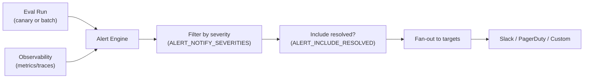

# Alert webhooks

<div class="grid chunk_summaries" markdown>

-   :material-bell-alert:{ .lg .middle } **Policy gates**

    ---

    Filter outbound notifications by severity before fan-out to receivers.

-   :material-check-circle:{ .lg .middle } **Include resolved**

    ---

    Optionally emit a closure notification when a condition clears.

-   :material-timer-sand:{ .lg .middle } **Timeout control**

    ---

    Bound delivery waits so ragweld pipelines don’t stall on slow receivers.

-   :material-lan-connect:{ .lg .middle } **Multiple targets**

    ---

    Send alerts to Slack, PagerDuty, Teams, or any HTTPS endpoint your org uses.

-   :material-shield-key:{ .lg .middle } **Ops-grade hygiene**

    ---

    Idempotency advice, dedupe tips, and how to avoid alert storms.

</div>

[Get started](../index.md){ .md-button .md-button--primary }
[Configuration](../configuration.md){ .md-button }
[Config reference](../reference/config/index.md){ .md-button }
[API](../api.md){ .md-button }

!!! note
    Webhook settings, defaults, and long-form guidance originate from Pydantic models in `server/models/tribrid_config_model.py` and glossary text in `data/glossary.json`. If a field isn’t defined there, it doesn’t exist. Regenerate docs after model or glossary updates.

## What emits alert webhooks

ragweld can emit outbound alerts when operations drift or regress, for example:

- Canary regressions in evaluation runs (e.g., MRR/NDCG/MAP drop beyond threshold)
- Benchmark deltas between model/reranker versions
- Other operational guardrails configured by your team

Alerts travel through a policy filter (severity allowlist), optional “include resolved” handling, and then fan out to one or more webhook targets you configure.



!!! tip "API first, MCP second"
    Alerts are part of ragweld’s API-first contract and operate independently of agent tooling. MCP integrations can react to alerts, but webhook delivery doesn’t depend on MCP being present.

## Configure the webhook pipeline

You can configure webhook targets and policy in two places:

1) UI: Admin → Integrations → Webhooks
2) Environment/config: via Pydantic-backed settings

The following environment-style keys control policy:

Alert Notify Severities
: `ALERT_NOTIFY_SEVERITIES` is the final severity allowlist before delivery, e.g. `critical,warning`. The values must match the labels emitted upstream or valid alerts will be silently dropped. Start with `critical,warning`. Add `info` only if you truly need it.

Alert Include Resolved
: `ALERT_INCLUDE_RESOLVED` toggles whether a “resolved” message is sent when the condition clears. Keep it `1` (enabled) for clean incident timelines and automated ticket closure. Set to `0` only if closure messages are creating noise.

Alert Webhook Timeout
: `ALERT_WEBHOOK_TIMEOUT` bounds how long ragweld waits for a receiver before marking delivery failed. Tune from real latency percentiles. Too high grows queues during outages; too low increases retries and potential duplicates.

!!! tip "Safe defaults"
    - If you’re not sure, use `ALERT_NOTIFY_SEVERITIES=critical,warning`.
    - Keep `ALERT_INCLUDE_RESOLVED=1` until you can demonstrate it hurts response quality.
    - Set `ALERT_WEBHOOK_TIMEOUT` from your p95 receiver latency, not from a guess.

### Examples

=== "Docker Compose"

```yaml
services:
  ragweld:
    image: ghcr.io/dmontgomery40/ragweld:latest
    environment:
      - ALERT_NOTIFY_SEVERITIES=critical,warning        # (1)!
      - ALERT_INCLUDE_RESOLVED=1                        # (2)!
      - ALERT_WEBHOOK_TIMEOUT=8                         # (3)!
      # Example target(s) typically configured via UI secrets/integrations
      # - WEBHOOK_TARGETS=https://hooks.slack.com/services/T000/B000/XXX,https://events.pagerduty.com/v2/enqueue
```

1. Keep the vocabulary aligned with what your alert engine emits, e.g. `critical`, `warning`, `info`. A mismatch here silently filters alerts.
2. Enable closure notifications so chat channels, incident tools, and audits reflect recovery without manual clean-up.
3. Pick a value informed by your receiver’s p95 latency. Too high increases backlog during outages; too low increases retries.

=== ".env"

```ini
ALERT_NOTIFY_SEVERITIES=critical,warning
ALERT_INCLUDE_RESOLVED=1
ALERT_WEBHOOK_TIMEOUT=8
# WEBHOOK_TARGETS=https://hooks.slack.com/services/T000/B000/XXX
```

=== "Kubernetes"

```yaml
apiVersion: apps/v1
kind: Deployment
metadata:
  name: ragweld
spec:
  template:
    spec:
      containers:
        - name: ragweld
          image: ghcr.io/dmontgomery40/ragweld:latest
          env:
            - name: ALERT_NOTIFY_SEVERITIES
              value: "critical,warning"
            - name: ALERT_INCLUDE_RESOLVED
              value: "1"
            - name: ALERT_WEBHOOK_TIMEOUT
              value: "8"
            # - name: WEBHOOK_TARGETS
            #   value: "https://hooks.slack.com/services/T000/B000/XXX"
```

## Rollout checklist (operators)

- [ ] Decide which severities should page vs. inform (start at `critical,warning`).
- [ ] Enable “include resolved” for clean MTTR tracking and timeline closure.
- [ ] Add webhook targets in Admin → Integrations → Webhooks.
- [ ] Set the timeout from observed p95 latency for each target class.
- [ ] Verify outbound egress rules permit calls to your targets.
- [ ] Dry-run with a test endpoint before paging real humans.

## Test your pipeline end-to-end

1) Point a target to a test receiver such as https://webhook.site or https://httpbin.org/post.
2) Trigger a condition that should alert:
   - Run an eval canary against a known “bad” revision to force a regression.
   - Or temporarily lower an alert threshold to generate a firing condition.
3) Confirm you receive the notification payload at the test receiver.
4) Resolve the condition and confirm a closure (“resolved”) message if enabled.

!!! note
    Exact event types and payload details can evolve over time. Treat the “type”/“category” fields in the payload as the primary routing keys on the receiver side, and avoid brittle schema coupling when possible.

## Troubleshooting

??? tip "No alerts are arriving"
    - Check the severity allowlist: `ALERT_NOTIFY_SEVERITIES` must match the labels your alert engine emits exactly.
    - Verify outbound egress from the ragweld container/host:
      - `docker exec -it <container> sh -lc 'curl -sS -X POST https://httpbin.org/post -d "{}"'`
    - Look at backend logs for timeout or non-2xx responses from the receiver.

??? tip "Alerts arrive but never show as resolved"
    - Ensure `ALERT_INCLUDE_RESOLVED=1` if your operations policy expects closure messages.
    - Some receivers require dedupe keys; if closure messages are ignored, check the receiver’s correlation rules.

??? tip "We get duplicate or out-of-order messages"
    - Timeouts can cause retries. Tune `ALERT_WEBHOOK_TIMEOUT` and ensure receivers are idempotent.
    - Use a dedupe key or a stable hash on the receiver side to collapse duplicates.

??? tip "Noise is overwhelming our channels"
    - Start with `critical,warning`. Only add `info` after you have automation to triage it.
    - Consider per-target severity filters if your integration layer supports it.

!!! warning "Treat webhook URLs as secrets"
    Do not check webhook URLs into version control. Store them in secrets management and restrict who can read them. Rotate tokens on schedule or immediately after potential exposure.

## Operational patterns that work

- Idempotent receivers: accept duplicate payloads without side effects.
- Backoff + dead letters: if a receiver is down, exponential backoff and a dead-letter queue prevent thundering herds.
- Correlate to traces: include trace/run links in the message text so on-call can jump straight into drilldowns.
- Canary first: wire alerts to canary evals before broadening to all runs.

## Reference and related docs

- Configuration overview: [Configuration](../configuration.md)
- All generated settings: [Config reference](../reference/config/index.md)
- Evaluations and canaries: [Evaluation Guide](../eval_guide.md)
- Ops surfaces: [Operations & metrics](../operations.md)
- Observability stack: [Observability](../observability.md)
- Health endpoints: [Health, Readiness, and Metrics API](../api_health.md)

## Rationale for the key knobs

Advanced controls are powerful but easy to misuse. Here’s why the webhook knobs matter:

- `ALERT_NOTIFY_SEVERITIES`
  - What it does: final allowlist before fan-out.
  - Why it matters: prevents low-signal alert floods that mask true incidents.
  - Failure modes: mismatched labels silently drop alerts; overbroad allowlists cause notification fatigue.
  - If you’re not sure: use `critical,warning`.

- `ALERT_INCLUDE_RESOLVED`
  - What it does: emits closure messages when a condition clears.
  - Why it matters: creates clean incident timelines and supports automated ticket closure.
  - Failure modes: disabled closure creates “stuck open” incidents in channels and tools.
  - If you’re not sure: set to `1`.

- `ALERT_WEBHOOK_TIMEOUT`
  - What it does: caps delivery wait time to avoid stalling pipelines.
  - Why it matters: protects indexing, eval, and tracing from slow or failing receivers.
  - Failure modes: too high causes backlog during outages; too low increases retries/duplicates.
  - If you’re not sure: start at your receiver’s observed p95 and adjust with real data.

## Example receiver contract (generic)

Most receivers expect:

- HTTP method: `POST`
- Content-Type: `application/json`
- Body: alert metadata (type/category/severity/timestamps) plus event-specific context

If you implement a custom receiver, keep it:

- Idempotent (ignore repeat deliveries of the same logical event)
- Fast (respond within your configured timeout)
- Clear (return 2xx for success; 4xx for permanent failures; 5xx for transient failures)
