# API surface

!!! info "Generated page"
    Every route below is read from the `@router.<method>` decorators under `server/api/` and the
    mount prefixes in `server/main.py` on every docs-autopilot run. The wire schemas are the registered
    Pydantic models; see the configuration reference for their fields.

176 routes across 24 routers, all served by the FastAPI app in `server/main.py`.

```mermaid
flowchart LR
    app["FastAPI app\nserver/main.py"]
    n_agent["agent\n11 routes: GET, POST"]
    app --> n_agent
    n_benchmark["benchmark\n3 routes: GET, POST"]
    app --> n_benchmark
    n_chat["chat\n9 routes: DELETE, GET, POST"]
    app --> n_chat
    n_chunk_summaries["chunk_summaries\n3 routes: DELETE, GET, POST"]
    app --> n_chunk_summaries
    n_config["config\n10 routes: GET, PATCH, POST, PUT"]
    app --> n_config
    n_cost["cost\n4 routes: GET, POST"]
    app --> n_cost
    n_dataset["dataset\n6 routes: DELETE, GET, POST, PUT"]
    app --> n_dataset
    n_docker["docker\n7 routes: GET, POST"]
    app --> n_docker
    n_documents["documents\n3 routes: GET"]
    app --> n_documents
    n_eval["eval\n14 routes: DELETE, GET, POST"]
    app --> n_eval
    n_feedback["feedback\n1 routes: POST"]
    app --> n_feedback
    n_graph["graph\n11 routes: GET, POST"]
    app --> n_graph
    n_health["health\n2 routes: GET"]
    app --> n_health
    n_index["index\n15 routes: DELETE, GET, POST"]
    app --> n_index
    n_keywords["keywords\n1 routes: POST"]
    app --> n_keywords
    n_lineage["lineage\n6 routes: GET, POST"]
    app --> n_lineage
    n_models["models\n5 routes: GET, POST"]
    app --> n_models
    n_observability["observability\n6 routes: GET"]
    app --> n_observability
    n_prompts["prompts\n4 routes: GET, POST, PUT"]
    app --> n_prompts
    n_repos["repos\n12 routes: DELETE, GET, PATCH, POST"]
    app --> n_repos
    n_reranker["reranker\n27 routes: GET, POST"]
    app --> n_reranker
    n_runtime_capabilities["runtime_capabilities\n1 routes: GET"]
    app --> n_runtime_capabilities
    n_search["search\n3 routes: POST"]
    app --> n_search
    n_synthetic["synthetic\n12 routes: GET, POST"]
    app --> n_synthetic
```

## Routers

### `agent` (11 routes)

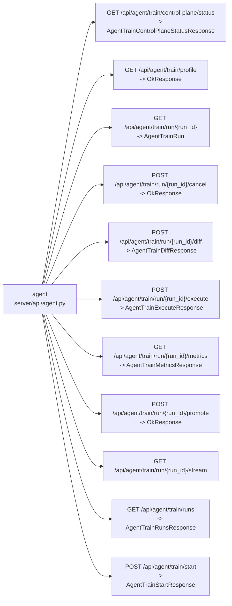
```mermaid
flowchart LR
    n_agent["agent\nserver/api/agent.py"]
    n_agent_0["GET /api/agent/train/control-plane/status\n-> AgentTrainControlPlaneStatusResponse"]
    n_agent --> n_agent_0
    n_agent_1["GET /api/agent/train/profile\n-> OkResponse"]
    n_agent --> n_agent_1
    n_agent_2["GET /api/agent/train/run/{run_id}\n-> AgentTrainRun"]
    n_agent --> n_agent_2
    n_agent_3["POST /api/agent/train/run/{run_id}/cancel\n-> OkResponse"]
    n_agent --> n_agent_3
    n_agent_4["POST /api/agent/train/run/{run_id}/diff\n-> AgentTrainDiffResponse"]
    n_agent --> n_agent_4
    n_agent_5["POST /api/agent/train/run/{run_id}/execute\n-> AgentTrainExecuteResponse"]
    n_agent --> n_agent_5
    n_agent_6["GET /api/agent/train/run/{run_id}/metrics\n-> AgentTrainMetricsResponse"]
    n_agent --> n_agent_6
    n_agent_7["POST /api/agent/train/run/{run_id}/promote\n-> OkResponse"]
    n_agent --> n_agent_7
    n_agent_8["GET /api/agent/train/run/{run_id}/stream"]
    n_agent --> n_agent_8
    n_agent_9["GET /api/agent/train/runs\n-> AgentTrainRunsResponse"]
    n_agent --> n_agent_9
    n_agent_10["POST /api/agent/train/start\n-> AgentTrainStartResponse"]
    n_agent --> n_agent_10
```

| Method | Path | Handler | Response model |
|---|---|---|---|
| `GET` | `/api/agent/train/control-plane/status` | `get_train_control_plane_status` | `AgentTrainControlPlaneStatusResponse` |
| `GET` | `/api/agent/train/profile` | `get_train_profile` | `OkResponse` |
| `GET` | `/api/agent/train/run/{run_id}` | `get_train_run` | `AgentTrainRun` |
| `POST` | `/api/agent/train/run/{run_id}/cancel` | `cancel_train_run` | `OkResponse` |
| `POST` | `/api/agent/train/run/{run_id}/diff` | `diff_train_runs` | `AgentTrainDiffResponse` |
| `POST` | `/api/agent/train/run/{run_id}/execute` | `execute_train_run` | `AgentTrainExecuteResponse` |
| `GET` | `/api/agent/train/run/{run_id}/metrics` | `get_train_run_metrics` | `AgentTrainMetricsResponse` |
| `POST` | `/api/agent/train/run/{run_id}/promote` | `promote_train_run` | `OkResponse` |
| `GET` | `/api/agent/train/run/{run_id}/stream` | `stream_train_run` | `-` |
| `GET` | `/api/agent/train/runs` | `list_train_runs` | `AgentTrainRunsResponse` |
| `POST` | `/api/agent/train/start` | `start_train_run` | `AgentTrainStartResponse` |

### `benchmark` (3 routes)

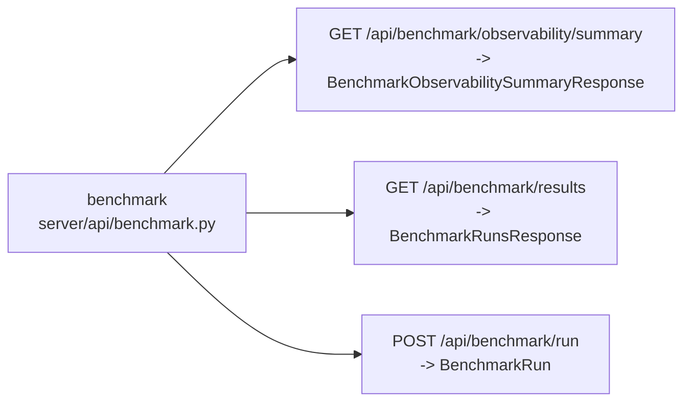
```mermaid
flowchart LR
    n_benchmark["benchmark\nserver/api/benchmark.py"]
    n_benchmark_0["GET /api/benchmark/observability/summary\n-> BenchmarkObservabilitySummaryResponse"]
    n_benchmark --> n_benchmark_0
    n_benchmark_1["GET /api/benchmark/results\n-> BenchmarkRunsResponse"]
    n_benchmark --> n_benchmark_1
    n_benchmark_2["POST /api/benchmark/run\n-> BenchmarkRun"]
    n_benchmark --> n_benchmark_2
```

| Method | Path | Handler | Response model |
|---|---|---|---|
| `GET` | `/api/benchmark/observability/summary` | `benchmark_observability_summary` | `BenchmarkObservabilitySummaryResponse` |
| `GET` | `/api/benchmark/results` | `benchmark_results` | `BenchmarkRunsResponse` |
| `POST` | `/api/benchmark/run` | `benchmark_run` | `BenchmarkRun` |

### `chat` (9 routes)

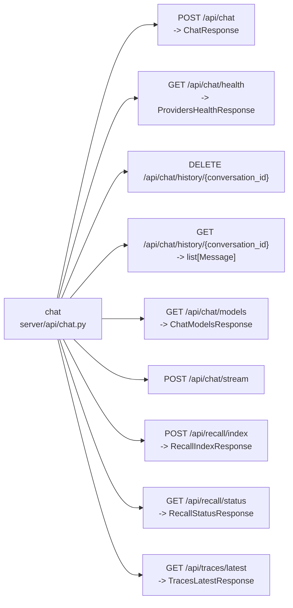
```mermaid
flowchart LR
    n_chat["chat\nserver/api/chat.py"]
    n_chat_0["POST /api/chat\n-> ChatResponse"]
    n_chat --> n_chat_0
    n_chat_1["GET /api/chat/health\n-> ProvidersHealthResponse"]
    n_chat --> n_chat_1
    n_chat_2["DELETE /api/chat/history/{conversation_id}"]
    n_chat --> n_chat_2
    n_chat_3["GET /api/chat/history/{conversation_id}\n-> list[Message]"]
    n_chat --> n_chat_3
    n_chat_4["GET /api/chat/models\n-> ChatModelsResponse"]
    n_chat --> n_chat_4
    n_chat_5["POST /api/chat/stream"]
    n_chat --> n_chat_5
    n_chat_6["POST /api/recall/index\n-> RecallIndexResponse"]
    n_chat --> n_chat_6
    n_chat_7["GET /api/recall/status\n-> RecallStatusResponse"]
    n_chat --> n_chat_7
    n_chat_8["GET /api/traces/latest\n-> TracesLatestResponse"]
    n_chat --> n_chat_8
```

| Method | Path | Handler | Response model |
|---|---|---|---|
| `POST` | `/api/chat` | `chat` | `ChatResponse` |
| `GET` | `/api/chat/health` | `chat_health` | `ProvidersHealthResponse` |
| `DELETE` | `/api/chat/history/{conversation_id}` | `clear_chat_history` | `-` |
| `GET` | `/api/chat/history/{conversation_id}` | `get_chat_history` | `list[Message]` |
| `GET` | `/api/chat/models` | `list_chat_models` | `ChatModelsResponse` |
| `POST` | `/api/chat/stream` | `chat_stream` | `-` |
| `POST` | `/api/recall/index` | `recall_index` | `RecallIndexResponse` |
| `GET` | `/api/recall/status` | `recall_status` | `RecallStatusResponse` |
| `GET` | `/api/traces/latest` | `get_latest_trace` | `TracesLatestResponse` |

### `chunk_summaries` (3 routes)

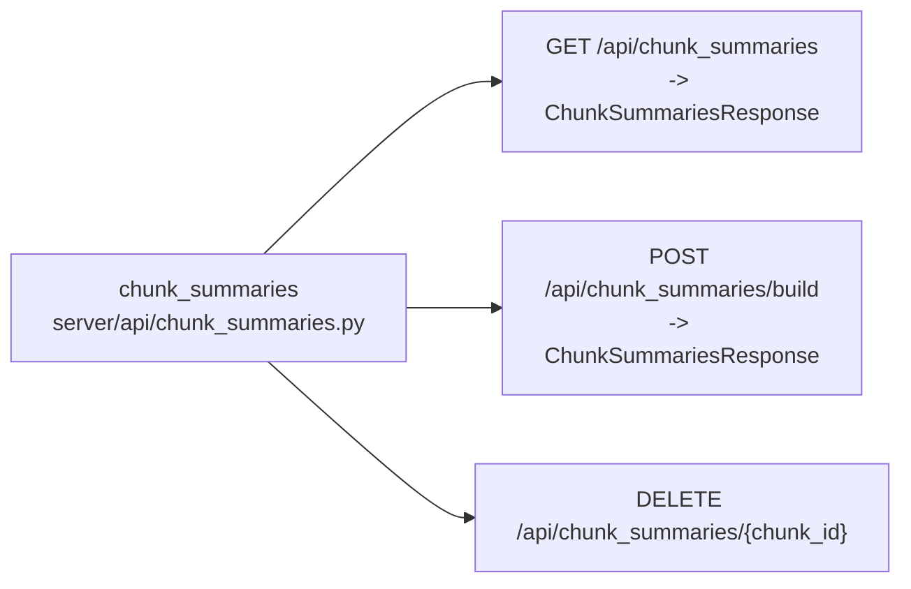
```mermaid
flowchart LR
    n_chunk_summaries["chunk_summaries\nserver/api/chunk_summaries.py"]
    n_chunk_summaries_0["GET /api/chunk_summaries\n-> ChunkSummariesResponse"]
    n_chunk_summaries --> n_chunk_summaries_0
    n_chunk_summaries_1["POST /api/chunk_summaries/build\n-> ChunkSummariesResponse"]
    n_chunk_summaries --> n_chunk_summaries_1
    n_chunk_summaries_2["DELETE /api/chunk_summaries/{chunk_id}"]
    n_chunk_summaries --> n_chunk_summaries_2
```

| Method | Path | Handler | Response model |
|---|---|---|---|
| `GET` | `/api/chunk_summaries` | `list_chunk_summaries` | `ChunkSummariesResponse` |
| `POST` | `/api/chunk_summaries/build` | `build_chunk_summaries` | `ChunkSummariesResponse` |
| `DELETE` | `/api/chunk_summaries/{chunk_id}` | `delete_chunk_summary` | `-` |

### `config` (10 routes)

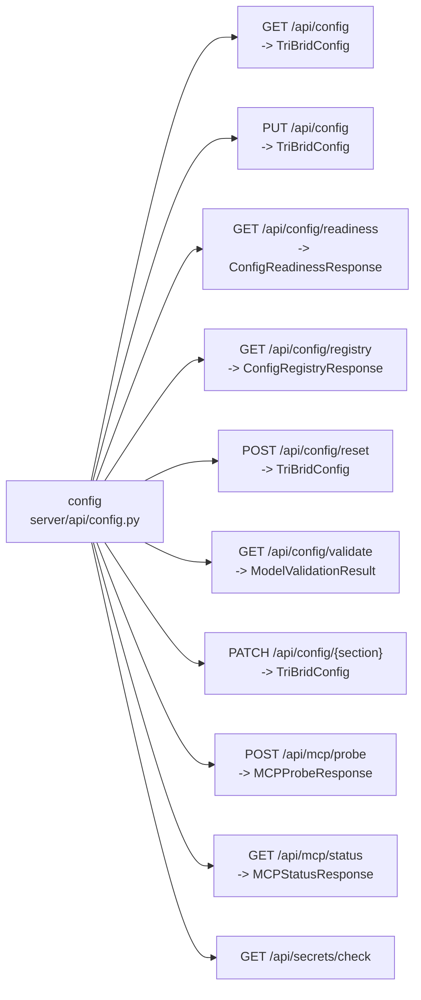
```mermaid
flowchart LR
    n_config["config\nserver/api/config.py"]
    n_config_0["GET /api/config\n-> TriBridConfig"]
    n_config --> n_config_0
    n_config_1["PUT /api/config\n-> TriBridConfig"]
    n_config --> n_config_1
    n_config_2["GET /api/config/readiness\n-> ConfigReadinessResponse"]
    n_config --> n_config_2
    n_config_3["GET /api/config/registry\n-> ConfigRegistryResponse"]
    n_config --> n_config_3
    n_config_4["POST /api/config/reset\n-> TriBridConfig"]
    n_config --> n_config_4
    n_config_5["GET /api/config/validate\n-> ModelValidationResult"]
    n_config --> n_config_5
    n_config_6["PATCH /api/config/{section}\n-> TriBridConfig"]
    n_config --> n_config_6
    n_config_7["POST /api/mcp/probe\n-> MCPProbeResponse"]
    n_config --> n_config_7
    n_config_8["GET /api/mcp/status\n-> MCPStatusResponse"]
    n_config --> n_config_8
    n_config_9["GET /api/secrets/check"]
    n_config --> n_config_9
```

| Method | Path | Handler | Response model |
|---|---|---|---|
| `GET` | `/api/config` | `get_config` | `TriBridConfig` |
| `PUT` | `/api/config` | `update_config` | `TriBridConfig` |
| `GET` | `/api/config/readiness` | `get_config_readiness` | `ConfigReadinessResponse` |
| `GET` | `/api/config/registry` | `get_config_registry` | `ConfigRegistryResponse` |
| `POST` | `/api/config/reset` | `reset_config` | `TriBridConfig` |
| `GET` | `/api/config/validate` | `validate_config` | `ModelValidationResult` |
| `PATCH` | `/api/config/{section}` | `update_config_section` | `TriBridConfig` |
| `POST` | `/api/mcp/probe` | `mcp_probe` | `MCPProbeResponse` |
| `GET` | `/api/mcp/status` | `mcp_status` | `MCPStatusResponse` |
| `GET` | `/api/secrets/check` | `check_secrets` | `-` |

### `cost` (4 routes)

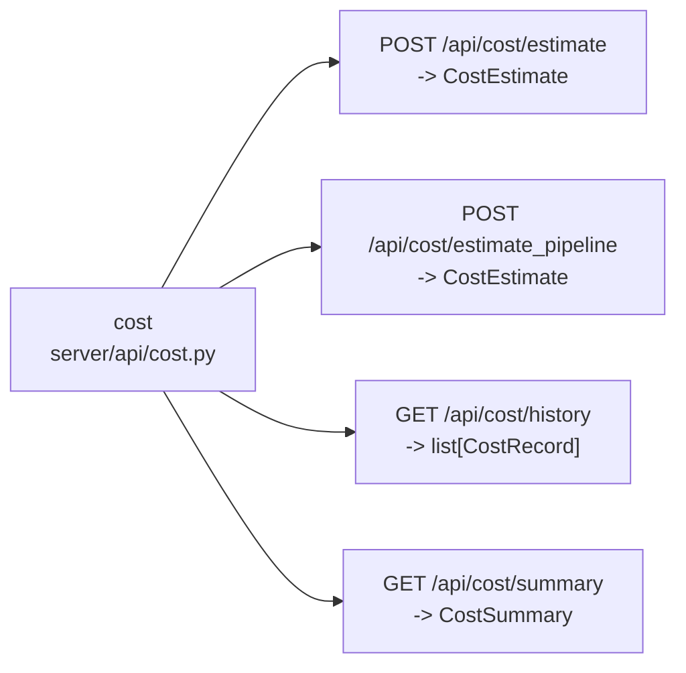
```mermaid
flowchart LR
    n_cost["cost\nserver/api/cost.py"]
    n_cost_0["POST /api/cost/estimate\n-> CostEstimate"]
    n_cost --> n_cost_0
    n_cost_1["POST /api/cost/estimate_pipeline\n-> CostEstimate"]
    n_cost --> n_cost_1
    n_cost_2["GET /api/cost/history\n-> list[CostRecord]"]
    n_cost --> n_cost_2
    n_cost_3["GET /api/cost/summary\n-> CostSummary"]
    n_cost --> n_cost_3
```

| Method | Path | Handler | Response model |
|---|---|---|---|
| `POST` | `/api/cost/estimate` | `estimate_cost` | `CostEstimate` |
| `POST` | `/api/cost/estimate_pipeline` | `estimate_cost_pipeline` | `CostEstimate` |
| `GET` | `/api/cost/history` | `get_cost_history` | `list[CostRecord]` |
| `GET` | `/api/cost/summary` | `get_cost_summary` | `CostSummary` |

### `dataset` (6 routes)

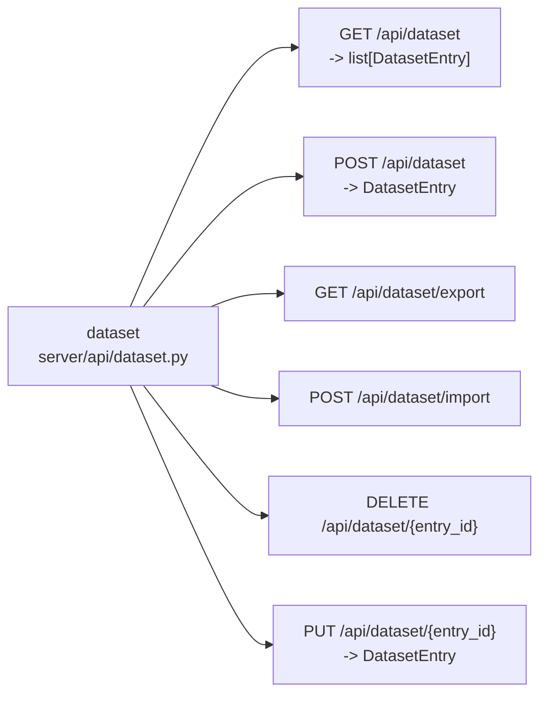
```mermaid
flowchart LR
    n_dataset["dataset\nserver/api/dataset.py"]
    n_dataset_0["GET /api/dataset\n-> list[DatasetEntry]"]
    n_dataset --> n_dataset_0
    n_dataset_1["POST /api/dataset\n-> DatasetEntry"]
    n_dataset --> n_dataset_1
    n_dataset_2["GET /api/dataset/export"]
    n_dataset --> n_dataset_2
    n_dataset_3["POST /api/dataset/import"]
    n_dataset --> n_dataset_3
    n_dataset_4["DELETE /api/dataset/{entry_id}"]
    n_dataset --> n_dataset_4
    n_dataset_5["PUT /api/dataset/{entry_id}\n-> DatasetEntry"]
    n_dataset --> n_dataset_5
```

| Method | Path | Handler | Response model |
|---|---|---|---|
| `GET` | `/api/dataset` | `list_dataset` | `list[DatasetEntry]` |
| `POST` | `/api/dataset` | `add_dataset_entry` | `DatasetEntry` |
| `GET` | `/api/dataset/export` | `export_dataset` | `-` |
| `POST` | `/api/dataset/import` | `import_dataset` | `-` |
| `DELETE` | `/api/dataset/{entry_id}` | `delete_dataset_entry` | `-` |
| `PUT` | `/api/dataset/{entry_id}` | `update_dataset_entry` | `DatasetEntry` |

### `docker` (7 routes)

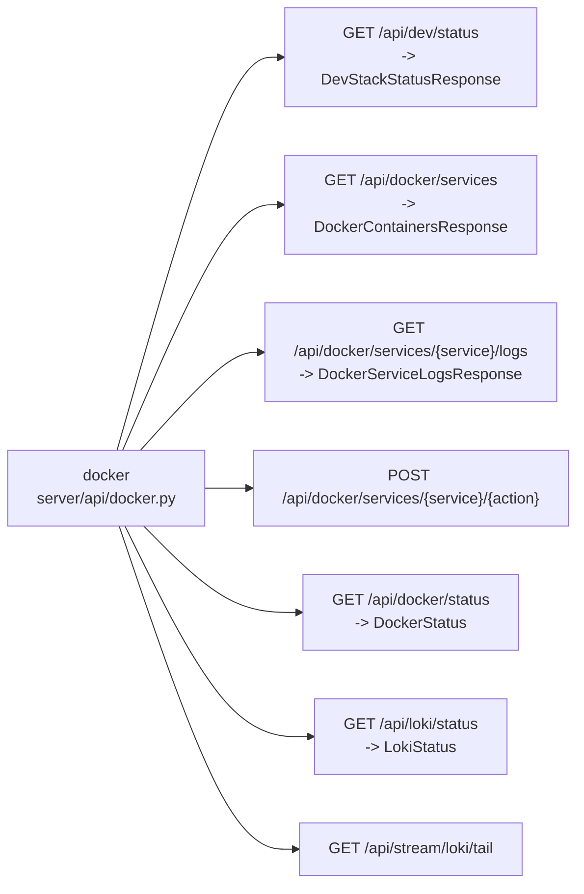
```mermaid
flowchart LR
    n_docker["docker\nserver/api/docker.py"]
    n_docker_0["GET /api/dev/status\n-> DevStackStatusResponse"]
    n_docker --> n_docker_0
    n_docker_1["GET /api/docker/services\n-> DockerContainersResponse"]
    n_docker --> n_docker_1
    n_docker_2["GET /api/docker/services/{service}/logs\n-> DockerServiceLogsResponse"]
    n_docker --> n_docker_2
    n_docker_3["POST /api/docker/services/{service}/{action}"]
    n_docker --> n_docker_3
    n_docker_4["GET /api/docker/status\n-> DockerStatus"]
    n_docker --> n_docker_4
    n_docker_5["GET /api/loki/status\n-> LokiStatus"]
    n_docker --> n_docker_5
    n_docker_6["GET /api/stream/loki/tail"]
    n_docker --> n_docker_6
```

| Method | Path | Handler | Response model |
|---|---|---|---|
| `GET` | `/api/dev/status` | `get_dev_stack_status` | `DevStackStatusResponse` |
| `GET` | `/api/docker/services` | `list_docker_services` | `DockerContainersResponse` |
| `GET` | `/api/docker/services/{service}/logs` | `get_docker_service_logs` | `DockerServiceLogsResponse` |
| `POST` | `/api/docker/services/{service}/{action}` | `control_docker_service` | `-` |
| `GET` | `/api/docker/status` | `get_docker_status` | `DockerStatus` |
| `GET` | `/api/loki/status` | `loki_status` | `LokiStatus` |
| `GET` | `/api/stream/loki/tail` | `loki_tail` | `-` |

### `documents` (3 routes)

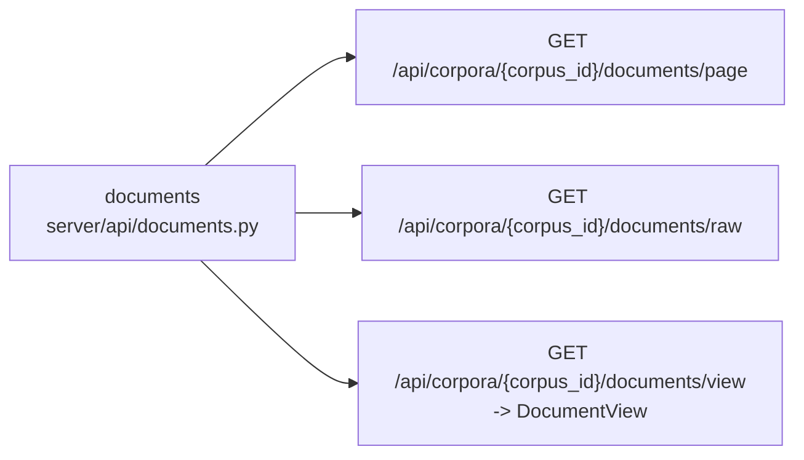
```mermaid
flowchart LR
    n_documents["documents\nserver/api/documents.py"]
    n_documents_0["GET /api/corpora/{corpus_id}/documents/page"]
    n_documents --> n_documents_0
    n_documents_1["GET /api/corpora/{corpus_id}/documents/raw"]
    n_documents --> n_documents_1
    n_documents_2["GET /api/corpora/{corpus_id}/documents/view\n-> DocumentView"]
    n_documents --> n_documents_2
```

| Method | Path | Handler | Response model |
|---|---|---|---|
| `GET` | `/api/corpora/{corpus_id}/documents/page` | `render_document_page` | `-` |
| `GET` | `/api/corpora/{corpus_id}/documents/raw` | `raw_document` | `-` |
| `GET` | `/api/corpora/{corpus_id}/documents/view` | `view_document` | `DocumentView` |

### `eval` (14 routes)

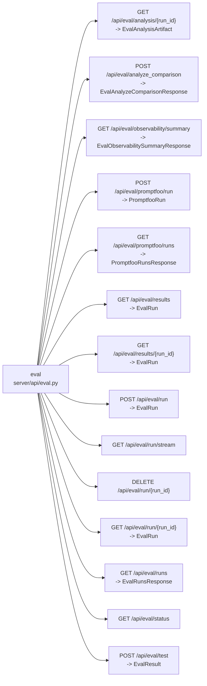
```mermaid
flowchart LR
    n_eval["eval\nserver/api/eval.py"]
    n_eval_0["GET /api/eval/analysis/{run_id}\n-> EvalAnalysisArtifact"]
    n_eval --> n_eval_0
    n_eval_1["POST /api/eval/analyze_comparison\n-> EvalAnalyzeComparisonResponse"]
    n_eval --> n_eval_1
    n_eval_2["GET /api/eval/observability/summary\n-> EvalObservabilitySummaryResponse"]
    n_eval --> n_eval_2
    n_eval_3["POST /api/eval/promptfoo/run\n-> PromptfooRun"]
    n_eval --> n_eval_3
    n_eval_4["GET /api/eval/promptfoo/runs\n-> PromptfooRunsResponse"]
    n_eval --> n_eval_4
    n_eval_5["GET /api/eval/results\n-> EvalRun"]
    n_eval --> n_eval_5
    n_eval_6["GET /api/eval/results/{run_id}\n-> EvalRun"]
    n_eval --> n_eval_6
    n_eval_7["POST /api/eval/run\n-> EvalRun"]
    n_eval --> n_eval_7
    n_eval_8["GET /api/eval/run/stream"]
    n_eval --> n_eval_8
    n_eval_9["DELETE /api/eval/run/{run_id}"]
    n_eval --> n_eval_9
    n_eval_10["GET /api/eval/run/{run_id}\n-> EvalRun"]
    n_eval --> n_eval_10
    n_eval_11["GET /api/eval/runs\n-> EvalRunsResponse"]
    n_eval --> n_eval_11
    n_eval_12["GET /api/eval/status"]
    n_eval --> n_eval_12
    n_eval_13["POST /api/eval/test\n-> EvalResult"]
    n_eval --> n_eval_13
```

| Method | Path | Handler | Response model |
|---|---|---|---|
| `GET` | `/api/eval/analysis/{run_id}` | `get_eval_analysis` | `EvalAnalysisArtifact` |
| `POST` | `/api/eval/analyze_comparison` | `analyze_eval_comparison` | `EvalAnalyzeComparisonResponse` |
| `GET` | `/api/eval/observability/summary` | `eval_observability_summary` | `EvalObservabilitySummaryResponse` |
| `POST` | `/api/eval/promptfoo/run` | `run_promptfoo` | `PromptfooRun` |
| `GET` | `/api/eval/promptfoo/runs` | `list_promptfoo_runs` | `PromptfooRunsResponse` |
| `GET` | `/api/eval/results` | `eval_results` | `EvalRun` |
| `GET` | `/api/eval/results/{run_id}` | `eval_results_by_run` | `EvalRun` |
| `POST` | `/api/eval/run` | `run_evaluation` | `EvalRun` |
| `GET` | `/api/eval/run/stream` | `eval_run_stream` | `-` |
| `DELETE` | `/api/eval/run/{run_id}` | `delete_eval_run` | `-` |
| `GET` | `/api/eval/run/{run_id}` | `get_eval_run` | `EvalRun` |
| `GET` | `/api/eval/runs` | `list_eval_runs` | `EvalRunsResponse` |
| `GET` | `/api/eval/status` | `eval_status` | `-` |
| `POST` | `/api/eval/test` | `test_eval_entry` | `EvalResult` |

### `feedback` (1 routes)

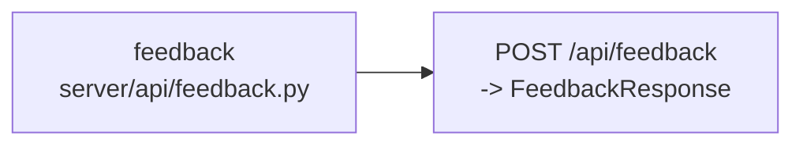
```mermaid
flowchart LR
    n_feedback["feedback\nserver/api/feedback.py"]
    n_feedback_0["POST /api/feedback\n-> FeedbackResponse"]
    n_feedback --> n_feedback_0
```

| Method | Path | Handler | Response model |
|---|---|---|---|
| `POST` | `/api/feedback` | `post_feedback` | `FeedbackResponse` |

### `graph` (11 routes)

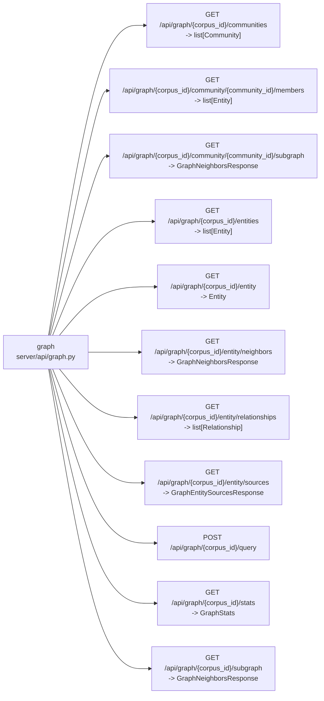
```mermaid
flowchart LR
    n_graph["graph\nserver/api/graph.py"]
    n_graph_0["GET /api/graph/{corpus_id}/communities\n-> list[Community]"]
    n_graph --> n_graph_0
    n_graph_1["GET /api/graph/{corpus_id}/community/{community_id}/members\n-> list[Entity]"]
    n_graph --> n_graph_1
    n_graph_2["GET /api/graph/{corpus_id}/community/{community_id}/subgraph\n-> GraphNeighborsResponse"]
    n_graph --> n_graph_2
    n_graph_3["GET /api/graph/{corpus_id}/entities\n-> list[Entity]"]
    n_graph --> n_graph_3
    n_graph_4["GET /api/graph/{corpus_id}/entity\n-> Entity"]
    n_graph --> n_graph_4
    n_graph_5["GET /api/graph/{corpus_id}/entity/neighbors\n-> GraphNeighborsResponse"]
    n_graph --> n_graph_5
    n_graph_6["GET /api/graph/{corpus_id}/entity/relationships\n-> list[Relationship]"]
    n_graph --> n_graph_6
    n_graph_7["GET /api/graph/{corpus_id}/entity/sources\n-> GraphEntitySourcesResponse"]
    n_graph --> n_graph_7
    n_graph_8["POST /api/graph/{corpus_id}/query"]
    n_graph --> n_graph_8
    n_graph_9["GET /api/graph/{corpus_id}/stats\n-> GraphStats"]
    n_graph --> n_graph_9
    n_graph_10["GET /api/graph/{corpus_id}/subgraph\n-> GraphNeighborsResponse"]
    n_graph --> n_graph_10
```

| Method | Path | Handler | Response model |
|---|---|---|---|
| `GET` | `/api/graph/{corpus_id}/communities` | `list_communities` | `list[Community]` |
| `GET` | `/api/graph/{corpus_id}/community/{community_id}/members` | `get_community_members` | `list[Entity]` |
| `GET` | `/api/graph/{corpus_id}/community/{community_id}/subgraph` | `get_community_subgraph` | `GraphNeighborsResponse` |
| `GET` | `/api/graph/{corpus_id}/entities` | `list_entities` | `list[Entity]` |
| `GET` | `/api/graph/{corpus_id}/entity` | `get_entity` | `Entity` |
| `GET` | `/api/graph/{corpus_id}/entity/neighbors` | `get_entity_neighbors` | `GraphNeighborsResponse` |
| `GET` | `/api/graph/{corpus_id}/entity/relationships` | `get_entity_relationships` | `list[Relationship]` |
| `GET` | `/api/graph/{corpus_id}/entity/sources` | `get_entity_sources` | `GraphEntitySourcesResponse` |
| `POST` | `/api/graph/{corpus_id}/query` | `graph_query` | `-` |
| `GET` | `/api/graph/{corpus_id}/stats` | `get_graph_stats` | `GraphStats` |
| `GET` | `/api/graph/{corpus_id}/subgraph` | `get_repo_subgraph` | `GraphNeighborsResponse` |

### `health` (2 routes)

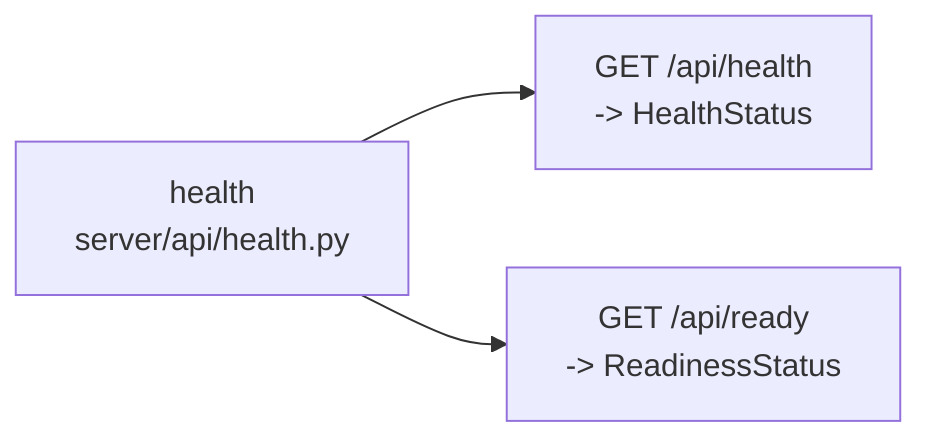
```mermaid
flowchart LR
    n_health["health\nserver/api/health.py"]
    n_health_0["GET /api/health\n-> HealthStatus"]
    n_health --> n_health_0
    n_health_1["GET /api/ready\n-> ReadinessStatus"]
    n_health --> n_health_1
```

| Method | Path | Handler | Response model |
|---|---|---|---|
| `GET` | `/api/health` | `health_check` | `HealthStatus` |
| `GET` | `/api/ready` | `readiness_check` | `ReadinessStatus` |

### `index` (15 routes)

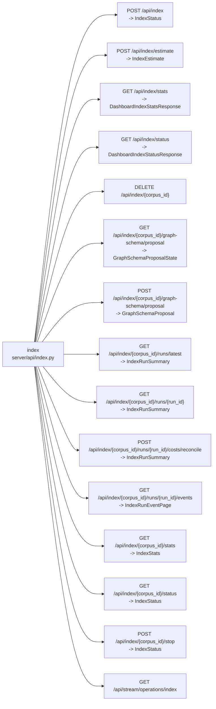
```mermaid
flowchart LR
    n_index["index\nserver/api/index.py"]
    n_index_0["POST /api/index\n-> IndexStatus"]
    n_index --> n_index_0
    n_index_1["POST /api/index/estimate\n-> IndexEstimate"]
    n_index --> n_index_1
    n_index_2["GET /api/index/stats\n-> DashboardIndexStatsResponse"]
    n_index --> n_index_2
    n_index_3["GET /api/index/status\n-> DashboardIndexStatusResponse"]
    n_index --> n_index_3
    n_index_4["DELETE /api/index/{corpus_id}"]
    n_index --> n_index_4
    n_index_5["GET /api/index/{corpus_id}/graph-schema/proposal\n-> GraphSchemaProposalState"]
    n_index --> n_index_5
    n_index_6["POST /api/index/{corpus_id}/graph-schema/proposal\n-> GraphSchemaProposal"]
    n_index --> n_index_6
    n_index_7["GET /api/index/{corpus_id}/runs/latest\n-> IndexRunSummary"]
    n_index --> n_index_7
    n_index_8["GET /api/index/{corpus_id}/runs/{run_id}\n-> IndexRunSummary"]
    n_index --> n_index_8
    n_index_9["POST /api/index/{corpus_id}/runs/{run_id}/costs/reconcile\n-> IndexRunSummary"]
    n_index --> n_index_9
    n_index_10["GET /api/index/{corpus_id}/runs/{run_id}/events\n-> IndexRunEventPage"]
    n_index --> n_index_10
    n_index_11["GET /api/index/{corpus_id}/stats\n-> IndexStats"]
    n_index --> n_index_11
    n_index_12["GET /api/index/{corpus_id}/status\n-> IndexStatus"]
    n_index --> n_index_12
    n_index_13["POST /api/index/{corpus_id}/stop\n-> IndexStatus"]
    n_index --> n_index_13
    n_index_14["GET /api/stream/operations/index"]
    n_index --> n_index_14
```

| Method | Path | Handler | Response model |
|---|---|---|---|
| `POST` | `/api/index` | `start_index` | `IndexStatus` |
| `POST` | `/api/index/estimate` | `estimate_index` | `IndexEstimate` |
| `GET` | `/api/index/stats` | `get_dashboard_index_stats` | `DashboardIndexStatsResponse` |
| `GET` | `/api/index/status` | `get_dashboard_index_status` | `DashboardIndexStatusResponse` |
| `DELETE` | `/api/index/{corpus_id}` | `delete_index` | `-` |
| `GET` | `/api/index/{corpus_id}/graph-schema/proposal` | `get_graph_schema_proposal` | `GraphSchemaProposalState` |
| `POST` | `/api/index/{corpus_id}/graph-schema/proposal` | `propose_graph_schema` | `GraphSchemaProposal` |
| `GET` | `/api/index/{corpus_id}/runs/latest` | `get_latest_index_run` | `IndexRunSummary` |
| `GET` | `/api/index/{corpus_id}/runs/{run_id}` | `get_index_run` | `IndexRunSummary` |
| `POST` | `/api/index/{corpus_id}/runs/{run_id}/costs/reconcile` | `reconcile_index_run_costs` | `IndexRunSummary` |
| `GET` | `/api/index/{corpus_id}/runs/{run_id}/events` | `get_index_run_events` | `IndexRunEventPage` |
| `GET` | `/api/index/{corpus_id}/stats` | `get_index_stats` | `IndexStats` |
| `GET` | `/api/index/{corpus_id}/status` | `get_index_status` | `IndexStatus` |
| `POST` | `/api/index/{corpus_id}/stop` | `stop_index_for_corpus` | `IndexStatus` |
| `GET` | `/api/stream/operations/index` | `stream_index_operation` | `-` |

### `keywords` (1 routes)

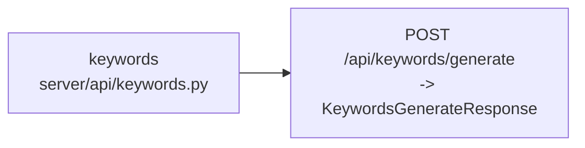
```mermaid
flowchart LR
    n_keywords["keywords\nserver/api/keywords.py"]
    n_keywords_0["POST /api/keywords/generate\n-> KeywordsGenerateResponse"]
    n_keywords --> n_keywords_0
```

| Method | Path | Handler | Response model |
|---|---|---|---|
| `POST` | `/api/keywords/generate` | `generate_keywords` | `KeywordsGenerateResponse` |

### `lineage` (6 routes)

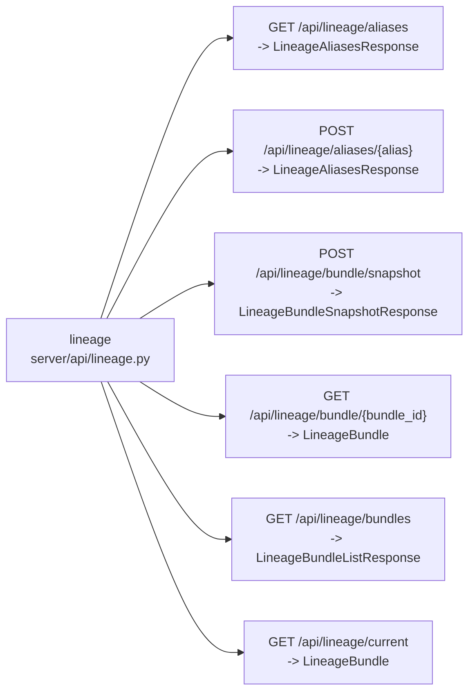
```mermaid
flowchart LR
    n_lineage["lineage\nserver/api/lineage.py"]
    n_lineage_0["GET /api/lineage/aliases\n-> LineageAliasesResponse"]
    n_lineage --> n_lineage_0
    n_lineage_1["POST /api/lineage/aliases/{alias}\n-> LineageAliasesResponse"]
    n_lineage --> n_lineage_1
    n_lineage_2["POST /api/lineage/bundle/snapshot\n-> LineageBundleSnapshotResponse"]
    n_lineage --> n_lineage_2
    n_lineage_3["GET /api/lineage/bundle/{bundle_id}\n-> LineageBundle"]
    n_lineage --> n_lineage_3
    n_lineage_4["GET /api/lineage/bundles\n-> LineageBundleListResponse"]
    n_lineage --> n_lineage_4
    n_lineage_5["GET /api/lineage/current\n-> LineageBundle"]
    n_lineage --> n_lineage_5
```

| Method | Path | Handler | Response model |
|---|---|---|---|
| `GET` | `/api/lineage/aliases` | `get_aliases` | `LineageAliasesResponse` |
| `POST` | `/api/lineage/aliases/{alias}` | `update_alias` | `LineageAliasesResponse` |
| `POST` | `/api/lineage/bundle/snapshot` | `snapshot_bundle` | `LineageBundleSnapshotResponse` |
| `GET` | `/api/lineage/bundle/{bundle_id}` | `get_bundle` | `LineageBundle` |
| `GET` | `/api/lineage/bundles` | `get_bundles` | `LineageBundleListResponse` |
| `GET` | `/api/lineage/current` | `get_current_lineage` | `LineageBundle` |

### `models` (5 routes)

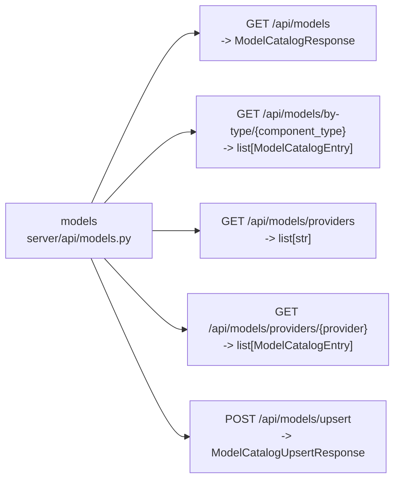
```mermaid
flowchart LR
    n_models["models\nserver/api/models.py"]
    n_models_0["GET /api/models\n-> ModelCatalogResponse"]
    n_models --> n_models_0
    n_models_1["GET /api/models/by-type/{component_type}\n-> list[ModelCatalogEntry]"]
    n_models --> n_models_1
    n_models_2["GET /api/models/providers\n-> list[str]"]
    n_models --> n_models_2
    n_models_3["GET /api/models/providers/{provider}\n-> list[ModelCatalogEntry]"]
    n_models --> n_models_3
    n_models_4["POST /api/models/upsert\n-> ModelCatalogUpsertResponse"]
    n_models --> n_models_4
```

| Method | Path | Handler | Response model |
|---|---|---|---|
| `GET` | `/api/models` | `get_all_models` | `ModelCatalogResponse` |
| `GET` | `/api/models/by-type/{component_type}` | `get_models_by_type` | `list[ModelCatalogEntry]` |
| `GET` | `/api/models/providers` | `get_providers` | `list[str]` |
| `GET` | `/api/models/providers/{provider}` | `get_models_for_provider` | `list[ModelCatalogEntry]` |
| `POST` | `/api/models/upsert` | `upsert_model` | `ModelCatalogUpsertResponse` |

### `observability` (6 routes)

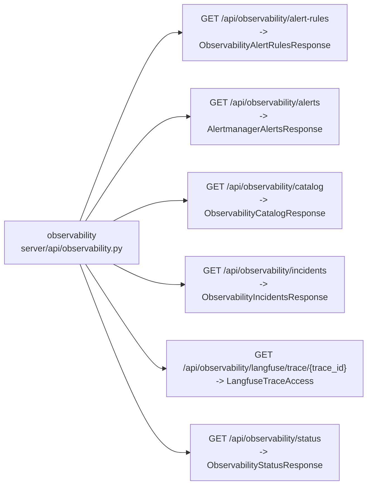
```mermaid
flowchart LR
    n_observability["observability\nserver/api/observability.py"]
    n_observability_0["GET /api/observability/alert-rules\n-> ObservabilityAlertRulesResponse"]
    n_observability --> n_observability_0
    n_observability_1["GET /api/observability/alerts\n-> AlertmanagerAlertsResponse"]
    n_observability --> n_observability_1
    n_observability_2["GET /api/observability/catalog\n-> ObservabilityCatalogResponse"]
    n_observability --> n_observability_2
    n_observability_3["GET /api/observability/incidents\n-> ObservabilityIncidentsResponse"]
    n_observability --> n_observability_3
    n_observability_4["GET /api/observability/langfuse/trace/{trace_id}\n-> LangfuseTraceAccess"]
    n_observability --> n_observability_4
    n_observability_5["GET /api/observability/status\n-> ObservabilityStatusResponse"]
    n_observability --> n_observability_5
```

| Method | Path | Handler | Response model |
|---|---|---|---|
| `GET` | `/api/observability/alert-rules` | `observability_alert_rules` | `ObservabilityAlertRulesResponse` |
| `GET` | `/api/observability/alerts` | `observability_alerts` | `AlertmanagerAlertsResponse` |
| `GET` | `/api/observability/catalog` | `observability_catalog` | `ObservabilityCatalogResponse` |
| `GET` | `/api/observability/incidents` | `observability_incidents` | `ObservabilityIncidentsResponse` |
| `GET` | `/api/observability/langfuse/trace/{trace_id}` | `observability_langfuse_trace` | `LangfuseTraceAccess` |
| `GET` | `/api/observability/status` | `observability_status` | `ObservabilityStatusResponse` |

### `prompts` (4 routes)

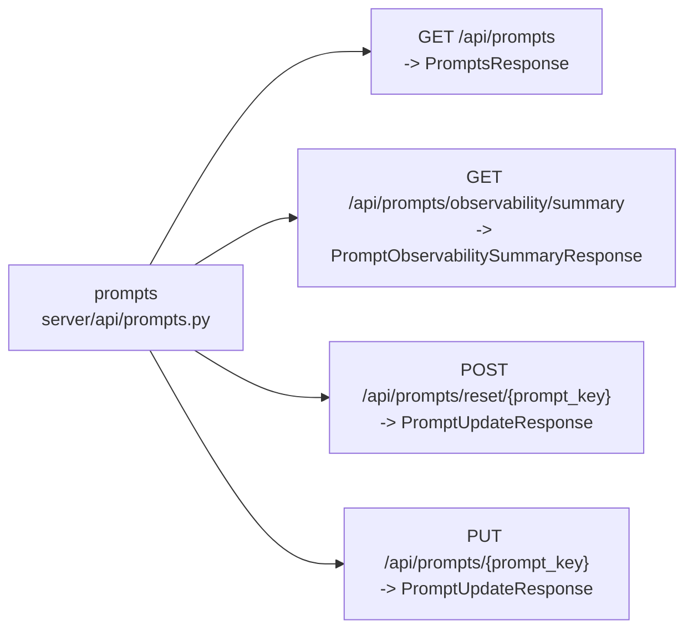
```mermaid
flowchart LR
    n_prompts["prompts\nserver/api/prompts.py"]
    n_prompts_0["GET /api/prompts\n-> PromptsResponse"]
    n_prompts --> n_prompts_0
    n_prompts_1["GET /api/prompts/observability/summary\n-> PromptObservabilitySummaryResponse"]
    n_prompts --> n_prompts_1
    n_prompts_2["POST /api/prompts/reset/{prompt_key}\n-> PromptUpdateResponse"]
    n_prompts --> n_prompts_2
    n_prompts_3["PUT /api/prompts/{prompt_key}\n-> PromptUpdateResponse"]
    n_prompts --> n_prompts_3
```

| Method | Path | Handler | Response model |
|---|---|---|---|
| `GET` | `/api/prompts` | `list_prompts` | `PromptsResponse` |
| `GET` | `/api/prompts/observability/summary` | `prompts_observability_summary` | `PromptObservabilitySummaryResponse` |
| `POST` | `/api/prompts/reset/{prompt_key}` | `reset_prompt` | `PromptUpdateResponse` |
| `PUT` | `/api/prompts/{prompt_key}` | `update_prompt` | `PromptUpdateResponse` |

### `repos` (12 routes)

```mermaid
flowchart LR
    n_repos["repos\nserver/api/repos.py"]
    n_repos_0["GET /api/corpora\n-> list[Corpus]"]
    n_repos --> n_repos_0
    n_repos_1["POST /api/corpora\n-> Corpus"]
    n_repos --> n_repos_1
    n_repos_2["DELETE /api/corpora/{corpus_id}"]
    n_repos --> n_repos_2
    n_repos_3["GET /api/corpora/{corpus_id}\n-> Corpus"]
    n_repos --> n_repos_3
    n_repos_4["PATCH /api/corpora/{corpus_id}\n-> Corpus"]
    n_repos --> n_repos_4
    n_repos_5["GET /api/corpora/{corpus_id}/stats\n-> CorpusStats"]
    n_repos --> n_repos_5
    n_repos_6["GET /api/repos\n-> list[Corpus]"]
    n_repos --> n_repos_6
    n_repos_7["POST /api/repos\n-> Corpus"]
    n_repos --> n_repos_7
    n_repos_8["DELETE /api/repos/{corpus_id}"]
    n_repos --> n_repos_8
    n_repos_9["GET /api/repos/{corpus_id}\n-> Corpus"]
    n_repos --> n_repos_9
    n_repos_10["PATCH /api/repos/{corpus_id}\n-> Corpus"]
    n_repos --> n_repos_10
    n_repos_11["GET /api/repos/{corpus_id}/stats\n-> CorpusStats"]
    n_repos --> n_repos_11
```

| Method | Path | Handler | Response model |
|---|---|---|---|
| `GET` | `/api/corpora` | `list_corpora` | `list[Corpus]` |
| `POST` | `/api/corpora` | `add_corpus` | `Corpus` |
| `DELETE` | `/api/corpora/{corpus_id}` | `delete_corpus` | `-` |
| `GET` | `/api/corpora/{corpus_id}` | `get_corpus` | `Corpus` |
| `PATCH` | `/api/corpora/{corpus_id}` | `update_corpus_endpoint` | `Corpus` |
| `GET` | `/api/corpora/{corpus_id}/stats` | `get_corpus_stats` | `CorpusStats` |
| `GET` | `/api/repos` | `list_repos` | `list[Corpus]` |
| `POST` | `/api/repos` | `add_repo` | `Corpus` |
| `DELETE` | `/api/repos/{corpus_id}` | `delete_repo` | `-` |
| `GET` | `/api/repos/{corpus_id}` | `get_repo` | `Corpus` |
| `PATCH` | `/api/repos/{corpus_id}` | `update_repo` | `Corpus` |
| `GET` | `/api/repos/{corpus_id}/stats` | `get_repo_stats` | `CorpusStats` |

### `reranker` (27 routes)

```mermaid
flowchart LR
    n_reranker["reranker\nserver/api/reranker.py"]
    n_reranker_0["POST /api/reranker/click\n-> OkResponse"]
    n_reranker --> n_reranker_0
    n_reranker_1["GET /api/reranker/costs\n-> RerankerCostsResponse"]
    n_reranker --> n_reranker_1
    n_reranker_2["POST /api/reranker/evaluate\n-> RerankerEvaluateResponse"]
    n_reranker --> n_reranker_2
    n_reranker_3["GET /api/reranker/info\n-> RerankerInfoResponse"]
    n_reranker --> n_reranker_3
    n_reranker_4["GET /api/reranker/logs\n-> RerankerLogsResponse"]
    n_reranker --> n_reranker_4
    n_reranker_5["POST /api/reranker/logs/clear\n-> OkResponse"]
    n_reranker --> n_reranker_5
    n_reranker_6["GET /api/reranker/logs/count\n-> CountResponse"]
    n_reranker --> n_reranker_6
    n_reranker_7["GET /api/reranker/logs/download"]
    n_reranker --> n_reranker_7
    n_reranker_8["POST /api/reranker/mine\n-> RerankerMineResponse"]
    n_reranker --> n_reranker_8
    n_reranker_9["GET /api/reranker/nohits\n-> RerankerNoHitsResponse"]
    n_reranker --> n_reranker_9
    n_reranker_10["POST /api/reranker/promote"]
    n_reranker --> n_reranker_10
    n_reranker_11["POST /api/reranker/score\n-> RerankerScoreResponse"]
    n_reranker --> n_reranker_11
    n_reranker_12["GET /api/reranker/status\n-> RerankerLegacyStatus"]
    n_reranker --> n_reranker_12
    n_reranker_13["POST /api/reranker/stop\n-> RerankerTrainLegacyResponse"]
    n_reranker --> n_reranker_13
    n_reranker_14["POST /api/reranker/train\n-> RerankerTrainLegacyResponse"]
    n_reranker --> n_reranker_14
    n_reranker_15["POST /api/reranker/train/diff\n-> RerankerTrainDiffResponse"]
    n_reranker --> n_reranker_15
    n_reranker_16["GET /api/reranker/train/profile\n-> CorpusEvalProfile"]
    n_reranker --> n_reranker_16
    n_reranker_17["GET /api/reranker/train/run/stream"]
    n_reranker --> n_reranker_17
    n_reranker_18["GET /api/reranker/train/run/{run_id}\n-> RerankerTrainRun"]
    n_reranker --> n_reranker_18
    n_reranker_19["POST /api/reranker/train/run/{run_id}/cancel\n-> OkResponse"]
    n_reranker --> n_reranker_19
    n_reranker_20["GET /api/reranker/train/run/{run_id}/diagnostics\n-> RerankerTrainDiagnosticsResponse"]
    n_reranker --> n_reranker_20
    n_reranker_21["GET /api/reranker/train/run/{run_id}/diagnostics/download"]
    n_reranker --> n_reranker_21
    n_reranker_22["GET /api/reranker/train/run/{run_id}/metrics\n-> RerankerTrainMetricsResponse"]
    n_reranker --> n_reranker_22
    n_reranker_23["POST /api/reranker/train/run/{run_id}/promote\n-> OkResponse"]
    n_reranker --> n_reranker_23
    n_reranker_24["GET /api/reranker/train/runs\n-> RerankerTrainRunsResponse"]
    n_reranker --> n_reranker_24
    n_reranker_25["POST /api/reranker/train/start\n-> RerankerTrainStartResponse"]
    n_reranker --> n_reranker_25
    n_reranker_26["GET /api/reranker/triplets/count\n-> CountResponse"]
    n_reranker --> n_reranker_26
```

| Method | Path | Handler | Response model |
|---|---|---|---|
| `POST` | `/api/reranker/click` | `track_click` | `OkResponse` |
| `GET` | `/api/reranker/costs` | `get_costs` | `RerankerCostsResponse` |
| `POST` | `/api/reranker/evaluate` | `evaluate_reranker` | `RerankerEvaluateResponse` |
| `GET` | `/api/reranker/info` | `get_reranker_info` | `RerankerInfoResponse` |
| `GET` | `/api/reranker/logs` | `get_logs` | `RerankerLogsResponse` |
| `POST` | `/api/reranker/logs/clear` | `clear_logs` | `OkResponse` |
| `GET` | `/api/reranker/logs/count` | `get_logs_count` | `CountResponse` |
| `GET` | `/api/reranker/logs/download` | `download_logs` | `-` |
| `POST` | `/api/reranker/mine` | `mine_reranker_triplets` | `RerankerMineResponse` |
| `GET` | `/api/reranker/nohits` | `get_nohits` | `RerankerNoHitsResponse` |
| `POST` | `/api/reranker/promote` | `promote_model` | `-` |
| `POST` | `/api/reranker/score` | `score_reranker` | `RerankerScoreResponse` |
| `GET` | `/api/reranker/status` | `get_reranker_status` | `RerankerLegacyStatus` |
| `POST` | `/api/reranker/stop` | `stop_reranker` | `RerankerTrainLegacyResponse` |
| `POST` | `/api/reranker/train` | `train_reranker` | `RerankerTrainLegacyResponse` |
| `POST` | `/api/reranker/train/diff` | `diff_train_runs` | `RerankerTrainDiffResponse` |
| `GET` | `/api/reranker/train/profile` | `get_train_profile` | `CorpusEvalProfile` |
| `GET` | `/api/reranker/train/run/stream` | `stream_train_run` | `-` |
| `GET` | `/api/reranker/train/run/{run_id}` | `get_train_run` | `RerankerTrainRun` |
| `POST` | `/api/reranker/train/run/{run_id}/cancel` | `cancel_train_run` | `OkResponse` |
| `GET` | `/api/reranker/train/run/{run_id}/diagnostics` | `get_train_run_diagnostics` | `RerankerTrainDiagnosticsResponse` |
| `GET` | `/api/reranker/train/run/{run_id}/diagnostics/download` | `download_train_run_diagnostics` | `-` |
| `GET` | `/api/reranker/train/run/{run_id}/metrics` | `get_train_run_metrics` | `RerankerTrainMetricsResponse` |
| `POST` | `/api/reranker/train/run/{run_id}/promote` | `promote_train_run` | `OkResponse` |
| `GET` | `/api/reranker/train/runs` | `list_train_runs` | `RerankerTrainRunsResponse` |
| `POST` | `/api/reranker/train/start` | `start_train_run` | `RerankerTrainStartResponse` |
| `GET` | `/api/reranker/triplets/count` | `get_triplets_count` | `CountResponse` |

### `runtime_capabilities` (1 routes)

```mermaid
flowchart LR
    n_runtime_capabilities["runtime_capabilities\nserver/api/runtime_capabilities.py"]
    n_runtime_capabilities_0["GET /api/runtime-capabilities\n-> RuntimeCapabilitiesResponse"]
    n_runtime_capabilities --> n_runtime_capabilities_0
```

| Method | Path | Handler | Response model |
|---|---|---|---|
| `GET` | `/api/runtime-capabilities` | `get_runtime_capabilities` | `RuntimeCapabilitiesResponse` |

### `search` (3 routes)

```mermaid
flowchart LR
    n_search["search\nserver/api/search.py"]
    n_search_0["POST /api/answer\n-> AnswerResponse"]
    n_search --> n_search_0
    n_search_1["POST /api/answer/stream"]
    n_search --> n_search_1
    n_search_2["POST /api/search\n-> SearchResponse"]
    n_search --> n_search_2
```

| Method | Path | Handler | Response model |
|---|---|---|---|
| `POST` | `/api/answer` | `answer` | `AnswerResponse` |
| `POST` | `/api/answer/stream` | `answer_stream` | `-` |
| `POST` | `/api/search` | `search` | `SearchResponse` |

### `synthetic` (12 routes)

```mermaid
flowchart LR
    n_synthetic["synthetic\nserver/api/synthetic.py"]
    n_synthetic_0["POST /api/synthetic/run/start\n-> SyntheticRun"]
    n_synthetic --> n_synthetic_0
    n_synthetic_1["GET /api/synthetic/run/stream"]
    n_synthetic --> n_synthetic_1
    n_synthetic_2["GET /api/synthetic/run/{run_id}\n-> SyntheticRun"]
    n_synthetic --> n_synthetic_2
    n_synthetic_3["GET /api/synthetic/run/{run_id}/artifact/preview\n-> SyntheticArtifactPreviewResponse"]
    n_synthetic --> n_synthetic_3
    n_synthetic_4["POST /api/synthetic/run/{run_id}/cancel\n-> OkResponse"]
    n_synthetic --> n_synthetic_4
    n_synthetic_5["POST /api/synthetic/run/{run_id}/promote/{alias}\n-> LineageAliasesResponse"]
    n_synthetic --> n_synthetic_5
    n_synthetic_6["POST /api/synthetic/run/{run_id}/publish/config_patch\n-> SyntheticConfigPatchResponse"]
    n_synthetic --> n_synthetic_6
    n_synthetic_7["POST /api/synthetic/run/{run_id}/publish/eval_dataset\n-> SyntheticPublishResponse"]
    n_synthetic --> n_synthetic_7
    n_synthetic_8["POST /api/synthetic/run/{run_id}/publish/keywords\n-> SyntheticPublishResponse"]
    n_synthetic --> n_synthetic_8
    n_synthetic_9["POST /api/synthetic/run/{run_id}/publish/semantic_cards\n-> SyntheticPublishResponse"]
    n_synthetic --> n_synthetic_9
    n_synthetic_10["POST /api/synthetic/run/{run_id}/publish/triplets\n-> SyntheticPublishResponse"]
    n_synthetic --> n_synthetic_10
    n_synthetic_11["GET /api/synthetic/runs\n-> SyntheticRunsResponse"]
    n_synthetic --> n_synthetic_11
```

| Method | Path | Handler | Response model |
|---|---|---|---|
| `POST` | `/api/synthetic/run/start` | `synthetic_run_start` | `SyntheticRun` |
| `GET` | `/api/synthetic/run/stream` | `synthetic_run_stream` | `-` |
| `GET` | `/api/synthetic/run/{run_id}` | `synthetic_run_get` | `SyntheticRun` |
| `GET` | `/api/synthetic/run/{run_id}/artifact/preview` | `synthetic_artifact_preview` | `SyntheticArtifactPreviewResponse` |
| `POST` | `/api/synthetic/run/{run_id}/cancel` | `synthetic_run_cancel` | `OkResponse` |
| `POST` | `/api/synthetic/run/{run_id}/promote/{alias}` | `synthetic_run_promote` | `LineageAliasesResponse` |
| `POST` | `/api/synthetic/run/{run_id}/publish/config_patch` | `synthetic_publish_config_patch` | `SyntheticConfigPatchResponse` |
| `POST` | `/api/synthetic/run/{run_id}/publish/eval_dataset` | `synthetic_publish_eval_dataset` | `SyntheticPublishResponse` |
| `POST` | `/api/synthetic/run/{run_id}/publish/keywords` | `synthetic_publish_keywords` | `SyntheticPublishResponse` |
| `POST` | `/api/synthetic/run/{run_id}/publish/semantic_cards` | `synthetic_publish_semantic_cards` | `SyntheticPublishResponse` |
| `POST` | `/api/synthetic/run/{run_id}/publish/triplets` | `synthetic_publish_triplets` | `SyntheticPublishResponse` |
| `GET` | `/api/synthetic/runs` | `synthetic_runs` | `SyntheticRunsResponse` |
